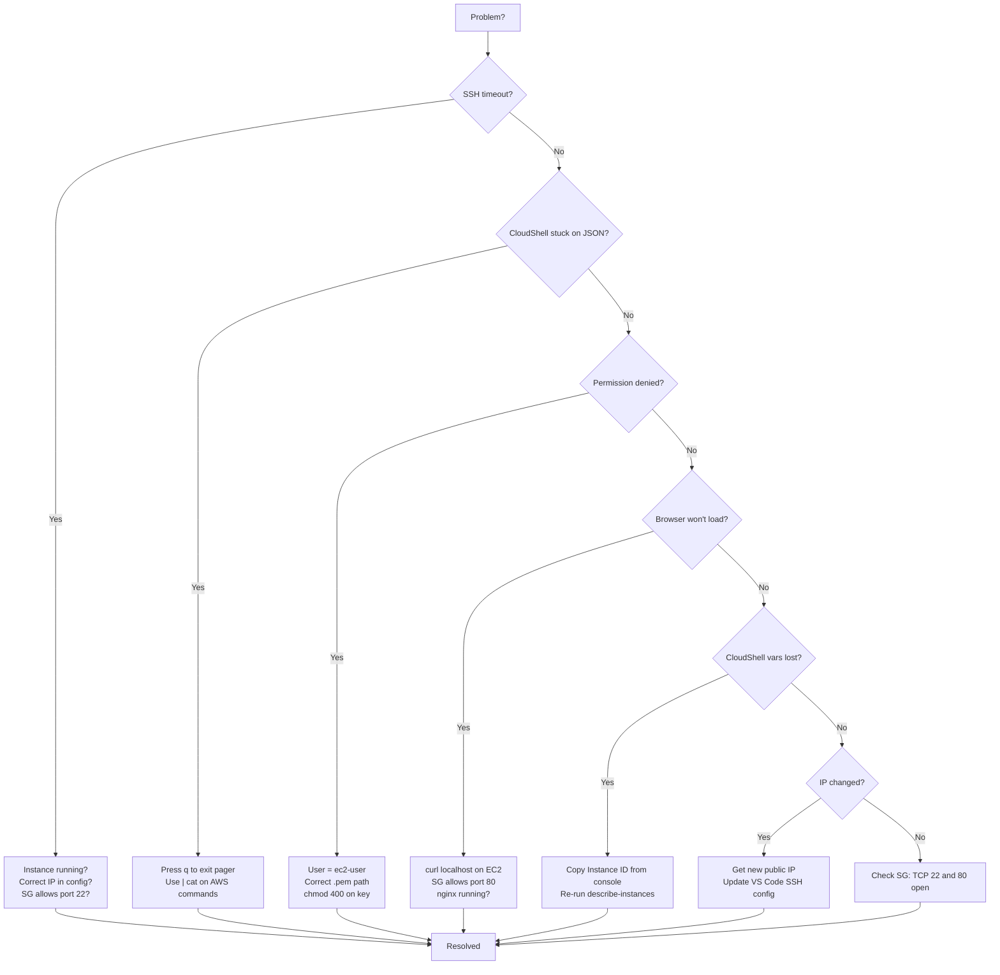
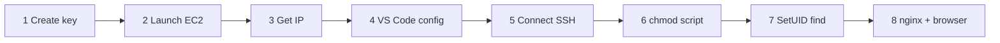
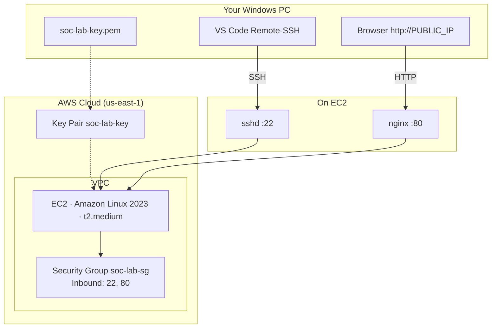
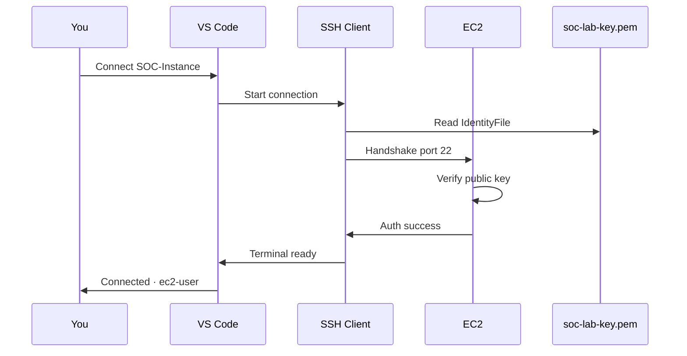
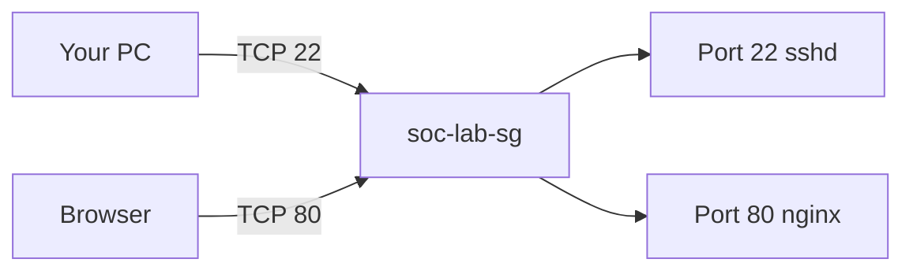
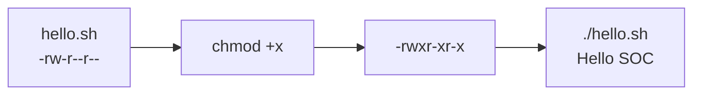
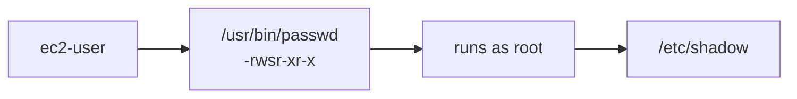
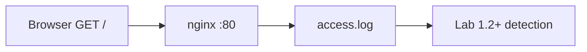
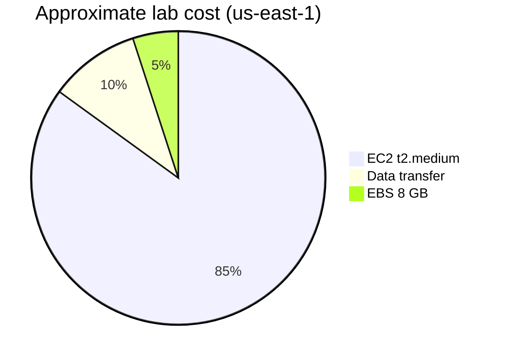

# Lab 1.1 — EC2, SSH, Linux Basics & Web Service

**Personal AWS · ~60–90 min · Region `us-east-1`**

Build a Linux server in your AWS account, connect from VS Code, practice Linux basics, and run nginx for later detection labs.

Save screenshots to `lab 1.1 screenshots/`.

---

## Steps at a glance

| Step | What | Explanation |
|------|------|-------------|
| 1 | Create SSH key | Generate a key pair so only you can log in to the server (no password). |
| 2 | Launch EC2 | Start a Linux virtual server in AWS with firewall rules for SSH (22) and web (80). |
| 3 | Get public IP | Find the server’s internet address so your PC can reach it. |
| 4 | VS Code SSH config | Tell VS Code which IP and key file to use for remote access. |
| 5 | Connect to EC2 | Open a remote terminal on the server — your main workspace for the rest of the lab. |
| 6 | Linux script (`chmod`) | Create a script and make it executable with `chmod +x`. |
| 7 | SetUID find | Find programs that run as root — a common privilege-escalation risk on Linux. |
| 8 | nginx + browser test | Run a web service that writes access logs for future detection labs. |

- [ ] 1 → 2 → 3 → 4 → 5 → 6 → 7 → 8 done

---

## Your worksheet

| Field | Your value |
|-------|------------|
| Region | `us-east-1` |
| Key file | `C:\Users\GURINDER\Downloads\soc-lab-key.pem` |
| Instance ID | `i-________________` |
| Public IP | `__.___.___.___` |
| SSH user | `ec2-user` |
| Lab URL | `http://YOUR_PUBLIC_IP` |

**Before you start:** AWS account · region **us-east-1** · [VS Code](https://code.visualstudio.com/) + **Remote - SSH** · keep `.pem` private · terminate instance when finished.

**CloudShell tips:** Paste each **block** below as one piece, then press **Enter** once. Commands use `| cat` so JSON output does not open a pager (if you do get stuck in a pager, press **`q`**). Use `~/soc-lab-key.pem` so a read-only old key file cannot block overwrite.

> **Optional — delete everything and start fresh:** If you ran this lab before, hit duplicate-resource errors (`InvalidGroup.Duplicate`, `InvalidPermission.Duplicate`), or got `Permission denied` on `soc-lab-key.pem`, run the full **Cleanup** script in the [Cleanup](#cleanup) section first. Also delete `C:\Users\GURINDER\Downloads\soc-lab-key.pem` on your PC. When you see `=== DONE — everything cleaned up ===`, begin again at **Step 1 (Block 1)**.

---

# Lab steps

Do **1 → 8 in order**. Steps **1–3** are three separate CloudShell blocks — run them in order in the **same** CloudShell session.

---

## Step 1 — Create SSH key (Block 1)

1. [AWS Console](https://console.aws.amazon.com/) → region **us-east-1** → open **CloudShell** (`>_` icon).
2. Paste **Block 1** and press Enter once:

```bash
export AWS_DEFAULT_REGION=us-east-1

aws ec2 create-key-pair \
  --key-name soc-lab-key \
  --query 'KeyMaterial' \
  --output text > ~/soc-lab-key.pem

chmod 400 ~/soc-lab-key.pem
ls -la ~/soc-lab-key.pem
```

3. CloudShell → **Actions** → **Download file** → save `soc-lab-key.pem` to `C:\Users\GURINDER\Downloads\`.

**Or use the Console:** **EC2 → Key Pairs → Create key pair** · Name `soc-lab-key` · RSA · `.pem` · Download.

**Done when:** `ls` shows `-r-------- ... soc-lab-key.pem` and the file is in Downloads.  
**Screenshot:** `step-01-key.png`  
**Stuck?** Wrong region → switch to **us-east-1**. `Permission denied` on `.pem` → run the **Cleanup** section, then start again. No download → use Console method above.

---

## Step 2 — Launch EC2 (Block 2)

1. In the **same** CloudShell session, paste **Block 2** and press Enter once:

```bash
export AWS_DEFAULT_REGION=us-east-1

aws ec2 create-security-group \
  --group-name soc-lab-sg \
  --description "SOC Lab SG" | cat

VPC_ID=$(aws ec2 describe-vpcs \
  --filters Name=is-default,Values=true \
  --query 'Vpcs[0].VpcId' --output text)

SG_ID=$(aws ec2 describe-security-groups \
  --filters Name=group-name,Values=soc-lab-sg Name=vpc-id,Values=$VPC_ID \
  --query 'SecurityGroups[0].GroupId' --output text)

aws ec2 authorize-security-group-ingress \
  --group-id $SG_ID --protocol tcp --port 22 --cidr 0.0.0.0/0 | cat

aws ec2 authorize-security-group-ingress \
  --group-id $SG_ID --protocol tcp --port 80 --cidr 0.0.0.0/0 | cat

SUBNET_ID=$(aws ec2 describe-subnets \
  --filters Name=vpc-id,Values=$VPC_ID Name=default-for-az,Values=true \
  --query 'Subnets[0].SubnetId' --output text)

INSTANCE_ID=$(aws ec2 run-instances \
  --image-id ami-098e39bafa7e7303d \
  --instance-type t2.medium \
  --key-name soc-lab-key \
  --network-interfaces "AssociatePublicIpAddress=true,DeviceIndex=0,SubnetId=$SUBNET_ID,Groups=$SG_ID" \
  --query 'Instances[0].InstanceId' --output text)

echo "Instance ID: $INSTANCE_ID"
```

2. Copy **Instance ID** (e.g. `i-0abc123...`) to your worksheet.

**Or use the Console:** **EC2 → Launch Instance** · Amazon Linux 2023 · `t2.medium` · key `soc-lab-key` · allow **SSH** and **HTTP** from `0.0.0.0/0`.

**Done when:** You see `Instance ID: i-...` and instance state is **running**.  
**Screenshot:** `step-02-instance.png`  
**Stuck?** `InvalidAMIID` → wrong region. `InvalidKeyPair` → do Step 1 first. Terminal stuck on JSON → press **`q`**.

---

## Step 3 — Get public IP (Block 3)

Wait **30–60 s** after Step 2, then paste **Block 3** in the same CloudShell session:

```bash
aws ec2 describe-instances \
  --instance-ids $INSTANCE_ID \
  --query 'Reservations[0].Instances[0].PublicIpAddress' \
  --output text
```

Or: **EC2 → Instances → your instance → Public IPv4**.

Write the IP in your worksheet.

**Done when:** You have an IP like `54.198.xxx.xxx`.  
**Screenshot:** `step-03-ip.png`  
**Stuck?** No IP yet → wait 60 s. `$INSTANCE_ID` empty → get IP from console or re-run the last two lines of Block 2.

---

## Step 4 — VS Code SSH config

1. Open **VS Code** → Remote Explorer → **SSH** → gear → **Open SSH Configuration File**.
2. Paste — replace `YOUR_PUBLIC_IP_HERE`:

```ssh-config
Host SOC-Instance
  HostName YOUR_PUBLIC_IP_HERE
  IdentityFile "C:\Users\GURINDER\Downloads\soc-lab-key.pem"
  User ec2-user
```

3. Save. Confirm **SOC-Instance** appears under SSH.

**Done when:** Config has your real IP.  
**Screenshot:** `step-04-vscode-config.png`  
**Stuck?** Wrong path → right-click `.pem` → **Copy as path**.

---

## Step 5 — Connect to EC2

1. Remote Explorer → **SOC-Instance** → **→** connect → **Continue** on fingerprint.
2. Wait for **`SSH: SOC-Instance`** in the bottom-left corner.
3. **File → Open Folder** → `/home/ec2-user` → OK.
4. **Terminal → New Terminal** → run:

```bash
whoami
pwd
```

**Done when:** `whoami` = `ec2-user`, `pwd` = `/home/ec2-user`.  
**Screenshot:** `step-05-connected.png`  
**Stuck?** Timeout → check instance running + IP in config. `Permission denied` → wrong key or user.

---

## Step 6 — Script & chmod

```bash
echo 'echo Hello SOC' > hello.sh
chmod +x hello.sh
./hello.sh
```

**Done when:** Output prints `Hello SOC`.  
**Stuck?** `Permission denied` → run `chmod +x hello.sh` again.

---

## Step 7 — SetUID find

```bash
ls -l /usr/bin/passwd
find / -perm -4000 -exec ls -l {} \; 2>/dev/null
```

**Done when:** `passwd` shows `rws` in permissions; output includes `/usr/bin/sudo`.

---

## Step 8 — nginx & browser test

```bash
sudo dnf install -y nginx
sudo systemctl enable --now nginx
```

Replace the default page:

```bash
cat <<'EOF' | sudo tee /usr/share/nginx/html/index.html
<!doctype html>
<html><body><h1>SOC Lab Service Running</h1></body></html>
EOF
```

Generate logs and check:

```bash
for i in {1..5}; do curl -s http://localhost >/dev/null; done
sudo tail -n 10 /var/log/nginx/access.log
```

On your **Windows PC**, open `http://YOUR_PUBLIC_IP` in a browser.

**Done when:** Browser shows **SOC Lab Service Running**; `access.log` has request lines.  
**Screenshot:** `step-08-nginx.png`  
**Stuck?** Browser fails but `curl localhost` works → security group needs port **80**. nginx down → `sudo systemctl start nginx`.

---

## Finish checklist

| ✓ | Check |
|---|--------|
| ☐ | EC2 running in `us-east-1` |
| ☐ | Public IP in worksheet |
| ☐ | VS Code SSH works (`whoami` = `ec2-user`) |
| ☐ | `./hello.sh` → `Hello SOC` |
| ☐ | SetUID find includes `/usr/bin/sudo` |
| ☐ | Lab page loads in browser |
| ☐ | Screenshots saved |

---

## Cleanup

Use this when you finish the lab **or** when you want to wipe prior attempts and start over (see optional note above).

Run this in CloudShell to remove the lab instance, security group, key pair, and local key file. Also delete `C:\Users\GURINDER\Downloads\soc-lab-key.pem` on your PC.

```bash
export AWS_DEFAULT_REGION=us-east-1

echo "=== 1. Terminate lab instances ==="
INSTANCE_IDS=$(aws ec2 describe-instances \
  --filters "Name=key-name,Values=soc-lab-key" \
            "Name=instance-state-name,Values=pending,running,stopping,stopped" \
  --query 'Reservations[].Instances[].InstanceId' \
  --output text)

if [ -n "$INSTANCE_IDS" ] && [ "$INSTANCE_IDS" != "None" ]; then
  echo "Terminating: $INSTANCE_IDS"
  aws ec2 terminate-instances --instance-ids $INSTANCE_IDS | cat
  echo "Waiting for termination (1-2 min)..."
  aws ec2 wait instance-terminated --instance-ids $INSTANCE_IDS
  echo "Instances terminated."
else
  echo "No lab instances found."
fi

echo "=== 2. Delete security group ==="
VPC_ID=$(aws ec2 describe-vpcs \
  --filters Name=is-default,Values=true \
  --query 'Vpcs[0].VpcId' --output text)

SG_ID=$(aws ec2 describe-security-groups \
  --filters Name=group-name,Values=soc-lab-sg Name=vpc-id,Values=$VPC_ID \
  --query 'SecurityGroups[0].GroupId' --output text 2>/dev/null)

if [ -n "$SG_ID" ] && [ "$SG_ID" != "None" ]; then
  aws ec2 delete-security-group --group-id $SG_ID | cat && echo "Security group deleted."
else
  echo "No soc-lab-sg found."
fi

echo "=== 3. Delete key pair ==="
aws ec2 delete-key-pair --key-name soc-lab-key | cat && echo "Key pair deleted." || echo "Key pair not found."

echo "=== 4. Remove local key file ==="
rm -f ~/soc-lab-key.pem && echo "Local pem removed."

echo "=== DONE — everything cleaned up ==="
```

If security group delete fails with `DependencyViolation`, wait 2 minutes and run only:

```bash
export AWS_DEFAULT_REGION=us-east-1
VPC_ID=$(aws ec2 describe-vpcs --filters Name=is-default,Values=true --query 'Vpcs[0].VpcId' --output text)
SG_ID=$(aws ec2 describe-security-groups --filters Name=group-name,Values=soc-lab-sg Name=vpc-id,Values=$VPC_ID --query 'SecurityGroups[0].GroupId' --output text)
aws ec2 delete-security-group --group-id $SG_ID | cat
```

---

## Troubleshooting

| Problem | Fix |
|---------|-----|
| CloudShell stuck on JSON | Press **`q`** to exit the pager; use `\| cat` on AWS commands (already in Blocks 1–2) |
| `Permission denied` on `.pem` | Old read-only key file — run **Cleanup**, delete Downloads `.pem`, start Steps 1–3 again |
| `InvalidGroup.Duplicate` / `InvalidPermission.Duplicate` | Resources already exist — run **Cleanup** for a fresh start, or ignore if continuing same session |
| SSH timeout | Instance **running**; correct public IP in config |
| Permission denied (SSH) | User must be `ec2-user`; correct `.pem` path |
| Browser won't load | `curl localhost` on server first; if OK works, open port **80** in security group |
| CloudShell vars lost | EC2 console → copy Instance ID and public IP manually, or re-run Block 2 |
| IP changed after stop/start | Update `HostName` in VS Code SSH config |
| Port blocked | Security group must allow TCP **22** (SSH) and **80** (HTTP) |



---

## Reference

**Full diagram collection:** [diagrams/DIAGRAMS.md](diagrams/DIAGRAMS.md) (9 Mermaid diagrams + SVG fallbacks)

Render in **GitHub** or VS Code with **Markdown Preview Mermaid Support**. Export PNG from [Mermaid Live Editor](https://mermaid.live/) into `lab 1.1 screenshots/` if needed.

### Lab workflow



### Architecture



### SSH connection flow



### Security group



### chmod flow



### SetUID



### nginx and access logs



### AWS cost (terminate when done)



### SVG fallbacks

| Diagram | File |
|---------|------|
| Architecture | [01-architecture.svg](diagrams/01-architecture.svg) |
| VPC / SG | [02-vpc-networking.svg](diagrams/02-vpc-networking.svg) |
| SSH keys | [03-ssh-keys.svg](diagrams/03-ssh-keys.svg) |
| chmod | [04-chmod-flow.svg](diagrams/04-chmod-flow.svg) |
| SetUID | [05-setuid-flow.svg](diagrams/05-setuid-flow.svg) |
| nginx | [06-nginx-telemetry.svg](diagrams/06-nginx-telemetry.svg) |
| Roadmap | [00-complete-roadmap.svg](diagrams/00-complete-roadmap.svg) |

---

## Glossary

| Term | Meaning |
|------|---------|
| **EC2** | AWS virtual server |
| **SSH** | Secure remote terminal (port 22) |
| **Security Group** | Firewall on your instance |
| **PEM** | Private key file format |
| **chmod** | Change file permissions |
| **SetUID** | Program runs as file owner (often root) |
| **nginx** | Web server; writes `access.log` |
| **Telemetry** | Logs and events for detection |

---

*Source: `labs/1.1-Instance-Setup.md`*
