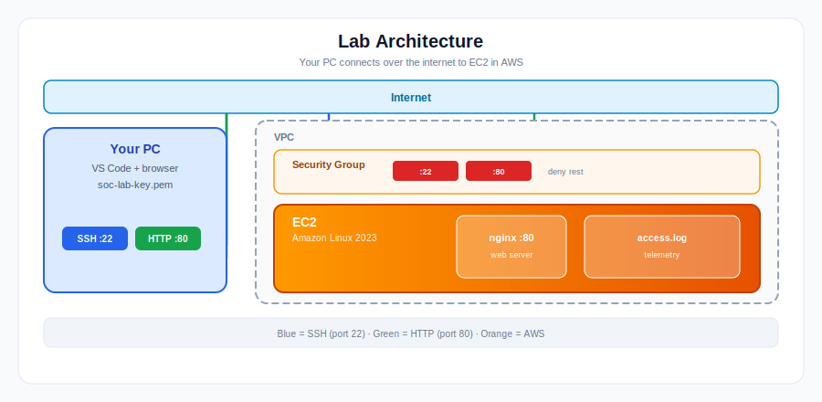
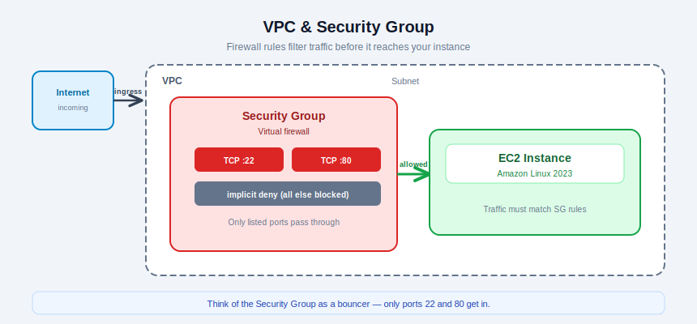
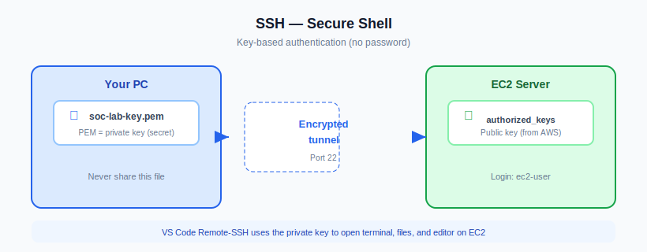
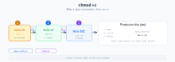
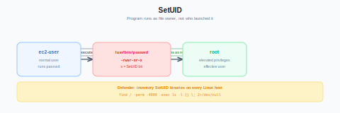
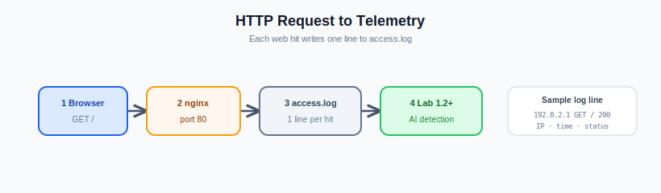
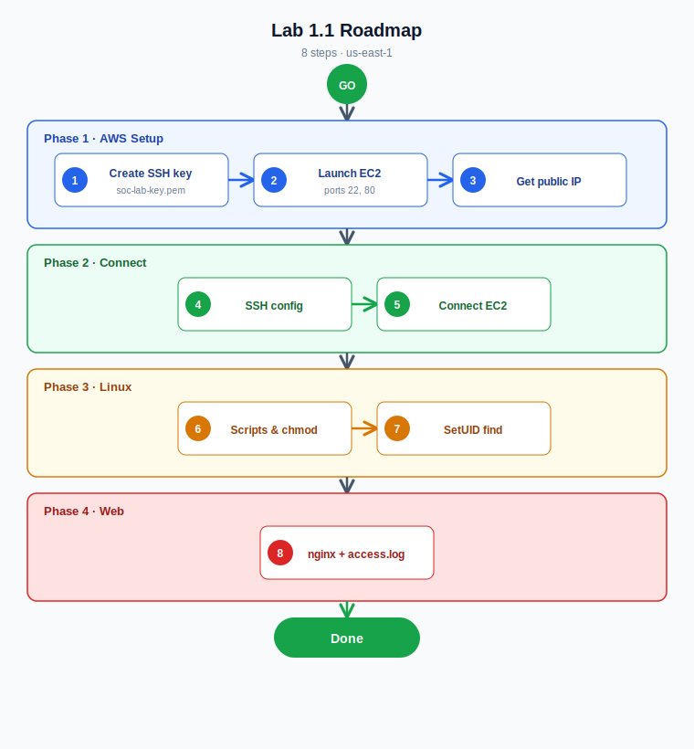

# Lab 1.1 — EC2, SSH, Linux Basics & Web Service

**Personal AWS · ~60–90 min · Region `us-east-1`**

Build a Linux server in your AWS account, connect from VS Code, practice Linux basics, and run nginx for later detection labs.

Save screenshots to `lab 1.1 screenshots/`.

---

## Steps at a glance

| Step | What | Explanation |
|------|------|-------------|
| 1 | Create SSH key | Generate a key pair so only you can log in to the server (no password). |
| 2 | Launch EC2 | Start a Linux virtual server in AWS with firewall rules for SSH (22) and web (80). |
| 3 | Get public IP | Find the server’s internet address so your PC can reach it. |
| 4 | VS Code SSH config | Tell VS Code which IP and key file to use for remote access. |
| 5 | Connect to EC2 | Open a remote terminal on the server — your main workspace for the rest of the lab. |
| 6 | Linux script (`chmod`) | Create a script and make it executable with `chmod +x`. |
| 7 | SetUID find | Find programs that run as root — a common privilege-escalation risk on Linux. |
| 8 | nginx + browser test | Run a web service that writes access logs for future detection labs. |

- [ ] 1 → 2 → 3 → 4 → 5 → 6 → 7 → 8 done

---

## Your worksheet

| Field | Your value |
|-------|------------|
| Region | `us-east-1` |
| Key file | `C:\Users\GURINDER\Downloads\soc-lab-key.pem` |
| Instance ID | `i-________________` |
| Public IP | `__.___.___.___` |
| SSH user | `ec2-user` |
| Lab URL | `http://YOUR_PUBLIC_IP` |

**Before you start:** AWS account · region **us-east-1** · [VS Code](https://code.visualstudio.com/) + **Remote - SSH** · keep `.pem` private · terminate instance when finished.

---

# Lab steps

Do **1 → 8 in order**.

---

## Step 1 — Create SSH key

1. [AWS Console](https://console.aws.amazon.com/) → region **us-east-1** → open **CloudShell** (`>_` icon).
2. Run:

```bash
aws ec2 create-key-pair \
  --key-name soc-lab-key \
  --query 'KeyMaterial' \
  --output text > soc-lab-key.pem
chmod 400 soc-lab-key.pem
```

3. CloudShell → **Actions** → **Download file** → save `soc-lab-key.pem` to `C:\Users\GURINDER\Downloads\`.

**Or use the Console:** **EC2 → Key Pairs → Create key pair** · Name `soc-lab-key` · RSA · `.pem` · Download.

**Done when:** `soc-lab-key.pem` is in Downloads.  
**Screenshot:** `step-01-key.png`  
**Stuck?** Wrong region → switch to **us-east-1**. No download → use Console method above.

---

## Step 2 — Launch EC2

1. In CloudShell, paste and run *(Enter at the end)*:

```bash
aws ec2 create-security-group \
  --group-name soc-lab-sg \
  --description "SOC Lab SG" || true

VPC_ID=$(aws ec2 describe-vpcs \
  --filters Name=is-default,Values=true \
  --query 'Vpcs[0].VpcId' --output text)

SG_ID=$(aws ec2 describe-security-groups \
  --filters Name=group-name,Values=soc-lab-sg Name=vpc-id,Values=$VPC_ID \
  --query 'SecurityGroups[0].GroupId' --output text)

aws ec2 authorize-security-group-ingress \
  --group-id $SG_ID --protocol tcp --port 22 --cidr 0.0.0.0/0 || true

aws ec2 authorize-security-group-ingress \
  --group-id $SG_ID --protocol tcp --port 80 --cidr 0.0.0.0/0 || true

SUBNET_ID=$(aws ec2 describe-subnets \
  --filters Name=vpc-id,Values=$VPC_ID Name=default-for-az,Values=true \
  --query 'Subnets[0].SubnetId' --output text)

INSTANCE_ID=$(aws ec2 run-instances \
  --image-id ami-098e39bafa7e7303d \
  --instance-type t2.medium \
  --key-name soc-lab-key \
  --network-interfaces "AssociatePublicIpAddress=true,DeviceIndex=0,SubnetId=$SUBNET_ID,Groups=$SG_ID" \
  --query 'Instances[0].InstanceId' --output text)

echo "Instance ID: $INSTANCE_ID"
```

2. Copy **Instance ID** to your worksheet.

**Or use the Console:** **EC2 → Launch Instance** · Amazon Linux 2023 · `t2.medium` · key `soc-lab-key` · allow **SSH** and **HTTP** from `0.0.0.0/0`.

**Done when:** Instance state is **running**.  
**Screenshot:** `step-02-instance.png`  
**Stuck?** `InvalidAMIID` → wrong region. `InvalidKeyPair` → do Step 1 first.

---

## Step 3 — Get public IP

Wait **30–60 s** after Step 2, then:

```bash
aws ec2 describe-instances \
  --instance-ids $INSTANCE_ID \
  --query 'Reservations[0].Instances[0].PublicIpAddress' \
  --output text
```

Or: **EC2 → Instances → your instance → Public IPv4**.

Write the IP in your worksheet.

**Done when:** You have an IP like `54.198.xxx.xxx`.  
**Screenshot:** `step-03-ip.png`  
**Stuck?** No IP yet → wait 60 s. `$INSTANCE_ID` empty → get IP from console.

---

## Step 4 — VS Code SSH config

1. Open **VS Code** → Remote Explorer → **SSH** → gear → **Open SSH Configuration File**.
2. Paste — replace `YOUR_PUBLIC_IP_HERE`:

```ssh-config
Host SOC-Instance
  HostName YOUR_PUBLIC_IP_HERE
  IdentityFile "C:\Users\GURINDER\Downloads\soc-lab-key.pem"
  User ec2-user
```

3. Save. Confirm **SOC-Instance** appears under SSH.

**Done when:** Config has your real IP.  
**Screenshot:** `step-04-vscode-config.png`  
**Stuck?** Wrong path → right-click `.pem` → **Copy as path**.

---

## Step 5 — Connect to EC2

1. Remote Explorer → **SOC-Instance** → **→** connect → **Continue** on fingerprint.
2. Wait for **`SSH: SOC-Instance`** in the bottom-left corner.
3. **File → Open Folder** → `/home/ec2-user` → OK.
4. **Terminal → New Terminal** → run:

```bash
whoami
pwd
```

**Done when:** `whoami` = `ec2-user`, `pwd` = `/home/ec2-user`.  
**Screenshot:** `step-05-connected.png`  
**Stuck?** Timeout → check instance running + IP in config. `Permission denied` → wrong key or user.

---

## Step 6 — Script & chmod

```bash
echo 'echo Hello SOC' > hello.sh
chmod +x hello.sh
./hello.sh
```

**Done when:** Output prints `Hello SOC`.  
**Stuck?** `Permission denied` → run `chmod +x hello.sh` again.

---

## Step 7 — SetUID find

```bash
ls -l /usr/bin/passwd
find / -perm -4000 -exec ls -l {} \; 2>/dev/null
```

**Done when:** `passwd` shows `rws` in permissions; output includes `/usr/bin/sudo`.

---

## Step 8 — nginx & browser test

```bash
sudo dnf install -y nginx
sudo systemctl enable --now nginx
```

Replace the default page:

```bash
cat <<'EOF' | sudo tee /usr/share/nginx/html/index.html
<!doctype html>
<html><body><h1>SOC Lab Service Running</h1></body></html>
EOF
```

Generate logs and check:

```bash
for i in {1..5}; do curl -s http://localhost >/dev/null; done
sudo tail -n 10 /var/log/nginx/access.log
```

On your **Windows PC**, open `http://YOUR_PUBLIC_IP` in a browser.

**Done when:** Browser shows **SOC Lab Service Running**; `access.log` has request lines.  
**Screenshot:** `step-08-nginx.png`  
**Stuck?** Browser fails but `curl localhost` works → security group needs port **80**. nginx down → `sudo systemctl start nginx`.

---

## Finish checklist

| ✓ | Check |
|---|--------|
| ☐ | EC2 running in `us-east-1` |
| ☐ | Public IP in worksheet |
| ☐ | VS Code SSH works (`whoami` = `ec2-user`) |
| ☐ | `./hello.sh` → `Hello SOC` |
| ☐ | SetUID find includes `/usr/bin/sudo` |
| ☐ | Lab page loads in browser |
| ☐ | Screenshots saved |

---

## Cleanup

```bash
aws ec2 terminate-instances --instance-ids YOUR_INSTANCE_ID
aws ec2 delete-key-pair --key-name soc-lab-key
aws ec2 delete-security-group --group-name soc-lab-sg
```

---

## Troubleshooting

| Problem | Fix |
|---------|-----|
| SSH timeout | Instance **running**; correct public IP in config |
| Permission denied | User must be `ec2-user`; correct `.pem` path |
| Browser won't load | `curl localhost` on server first; if OK works, open port **80** in security group |
| CloudShell vars lost | EC2 console → copy Instance ID and public IP manually |
| IP changed after stop/start | Update `HostName` in VS Code SSH config |
| Port blocked | Security group must allow TCP **22** (SSH) and **80** (HTTP) |

---

## Reference

### Architecture



### VPC & Security Group



### SSH keys



### chmod flow



### SetUID



### nginx logs



### Lab roadmap



---

## Glossary

| Term | Meaning |
|------|---------|
| **EC2** | AWS virtual server |
| **SSH** | Secure remote terminal (port 22) |
| **Security Group** | Firewall on your instance |
| **PEM** | Private key file format |
| **chmod** | Change file permissions |
| **SetUID** | Program runs as file owner (often root) |
| **nginx** | Web server; writes `access.log` |
| **Telemetry** | Logs and events for detection |

---

*Source: `labs/1.1-Instance-Setup.md`*
