# Lab 1.1 — EC2, SSH, Linux Basics & Web Service

**Personal AWS lab · Beginner guide · ~60–90 minutes**

You will build a small Linux server in **your own AWS account**, connect from VS Code, practice Linux skills, and run a web service that later labs use for detection practice.

---

## Complete Lab Roadmap

All **8 steps** in order. The Mermaid chart renders on GitHub; the detailed image is below it.

```mermaid
flowchart LR
    START([YOU START]) --> S1

    subgraph P1["Phase 1 · AWS (~20 min)"]
        direction TB
        S1["Step 1\nCreate SSH key"]
        S2["Step 2\nLaunch EC2"]
        S3["Step 3\nGet public IP"]
        S1 --> S2 --> S3
    end

    S3 --> S4

    subgraph P2["Phase 2 · Connect (~10 min)"]
        direction TB
        S4["Step 4\nVS Code SSH config"]
        S5["Step 5\nConnect to EC2"]
        S4 --> S5
    end

    S5 --> S6

    subgraph P3["Phase 3 · Linux (~15 min)"]
        direction TB
        S6["Step 6\nFiles & scripts"]
        S7["Step 7\nSetUID inventory"]
        S6 --> S7
    end

    S7 --> S8

    subgraph P4["Phase 4 · Web (~15 min)"]
        S8["Step 8\nnginx + access logs"]
    end

    S8 --> DONE([LAB DONE])
```



<details>
<summary><strong>Detailed roadmap diagram (click to expand)</strong></summary>


</details>

| Phase | Steps | You will have |
|-------|-------|---------------|
| **1 · AWS** | 1 → 2 → 3 | SSH key, running EC2, public IP |
| **2 · Connect** | 4 → 5 | VS Code linked to your server |
| **3 · Linux** | 6 → 7 | Script skills + SetUID awareness |
| **4 · Web** | 8 | nginx page + access logs (telemetry) |

---

## How to Use This Guide

| If you are… | Start here |
|------------|------------|
| **Brand new to AWS** | Study the [complete roadmap](#complete-lab-roadmap), then [Step 1](#step-1-of-8--create-your-ssh-key) |
| **Ready to build now** | Scan the roadmap, fill [Lab Worksheet](#lab-worksheet), start [Step 1](#step-1-of-8--create-your-ssh-key) |
| **Stuck on a step** | Check the **Stuck?** line at the bottom of that step, or [Troubleshooting](#troubleshooting) |
| **Looking up a term** | See [Glossary](#glossary) — includes **Full Form** column for acronyms |

> Save screenshots to `lab 1.1 screenshots/` as you complete each step.

---

## Lab Worksheet

Fill this in as you go — you will need these values later.

| Field | Your value |
|-------|------------|
| AWS region | `us-east-1` *(fixed for this lab)* |
| Key file path | `C:\Users\GURINDER\Downloads\soc-lab-key.pem` |
| Instance ID | `i-________________` |
| Public IP | `__.___.___.___` |
| SSH user | `ec2-user` *(fixed for Amazon Linux)* |
| Lab page URL | `http://YOUR_PUBLIC_IP` |

---

## Progress Tracker

Tick each box before moving to the next lab.

**Phase 1 — AWS (Steps 1–3)**
- [ ] Step 1 — SSH key downloaded to your PC
- [ ] Step 2 — EC2 instance running
- [ ] Step 3 — Public IP recorded in worksheet

**Phase 2 — Connect (Steps 4–5)**
- [ ] Step 4 — VS Code SSH config saved
- [ ] Step 5 — Connected; `whoami` shows `ec2-user`

**Phase 3 — Linux (Steps 6–7)**
- [ ] Step 6 — `./hello.sh` prints `Hello SOC`
- [ ] Step 7 — SetUID find includes `/usr/bin/sudo`

**Phase 4 — Web service (Step 8)**
- [ ] Step 8 — Lab page loads in browser; access log has entries

**Finish**
- [ ] All checkpoints passed → [Lab Checkpoint](#lab-checkpoint)
- [ ] Screenshots saved in `lab 1.1 screenshots/`

---

## Before You Begin

### What you will build

See the [complete roadmap](#complete-lab-roadmap) above for the full picture. In short:

```
Your PC ──SSH:22──► EC2 Linux server ──HTTP:80──► Browser
                         └── nginx + access logs (telemetry for later labs)
```

### Prerequisites

- [ ] Personal AWS account (permissions for EC2, keys, security groups)
- [ ] AWS Console region = **US East (N. Virginia) / us-east-1**
- [ ] [VS Code](https://code.visualstudio.com/) + **Remote - SSH** extension
- [ ] CloudShell in AWS Console *(no local CLI required)*

### Important rules (personal account)

| Rule | Why |
|------|-----|
| Stay in `us-east-1` | Lab AMI only works in this region |
| Keep `soc-lab-key.pem` private | Never share or paste into AI tools |
| Terminate instance when done | `t2.medium` costs money while running |
| Screenshot each major step | Proof of completion + helps debugging |

### Learning goals

By the end you can: launch EC2 · connect via SSH keys · use Linux permissions · spot SetUID risk · run nginx for telemetry.

<details>
<summary><strong>Cybersecurity context (optional read)</strong></summary>

| View | Focus |
|------|-------|
| Attacker | Remote access to cloud host (MITRE T1021, T1078) |
| Defender | Key-only SSH, firewall rules, logs before attack simulation |

</details>

---

# The Lab

Follow steps **1 → 8 in order**. Each step tells you what to do, what success looks like, and where to save a screenshot.

---

## Step 1 of 8 — Create Your SSH Key

| | |
|--|--|
| **Phase** | 1 · AWS setup |
| **Time** | ~5 min |
| **Where** | AWS Console → CloudShell |

### What you are doing

Creating a key pair named `soc-lab-key`. AWS installs the public key on your server; you keep the private `.pem` file on your PC.

### Instructions

**Option A — CloudShell** *(recommended)*

1. Open [AWS Console](https://console.aws.amazon.com/) → confirm region is **us-east-1** (top-right).
2. Click **CloudShell** (the `>_` icon in the top bar).
3. Paste and run:

```bash
aws ec2 create-key-pair \
  --key-name soc-lab-key \
  --query 'KeyMaterial' \
  --output text > soc-lab-key.pem

chmod 400 soc-lab-key.pem
```

4. CloudShell menu → **Actions** → **Download file** → choose `soc-lab-key.pem`.
5. Save to: `C:\Users\GURINDER\Downloads\soc-lab-key.pem`

**Option B — AWS Console** *(no commands)*

1. **EC2 → Key Pairs → Create key pair**
2. Name: `soc-lab-key` · Type: RSA · Format: .pem
3. Download when prompted.

### Success looks like

- File `soc-lab-key.pem` exists in your Downloads folder.
- CloudShell shows no errors after the create command.

### Screenshot

Save key creation or download proof → `lab 1.1 screenshots/step-01-key.png`

### Stuck?

Key won't download → use Console Option B.  
Wrong region → switch to **us-east-1** and retry.

---

## Step 2 of 8 — Launch Your EC2 Server

| | |
|--|--|
| **Phase** | 1 · AWS setup |
| **Time** | ~10 min |
| **Where** | AWS Console → CloudShell |

### What you are doing

Creating a firewall (security group) that allows SSH (22) and HTTP (80), then launching an Amazon Linux 2023 server.

### Instructions

**Option A — CloudShell** *(paste the whole block, press Enter at the end)*

```bash
aws ec2 create-security-group \
  --group-name soc-lab-sg \
  --description "SOC Lab SG" || true

VPC_ID=$(aws ec2 describe-vpcs \
  --filters Name=is-default,Values=true \
  --query 'Vpcs[0].VpcId' --output text)

SG_ID=$(aws ec2 describe-security-groups \
  --filters Name=group-name,Values=soc-lab-sg Name=vpc-id,Values=$VPC_ID \
  --query 'SecurityGroups[0].GroupId' --output text)

aws ec2 authorize-security-group-ingress \
  --group-id $SG_ID --protocol tcp --port 22 --cidr 0.0.0.0/0 || true

aws ec2 authorize-security-group-ingress \
  --group-name soc-lab-sg --protocol tcp --port 80 --cidr 0.0.0.0/0 || true

SUBNET_ID=$(aws ec2 describe-subnets \
  --filters Name=vpc-id,Values=$VPC_ID Name=default-for-az,Values=true \
  --query 'Subnets[0].SubnetId' --output text)

INSTANCE_ID=$(aws ec2 run-instances \
  --image-id ami-098e39bafa7e7303d \
  --instance-type t2.medium \
  --key-name soc-lab-key \
  --network-interfaces "AssociatePublicIpAddress=true,DeviceIndex=0,SubnetId=$SUBNET_ID,Groups=$SG_ID" \
  --query 'Instances[0].InstanceId' --output text)

echo "Instance ID: $INSTANCE_ID"
```

Copy the printed **Instance ID** into your [worksheet](#lab-worksheet).

**Option B — Console launch wizard**

1. **EC2 → Launch Instance**
2. Name: `soc-lab-instance` · AMI: **Amazon Linux 2023** · Type: **t2.medium**
3. Key pair: **soc-lab-key**
4. Allow **SSH** and **HTTP** from anywhere (`0.0.0.0/0`)
5. Launch

### Success looks like

- EC2 → Instances shows state **running**.
- Instance ID written in your worksheet.

### Screenshot

Running instance in EC2 console → `lab 1.1 screenshots/step-02-instance.png`

### Stuck?

`InvalidAMIID.NotFound` → wrong region; use **us-east-1**.  
`InvalidKeyPair.NotFound` → complete Step 1 first.

---

## Step 3 of 8 — Get Your Public IP

| | |
|--|--|
| **Phase** | 1 · AWS setup |
| **Time** | ~2 min *(wait 30–60 s after Step 2)* |
| **Where** | CloudShell or EC2 Console |

### What you are doing

Your server needs a public IP so your PC can reach it over SSH and HTTP.

### Instructions

In CloudShell:

```bash
aws ec2 describe-instances \
  --instance-ids $INSTANCE_ID \
  --query 'Reservations[0].Instances[0].PublicIpAddress' \
  --output text
```

Or in the console: **EC2 → Instances → click instance → Public IPv4 address**.

Write the IP in your [worksheet](#lab-worksheet).

### Success looks like

An IP like `54.198.xxx.xxx` — four numbers separated by dots.

### Screenshot

Terminal or console showing public IP → `lab 1.1 screenshots/step-03-ip.png`

### Stuck?

`$INSTANCE_ID` empty → CloudShell session reset; get IP from the console instead.  
No IP yet → wait 60 seconds and retry.

---

## Step 4 of 8 — Configure VS Code SSH

| | |
|--|--|
| **Phase** | 2 · Connect |
| **Time** | ~5 min |
| **Where** | VS Code on your Windows PC |

### What you are doing

Telling VS Code how to connect to your server using your key file and public IP.

### Instructions

1. Open **VS Code**.
2. Open SSH config: **Remote Explorer** (left sidebar) → **SSH** → gear icon → **User** config file.  
   *Shortcut: `Ctrl+Shift+P` → type `Remote-SSH: Open SSH Configuration File`*
3. Paste this — **replace `YOUR_PUBLIC_IP_HERE`** with the IP from Step 3:

```ssh-config
Host SOC-Instance
  HostName YOUR_PUBLIC_IP_HERE
  IdentityFile "C:\Users\GURINDER\Downloads\soc-lab-key.pem"
  User ec2-user
```

4. **Save** the file.
5. Confirm **SOC-Instance** appears under SSH in Remote Explorer.

### Success looks like

- Config file saved with your real IP (not the placeholder).
- `SOC-Instance` visible in the SSH targets list.

### Screenshot

SSH config with IP filled in → `lab 1.1 screenshots/step-04-vscode-config.png`

### Stuck?

Path wrong → right-click `.pem` in File Explorer → **Copy as path** → paste into `IdentityFile`.

---

## Step 5 of 8 — Connect to Your Server

| | |
|--|--|
| **Phase** | 2 · Connect |
| **Time** | ~5 min |
| **Where** | VS Code → remote EC2 |

### What you are doing

Opening a remote terminal and file explorer on your EC2 instance — this is how analysts work on cloud servers.

### Instructions

1. Remote Explorer → hover **SOC-Instance** → click the **→** connect arrow.
2. First time: fingerprint warning → click **Continue**.
3. Wait until bottom-left corner shows **`SSH: SOC-Instance`** (colored indicator).
4. **File → Open Folder** → enter `/home/ec2-user` → OK.
5. **Terminal → New Terminal**.
6. Run:

```bash
hostnamectl
whoami
pwd
```

### Success looks like

```
ec2-user          ← whoami output
/home/ec2-user    ← pwd output
```

Bottom prompt should **not** look like a Windows path (`C:\...`).

### Screenshot

Connected status bar + terminal output → `lab 1.1 screenshots/step-05-connected.png`

### Stuck?

Connection timeout → [SSH troubleshooting](#ssh-connection-fails).  
`Permission denied` → wrong key file or wrong user (`ec2-user` only).

---

## Step 6 of 8 — Linux Files & Scripts

| | |
|--|--|
| **Phase** | 3 · Linux skills |
| **Time** | ~10 min |
| **Where** | VS Code remote terminal *(on EC2)* |

### What you are doing

Learning basic Linux navigation and how to make a script executable — skills used in both attack and defense workflows.

### Instructions

**Part A — Navigate**

```bash
ls
ls -l
cd ~
pwd
mkdir -p test
cd test
touch test.py
cd ..
ls -l test/test.py
```

**Part B — Create and run a script**

```bash
echo 'echo Hello SOC' > hello.sh
chmod +x hello.sh
./hello.sh
```

### Success looks like

```
Hello SOC
```

### What happened?

| Command | Meaning |
|---------|---------|
| `chmod +x` | Makes file executable |
| `./hello.sh` | Runs script in current folder |

<details>
<summary><strong>Diagram — file permissions flow</strong></summary>


</details>

### Stuck?

`Permission denied` on `./hello.sh` → run `chmod +x hello.sh` again.

---

## Step 7 of 8 — Find SetUID Binaries

| | |
|--|--|
| **Phase** | 3 · Linux skills |
| **Time** | ~5 min *(find takes 1–2 min)* |
| **Where** | VS Code remote terminal |

### What you are doing

Finding programs that run as root when any user executes them — a common privilege-escalation path attackers look for.

### Instructions

```bash
ls -l /usr/bin/passwd
find / -perm -4000 -exec ls -l {} \; 2>/dev/null
```

Look for **`s`** in `/usr/bin/passwd` permissions (example `-rwsr-xr-x`).

### Success looks like

- `passwd` line contains `rws` (the `s` means SetUID).
- Find output includes `/usr/bin/sudo`.

<details>
<summary><strong>Diagram — how SetUID works</strong></summary>


</details>

<details>
<summary><strong>Optional — ask an AI assistant</strong></summary>

Paste your `find` output and ask:

> *"I am a security analyst. Which SetUID binaries are unusual or risky on a standard Linux server, and why?"*

</details>

---

## Step 8 of 8 — Run nginx Web Service

| | |
|--|--|
| **Phase** | 4 · Web service |
| **Time** | ~15 min |
| **Where** | Remote terminal + Windows browser |
| **Required** | Later labs need these access logs |

### What you are doing

Installing a web server that generates HTTP logs — the **telemetry** future detection labs will analyze.

### Instructions

**8.1 Install and start nginx**

```bash
sudo dnf install -y nginx
sudo systemctl enable --now nginx
sudo systemctl status nginx --no-pager
```

**8.2 Replace the default page**

```bash
cat <<'EOF' | sudo tee /usr/share/nginx/html/index.html
<!doctype html>
<html>
  <head><title>SOC Lab Service</title></head>
  <body>
    <h1>SOC Lab Service Running</h1>
    <p>Training service endpoint active.</p>
  </body>
</html>
EOF
```

**8.3 Test on the server**

```bash
curl -I http://localhost
curl -s http://localhost | head -n 5
```

**8.4 Test in your browser** *(on Windows PC)*

Open: `http://YOUR_PUBLIC_IP` *(IP from worksheet)*

**8.5 Generate log entries**

```bash
for i in {1..5}; do curl -s http://localhost >/dev/null; done
sudo tail -n 20 /var/log/nginx/access.log
```

### Success looks like

- `systemctl status` shows **`active (running)`**
- Browser displays **SOC Lab Service Running**
- `access.log` shows lines with your requests

### Screenshot

Browser showing lab page → `lab 1.1 screenshots/step-08-nginx.png`

### Stuck?

Browser fails but curl works → security group missing port 80; redo Step 2 firewall rules.  
Page won't load on server → `sudo systemctl start nginx`.

---

# After the Lab

---

## Lab Checkpoint

All must be true before Lab 1.2:

| ✓ | Item | Quick test |
|---|------|------------|
| ☐ | EC2 running in `us-east-1` | EC2 Console |
| ☐ | Public IP in worksheet | — |
| ☐ | VS Code SSH works | `whoami` → `ec2-user` |
| ☐ | Script runs | `./hello.sh` → `Hello SOC` |
| ☐ | SetUID found | `/usr/bin/sudo` in find output |
| ☐ | nginx running | `sudo systemctl status nginx` |
| ☐ | Page in browser | `http://YOUR_PUBLIC_IP` |
| ☐ | Logs exist | `sudo tail /var/log/nginx/access.log` |
| ☐ | Screenshots saved | `lab 1.1 screenshots/` folder |

---

## Cleanup

Stop billing when finished:

```bash
aws ec2 terminate-instances --instance-ids YOUR_INSTANCE_ID
aws ec2 delete-key-pair --key-name soc-lab-key
aws ec2 delete-security-group --group-name soc-lab-sg
```

Delete `soc-lab-key.pem` from Downloads if no longer needed.

---

## Troubleshooting

### SSH connection fails

| Symptom | Fix |
|---------|-----|
| Timeout | Instance must be **running**; check public IP |
| IP changed | Stop/start assigns new IP — update VS Code config |
| Port blocked | Security group must allow TCP **22** |
| Wrong key path | `IdentityFile` must match actual `.pem` location |

### Permission denied (publickey)

- Wrong `.pem` file for this instance
- Wrong user — must be `ec2-user` (not `ubuntu` or `root`)

### Browser cannot load page

1. Run `curl http://localhost` on server first.
2. If curl works → fix security group port **80**.
3. If curl fails → `sudo systemctl start nginx`.

### CloudShell variables lost

```bash
aws ec2 describe-instances \
  --filters "Name=instance-state-name,Values=running" \
  --query 'Reservations[].Instances[].[InstanceId,PublicIpAddress]' \
  --output table
```

---

# Reference

Read these when you want deeper context — not required to complete the lab.

---

## Architecture


<details>
<summary><strong>Networking diagram (VPC & Security Group)</strong></summary>


</details>

<details>
<summary><strong>SSH key diagram</strong></summary>


</details>

<details>
<summary><strong>nginx telemetry pipeline</strong></summary>


</details>

---

## Glossary

Quick lookup for lab terms. **Full Form** expands acronyms; **—** means the term is not an acronym.

| Term | Full Form | Plain English |
|------|-----------|-------------|
| **AMI** | Amazon Machine Image | OS template snapshot used to launch an EC2 instance |
| **AWS** | Amazon Web Services | Cloud platform where you run this lab |
| **CLI** | Command Line Interface | Text interface for running commands (CloudShell, terminal) |
| **CloudShell** | AWS CloudShell | Browser-based terminal built into the AWS Console |
| **CIDR** | Classless Inter-Domain Routing | IP range notation (e.g. `0.0.0.0/0` = anywhere) |
| **EC2** | Elastic Compute Cloud | AWS service that provides virtual servers (instances) |
| **HTTP** | Hypertext Transfer Protocol | Web traffic protocol used on port 80 |
| **Ingress** | — *(networking term)* | Incoming traffic **into** your server (firewall allow rules) |
| **Instance type** | — | EC2 size tier defining CPU, RAM, and hourly cost (lab: `t2.medium`) |
| **MITRE ATT&CK** | Adversarial Tactics, Techniques, and Common Knowledge | Framework mapping attack behaviors (e.g. T1021 Remote Services) |
| **nginx** | — *(proper name, not an acronym)* | Lightweight web server; one log line per HTTP request |
| **PEM** | Privacy Enhanced Mail | File format for SSH private keys (`.pem` extension) |
| **Public IP** | Internet Protocol address | Numeric address reachable from the internet |
| **Region** | — | Geographic AWS datacenter; this lab requires `us-east-1` (N. Virginia) |
| **Security Group (SG)** | — | Virtual stateful firewall attached to your EC2 instance |
| **SetUID** | Set User ID | Linux flag: program runs as the **file owner** (often `root`) |
| **SOC** | Security Operations Center | Team that monitors, detects, and responds to threats |
| **SSH** | Secure Shell | Encrypted protocol for remote terminal access (port 22) |
| **TCP** | Transmission Control Protocol | Reliable connection protocol (SSH port 22, HTTP port 80) |
| **Telemetry** | — | Observable data: logs, metrics, and events used in detection |
| **VPC** | Virtual Private Cloud | Isolated virtual network boundary inside AWS |
| **VS Code** | Visual Studio Code | Editor with Remote - SSH for working on EC2 remotely |

---

## Summary

| Step | You built | Used in later labs |
|------|-----------|-------------------|
| 1–3 | EC2 server in AWS | Attack target environment |
| 4–5 | VS Code SSH access | Remote investigation |
| 6–7 | Linux + SetUID skills | Host forensics |
| 8 | nginx + access logs | AI detection & triage |

**What's next:** Lab 1.2 — Suspicious Activity Simulation & AI Triage

---

*Source: `labs/1.1-Instance-Setup.md` · Practice: `gurinder_practice/lab 1.1`*
