# Lab 1.1 — Visual Reference (Mermaid)

Use these in **GitHub**, **VS Code** (with [Markdown Preview Mermaid Support](https://marketplace.visualstudio.com/items?itemName=bierner.markdown-mermaid)), or [Mermaid Live Editor](https://mermaid.live/).

Export PNG/SVG from Mermaid Live Editor into `lab 1.1 screenshots/` if you need image files.

---

## 1. Complete lab architecture

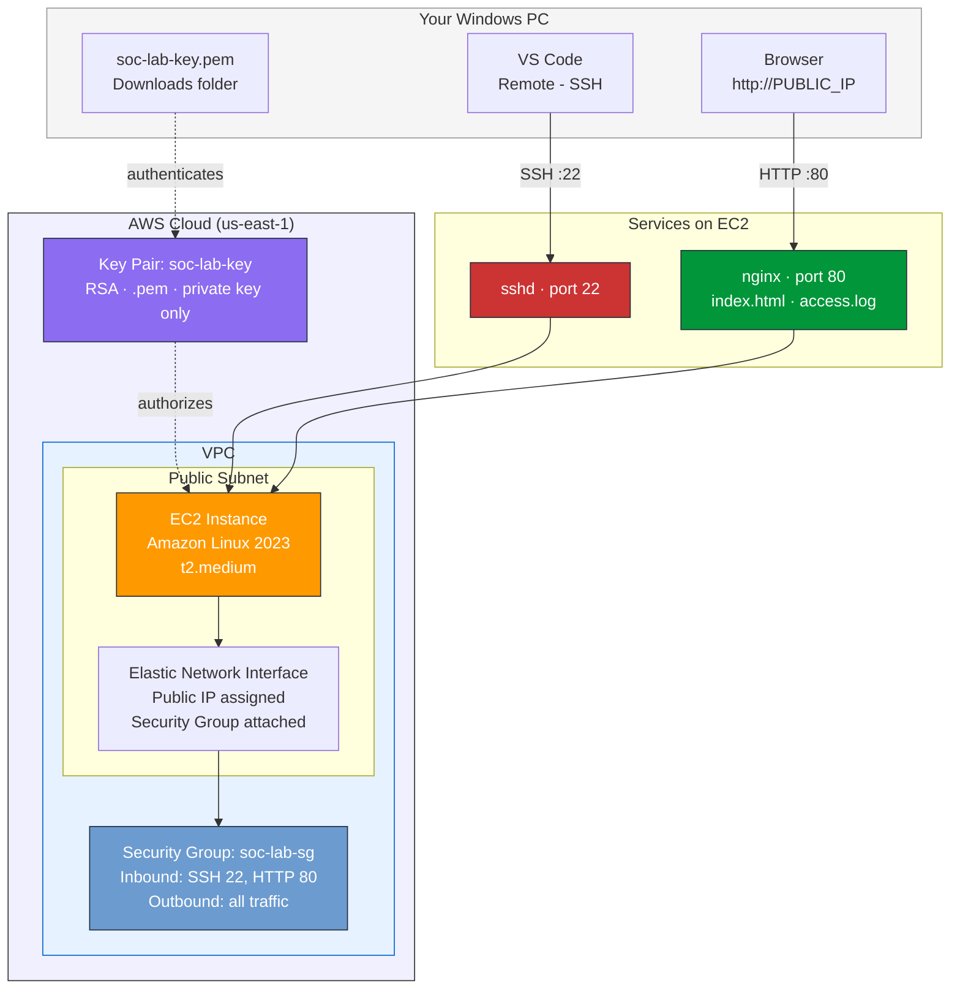

---

## 2. SSH connection flow

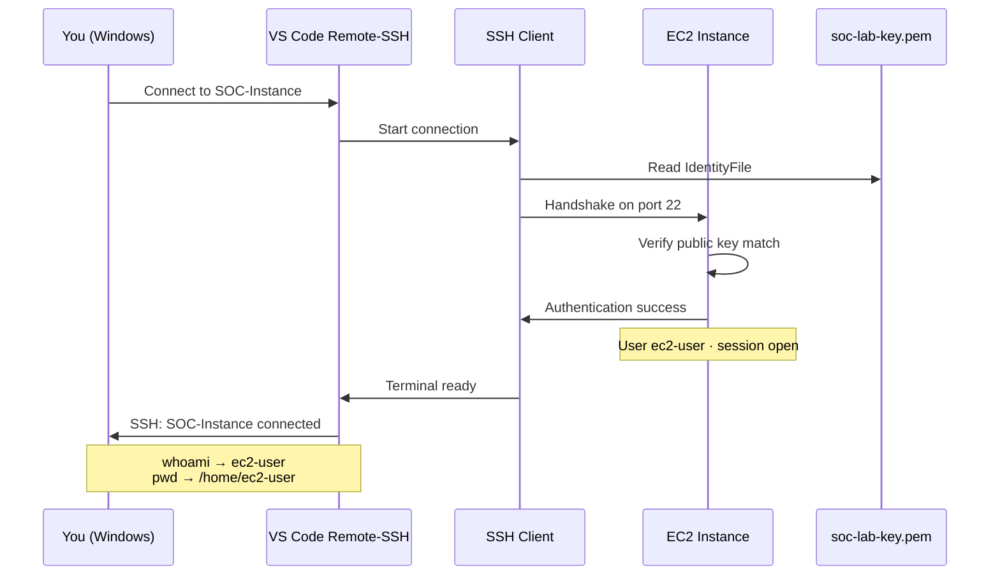

---

## 3. Security group detail

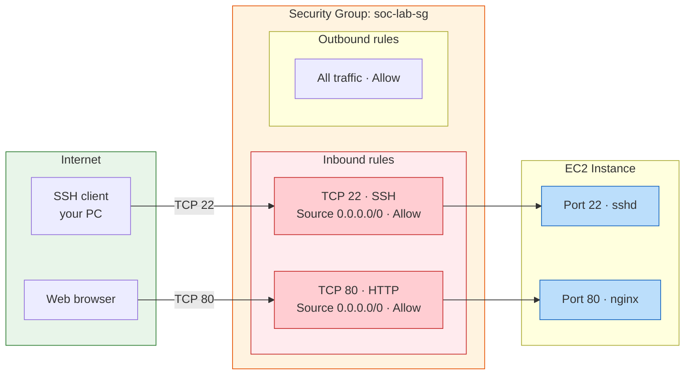

---

## 4. Linux permissions and chmod

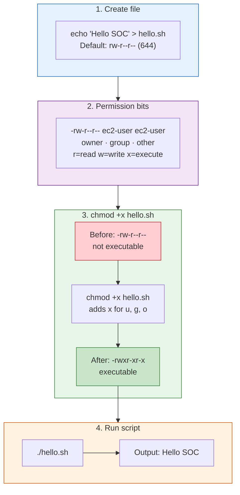

---

## 5. SetUID privilege escalation

```mermaid
graph TB
    subgraph Normal["Normal execution"]
        U1["User: ec2-user"]
        P1["Program owned by ec2-user"]
        R1["Runs with user privileges"]
        U1 --> P1 --> R1
    end

    subgraph SetUID["SetUID execution"]
        U2["User: ec2-user"]
        P2["/usr/bin/passwd<br/>-rwsr-xr-x · owner root"]
        R2["Runs as root (UID 0)"]
        Shadow["/etc/shadow"]
        U2 --> P2 --> R2
        R2 --> Shadow
    end

    subgraph Detect["Defender detection"]
        Find["find / -perm -4000 -exec ls -l {} \\; 2>/dev/null"]
        Examples["Common: passwd, sudo, mount, ping"]
        Find --> Examples
    end

    style Normal fill:#e3f2fd,stroke:#1565c0
    style SetUID fill:#ffebee,stroke:#c62828
    style Detect fill:#e8f5e9,stroke:#2e7d32
    style R2 fill:#ffcdd2,stroke:#c62828
```

---

## 6. nginx setup and logging

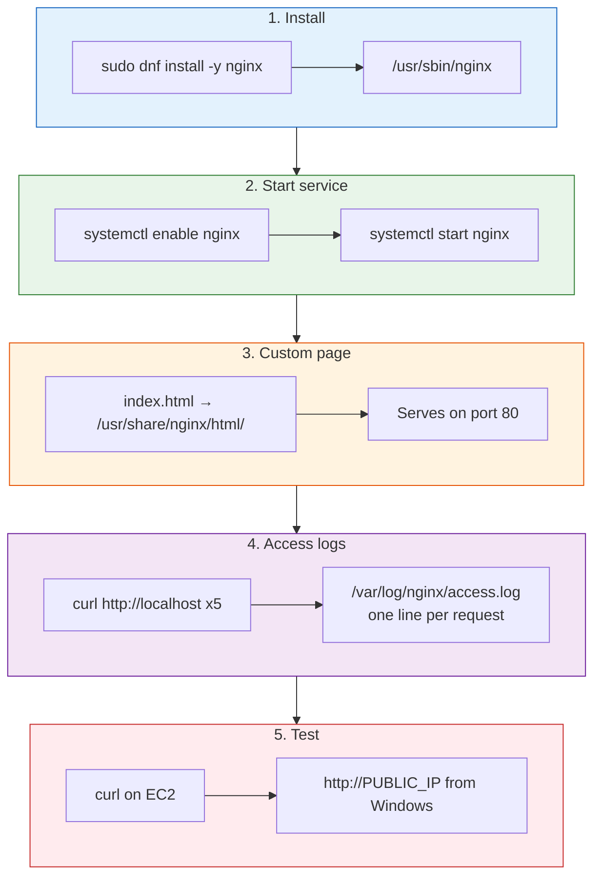

---

## 7. Lab workflow (steps 1–8)

```mermaid
graph LR
    S1["1 Create key"] --> S2["2 Launch EC2"] --> S3["3 Get IP"]
    S3 --> S4["4 VS Code config"] --> S5["5 Connect SSH"]
    S5 --> S6["6 chmod script"] --> S7["7 SetUID find"] --> S8["8 nginx + browser"]

    style S1 fill:#e1f5fe,stroke:#01579b
    style S2 fill:#e1f5fe,stroke:#01579b
    style S3 fill:#e1f5fe,stroke:#01579b
    style S4 fill:#e1f5fe,stroke:#01579b
    style S5 fill:#e1f5fe,stroke:#01579b
    style S6 fill:#e1f5fe,stroke:#01579b
    style S7 fill:#e1f5fe,stroke:#01579b
    style S8 fill:#c8e6c9,stroke:#2e7d32
```

### Steps with verification

```mermaid
graph LR
    S1["Step 1<br/>create-key-pair"] --> V1["Key in Downloads"]
    V1 --> S2["Step 2<br/>run-instances"]
    S2 --> V2["Instance running"]
    V2 --> S3["Step 3<br/>describe-instances"]
    S3 --> V3["Public IP saved"]
    V3 --> S4["Step 4<br/>~/.ssh/config"]
    S4 --> V4["SOC-Instance listed"]
    V4 --> S5["Step 5<br/>Connect"]
    V5["whoami = ec2-user"] --> S6["Step 6<br/>chmod +x"]
    S5 --> V5
    S6 --> V6["Hello SOC"]
    V6 --> S7["Step 7<br/>find SetUID"]
    S7 --> V7["sudo in list"]
    V7 --> S8["Step 8<br/>nginx"]
    S8 --> V8["Browser OK"]

    style V1 fill:#c8e6c9,stroke:#2e7d32
    style V2 fill:#c8e6c9,stroke:#2e7d32
    style V3 fill:#c8e6c9,stroke:#2e7d32
    style V4 fill:#c8e6c9,stroke:#2e7d32
    style V5 fill:#c8e6c9,stroke:#2e7d32
    style V6 fill:#c8e6c9,stroke:#2e7d32
    style V7 fill:#c8e6c9,stroke:#2e7d32
    style V8 fill:#c8e6c9,stroke:#2e7d32
```

---

## 8. Troubleshooting flowchart

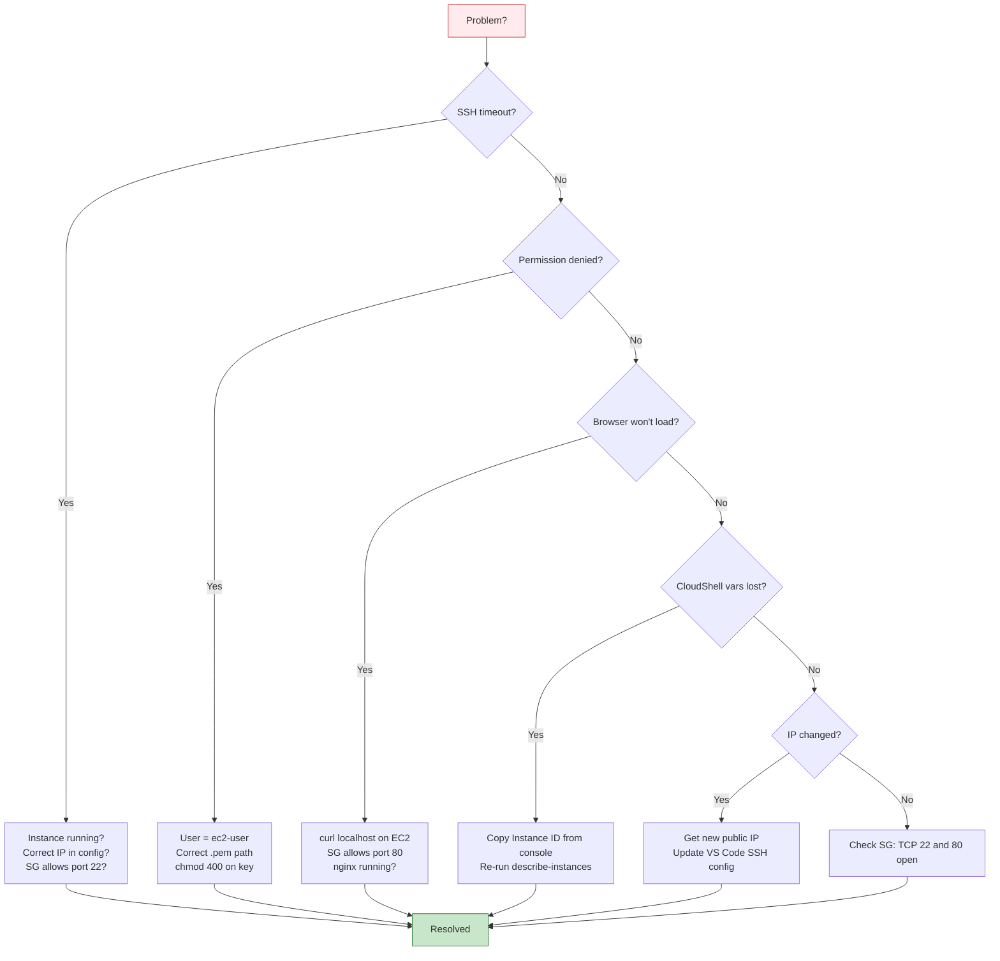

---

## 9. AWS services and cost (us-east-1)

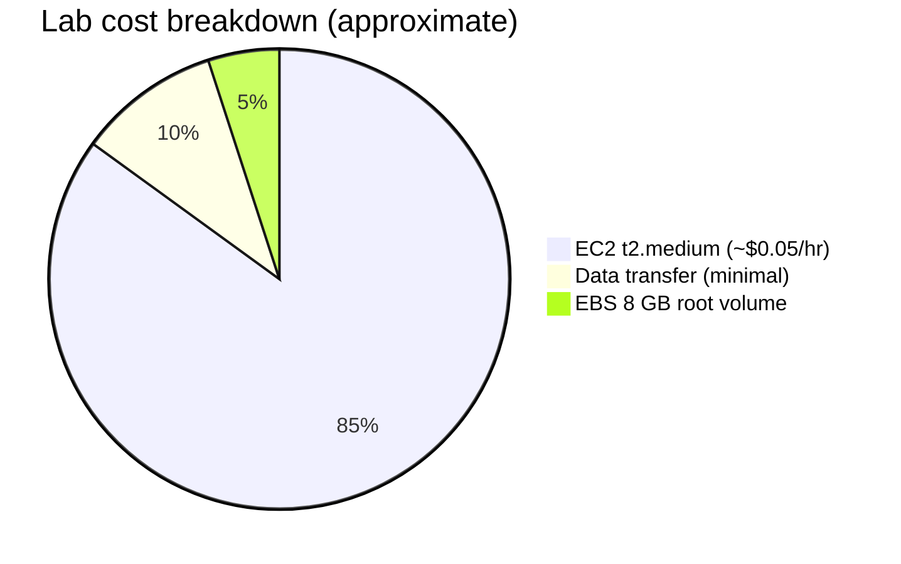

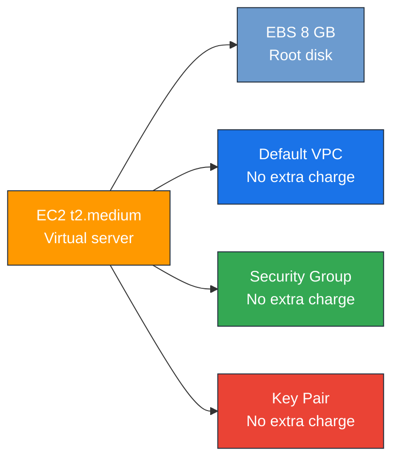

---

## Static SVG fallbacks

If Mermaid does not render, use the generated SVG files (run `python build_diagrams.py`):

| Topic | File |
|-------|------|
| Architecture | `01-architecture.svg` |
| VPC / Security Group | `02-vpc-networking.svg` |
| SSH keys | `03-ssh-keys.svg` |
| chmod | `04-chmod-flow.svg` |
| SetUID | `05-setuid-flow.svg` |
| nginx logs | `06-nginx-telemetry.svg` |
| Roadmap | `00-complete-roadmap.svg` |
