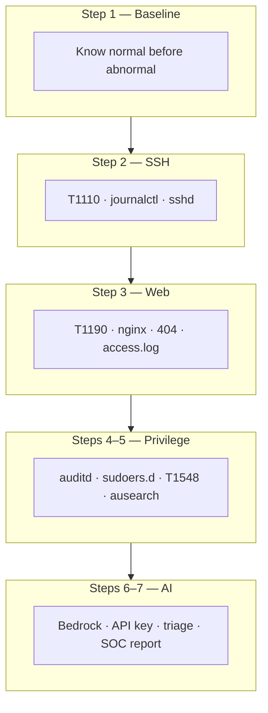
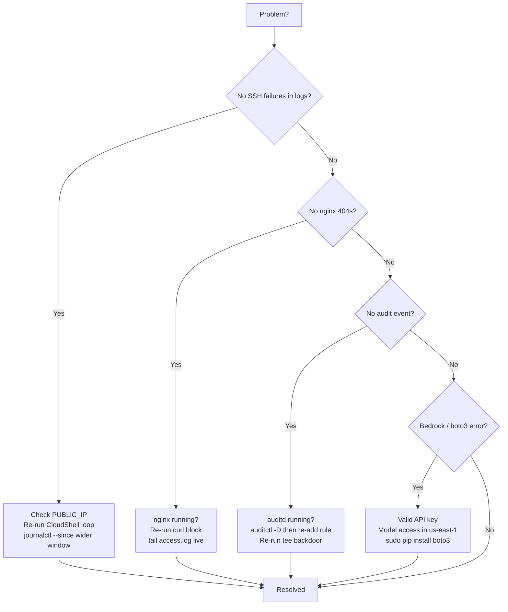
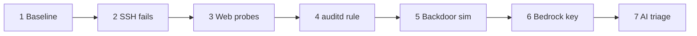
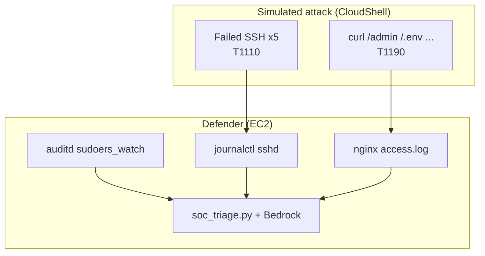
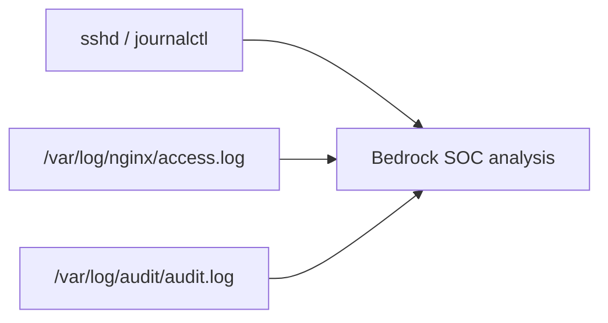
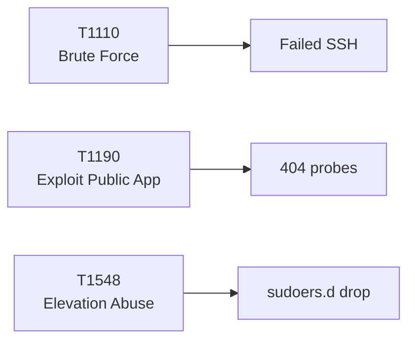

# Lab 1.2 — Suspicious Activity Simulation & AI Triage

**Personal AWS · ~60–90 min · Region `us-east-1` · Requires Lab 1.1**

Generate controlled suspicious activity on your EC2 instance — failed SSH, web probes, and a sudoers persistence technique — then collect evidence with auditd and nginx logs, and triage everything with Amazon Bedrock.

Save screenshots locally to `lab 1.2 screenshots/` — that folder is **gitignored** and must **never** be pushed to GitHub. **Never** commit your Bedrock API key or paste it into shared docs.

---

## Steps at a glance

| Step | What | Explanation |
|------|------|-------------|
| 1 | Baseline logs | Snapshot audit and nginx logs before generating any activity. |
| 2 | Failed SSH attempts | Simulate brute-force logins from CloudShell (ATT&CK T1110). |
| 3 | Web recon probes | Request suspicious paths; confirm 404s in `access.log` (T1190). |
| 4 | auditd watch rule | Remove default suppression; watch `/etc/sudoers.d` for changes. |
| 5 | Persistence simulation | Drop a controlled `lab-backdoor` file; confirm audit evidence (T1548). |
| 6 | Bedrock API key | Create a long-term API key in the AWS console for AI triage. |
| 7 | AI SOC triage | Run `soc_triage.py` to analyze logs with Bedrock. |

- [ ] 1 → 2 → 3 → 4 → 5 → 6 → 7 done

---

## Your worksheet

| Field | Your value |
|-------|------------|
| Region | `us-east-1` |
| Public IP | `__.___.___.___` (from Lab 1.1) |
| Instance ID | `i-________________` |
| SSH host | `SOC-Instance` (VS Code) |
| Bedrock model | `mistral.mistral-large-2402-v1:0` |
| Backdoor file | `/etc/sudoers.d/lab-backdoor` (left in place for Lab 2.1) |

**Before you start:** Lab 1.1 complete · EC2 **running** · nginx **active** · VS Code SSH works · region **us-east-1**.

### Safety rails

- Run only in your **training** AWS account and EC2 from Lab 1.1.
- Do **not** run malware, exploit frameworks, or destructive tools.
- All activity is **controlled and documented** for learning.
- Keep `lab-backdoor` and the audit rule — they are the starting state for Lab 2.1.

### Cyber lens

| Role | Detail |
|------|--------|
| **Attacker objective** | Initial access (SSH), web recon, privilege persistence |
| **ATT&CK** | T1110 Brute Force · T1190 Exploit Public-Facing Application · T1548 Abuse Elevation Control |
| **Defender outcome** | Collect SSH, web, and privilege evidence; triage with AI |

---

## Concepts in plain English

Read this section first if the lab feels like a wall of jargon. You can return here while doing each step.

### The story in one minute

Imagine your EC2 server is a **building**:

1. An attacker tries wrong keys at the **front door** (failed SSH) — you check the **security camera** (sshd logs).
2. They walk around trying **locked side doors** (`/admin`, `/.env`) — the **visitor log** (nginx) records each try.
3. They try to leave a **copy of a master key** in the manager’s drawer (`sudoers.d`) — the **alarm system** (auditd) records who put it there.
4. You hand all recordings to a **smart analyst** (Bedrock AI) who writes a **incident report** (triage).

You are playing **both roles** on purpose: CloudShell = fake attacker; EC2 = defender collecting proof.

### Acronyms and full forms

| Short | Full form | Plain meaning |
|-------|-----------|---------------|
| **SOC** | Security Operations Center | Team (or you) that watches for attacks and responds |
| **SSH** | Secure Shell | Encrypted remote login to a Linux server (port 22) |
| **sshd** | SSH **d**aemon | Background service on the server that accepts SSH connections |
| **EC2** | Elastic Compute Cloud | AWS virtual server (your Linux machine) |
| **nginx** | *(pronounced “engine-x”)* | Web server software — serves web pages on port 80 |
| **HTTP** | Hypertext Transfer Protocol | How browsers request web pages |
| **404** | HTTP status code | “Page not found” — server is up, but that path doesn’t exist |
| **API** | Application Programming Interface | A way for programs to talk to a service (here: Python → Bedrock) |
| **AI** | Artificial Intelligence | Software that analyzes text and finds patterns (here: reads logs) |
| **MITRE ATT&CK** | Adversarial Tactics, Techniques, and Common Knowledge | Catalog of **how real attackers behave**, with numbered technique IDs |
| **T1110, T1190, T1548** | ATT&CK technique IDs | Labels for specific attack types (see below) |
| **NOPASSWD** | No password required | sudo rule: run commands as root **without** typing a password |
| **sudo** | **s**uper**u**ser **do** | Run one command with admin (root) power |
| **UID** | User ID | Number for each Linux user (`0` = root, `1000` = ec2-user) |
| **auid** | Audit User ID | Who **really** logged in and ran the command (auditd tracks this) |

### ATT&CK techniques used in this lab

| ID | Name | What it means in this lab | Your step |
|----|------|---------------------------|-----------|
| **T1110** | Brute Force | Trying many logins hoping one works | Step 2 — `fakeuser` SSH attempts |
| **T1190** | Exploit Public-Facing Application | Probing a website for weak or hidden paths | Step 3 — `/admin`, `/.env`, etc. |
| **T1548** | Abuse Elevation Control Mechanism | Tricking the system into giving admin access | Step 5 — file in `/etc/sudoers.d/` |

**ATT&CK** is not malware — it is a **dictionary** defenders use to name attacker behavior the same way everywhere.

### Attacker words vs defender words

| Word | Attacker meaning | Defender meaning |
|------|------------------|------------------|
| **Recon / probe** | “What can I find on this server?” | Suspicious URLs in web logs |
| **Brute force** | “Guess passwords or users until one works” | Many failed SSH lines in logs |
| **Persistence / backdoor** | “Stay admin even after reboot” | Unauthorized file in `sudoers.d` |
| **Telemetry** | *(defender term)* | Any log or event that proves something happened |
| **Evidence** | *(defender term)* | Log lines you can show in an investigation |
| **Baseline** | — | “Normal” logs **before** the attack — so you can compare |
| **Triage** | — | Sort incidents by urgency; decide what matters first |

### Log files — what each one records

| Log / tool | Full path or command | What it records | Lab step |
|------------|----------------------|-----------------|----------|
| **nginx access.log** | `/var/log/nginx/access.log` | Every web request: IP, time, URL, status (200, 404…) | 1, 3 |
| **audit.log** | `/var/log/audit/audit.log` | Security events: file creates, privilege changes | 1, 5 |
| **journalctl (sshd)** | `journalctl -u sshd` | SSH login success/failure messages | 2 |
| **ausearch** | `ausearch -k sudoers_watch` | Search audit log by keyword/rule name | 5 |

**tail** = show last N lines of a file. **grep** = search for text in a file.

### Tools and commands — what they do

| Term | What it is | Simple analogy |
|------|------------|----------------|
| **CloudShell** | Browser terminal in AWS | Attacker’s laptop in the cloud — hits your server from outside |
| **auditd** | Linux **audit daemon** | Security camera system for the server |
| **auditctl** | Control audit rules | Tell the camera *which folder to watch* |
| **sudoers.d** | Folder of sudo rule files | Drawer where “who may run admin commands” rules live |
| **lab-backdoor** | Fake malicious sudo file | Training-only “master key” — **not** real malware |
| **Bedrock** | AWS AI model service | Hire an analyst who reads logs fast |
| **boto3** | AWS SDK for Python | Python library that talks to AWS APIs |
| **soc_triage.py** | Your triage script | Sends last 50 log lines to Bedrock; prints analysis |
| **converse** | Bedrock API call | “Chat with the model” — send logs, get text back |
| **Mistral** | AI model vendor | The “brain” behind the analysis (via Bedrock) |

### Step-by-step: which concept appears where



### Common confusing phrases

| Phrase | What it actually means |
|--------|------------------------|
| “Simulate suspicious activity” | You **pretend** to attack your **own** lab server safely |
| “Controlled and documented” | Every action is intentional and leaves logs on purpose |
| “Primary signal” | The main clue defenders would notice first |
| “404 entries” | Scanner tried URLs that don’t exist — still suspicious |
| “Remove suppression rule” | Amazon Linux hides some audit events by default — you turn monitoring **on** |
| “nametype=CREATE” | Audit log says a **new file was created** in the watched folder |
| “comm=tee” | The program that created the file was `tee` (the command you ran) |
| “Leave in place for Lab 2.1” | Don’t delete the backdoor file — next lab needs it |
| “Structured SOC analysis” | AI output with findings, ATT&CK IDs, risk level, next steps |

### How Lab 1.1 connects to Lab 1.2

| From Lab 1.1 | Used in Lab 1.2 as |
|--------------|-------------------|
| EC2 + public IP | Target for SSH and web probes |
| nginx + port 80 | Generates `access.log` for web recon |
| SSH + `ec2-user` | Real login works; fake users fail (Step 2) |
| `access.log` idea | Same log file — now you fill it with attack-like traffic |

---

# Lab steps

Do **1 → 7 in order**. Steps **2–3** run from **CloudShell**. Steps **1, 4–5, 7** run on **EC2** (VS Code terminal). Step **6** uses the **AWS Console**.

---

## Step 1 — Baseline logs

On your **EC2 instance** (VS Code → **SOC-Instance** → terminal), capture the current state before any suspicious activity.

```bash
sudo tail -n 20 /var/log/audit/audit.log
sudo systemctl status nginx --no-pager || true
sudo tail -n 20 /var/log/nginx/access.log 2>/dev/null || true
```

**Expected success:** Audit log may be quiet or show routine events. nginx shows **active (running)**. Access log may show your Lab 1.1 hits.

**Done when:** You have a mental (or screenshot) baseline — logs look normal before attacks.  
**Screenshot:** `step-01-baseline.png`  
**Stuck?** `No such file` on audit log → `sudo dnf install -y audit`; `sudo systemctl enable --now auditd`. nginx not running → Lab 1.1 Step 8 first.

---

## Step 2 — Failed SSH attempts

Simulate an attacker trying wrong usernames. Run from **AWS CloudShell** (region **us-east-1**), not from EC2.

1. Set your instance public IP:

```bash
export PUBLIC_IP=YOUR_EC2_PUBLIC_IP
echo "Target: $PUBLIC_IP"
```

2. Run five failed login attempts:

```bash
for i in {1..5}; do
  ssh -o BatchMode=yes \
      -o StrictHostKeyChecking=no \
      -o ConnectTimeout=3 \
      fakeuser@$PUBLIC_IP 2>/dev/null || true
done
echo "Done — failed SSH attempts sent"
```

3. Back on **EC2**, confirm events in sshd logs:

```bash
sudo journalctl -u sshd --since "10 min ago" | tail -25
```

**Expected success:** Journal shows **Failed password** or **Failed publickey** for `fakeuser`. Source IP is CloudShell’s outbound address.

**Done when:** At least one failed auth line appears for `fakeuser`.  
**Screenshot:** `step-02-ssh-fail.png` — journalctl output (redact IP if sharing).  
**Stuck?** No lines → confirm `PUBLIC_IP` is correct; wait 30 s and retry journalctl. Timeout from CloudShell → instance running; SG allows port **22**.

---

## Step 3 — Web recon probes

Still in **CloudShell** (same `PUBLIC_IP`), probe paths attackers commonly scan:

```bash
curl -s -o /dev/null -w "%{http_code} /admin\n"      http://$PUBLIC_IP/admin
curl -s -o /dev/null -w "%{http_code} /login\n"      http://$PUBLIC_IP/login
curl -s -o /dev/null -w "%{http_code} /.env\n"       http://$PUBLIC_IP/.env
curl -s -o /dev/null -w "%{http_code} /wp-admin\n"   http://$PUBLIC_IP/wp-admin
curl -s -o /dev/null -w "%{http_code} /config.php\n" http://$PUBLIC_IP/config.php
```

You can also open the same URLs in your **Windows browser** (`http://YOUR_PUBLIC_IP/admin`, etc.).

On **EC2**, confirm requests landed in nginx:

```bash
sudo tail -n 20 /var/log/nginx/access.log
```

**Expected success:** Five lines with paths `/admin`, `/login`, `/.env`, `/wp-admin`, `/config.php` and status **404**.

**Done when:** Access log shows the suspicious paths.  
**Screenshot:** `step-03-nginx-404.png`  
**Stuck?** No new lines → nginx down (`sudo systemctl start nginx`). Browser works but CloudShell fails → check `PUBLIC_IP`. All timeouts → SG must allow port **80**.

---

## Step 4 — auditd watch rule

On **EC2**, set up auditd to detect files dropped into `sudoers.d`.

1. Confirm auditd is running:

```bash
sudo systemctl status auditd --no-pager
```

2. Amazon Linux ships a rule that suppresses syscall auditing. Remove it, then add a watch:

```bash
sudo auditctl -l
sudo auditctl -D
sudo auditctl -a always,exit -F arch=b64 -S openat -F dir=/etc/sudoers.d/ -k sudoers_watch
sudo auditctl -l
```

**Expected success:** After `-D`, old rules are cleared. New rule shows `sudoers_watch` and `dir=/etc/sudoers.d/`.

**Done when:** `sudo auditctl -l` lists the `sudoers_watch` rule.  
**Screenshot:** `step-04-auditctl.png`  
**Stuck?** `auditctl: command not found` → `sudo dnf install -y audit`; `sudo systemctl enable --now auditd`. Rule disappears after reboot → normal for this lab; re-run Step 4 if needed before Step 5.

---

## Step 5 — Persistence simulation

Still on **EC2**, simulate an attacker dropping a NOPASSWD sudo rule:

```bash
echo "ec2-user ALL=(ALL) NOPASSWD: ALL" | sudo tee /etc/sudoers.d/lab-backdoor
```

Confirm audit captured the create event:

```bash
sudo ausearch -k sudoers_watch --start recent -i | grep -B8 "nametype=CREATE" || true
```

Also check the raw audit log:

```bash
sudo grep "lab-backdoor" /var/log/audit/audit.log | grep "sudoers"
```

**Expected success:** `ausearch` shows a `SYSCALL` with `comm=tee`, `nametype=CREATE`, and `auid=ec2-user` (the user who ran the command, even though `tee` ran as root).

> **Keep** `lab-backdoor` and the audit rule in place — Lab 2.1 uses them.

**Done when:** `grep lab-backdoor` returns at least one audit line.  
**Screenshot:** `step-05-ausearch.png`  
**Stuck?** No audit event → re-run Step 4, then Step 5 again. Empty `ausearch` → run without `grep` first: `sudo ausearch -k sudoers_watch --start recent -i | tail -40`.

---

## Step 6 — Bedrock API key

1. Open [AWS Console](https://console.aws.amazon.com/) → region **us-east-1**.
2. Go to **Amazon Bedrock** → **API keys** (left menu or search).
3. **Long-term API keys** tab → **Generate long-term API keys**.
4. Expiration **30 days** → **Generate**.
5. Copy the key and store it securely (password manager or local note — **not** in git).

> You will reuse this key in Lab 2.1. The key is shown **only once**.

**Done when:** You have a saved API key (starts with a Bedrock key prefix — do not paste it into GitHub).  
**Screenshot:** `step-06-bedrock-key.png` — console page only; **blur or crop the key**.  
**Stuck?** No Bedrock access → enable Bedrock in console for `us-east-1`. Model access errors later → request access to **Mistral** models under Bedrock **Model access**.

---

## Step 7 — AI SOC triage

On **EC2**, create the triage script. Replace `YOUR_BEDROCK_API_KEY` with your key from Step 6:

```bash
cat <<'PYEOF' > ~/soc_triage.py
import boto3
import os
from pathlib import Path

os.environ["AWS_BEARER_TOKEN_BEDROCK"] = "YOUR_BEDROCK_API_KEY"

audit_lines = Path("/var/log/audit/audit.log").read_text().splitlines()[-50:]
nginx_lines = Path("/var/log/nginx/access.log").read_text().splitlines()[-50:]

client = boto3.client("bedrock-runtime", region_name="us-east-1")

response = client.converse(
    modelId="mistral.mistral-large-2402-v1:0",
    system=[{
        "text": (
            "You are a SOC analyst specialized in Linux endpoint security and the MITRE ATT&CK "
            "framework. When given raw security logs, analyze them for suspicious activity, map "
            "findings to MITRE ATT&CK techniques with technique IDs, assess overall risk level "
            "(High / Medium / Low) with justification, and provide a prioritized list of "
            "recommended next steps for the defender. Be concise and actionable."
        )
    }],
    messages=[{
        "role": "user",
        "content": [{
            "text": (
                f"Audit log (last 50 lines):\n{chr(10).join(audit_lines)}\n\n"
                f"Nginx access log (last 50 lines):\n{chr(10).join(nginx_lines)}"
            )
        }]
    }],
)

print(response["output"]["message"]["content"][0]["text"])
PYEOF
```

Install dependencies and run (sudo needed to read the audit log):

```bash
sudo dnf install -y python3-pip
sudo pip install boto3
sudo python3 ~/soc_triage.py
```

**Expected success:** Printed SOC analysis mentioning failed SSH, suspicious web paths (404s), and the sudoers backdoor — with ATT&CK mappings and recommended actions.

**Done when:** Script completes without error and prints structured analysis.  
**Screenshot:** `step-07-ai-triage.png` — terminal output (redact API key if visible).  
**Stuck?** `AccessDeniedException` → check API key and model access. `No module named boto3` → re-run `sudo pip install boto3`. `Permission denied` reading audit log → use `sudo python3`. Wrong region → script uses `us-east-1`; match your Bedrock key region.

> **Security:** Delete the key from `soc_triage.py` after the lab or use an environment variable instead of hardcoding. Never commit `soc_triage.py` with a real key.

---

## Finish checklist

| ✓ | Check |
|---|--------|
| ☐ | Failed SSH attempts in `journalctl -u sshd` |
| ☐ | nginx `access.log` has 404s for `/admin`, `/.env`, etc. |
| ☐ | `sudo auditctl -l` shows `sudoers_watch` rule |
| ☐ | `ausearch -k sudoers_watch` shows `nametype=CREATE` and `comm=tee` |
| ☐ | `grep lab-backdoor /var/log/audit/audit.log` returns lines |
| ☐ | `soc_triage.py` prints Bedrock SOC analysis |
| ☐ | Screenshots saved locally (folder not pushed to GitHub) |
| ☐ | Bedrock API key stored safely (not in git) |

### Screenshot checklist (local only)

| File | Capture |
|------|---------|
| `step-01-baseline.png` | Baseline audit + nginx tail |
| `step-02-ssh-fail.png` | journalctl failed SSH lines |
| `step-03-nginx-404.png` | access.log with suspicious paths |
| `step-04-auditctl.png` | `auditctl -l` with sudoers_watch |
| `step-05-ausearch.png` | ausearch CREATE event |
| `step-06-bedrock-key.png` | Bedrock API keys page (key blurred) |
| `step-07-ai-triage.png` | AI analysis output |

Do not commit API keys, full audit logs with sensitive data, or raw screenshots to the repo.

---

## What you built

You simulated a **multi-vector attack** (credential brute force, web recon, privilege persistence), captured it with **auditd** and **nginx**, and triaged it with **AI**. The same logs feed **CloudWatch detection** in later labs — automated pipelines will surface the same events without manual queries.

**Left in place for Lab 2.1:** `/etc/sudoers.d/lab-backdoor` and the `sudoers_watch` audit rule.

---

## Troubleshooting

| Problem | Fix |
|---------|-----|
| SSH fails from CloudShell | Correct `PUBLIC_IP`; instance **running**; SG allows **22** |
| No journalctl SSH failures | Widen time: `--since "30 min ago"`; re-run Step 2 |
| nginx 404s missing | Re-run curls; `sudo tail -f /var/log/nginx/access.log` while curling |
| auditctl rule not sticking | Re-run Step 4 immediately before Step 5 |
| Empty ausearch | Run `sudo ausearch -k sudoers_watch --start recent -i \| tail -50` |
| Bedrock access denied | Regenerate key; enable Mistral model access in Bedrock console |
| boto3 import error | `sudo pip install boto3` |
| Script cannot read audit.log | Run with `sudo python3 ~/soc_triage.py` |
| API key in script leaked | Rotate key in Bedrock console; never commit the file |



---

## Reference

**Full diagram collection:** [diagrams/DIAGRAMS.md](diagrams/DIAGRAMS.md)

Render in **GitHub** or VS Code with **Markdown Preview Mermaid Support**.

### Lab workflow



### Attack vs defender flow



### Log sources



### ATT&CK mapping



---

## Glossary (quick lookup)

| Term | Full form / expansion | One-line meaning |
|------|----------------------|------------------|
| **SOC** | Security Operations Center | People/process/tools that detect and respond to attacks |
| **SSH** | Secure Shell | Encrypted remote terminal to Linux |
| **sshd** | SSH daemon | Service that handles SSH connections on the server |
| **Triage** | *(from medical)* | Prioritize incidents; analyze what matters most |
| **Telemetry** | — | Logs and events collected for monitoring |
| **Baseline** | — | Normal state before changes — for comparison |
| **Recon** | Reconnaissance | Attacker looking around before a real attack |
| **Brute force** | — | Many login guesses (T1110) |
| **Persistence** | — | Attacker trick to keep access (e.g. sudoers backdoor) |
| **auditd** | Audit daemon | Linux service that records security events |
| **auditctl** | Audit control | Add/remove audit watch rules |
| **ausearch** | Audit search | Search audit logs |
| **journalctl** | Journal control | View systemd service logs (sshd, nginx, etc.) |
| **sudoers.d** | — | Directory of sudo permission rule files |
| **NOPASSWD** | No password | sudo without password prompt — dangerous if abused |
| **SetUID / elevation** | Set User ID | Running with higher privileges (root) |
| **nginx** | Engine X | Web server; writes `access.log` |
| **access.log** | Access log | Record of every HTTP request to the web server |
| **404** | HTTP “Not Found” | Request reached server; path doesn’t exist |
| **Bedrock** | Amazon Bedrock | AWS service to call AI models via API |
| **boto3** | Boto 3 (AWS SDK) | Python library for AWS |
| **API key** | Application Programming Interface key | Secret token for programmatic access |
| **MITRE ATT&CK** | Adversarial Tactics, Techniques, Common Knowledge | Standard catalog of attacker behaviors |
| **T1110** | Technique 1110 | Brute Force |
| **T1190** | Technique 1190 | Exploit Public-Facing Application |
| **T1548** | Technique 1548 | Abuse Elevation Control Mechanism |
| **CloudShell** | — | AWS browser-based terminal |
| **Evidence** | — | Log lines that prove an action happened |
| **AI triage** | — | Use AI to summarize logs and suggest actions |

**Deep dive:** See [Concepts in plain English](#concepts-in-plain-english) above for tables, analogies, and step mapping.

---

*Source: `labs/1.2-Suspicious-Activity-Simulation-and-AI-Triage.md`*
