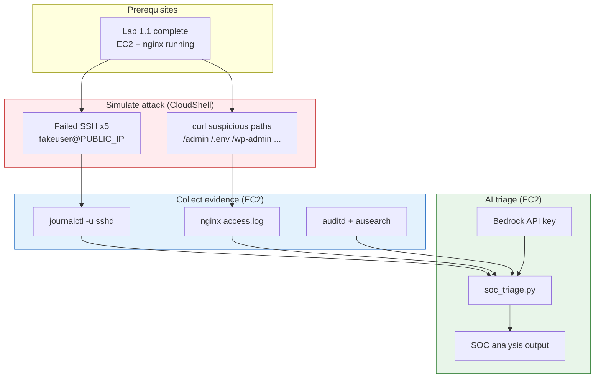
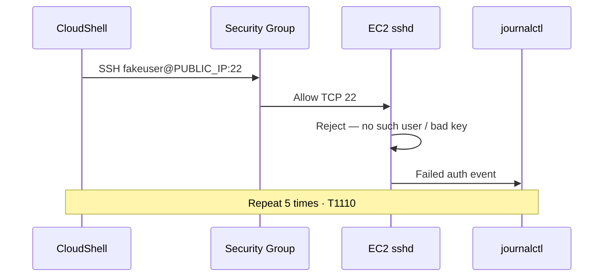
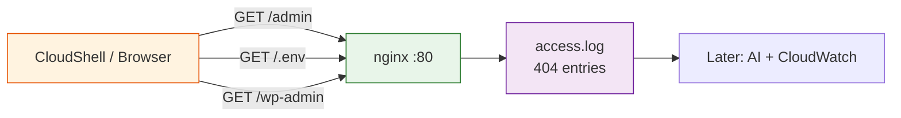
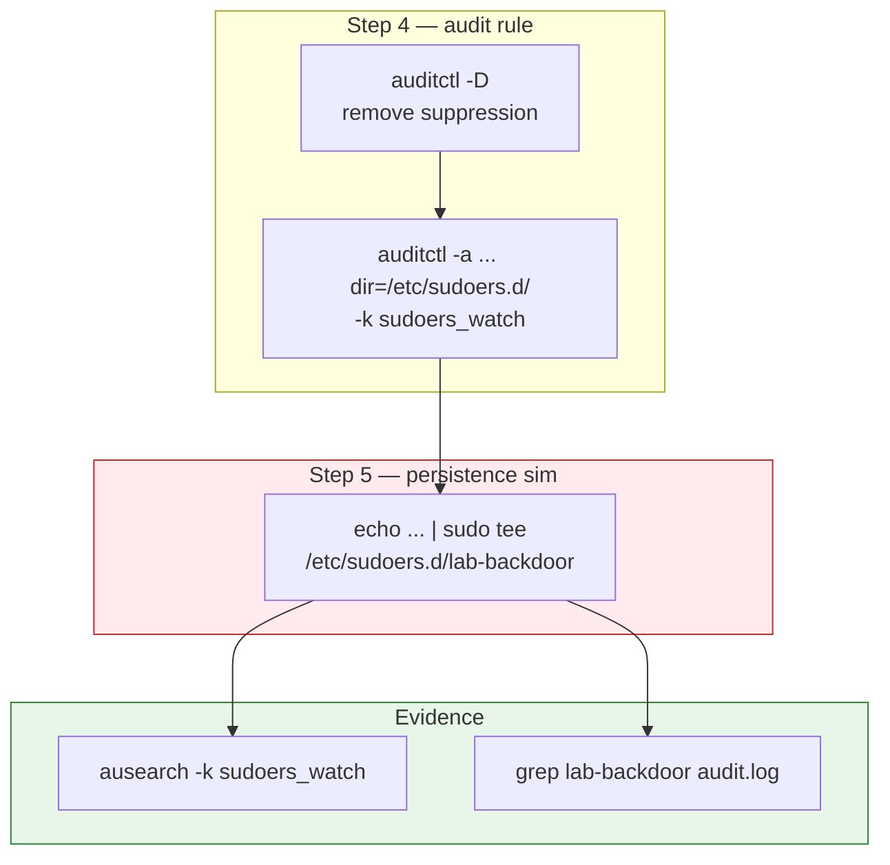
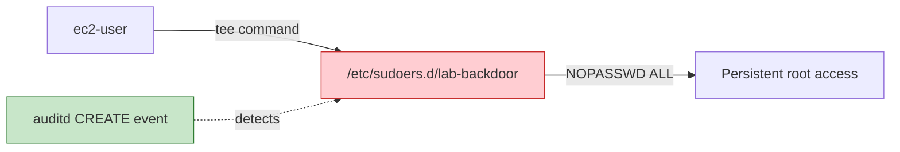
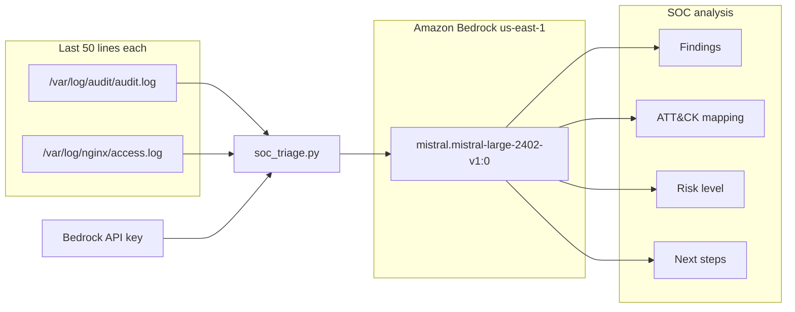
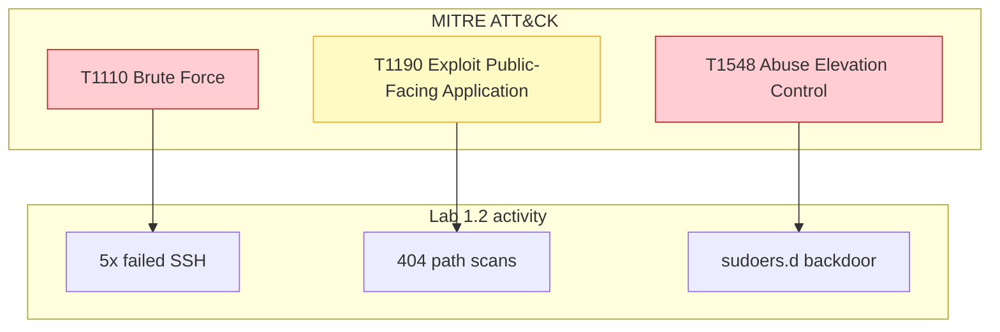
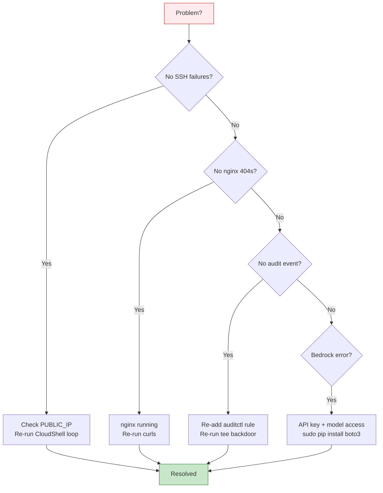
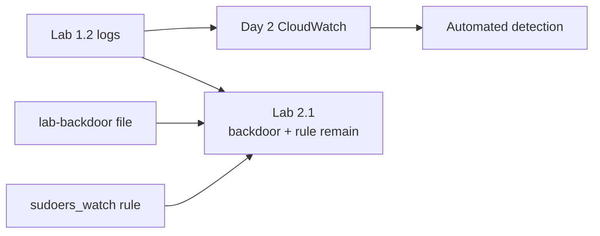

# Lab 1.2 — Visual Reference (Mermaid)

Diagrams for suspicious-activity simulation, evidence collection, and AI triage.

Render in **GitHub** or VS Code with **Markdown Preview Mermaid Support**. Export PNG from [Mermaid Live Editor](https://mermaid.live/) into `lab 1.2 screenshots/` if needed.

---

## 1. Complete lab flow

---

## 2. SSH brute-force simulation

---

## 3. Web recon probes

---

## 4. auditd sudoers watch

---

## 5. SetUID vs sudoers persistence (context)

---

## 6. AI SOC triage pipeline

---

## 7. ATT&CK technique map

---

## 8. Lab workflow with verification

```mermaid
graph LR
    S1["1 Baseline"] --> V1["Logs captured"]
    V1 --> S2["2 SSH fails"]
    S2 --> V2["journalctl shows failures"]
    V2 --> S3["3 Web probes"]
    S3 --> V3["404s in access.log"]
    V3 --> S4["4 auditd rule"]
    S4 --> V4["sudoers_watch active"]
    V4 --> S5["5 Backdoor file"]
    S5 --> V5["ausearch CREATE"]
    V5 --> S6["6 Bedrock key"]
    S6 --> S7["7 soc_triage.py"]
    S7 --> V7["AI analysis printed"]

    style V1 fill:#c8e6c9,stroke:#2e7d32
    style V2 fill:#c8e6c9,stroke:#2e7d32
    style V3 fill:#c8e6c9,stroke:#2e7d32
    style V4 fill:#c8e6c9,stroke:#2e7d32
    style V5 fill:#c8e6c9,stroke:#2e7d32
    style V7 fill:#c8e6c9,stroke:#2e7d32
```

---

## 9. Troubleshooting flowchart

---

## 10. Connection to later labs

