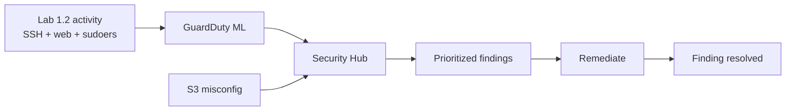

# Lab 1.3 — AI-Powered Threat Detection (GuardDuty & Security Hub)

**Personal AWS · ~60–90 min · Region `us-east-1` · Requires Labs 1.1 & 1.2**

Enable AWS managed detection that uses ML to surface the SSH brute force and sudoers activity from Lab 1.2 — then run a full **misconfiguration → detect → fix** loop with S3.

Save screenshots locally to `lab 1.3 screenshots/` — that folder is **gitignored** and must **never** be pushed to GitHub. Use **placeholders** in your worksheet; do not paste account IDs, ARNs, access keys, or raw finding exports into committed files.

> **Timing:** Enable GuardDuty and Security Hub **first**. Findings from Lab 1.2 often take **10–30 minutes** (GuardDuty) or **30–60 minutes** (Security Hub posture). Do the S3 exercise while you wait.

---

## Privacy & secrets — never commit to GitHub

| Never commit | Why | Keep it |
|--------------|-----|---------|
| **Screenshots** | May show account ID, ARNs, bucket names, finding details | `lab 1.3 screenshots/` only (gitignored) |
| **AWS account ID** | Identifies your account | Crop console captures |
| **Full finding JSON / exports** | Resource IDs, IPs, timestamps | Local notes only |
| **S3 bucket name with your name** | Fingerprints your account | Worksheet locally; use placeholder in git |
| **Bedrock / API keys** | From Lab 1.2 — still secret | Password manager only |
| **Real public IP / instance ID** | From Lab 1.1 worksheet | Local worksheet only |

**Safe to commit:** this guide, placeholder worksheet values, diagram files.

---

## The story

Your building from Labs 1.1–1.2 now has **automated AI guards** watching it 24/7 — no extra agents on EC2.

**Act 1 — Turn on the AI guard (Step 1)**  
You enable **GuardDuty**. ML models analyze CloudTrail, VPC flow logs, and DNS — looking for brute force, scanning, and credential abuse.  
→ *Enable GuardDuty*

**Act 2 — Open the security command center (Step 2)**  
You enable **Security Hub**. It collects findings from GuardDuty and maps them to **MITRE ATT&CK** and compliance standards (CIS, FSBP).  
→ *Enable Security Hub*

**Act 3 — Read the alerts from Lab 1.2 (Steps 3–4)**  
The failed SSH and web probes you simulated should appear as **findings** — proof that passive detection works without you querying logs manually.  
→ *Review GuardDuty & Security Hub findings*

**Act 4 — Leave a window unlocked on purpose (Steps 5–6)**  
You create an **S3 bucket** with public access block disabled (common mistake). Security Hub flags **S3.1**, you **fix** it, and the finding moves to **RESOLVED**.  
→ *S3 misconfiguration loop*

---

## Cybersecurity terms

### Story → term → lab step

| Story beat | Term | Full form | Step |
|------------|------|-----------|------|
| AI guard | **GuardDuty** | AWS threat detection service | 1 |
| Command center | **Security Hub** | Central findings aggregator | 2 |
| Alert details | **Finding** | Record of a detected issue | 3–4 |
| Attack labels | **MITRE ATT&CK** | T1110, T1548 on findings | 3–4 |
| Compliance checks | **CIS / FSBP** | Security standards in Security Hub | 2, 6 |
| Unlocked window | **S3 public access block** | S3 safety setting | 5–6 |
| Control ID | **S3.1** | FSBP — bucket must block public access | 6 |

### Key concepts

| Term | Meaning |
|------|---------|
| **GuardDuty** | Managed ML threat detection — no agents on EC2 |
| **Security Hub** | Single pane for GuardDuty + posture findings |
| **Finding** | One detected issue with severity, resource, technique |
| **ACTIVE / RESOLVED** | Open alert vs fixed and re-evaluated |
| **CVE vs ATT&CK** | CVE = known software flaw; ATT&CK = attacker behavior |
| **Posture finding** | Misconfiguration (e.g. open SG, S3 block off) — not live attack |

### How earlier labs connect

| From prior labs | Lab 1.3 detects it |
|-----------------|-------------------|
| Lab 1.2 failed SSH | `UnauthorizedAccess:EC2/SSHBruteForce` (GuardDuty) |
| Lab 1.2 web probes | Recon / unusual access patterns (may vary) |
| Lab 1.1 open SG :22/:80 | Posture findings in Security Hub (CIS/FSBP) |
| Lab 1.2 sudoers backdoor | May not appear in GuardDuty — auditd evidence still matters |

---

## Lab details

**Goal:** Enable GuardDuty and Security Hub, interpret findings from Lab 1.2, and complete an S3 misconfiguration detect-and-fix loop.

**Before you start:** Labs **1.1 & 1.2** complete · EC2 still running · Lab 1.2 activity at least **30 min ago** (ideal) · region **us-east-1**.

### Safety rails

- Training AWS account only.
- Do not change production IAM or S3 resources.
- GuardDuty and Security Hub: **30-day free trial** for new enablement.

### Steps at a glance

| Step | What | Story beat |
|------|------|------------|
| 1 | Enable GuardDuty | Turn on AI guard |
| 2 | Enable Security Hub | Command center |
| 3 | GuardDuty findings | Read SSH brute-force alert |
| 4 | Security Hub findings | ATT&CK + posture view |
| 5 | S3 misconfiguration | Leave window unlocked |
| 6 | Detect & remediate S3 | Fix → RESOLVED |

- [ ] 1 → 2 → 3 → 4 → 5 → 6 done

### Your worksheet (local only — use placeholders in git)

| Field | Your value |
|-------|------------|
| Region | `us-east-1` |
| GuardDuty status | Active / Pending |
| Security Hub standards | CIS + FSBP |
| S3 bucket name | `soc-lab-public-________` |
| SSH brute-force finding ID | `________________` |
| S3.1 finding seen? | Yes / Pending / Resolved |

### Where to run each step

| Step | Location |
|------|----------|
| 1–6 | **AWS Console** — `us-east-1` |

---

# Lab steps

*Full step-by-step instructions coming next — adapt from `labs/1.3-AWS-AI-Powered-Threat-Detection.md`.*

Do **1 → 2 → 6 in order**. Start **1 & 2 immediately**; do **5–6 while waiting** for findings from Lab 1.2.

---

## Step 1 — Enable GuardDuty

**Story:** Act 1 — turn on the AI guard.  
**Terms:** GuardDuty · ML detection · CloudTrail · VPC flow logs

**Console:** GuardDuty → **Get Started** → **Enable GuardDuty**.

**Done when:** GuardDuty status is **Enabled**.

**Screenshot:** `step-01-guardduty-enabled.png` (crop account ID)

---

## Step 2 — Enable Security Hub

**Story:** Act 2 — open the command center.  
**Terms:** Security Hub · CIS · FSBP · aggregation

**Console:** Security Hub → **Go to Security Hub** → enable **CIS AWS Foundations Benchmark** + **AWS Foundational Security Best Practices**.

**Done when:** Security Hub shows enabled with both standards.

**Screenshot:** `step-02-security-hub-enabled.png`

---

## Step 3 — GuardDuty findings

**Story:** Act 3a — read alerts from Lab 1.2.  
**Terms:** finding · SSHBruteForce · T1110

**Console:** GuardDuty → **Findings** → look for `UnauthorizedAccess:EC2/SSHBruteForce`.

**Done when:** Finding visible **or** noted as pending (wait 10–30 min after Lab 1.2).

**Screenshot:** `step-03-guardduty-finding.png`

---

## Step 4 — Security Hub findings

**Story:** Act 3b — prioritized view with ATT&CK mapping.  
**Terms:** severity · ACTIVE · MITRE · CVE

**Console:** Security Hub → **All findings** → filter **ACTIVE**, sort by **Severity**.

**Done when:** At least one GuardDuty-sourced or posture finding reviewed.

**Screenshot:** `step-04-security-hub-findings.png`

---

## Step 5 — S3 misconfiguration (create)

**Story:** Act 4a — deliberately leave a window unlocked.  
**Terms:** S3 · public access block · misconfiguration

**Console:** S3 → **Create bucket** → name `soc-lab-public-YOURNAME` → **uncheck** “Block all public access” → create.

**Done when:** Bucket exists with public access block **off**.

**Screenshot:** `step-05-s3-misconfig.png`

---

## Step 6 — Detect & remediate S3

**Story:** Act 4b — alarm fires, you fix, finding resolves.  
**Terms:** S3.1 · FSBP · RESOLVED · defender loop

1. Security Hub → search **S3.1** or your bucket name (may take 15–30 min).
2. S3 → bucket → **Permissions** → **Block all public access** → **On** → save.
3. Recheck Security Hub — finding should become **RESOLVED** within ~30 min.

**Done when:** Public access block re-enabled; finding resolved or pending re-scan.

**Screenshot:** `step-06-s3-remediated.png`

---

## Finish checklist

| ✓ | Check |
|---|--------|
| ☐ | GuardDuty enabled |
| ☐ | Security Hub enabled (CIS + FSBP) |
| ☐ | SSH brute-force finding seen (or pending noted) |
| ☐ | Security Hub findings reviewed |
| ☐ | S3 bucket created, then public access block re-enabled |
| ☐ | Screenshots saved locally (not in git) |

---

## Reference

**Diagrams:** [diagrams/DIAGRAMS.md](diagrams/DIAGRAMS.md)

---

## Glossary (quick lookup)

| Term | One-line meaning |
|------|------------------|
| **GuardDuty** | AWS ML threat detection service |
| **Security Hub** | Central security findings dashboard |
| **Finding** | Single detected issue with metadata |
| **FSBP** | AWS Foundational Security Best Practices standard |
| **CIS Benchmark** | Industry hardening checklist for AWS |
| **S3.1** | Control: S3 buckets must block public access |
| **Posture** | Configuration state, not live attacker action |

**Deep dive:** [The story](#the-story) · [Cybersecurity terms](#cybersecurity-terms)

---

*Source: `labs/1.3-AWS-AI-Powered-Threat-Detection.md`*
