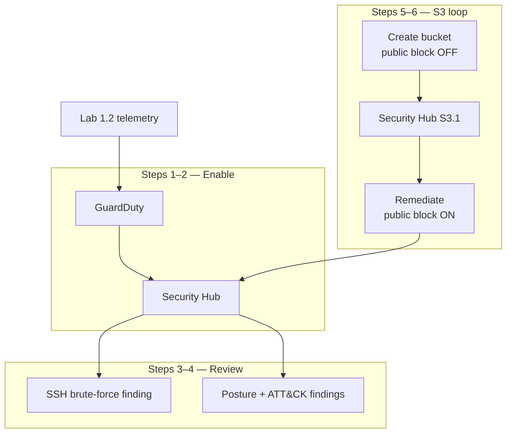
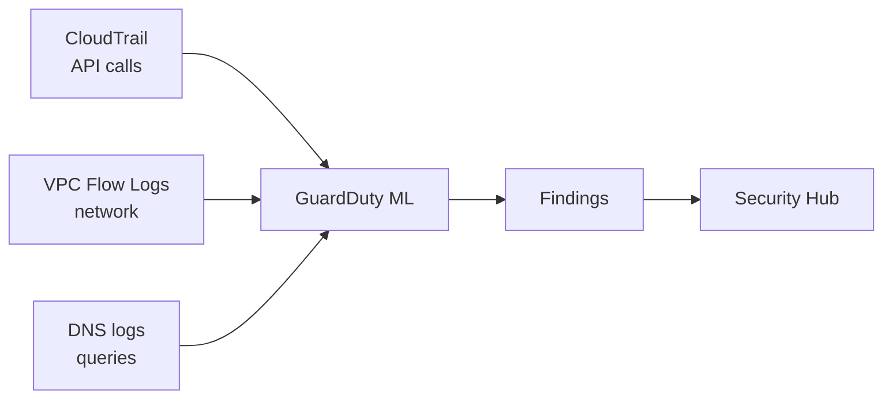
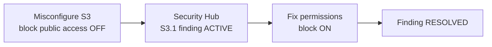
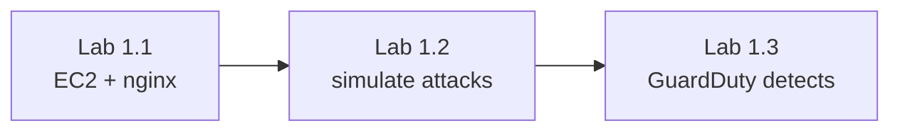

# Lab 1.3 — Visual Reference (Mermaid)

Diagrams for GuardDuty, Security Hub, and the S3 misconfiguration loop.

Render in **GitHub** or VS Code with **Markdown Preview Mermaid Support**. Export PNG from [Mermaid Live Editor](https://mermaid.live/) into `lab 1.3 screenshots/` if needed.

---

## 1. Lab flow overview

---

## 2. Data sources GuardDuty analyzes

---

## 3. S3 defender loop

---

## 4. Lab chain (1.1 → 1.3)

---

*More diagrams will be added when the full guide is expanded.*
