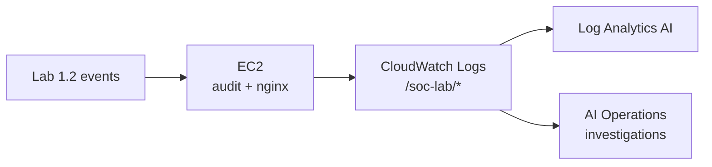

# Lab 2.1 — CloudWatch Log Streaming & AI Investigation

**Personal AWS · ~90–120 min · Region `us-east-1` · Requires Labs 1.1, 1.2 & 1.3**

Stream endpoint logs from your EC2 instance into CloudWatch, then use **Log Analytics AI** and **AI Operations** to investigate the same suspicious activity you triaged manually in Lab 1.2 — without grepping logs or running a Python script.

Save screenshots locally to `lab 2.1 screenshots/` — that folder is **gitignored** and must **never** be pushed to GitHub. Use the naming convention in [../SCREENSHOT-NAMING.md](../SCREENSHOT-NAMING.md). Do not commit account IDs, instance IDs, ARNs, or Bedrock/API keys.

---

## Privacy & secrets — never commit to GitHub

| Never commit | Why | Keep it |
|--------------|-----|---------|
| **Screenshots** | May show account ID, instance ID, log contents, IPs | `lab 2.1 screenshots/` only (gitignored) |
| **Instance ID / public IP** | Fingerprints your infra | Local worksheet only |
| **IAM role ARNs** | Account-specific | Crop console captures |
| **Log event exports** | Contain IPs, usernames, paths | Local screenshots only |
| **Bedrock API key** (from Lab 1.2) | Still valid secret | Password manager only |

**Safe to commit:** this guide, placeholder worksheet values, diagram files.

---

## The story

Your Lab 1.2 evidence (audit + nginx) still lives on the server. Now you **pipe it to the cloud** and let AWS AI read it for you.

**Act 1 — Give the server a cloud identity (Step 1)**  
Attach an **IAM instance profile** so EC2 can push logs to CloudWatch without embedded keys.  
→ *IAM role to EC2*

**Act 2 — Install the log shipper (Step 2)**  
Install the **CloudWatch agent**, fix audit log ACLs, and stream `/var/log/audit/audit.log` + nginx access logs to `/soc-lab/audit` and `/soc-lab/nginx`.  
→ *CloudWatch agent*

**Act 3 — Confirm telemetry arrived (Step 3)**  
Verify both log groups are ingesting events in the CloudWatch console.  
→ *Verify log groups*

**Act 4 — Ask questions in English (Step 4)**  
Use **Log Analytics** natural-language queries against your streamed logs.  
→ *Log Analytics AI*

**Act 5 — Turn on the AI investigator (Steps 5–6)**  
Enable **AI Operations**, run an investigation, and evaluate hypotheses like a SOC analyst.  
→ *AI Operations investigations*

---

## Cybersecurity terms

| Term | Meaning | Step |
|------|---------|------|
| **IAM instance profile** | Role attached to EC2 — no long-lived keys on disk | 1 |
| **CloudWatch agent** | Ships OS and app logs to CloudWatch | 2 |
| **Log group** | Named container for log streams (`/soc-lab/audit`) | 2–3 |
| **Logs Insights** | Query language for CloudWatch logs | 4 |
| **Log Analytics AI** | Natural-language → Insights query | 4 |
| **AI Operations** | Automated investigations over logs/metrics | 5–6 |
| **Facet** | Dimension required for some AI Operations observations | 6 |

**ATT&CK (from Lab 1.2 signal):** T1110 (Brute Force) · T1548 (Elevation Abuse) · T1190 (Public-Facing App)

---

## Lab details

**Goal:** Stream audit and nginx logs to CloudWatch and run AI-assisted investigations on Lab 1.2 telemetry.

**Before you start:** Labs **1.1–1.3** complete · EC2 running · Lab 1.2 `lab-backdoor` and `sudoers_watch` audit rule still in place · region **us-east-1**.

### Safety rails

- Training AWS account only.
- IAM role grants monitoring permissions — inspect policies before production use.
- AI Operations retention: use **7 days** in lab (cost control).

### Steps at a glance

| Step | What | Where |
|------|------|-------|
| 1 | Attach IAM role to EC2 | CloudShell |
| 2 | Install & configure CloudWatch agent | EC2 (SSH) |
| 3 | Verify log groups ingesting | AWS Console |
| 4 | Log Analytics natural-language queries | AWS Console |
| 5 | Enable AI Operations | AWS Console |
| 6 | Run AI investigation | AWS Console |

- [ ] 1 → 2 → 3 → 4 → 5 → 6 done

### Your worksheet (local only — use placeholders in git)

| Field | Your value |
|-------|------------|
| Region | `us-east-1` |
| Instance ID | `i-________________` |
| IAM role name | `soc-lab-ec2-monitoring` |
| Audit log group | `/soc-lab/audit` |
| Nginx log group | `/soc-lab/nginx` |
| Investigation name | `________________` |

### Where to run each step

| Step | Location |
|------|----------|
| 1 | **CloudShell** — `us-east-1` |
| 2 | **VS Code SSH** → EC2 (`ec2-user`) |
| 3–6 | **AWS Console** — CloudWatch — `us-east-1` |

---

# Lab steps

*Full step-by-step commands — adapt from `labs/2.1-CloudWatch-Log-Streaming-and-AI-Investigation.md`.*

Do **1 → 6 in order**.

---

## Step 1 — Attach IAM role to EC2

**Story:** Act 1 — cloud identity for the server.  
**Where:** CloudShell

Create role `soc-lab-ec2-monitoring`, attach `CloudWatchAgentServerPolicy` + `AmazonSSMManagedInstanceCore`, associate instance profile with your EC2 instance.

**Done when:** EC2 **IAM role** column shows `soc-lab-ec2-monitoring`.

**Screenshot:** `step-01-iam-role.png` (crop account ID)

**Stuck?** `InvalidInstanceId` → correct instance ID. Role exists → continue to attach profile.

---

## Step 2 — Install & configure CloudWatch agent

**Story:** Act 2 — ship logs off the box.  
**Where:** EC2 over SSH

Install `amazon-cloudwatch-agent`, set ACLs on `/var/log/audit/`, deploy agent config for audit + nginx paths, start the agent.

**Done when:** `sudo systemctl status amazon-cloudwatch-agent` is **active (running)**.

**Screenshot:** `step-02-agent-running.png`

**Stuck?** Agent cannot read audit log → re-run `setfacl` commands from source lab.

---

## Step 3 — Verify log groups

**Story:** Act 3 — confirm telemetry in the cloud.  
**Where:** Console → CloudWatch → **Log groups**

Open `/soc-lab/audit` and `/soc-lab/nginx` — recent log streams and events from Lab 1.2 activity should appear within a few minutes.

**Done when:** Both log groups show **Last event time** within the last hour.

**Screenshot:** `step-03-log-groups.png`

**Stuck?** No events → wait 5 min; check agent status on EC2; confirm IAM role attached.

---

## Step 4 — Log Analytics AI queries

**Story:** Act 4 — plain-English log search.  
**Where:** Console → CloudWatch → **Log Analytics**

Run natural-language queries (e.g. failed SSH, sudoers changes, nginx 404s) against `/soc-lab/audit` or `/soc-lab/nginx`.

**Done when:** At least one AI-generated query returns Lab 1.2-related events.

**Screenshot:** `step-04-log-analytics.png` (redact IPs if sharing)

---

## Step 5 — Enable AI Operations

**Story:** Act 5a — provision the investigator.  
**Where:** Console → CloudWatch → **AI Operations** → **Configurations**

Enable AI Operations · retention **7 days** · auto-create investigation permissions role.

**Done when:** AI Operations shows **Enabled** with retention configured.

**Screenshot:** `step-05-ai-ops-enabled.png`

---

## Step 6 — Run AI investigation

**Story:** Act 5b — automated SOC triage.  
**Where:** Console → **AI Operations** → **Investigations**

Create investigation from Logs Insights · query failed SSH (or sudoers activity) · use facet **`aws.region`** · start investigation · review hypotheses.

**Done when:** Investigation completes with at least one hypothesis referencing your log evidence.

**Screenshot:** `step-06-investigation.png` (crop IPs/account ID)

**Stuck?** Observation fails → ensure **Facet** is set. No log data → return to Step 3.

---

## Finish checklist

| ✓ | Check |
|---|--------|
| ☐ | IAM role `soc-lab-ec2-monitoring` on EC2 |
| ☐ | CloudWatch agent running |
| ☐ | `/soc-lab/audit` and `/soc-lab/nginx` ingesting |
| ☐ | Log Analytics query returned results |
| ☐ | AI Operations enabled |
| ☐ | Investigation completed with hypotheses |
| ☐ | Screenshots saved locally (not in git) |

### Screenshot checklist (local only — gitignored)

Save under `gurinder_practice/lab 2.1/lab 2.1 screenshots/`. Full naming reference: [SCREENSHOT-NAMING.md](../SCREENSHOT-NAMING.md).

| File | Step | Capture |
|------|------|---------|
| `step-01-iam-role.png` | 1 | EC2 instance with IAM role attached |
| `step-02-agent-running.png` | 2 | `systemctl status amazon-cloudwatch-agent` |
| `step-03-log-groups.png` | 3 | Both `/soc-lab/*` log groups with recent events |
| `step-04-log-analytics.png` | 4 | Log Analytics query + results |
| `step-05-ai-ops-enabled.png` | 5 | AI Operations configuration |
| `step-06-investigation.png` | 6 | Investigation hypotheses / summary |

---

## Reference

**Diagrams:** [diagrams/DIAGRAMS.md](diagrams/DIAGRAMS.md)

**Next lab:** Lab 2.2 builds dashboards and alarms on this telemetry.

---

## Glossary (quick lookup)

| Term | One-line meaning |
|------|------------------|
| **Instance profile** | IAM role container for EC2 |
| **CloudWatch agent** | Log/metrics shipper to AWS |
| **Log group** | Top-level log namespace in CloudWatch |
| **AI Operations** | CloudWatch automated investigation feature |
| **Hypothesis** | AI-generated explanation of observed activity |

---

*Source: `labs/2.1-CloudWatch-Log-Streaming-and-AI-Investigation.md`*
