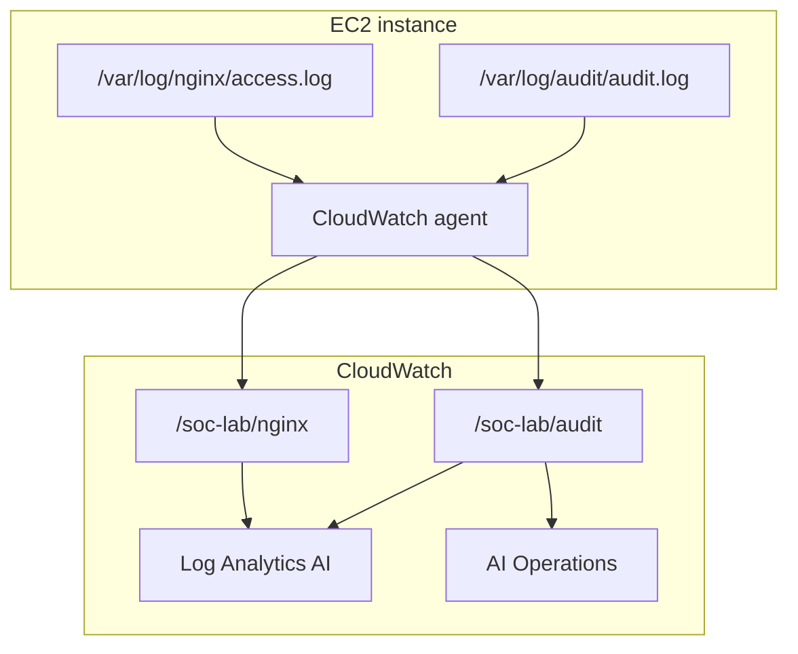
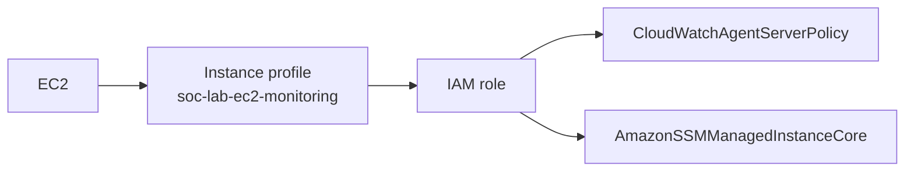
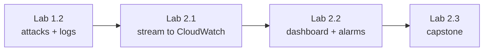

# Lab 2.1 — Visual Reference (Mermaid)

Diagrams for CloudWatch log streaming and AI Operations investigations.

Render in **GitHub** or VS Code with **Markdown Preview Mermaid Support**. Export PNG from [Mermaid Live Editor](https://mermaid.live/) into `lab 2.1 screenshots/` if needed.

---

## 1. Lab flow overview

---

## 2. IAM instance profile

---

## 3. Lab chain (1.2 → 2.1 → 2.2)

---

*More diagrams will be added when the full guide is expanded.*
