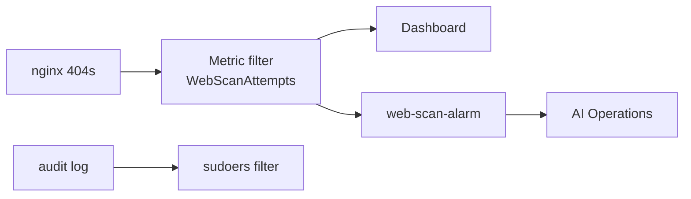

# Lab 2.2 — Security Monitoring Dashboard & Automated Detection

**Personal AWS · ~90–120 min · Region `us-east-1` · Requires Labs 1.1–2.1**

Build a live SOC-style **dashboard**, **metric filter**, and **alarm** on nginx scan traffic from Lab 1.2 — then wire the alarm to trigger an **AI Operations investigation** automatically when the threshold is breached.

Save screenshots locally to `lab 2.2 screenshots/` — that folder is **gitignored** and must **never** be pushed to GitHub. Use the naming convention in [../SCREENSHOT-NAMING.md](../SCREENSHOT-NAMING.md).

---

## Privacy & secrets — never commit to GitHub

| Never commit | Why | Keep it |
|--------------|-----|---------|
| **Screenshots** | Dashboards show IPs, metric values, account context | `lab 2.2 screenshots/` only |
| **SNS email / topic ARNs** | Account-specific | Local worksheet |
| **Public IP** | Your EC2 address | Placeholder in git |
| **Alarm history** | May contain probe source IPs | Crop captures |

**Safe to commit:** this guide, placeholder worksheet values, diagram files.

---

## The story

Streaming logs (Lab 2.1) was step one. Now you **operationalize** detection — count bad events, visualize them, and let AI triage fire on its own.

**Act 1 — Count the scans (Step 1)**  
Create a **metric filter** on `/soc-lab/nginx` that increments on every **404** — the fingerprint of web reconnaissance.  
→ *Metric filter*

**Act 2 — Generate fresh signal (Step 2)**  
Re-run the Lab 1.2-style **curl probe** from CloudShell so the dashboard has live data.  
→ *Web probe*

**Act 3 — Build the war room (Step 3)**  
Assemble a **CloudWatch dashboard** (`soc-lab-web-monitor`) with analyst-focused Logs Insights widgets.  
→ *SOC dashboard*

**Act 4 — Wire the alarm (Step 4)**  
Create alarm `web-scan-alarm` on `SOCLab/WebScanAttempts` · trigger **AI Operations** on **In alarm**.  
→ *Automated detection*

**Act 5 — Watch privilege changes (Step 5)**  
Add **sudoers / persistence** detection on the audit log — connects back to Lab 1.2 backdoor theme.  
→ *Audit metric filter*



---

## Cybersecurity terms

| Term | Meaning | Step |
|------|---------|------|
| **Metric filter** | Pattern match on log events → custom metric | 1, 5 |
| **Namespace** | Metric grouping (`SOCLab`) | 1, 4 |
| **Dashboard widget** | Visual panel (chart, query, alarm status) | 3 |
| **CloudWatch alarm** | Threshold on a metric → action | 4 |
| **SNS** | Notification channel (optional email) | 4 |
| **AI Operations action** | Auto-start investigation when alarm fires | 4 |

**ATT&CK:** T1190 · T1595.002 (Vulnerability Scanning) · T1548 (sudoers — Step 5)

---

## Lab details

**Goal:** Detect web reconnaissance and privilege persistence via metrics, dashboards, and automated AI triage.

**Before you start:** Lab **2.1** complete · `/soc-lab/nginx` and `/soc-lab/audit` ingesting · region **us-east-1**.

### Safety rails

- Training account only.
- Alarm thresholds are intentionally low for lab visibility — tune in production.

### Steps at a glance

| Step | What | Where |
|------|------|-------|
| 1 | Create nginx 404 metric filter | AWS Console |
| 2 | Generate fresh web probe signal | CloudShell |
| 3 | Build SOC dashboard | AWS Console |
| 4 | Create alarm + AI Operations action | AWS Console |
| 5 | Audit log privilege persistence filter | AWS Console |

- [ ] 1 → 2 → 3 → 4 → 5 done

### Your worksheet (local only)

| Field | Your value |
|-------|------------|
| Region | `us-east-1` |
| Dashboard name | `soc-lab-web-monitor` |
| Metric filter (nginx) | `nginx-scan-attempts` |
| Metric name | `WebScanAttempts` |
| Alarm name | `web-scan-alarm` |
| Public IP (for probe) | `__.___.___.___` |

### Where to run each step

| Step | Location |
|------|----------|
| 1, 3–5 | **AWS Console** — CloudWatch — `us-east-1` |
| 2 | **CloudShell** |

---

# Lab steps

*Full step-by-step instructions — adapt from `labs/2.2-Security-Monitoring-Dashboard-and-Automated-Detection.md`.*

Do **1 → 5 in order**. Run Step 2 before testing the alarm if you need fresh 404 events.

---

## Step 1 — Create metric filter (nginx 404s)

**Story:** Act 1 — count scan attempts.  
**Where:** CloudWatch → `/soc-lab/nginx` → **Metric filters**

Filter pattern for 4xx status codes · filter name `nginx-scan-attempts` · namespace `SOCLab` · metric `WebScanAttempts`.

**Done when:** Metric filter created and test pattern matches Lab 1.2 404 lines.

**Screenshot:** `step-01-metric-filter.png`

---

## Step 2 — Generate fresh signal

**Story:** Act 2 — feed the pipeline.  
**Where:** CloudShell

```bash
export PUBLIC_IP=YOUR_EC2_PUBLIC_IP
curl -s http://$PUBLIC_IP/admin > /dev/null
curl -s http://$PUBLIC_IP/login > /dev/null
curl -s http://$PUBLIC_IP/.env > /dev/null
curl -s http://$PUBLIC_IP/wp-admin > /dev/null
curl -s http://$PUBLIC_IP/config.php > /dev/null
```

**Done when:** Five new 404 lines in nginx access log on EC2.

**Screenshot:** `step-02-probe-signal.png` (redact IP)

---

## Step 3 — Build dashboard

**Story:** Act 3 — analyst war room.  
**Where:** CloudWatch → **Dashboards** → `soc-lab-web-monitor`

Add 7+ widgets per source lab (404 rate, top paths, source IPs, audit highlights, alarm status, etc.).

**Done when:** Dashboard displays live data from `/soc-lab/nginx` and `/soc-lab/audit`.

**Screenshot:** `step-03-dashboard.png`

---

## Step 4 — Create alarm + AI action

**Story:** Act 4 — automated triage.  
**Where:** CloudWatch → **Alarms**

Alarm on `SOCLab/WebScanAttempts` · Sum ≥ 1 per minute · **AI Operations investigation** on In alarm · name `web-scan-alarm`.

**Done when:** Alarm shows **OK** or **In alarm** after probe; investigation can be triggered.

**Screenshot:** `step-04-alarm-ai-action.png`

---

## Step 5 — Privilege persistence on audit log

**Story:** Act 5 — sudoers / backdoor watch.  
**Where:** CloudWatch → `/soc-lab/audit` → metric filter

Detect sudoers or persistence-related audit events (per source lab Part 5).

**Done when:** Second metric filter on audit log saved and visible on dashboard or alarms list.

**Screenshot:** `step-05-audit-filter.png`

---

## Finish checklist

| ✓ | Check |
|---|--------|
| ☐ | `nginx-scan-attempts` filter → `WebScanAttempts` |
| ☐ | Fresh 404 probe events in nginx log |
| ☐ | Dashboard `soc-lab-web-monitor` with 7+ widgets |
| ☐ | Alarm `web-scan-alarm` with AI Operations action |
| ☐ | Audit-based persistence filter added |
| ☐ | Screenshots saved locally (not in git) |

### Screenshot checklist (local only — gitignored)

Save under `gurinder_practice/lab 2.2/lab 2.2 screenshots/`. Full naming reference: [SCREENSHOT-NAMING.md](../SCREENSHOT-NAMING.md).

| File | Step | Capture |
|------|------|---------|
| `step-01-metric-filter.png` | 1 | Filter pattern + test match |
| `step-02-probe-signal.png` | 2 | nginx tail or CloudShell probe |
| `step-03-dashboard.png` | 3 | Full dashboard view |
| `step-04-alarm-ai-action.png` | 4 | Alarm config + AI action |
| `step-05-audit-filter.png` | 5 | Audit metric filter |

---

## Reference

**Diagrams:** [diagrams/DIAGRAMS.md](diagrams/DIAGRAMS.md)

**Next lab:** Lab 2.3 capstone — you build the full pipeline independently.

---

*Source: `labs/2.2-Security-Monitoring-Dashboard-and-Automated-Detection.md`*
