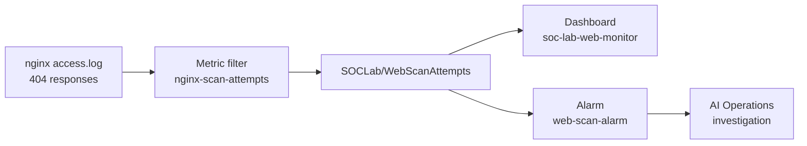
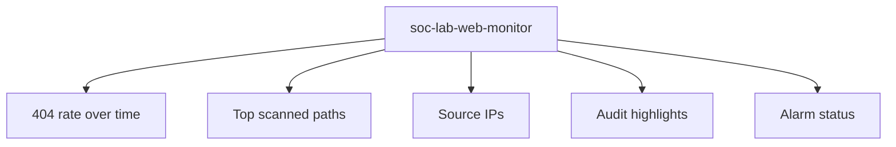
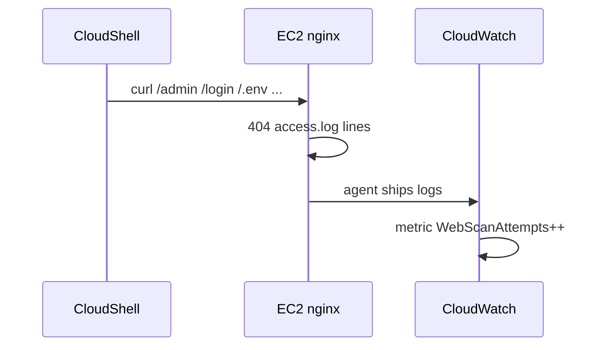

# Lab 2.2 — Visual Reference (Mermaid)

Diagrams for metric filters, dashboards, alarms, and automated AI triage.

Render in **GitHub** or VS Code with **Markdown Preview Mermaid Support**. Export PNG from [Mermaid Live Editor](https://mermaid.live/) into `lab 2.2 screenshots/` if needed.

---

## 1. Detection pipeline

---

## 2. Dashboard widget types

---

## 3. Web probe signal (Step 2)

---

*More diagrams will be added when the full guide is expanded.*
