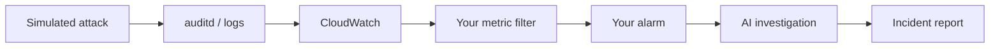

# Lab 2.3 — Attack & Detect Capstone

**Personal AWS · ~90–120 min · Region `us-east-1` · Requires Labs 2.1 & 2.2**

You are on **both sides of the wire**: pick a threat, build your own detection pipeline (metric filter → alarm → dashboard → AI investigation), **simulate the attack**, verify everything fires without manual clicks, then write a structured **incident report**.

Save screenshots locally to `lab 2.3 screenshots/` — that folder is **gitignored** and must **never** be pushed to GitHub. Use the naming convention in [../SCREENSHOT-NAMING.md](../SCREENSHOT-NAMING.md).

---

## Privacy & secrets — never commit to GitHub

| Never commit | Why | Keep it |
|--------------|-----|---------|
| **Screenshots** | Attacks, alarms, investigations expose IPs and account context | `lab 2.3 screenshots/` only |
| **`testattacker` password** | Lab credential | Local notes only |
| **Incident report with real IPs** | Sensitive telemetry | Local PDF/doc — not git |
| **Investigation exports** | Full log context | Crop or redact |

**Safe to commit:** this guide, placeholder worksheet values, diagram files.

---

## The story

Every prior lab showed you the pieces. This capstone asks you to **own the full loop** — like a shift lead handing you a threat card and saying “detect it.”

**Act 1 — Create the adversary account (Step 1)**  
Add low-privilege user **`testattacker`** for safe simulation.  
→ *Test account*

**Act 2 — Draw your threat card (Step 2)**  
Choose one technique from the threat menu (SSH brute force, new account, shadow read, `su` abuse, cron persistence).  
→ *Threat selection*

**Act 3 — Build the pipeline (Step 3)**  
Metric filter · alarm · dashboard widget · **AI Operations** on alarm — **without** step-by-step hand-holding.  
→ *Detection pipeline*

**Act 4 — Execute the attack (Step 4)**  
Run the simulation commands for your chosen threat.  
→ *Attack simulation*

**Act 5 — Prove detection worked (Steps 5–6)**  
Confirm metric → alarm → investigation fired; evaluate AI hypotheses.  
→ *Verify & triage*

**Act 6 — Close the incident (Step 7)**  
Write the incident report and formally close the investigation.  
→ *Incident report*



---

## Cybersecurity terms

| Term | Meaning | Step |
|------|---------|------|
| **Capstone** | Synthesis lab — minimal hand-holding | all |
| **testattacker** | Low-privilege lab user for simulations | 1, 4 |
| **Detection pipeline** | Log → metric → alarm → response | 3 |
| **Hypothesis** | AI explanation to accept/reject | 6 |
| **Incident report** | Structured SOC deliverable | 7 |

### Threat menu (pick one)

| # | Threat | Log pattern (audit) | ATT&CK |
|---|--------|---------------------|--------|
| A | SSH brute force | `exe="/usr/sbin/sshd" res=failed` | T1110 |
| B | New account backdoor | `type=ADD_USER` | T1136 |
| C | Sensitive file access | `name="/etc/shadow"` | T1003 |
| D | `su` abuse | `exe="/usr/bin/su" res=failed` | T1548 |
| E | Cron persistence | `crontab` | T1053 |

> **Default:** Threat **A** — fastest visible signal on `/soc-lab/audit`.

---

## Lab details

**Goal:** Independently detect one simulated attack end-to-end and document the response.

**Before you start:** Lab **2.2** complete (`web-scan-alarm` exists as reference) · `/soc-lab/audit` ingesting · SSH to EC2 · region **us-east-1**.

### Safety rails

- Only attack **your** lab EC2 instance.
- Do not use real attacker tooling — use provided simulation commands only.
- Delete or disable `testattacker` during cleanup.

### Steps at a glance

| Step | What | Where |
|------|------|-------|
| 1 | Create `testattacker` account | EC2 (SSH) |
| 2 | Choose threat A–E | Worksheet |
| 3 | Build detection pipeline | AWS Console |
| 4 | Simulate attack | EC2 / CloudShell |
| 5 | Verify alarm & metric fired | AWS Console |
| 6 | Evaluate AI investigation | AWS Console |
| 7 | Write incident report | Local document |

- [ ] 1 → 7 done

### Your worksheet (local only)

| Field | Your value |
|-------|------------|
| Region | `us-east-1` |
| Threat chosen | A / B / C / D / E |
| Metric name | `________________` |
| Alarm name | `________________` |
| Investigation ID | `________________` |
| Top hypothesis accepted? | Yes / No — notes |

---

# Lab steps

*Full instructions — adapt from `labs/2.3-Attack-and-Detect-Capstone.md`.*

Do **1 → 7 in order**. Record your threat choice before Step 3.

---

## Step 1 — Create test account

**Where:** EC2 over SSH

```bash
sudo useradd -m testattacker
sudo passwd testattacker
id testattacker
```

**Done when:** `testattacker` exists with **no** `wheel` group.

**Screenshot:** `step-01-testattacker.png`

---

## Step 2 — Choose your threat

**Where:** Worksheet

Pick **one** row from the threat menu. Note ATT&CK ID and log pattern.

**Done when:** Threat letter recorded in worksheet.

**Screenshot:** `step-02-threat-choice.png` (worksheet or notes — no secrets)

---

## Step 3 — Build detection pipeline

**Where:** AWS Console — CloudWatch

Without detailed prompts: metric filter on `/soc-lab/audit` · alarm (Sum ≥ 1, 1 min) · AI Operations action · dashboard widget.

**Done when:** Filter, alarm, and widget exist for **your** threat.

**Screenshot:** `step-03-pipeline.png`

---

## Step 4 — Simulate the attack

**Where:** EC2 or CloudShell (per threat)

Run simulation commands from source lab for your chosen threat.

**Done when:** Expected audit/nginx events appear in logs (and CloudWatch within minutes).

**Screenshot:** `step-04-attack-sim.png` (redact passwords)

---

## Step 5 — Verify pipeline fired

**Where:** CloudWatch → Metrics / Alarms

Confirm metric incremented · alarm entered **In alarm** · investigation auto-started (if configured).

**Done when:** End-to-end flow confirmed without manually starting the investigation.

**Screenshot:** `step-05-alarm-fired.png`

---

## Step 6 — Evaluate AI investigation

**Where:** AI Operations → Investigations

Review hypotheses · select most credible · note gaps.

**Done when:** You can explain which hypothesis matches your simulated attack and why.

**Screenshot:** `step-06-investigation.png`

---

## Step 7 — Incident report

**Where:** Local document (not git)

Structured report: timeline · impact · detection · root cause · recommendations · investigation closure.

**Done when:** Report complete and investigation closed in console.

**Screenshot:** `step-07-incident-report.png` (redact IPs)

---

## Finish checklist

| ✓ | Check |
|---|--------|
| ☐ | `testattacker` created |
| ☐ | Threat chosen and recorded |
| ☐ | Custom metric filter + alarm + widget |
| ☐ | Attack simulated successfully |
| ☐ | Alarm fired without manual trigger |
| ☐ | AI investigation evaluated |
| ☐ | Incident report written |
| ☐ | Screenshots saved locally (not in git) |

### Screenshot checklist (local only — gitignored)

Save under `gurinder_practice/lab 2.3/lab 2.3 screenshots/`. Full naming reference: [SCREENSHOT-NAMING.md](../SCREENSHOT-NAMING.md).

| File | Step | Capture |
|------|------|---------|
| `step-01-testattacker.png` | 1 | `id testattacker` output |
| `step-02-threat-choice.png` | 2 | Threat selection notes |
| `step-03-pipeline.png` | 3 | Filter + alarm configuration |
| `step-04-attack-sim.png` | 4 | Simulation command output |
| `step-05-alarm-fired.png` | 5 | Alarm in ALARM state |
| `step-06-investigation.png` | 6 | Investigation hypotheses |
| `step-07-incident-report.png` | 7 | Report summary (redacted) |

---

## Cleanup (after capstone)

```bash
# On EC2 — remove test user
sudo userdel -r testattacker
```

Delete or disable capstone-specific alarms and metric filters if no longer needed. Keep Lab 2.2 baseline alarms unless you are tearing down the whole environment.

---

## Reference

**Diagrams:** [diagrams/DIAGRAMS.md](diagrams/DIAGRAMS.md)

**Course complete:** You can launch, attack, stream, detect, triage, and document — the modern SOC analyst loop.

---

*Source: `labs/2.3-Attack-and-Detect-Capstone.md`*
