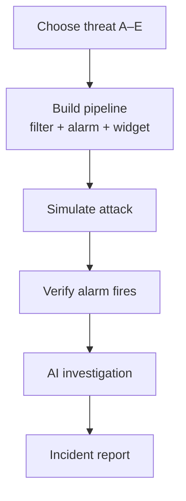
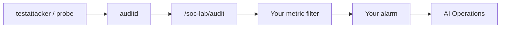
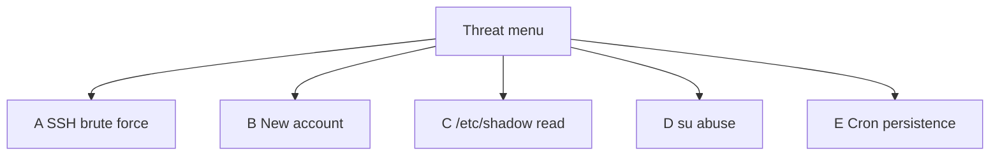

# Lab 2.3 — Visual Reference (Mermaid)

Diagrams for the attack-and-detect capstone.

Render in **GitHub** or VS Code with **Markdown Preview Mermaid Support**. Export PNG from [Mermaid Live Editor](https://mermaid.live/) into `lab 2.3 screenshots/` if needed.

---

## 1. Capstone loop

---

## 2. End-to-end telemetry path

---

## 3. Threat menu overview

---

*More diagrams will be added when the full guide is expanded.*
