# Day 1 — Speaker Notes

Use with **Cybersecurity-AI-day1.pdf**. Each section matches one slide (from slide 6).

---

## Slide 6 — What Is Cybersecurity?

**On slide:**

- Cybersecurity is the practice of protecting
- systems, networks, and data from digital
- attacks, unauthorized access, and damage.
- Every organization that operates digitally
- depends on cybersecurity controls to stay
- operational and trustworthy.
- Confidentiality — keeping data private
- and accessible only to authorized users
- Integrity — ensuring data is accurate and
- has not been tampered with
- Availability — keeping systems and
- services running when needed
- Threat actors range from individual
- hackers to nation-state groups with
- sophisticated toolsets

**Speaker notes:**

### Instructor Opening (How to Start Teaching)

Ask the class:

> "How many of you use online banking?"

> "How many use Gmail?"

> "How many use Amazon or online shopping?"
Then ask:

> "What would happen if someone stole your password?"

> "What if a hacker modified your bank balance?"

> "What if Amazon's website stopped working for 24 hours?"
Tell them:

> Cybersecurity exists to prevent exactly these situations.

### Formal Definition

Cybersecurity is the practice of protecting:

* Systems
* Networks
* Applications
* Devices
* Data

from:

* Unauthorized access
* Theft
* Damage
* Disruption
* Cyber attacks

### Simple Definition for Beginners

Tell students:

> Cybersecurity is like security guards, locks, cameras, and alarm systems for the digital world.
Physical World:

- House
- Door Lock
- Security Camera
- Alarm System

Digital World:

- Computer System
- Password
- Firewall
- Security Monitoring

### Why Cybersecurity Exists

Organizations depend on:

* Websites
* Databases
* Cloud systems
* Email
* Mobile apps

Without cybersecurity:

- Hackers
- Malware
- Ransomware
- Data Theft
- Service Outages
- Financial Loss

become common.

---

## Slide 7 — The Cia Triad

**On slide:**

- The CIA Triad is the foundational model for
- information security, organizing all security
- objectives into three properties.
- Every security control you implement, from
- encryption to firewall rules, maps back to at least
- one of these three.
- Property
- Goal
- Example
- Control
- Confidentiality
- Prevent
- unauthorized
- disclosure
- Encryption,
- access control
- Integrity
- Prevent
- unauthorized
- modification
- Hashing, audit
- logs
- Availability
- Ensure
- consistent
- access
- Redundancy,
- backups

**Speaker notes:**

### CIA Triad

Every cybersecurity framework is built around these three principles.

### Availability

Known as:

### Advanced Concept: Security Controls Map to CIA

Show this table:

| Control            | C | I | A |
| ------------------ | - | - | - |
| Encryption         | ✓ |   |   |
| MFA                | ✓ |   |   |
| IAM Policies       | ✓ |   |   |
| Hashing            |   | ✓ |   |
| Digital Signatures |   | ✓ |   |
| Audit Logs         |   | ✓ |   |
| Backups            |   |   | ✓ |
| Load Balancer      |   |   | ✓ |
| Auto Scaling       |   |   | ✓ |
| Disaster Recovery  |   |   | ✓ |

### Key Takeaway for Students

At the end of this slide, say:

> Cybersecurity is not just about stopping hackers.

> It is about protecting the confidentiality, integrity, and availability of digital systems while managing risks from constantly evolving threats.

> In this course, we will learn how AI helps security teams detect, investigate, and respond to those threats more efficiently.

---

## Slide 8 — The Modern Threat Landscape

**On slide:**

- Modern attackers target cloud infrastructure, identities,
- and APIs; not just on-premises servers. The attack
- surface has expanded dramatically as organizations
- moved workloads to cloud providers and adopted
- remote work.
- Ransomware attacks have disrupted critical
- infrastructure in healthcare, energy, and logistics
- Credential theft is now the leading initial access
- technique across industries
- Supply chain attacks compromise software before it
- ever reaches the end user
- Misconfigurations in cloud accounts are among the
- most common causes of data breaches

**Speaker notes:**

### Threat

Something capable of causing harm.

Examples:

- Hacker
- Malware
- Insider

---

### Important Concept: Attack Surface

This is not directly on the slide but extremely important.

### Ransomware

Files become inaccessible.

### 2. Credential Theft

The slide states:

> Credential theft is now the leading initial access technique.
This is extremely important.

### 3. Supply Chain Attacks

Most students struggle with this concept.

---

### 4. Cloud Misconfigurations

This is probably the most important topic for your AWS-based course.

---

### Key Takeaway

> AWS secures the cloud infrastructure, but customers secure everything they deploy within that infrastructure. Most cloud security incidents are caused by customer-controlled misconfigurations, making identity management, access controls, logging, encryption, and proper configuration critical responsibilities for every cloud security team.

---

## Slide 9 — Cloud Computing And The New Perimeter

**On slide:**

- Traditional network security assumed a
- clear boundary between "inside" and
- "outside" the organization.
- Cloud computing dissolved that
- perimeter. Resources are reachable from
- anywhere, and identity has become the
- new security boundary.

**Speaker notes:**

### Cloud Computing and the New Perimeter

This is one of the most important conceptual slides in modern cybersecurity.

Many beginners think cybersecurity means:

- Firewall
- +
- Antivirus
- +
- Passwords

That was largely true 15–20 years ago.

Today, cybersecurity is much more about:

- Identity
- Access Control
- Cloud Security
- Zero Trust

This slide explains **why cloud computing fundamentally changed security**.

### Castle-and-Moat Security

Like a medieval castle.


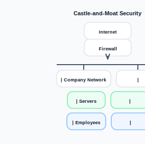


The firewall was the moat.

Once inside:

 `Trust was assumed.`

### Identity is the New Firewall

This phrase appears everywhere in cloud security.

Old model:




Modern model:


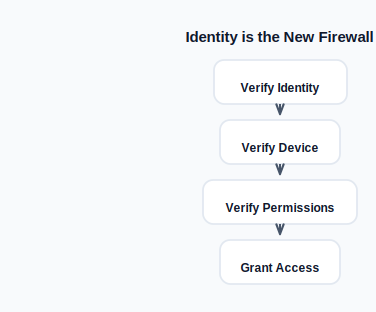


### Traditional Office

Imagine a company in 2005.


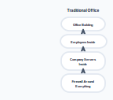


Security looked like a castle.




Everything important was inside.

---

Now ask:

---

## Slide 10 — Cloud Computing And The New Perimeter

**On slide:**

- The shared responsibility model defines the
- split between cloud provider and customer:
- Provider responsibility — physical
- infrastructure, hypervisor, and managed
- services
- Customer responsibility — OS
- configuration, access controls, data, and
- applications
- Misconfiguration of customer-controlled
- resources is the most common cloud
- security failure

**Speaker notes:**

### Shared Responsibility Model

Important AWS concept.

AWS secures:

 `Cloud Infrastructure`

Customer secures:

- Applications
- Data
- IAM
- Configurations

Misconfiguration is usually the customer's responsibility.

### Cloud Provider Responsibility

AWS secures:

### Customer Responsibility

The customer secures:

- Data
- Users
- Passwords
- IAM
- Applications
- Configurations

This is where most breaches occur.

---

## Slide 11 — Aws And Cloud Infrastructure

**On slide:**

- Amazon Web Services is the largest cloud provider,
- offering hundreds of services ranging from virtual
- machines to AI platforms and managed databases.
- Understanding its core building blocks is essential
- for cloud security work.

**Speaker notes:**

### AWS and Cloud Infrastructure

This slide is introducing AWS before diving into security services like IAM, CloudTrail, CloudWatch, Security Hub, and GuardDuty.

As an instructor, don't just explain AWS. Explain **why AWS exists**, **how cloud computing evolved**, and **why cybersecurity professionals must understand cloud infrastructure**.

### What is AWS?

AWS stands for:

### /

Entire operating system.

---

### -w

`Watch this file`

File:

 `/etc/passwd`

---

---

## Slide 12 — Aws And Cloud Infrastructure

**On slide:**

- Region — a geographic cluster of data
- centers (e.g., us-east-1)
- Availability Zone (AZ) — an isolated data
- center within a region
- IAM — Identity and Access Management;
- controls who can do what
- VPC — Virtual Private Cloud; an isolated
- network environment for your resources
- EC2 — Elastic Compute Cloud; virtual
- machines you can launch and manage on
- demand

**Speaker notes:**

### Regions

A region is a geographical location.

Examples:

- Canada Central
- US East (Virginia)
- US West (Oregon)
- Europe (Ireland)
- Asia Pacific (Tokyo)

### Availability Zones (AZs)

Each region contains multiple AZs.

Example:


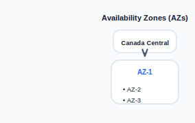


Purpose:

- High Availability
- Fault Tolerance

### Overly Permissive IAM

```json
{
  "Action":"*",
  "Resource":"*"
}
```

Too much access.

---

### 4. VPC

Virtual Private Cloud

Think:

 `Private Network Inside AWS`

---

## Slide 13 — Aws And Cloud Infrastructure

**On slide:**

- Region — a geographic cluster of data
- centers (e.g., us-east-1)
- Availability Zone (AZ) — an isolated data
- center within a region
- IAM — Identity and Access Management;
- controls who can do what
- VPC — Virtual Private Cloud; an isolated
- network environment for your resources
- EC2 — Elastic Compute Cloud; virtual
- machines you can launch and manage on
- demand

**Speaker notes:**

### EC2 (IaaS)

Customer manages:

- OS
- Applications
- Data
- Users

Most responsibility.

### Connecting Everything Together

Draw this on the whiteboard:


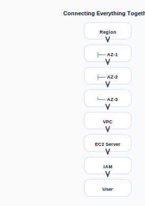


### Where is the resource?




---

## Slide 14 — Virtual Machines And Ec2 Instances

**On slide:**

- An EC2 instance is a virtual machine
- running in AWS. You choose the operating
- system, instance type (CPU and RAM),
- networking configuration, and storage.
- AMI (Amazon Machine Image) — the
- launch template; includes the OS and base
- software
- Instance type — determines CPU and
- memory (e.g., t3.micro for lightweight lab
- workloads)
- Key pair — used for SSH access;
- Security group — a virtual firewall that
- controls inbound and outbound traffic

**Speaker notes:**

### Q: Is AWS just virtual machines?

No.

AWS provides:

- Compute
- Storage
- Databases
- Networking
- Security
- AI
- Analytics

Hundreds of services.

### C2

`Suspicious Outbound Traffic`

---

## Slide 15 — Launching Ec2 Instances Safely

**On slide:**

- Checklist for a safe EC2 launch:
- Restrict SSH access (port 22) to your IP. Never use 0.0.0.0/0 in
- production
- Use key-based authentication and disable password-based SSH
- login
- Choose a minimal, trusted AMIs. Avoid images with unknown
- pre-installed software
- Tag resources from the start so they are identifiable and
- auditable
- Do not attach AdministratorAccess IAM roles unless explicitly
- required

**Speaker notes:**

### Launching EC2 Instances Safely

This slide is extremely practical.

Previous slides explained:

- What is EC2?
- What is IAM?
- What is a Security Group?
- What is a Key Pair?

This slide answers:

> "Now that we know how to launch an EC2 instance, how do we launch it securely?"
Tell students:

> "Most AWS security incidents don't happen because AWS is insecure. They happen because someone launched a server with bad security settings."
This slide is basically an **EC2 Security Checklist**.

### EC2 Security Checklist

Let's go through each recommendation.

### Open Security Groups

`0.0.0.0/0`

Allows access from anywhere.

---

### 3. Key Pair

One of the most important security concepts.

---

## Slide 16 — Ssh — Secure Shell

**On slide:**

- SSH is a network protocol for encrypted communication
- with remote hosts. It replaced older plaintext protocols
- like Telnet and rlogin.
- Port 22 — default SSH port; heavily probed by
- automated internet scanners
- Encryption — all traffic is encrypted end-to-end after
- the initial key exchange
- Authentication options — password (weak) or
- public/private key pair (strong)
- SSH client — built into macOS and Linux; available
- via OpenSSH on Windows
- Once connected, you have a shell session with the
- same privileges as the logged-in user

**Speaker notes:**

### Weak SSH Access

`Port 22 Open`

to everyone.

---

### Secure Shell

Used for:

 `Remote Administration`

Example:

```bash
ssh -i mykey.pem ec2-user@server
```

---

## Slide 17 — Ssh Key-Based Authentication

**On slide:**

- Key-based authentication replaces passwords with a
- cryptographic key pair. The private key never leaves
- your machine; the public key is installed on the
- server in ~/.ssh/authorized_keys.
- Two keys, one purpose:
- Private key (.pem / id_rsa) — stored securely on your
- local machine; treat it like a password
- Public key — stored on the server; mathematically
- linked to the private key
- Authentication succeeds only if the private key
- matches the public key on the server

**Speaker notes:**

### SSH Key-Based Authentication

This slide explains **how SSH actually proves your identity** when connecting to a Linux server or AWS EC2 instance.

As an instructor, tell students:

> "Passwords answer the question: 'Do you know the secret?'

> SSH keys answer the question: 'Can you prove you own the cryptographic key?'"
This is one of the most important concepts in cloud security.

### 2. Use Key-Based Authentication

The slide recommends:

> Disable password-based SSH login.
This is a huge security improvement.

### Can someone log in with only the public key?

No.

The public key is meant to be public.

Authentication requires:

 `Private Key`

### What happens if I lose the private key?

Access becomes difficult.

This is a common AWS beginner mistake.

---

## Slide 18 — Navigating The Linux Filesystem

**On slide:**

- Linux organizes everything under a
- single root directory /.
- Understanding this hierarchy is
- essential for locating logs,
- configuration files, and security-
- relevant artifacts during an
- investigation.

**Speaker notes:**

### Navigating the Linux Filesystem

This slide is extremely important because cybersecurity professionals spend much of their time investigating Linux systems.

Tell students:

> "When an incident happens, you become a digital detective. To investigate, you must know where Linux stores logs, configurations, user accounts, running processes, and evidence."
This slide teaches the **Linux File System Hierarchy (FHS)**.

### Controls Used

* Passwords
* MFA
* Encryption
* IAM permissions

AWS Example:

 `IAM Policy`

determines who can access an S3 bucket.

---

## Slide 19 — Linux File Permissions

**On slide:**

- Every file and directory in Linux has an owner, a
- group, and a set of permissions for three audiences:
- the owner, the group, and everyone else.
- Misconfigurations here are a frequent privilege
- escalation vector.
- Permission string breakdown — rwxr-xr--:
- chmod 600 key.pem — restrict a private key to
- owner read/write only
- World-writable files (777) are a common
- misconfiguration that attackers exploit
- Segment
- Audience
- Meaning
- rwx
- Owner
- Read, write,
- execute
- r-x
- Group
- Read and
- execute
- r--
- Others
- Read only

**Speaker notes:**

### Linux File Permissions

This is one of the most important Linux security topics because **permissions determine who can access, modify, or execute files**.

Tell students:

> "Many Linux compromises don't happen because of a software vulnerability. They happen because someone gave the wrong permissions to the wrong file."
For cybersecurity professionals, understanding permissions is essential for:

- Access Control
- Privilege Escalation Prevention
- System Hardening
- Incident Response
- Forensics

### Why chmod 600 key.pem?

```bash
chmod 600 key.pem
```

This is extremely important in AWS.

### Q: What does rwx mean?


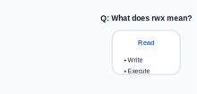


---

## Slide 20 — Setuid Binaries And Privilege Risk

**On slide:**

- Normally, a program runs with the privileges
- of the user who launched it. A SetUID binary
- runs with the privileges of its owner.
- SetUID is intentional for tools like sudo,
- passwd, and ping.
- Programs with SetUID that have known
- vulnerabilities, enabling instant privilege
- escalation
- Custom SetUID binaries placed by an
- attacker as a persistence technique

**Speaker notes:**

### SetUID Binaries and Privilege Risk

This is one of the most important **Linux Privilege Escalation** topics in cybersecurity.

Tell students:

> "Most attackers don't start with root access. Their goal is to become root. SetUID is one of the most common paths used to gain elevated privileges."
This slide introduces a concept frequently seen in:

- Penetration Testing
- Red Teaming
- Privilege Escalation
- Incident Response
- Linux Hardening

### Risk

Likelihood that a threat exploits a vulnerability.

Formula:

 `Risk = Threat × Vulnerability × Impact`

### SUID Files

```bash
find / -perm -4000
```

---

## Slide 21 — Setuid Binaries And Privilege Risk

**On slide:**

- Find all SetUID binaries with:
- find / -perm -4000
- 2>/dev/null.
- Any unexpected entries in
- that list should be
- investigated immediately

**Speaker notes:**

### Finding and Investigating SetUID Binaries

This slide builds on the previous SetUID concept and teaches students **how security analysts actually discover dangerous SetUID programs on Linux systems**.

Tell students:

> "Knowing what SetUID is is only half the job. The real cybersecurity skill is being able to find unexpected SetUID files before attackers use them."
This is a common activity in:

- Threat Hunting
- Incident Response
- Linux Hardening
- Security Audits
- Penetration Testing

---

## Slide 22 — Security Groups As Firewalls

**On slide:**

- A security group is a stateful virtual firewall attached to
- an EC2 instance. It controls what traffic is allowed in
- (inbound rules) and out (outbound rules) at the instance
- level.
- Rules are allowlist-based — anything not explicitly
- allowed is denied
- Stateful — if you allow inbound traffic, the return
- response is automatically permitted
- Common mistake: SSH (0.0.0.0/0) left open after initial
- setup
- Each rule specifies: protocol, port range, and
- source/destination CIDR or security group
- Security groups are your first line of defense against
- remote exploitation of services

**Speaker notes:**

### Group

Collection of users.

Example:

- Developers
- Administrators
- Security Team

---

### Security Groups as Firewalls

This is one of the most important AWS security concepts.

Tell students:

> "If IAM controls who can access AWS resources, Security Groups control who can reach your servers over the network."
A huge percentage of cloud breaches happen because:

 `A Security Group Was Misconfigured`

### Inbound Traffic

Traffic entering server.

Examples:

- SSH
- HTTPS
- HTTP
- Database Connections

### Outbound Traffic

Traffic leaving server.

Examples:

- Internet Access
- API Calls
- Database Queries

---

## Slide 23 — Running And Securing A Web Service

**On slide:**

- A web server like nginx serves HTTP content
- over port 80. In a lab context, a running web
- service generates traffic you can observe,
- detect, and analyze in later labs.
- Open only the ports the service requires and
- block everything else in the security group
- Run the service as a non-root user whenever
- possible
- Review access logs (/var/log/nginx/access.log)
- for unusual request patterns
- Enable SELinux (Security Enhanced Linux) if
- possible to prevent other processes from
- accessing web server files

**Speaker notes:**

### Amazon Web Services

Launched:

 `2006`

by Amazon.

Today AWS is the world's largest cloud provider.

### Nginx

Pronounced:

 `Engine-X`

Popular because it is:

- Fast
- Lightweight
- Scalable

### Why Nginx?

The slide uses:

 `Nginx`

because it is one of the most widely deployed web servers today.

Major websites use Nginx.

### Running and Securing a Web Service

This slide brings together many concepts you've already covered:

- Linux
- EC2
- Security Groups
- SSH
- Permissions
- Logs
- Monitoring

Tell students:

> "A web server is one of the most commonly attacked systems on the internet. The moment you expose a website to the public, attackers begin scanning it automatically."
This slide teaches how to run a web service securely.

---

## Slide 24 — Pop Quiz:

**Speaker notes:** Discuss the question; reveal answer after student responses.

---

## Slide 25 — Pop Quiz:

**Speaker notes:** Discuss the question; reveal answer after student responses.

---

## Slide 26 — Pop Quiz:

**Speaker notes:** Discuss the question; reveal answer after student responses.

---

## Slide 27 — Pop Quiz:

**Speaker notes:** Discuss the question; reveal answer after student responses.

---

## Slide 28 — Pop Quiz:

**On slide:**

- You run a routine audit and discover that a production EC2
- instance has an inbound security group rule allowing TCP port
- 22 from `0.0.0.0/0`. What is the most appropriate immediate
- response?
- A. Leave it — SSH is encrypted, so open access poses no real risk
- B. Disable the SSH service on the instance to prevent any remote access
- C. Restrict the SSH rule to your organization's IP range or your current IP address
- D. Enable MFA on the AWS console account to compensate for the broad access rule

**Speaker notes:** Discuss the question; reveal answer after student responses.

---

## Slide 29 — Pop Quiz:

**On slide:**

- You run a routine audit and discover that a production EC2
- instance has an inbound security group rule allowing TCP port
- 22 from `0.0.0.0/0`. What is the most appropriate immediate
- response?
- A. Leave it — SSH is encrypted, so open access poses no real risk
- B. Disable the SSH service on the instance to prevent any remote access
- C. Restrict the SSH rule to your organization's IP range or your current IP address
- D. Enable MFA on the AWS console account to compensate for the broad access rule

**Speaker notes:** Discuss the question; reveal answer after student responses.

---

## Slide 30 — Lab 1.1

**Speaker notes:** Discuss the question; reveal answer after student responses.

---

## Slide 31 — The Soc Analyst Role

**On slide:**

- A Security Operations Center (SOC) analyst monitors,
- detects, and responds to security events in real time.
- The role requires combining technical knowledge with
- structured analytical thinking, often under time
- pressure.
- Tier 1 — triage incoming alerts, close false
- positives, escalate true positives
- Tier 2 — investigate escalated incidents, correlate
- events across data sources
- Tier 3 — threat hunting, advanced forensics, and
- proactive detection engineering
- Core tools: SIEM platforms, endpoint detection,
- network logs, and cloud audit trails
- The analyst's primary output is a decision: escalate,
- remediate, or close

**Speaker notes:**

### What does a SOC analyst see?

Not hackers directly.

They see:

- Failed Logins
- Suspicious API Calls
- New IAM Users
- Unusual Network Traffic
- Privilege Escalation Attempts

Their job is to determine:

- Threat
- or
- False Positive

AI helps with that decision-making process.

---




### How SOC Teams Use SSH Logs

SOC analysts investigate:

- Repeated Login Failures
- Logins From Foreign Countries
- Root Login Attempts
- New SSH Keys Added

These often indicate attacks.

### What Does a SOC Monitor?

SOC analysts continuously monitor:

- Servers
- Cloud Infrastructure
- Networks
- Applications
- Databases
- User Activity
- Endpoints

---

## Slide 32 — The Cyber Kill Chain

**On slide:**

- The Cyber Kill Chain, developed by Lockheed Martin, describes the stages an
- attacker moves through from initial planning to achieving their objective.
- Understanding this model helps defenders identify where to detect and
- interrupt an attack before damage occurs.
- 1.
- Reconnaissance — gather target information
- 2.
- Weaponization — build or acquire an exploit
- 3.
- Delivery — send the payload to the target
- 4.
- Exploitation — trigger the vulnerability
- 5.
- Installation — establish a foothold
- 6.
- Command & Control — communicate with the compromised host
- 7.
- Actions on Objective — exfiltrate data, encrypt, or pivot

**Speaker notes:**

### The Cyber Kill Chain

This is one of the most important cybersecurity frameworks you'll teach.

Tell students:

> "Most attacks don't happen in a single step. Attackers follow a sequence of activities. If defenders can detect and stop any one of those stages, the attack can be prevented."
The Cyber Kill Chain was developed by Lockheed Martin to understand how cyber attacks progress.

### Reconnaissance

Analyze large datasets quickly.

---

## Slide 33 — The Cyber Kill Chain

**Speaker notes:**

### Vulnerability Exploitation

Outdated software.

### Malware Installation

Compromised servers.

### Action

```json
"s3:GetObject"
```

Means:

 `Read Objects`

only.

---

## Slide 34 — Mitre Att&Ck Framework

**On slide:**

- ATT&CK (Adversarial Tactics, Techniques, and
- Common Knowledge) is a publicly available
- knowledge base of real-world attacker behaviors. It
- gives defenders and analysts a shared vocabulary to
- describe, detect, and respond to threats across every
- stage of an attack.
- Organized into Tactics (goals) and Techniques
- (how goals are achieved)
- Each technique has a unique ID (e.g., T1110 =
- Brute Force, T1548 = Privilege Escalation)
- Used to map detection rules to specific attacker
- behaviors
- Enables coverage gap analysis — which techniques
- have no current detection?
- Reference: https://attack.mitre.org

**Speaker notes:**

### Cyber Kill Chain vs MITRE ATT&CK

Students may ask.

### MITRE ATT&CK

Focuses on:

 `Specific Attacker Techniques`

Hundreds of detailed behaviors.

---

## Slide 35 — Brute Force And Credential Attacks —

**On slide:**

- T1110
- Brute force attacks attempt to gain access by systematically
- trying many passwords or credential combinations against an
- authentication service. SSH is one of the most heavily targeted
- services for automated brute-force activity on the internet.
- T1110.001 — password guessing against a single known
- account
- T1110.003 — password spraying: one common password
- tried across many accounts
- Detection signals: high volume of failed auth events from a
- single source IP in a short window
- Log source on Linux: sshd journal entries and
- /var/log/audit/audit.log
- Effective mitigations: key-only SSH auth, fail2ban, rate
- limiting, non-default port

**Speaker notes:**

### Brute Force SSH

Trying passwords repeatedly.

### BRUTE FORCE AND CREDENTIAL ATTACKS (MITRE ATT&CK T1110)

This is one of the most common real-world attacks and a favorite topic in cybersecurity interviews, SOC operations, and cloud security.

---

## Slide 36 — Privilege Escalation — T1548

**On slide:**

- Privilege escalation allows an attacker with limited
- access to gain higher privileges, typically root or
- Administrator. On Linux, this commonly exploits the
- sudo mechanism or SetUID programs.
- T1548 sub-techniques relevant to Linux:
- T1548.003 — sudo abuse; misconfigurations in
- /etc/sudoers grant unintended root access
- T1548.001 — SetUID and SetGID exploitation to
- execute code as a privileged owner
- Detection: sudo execution events in the audit log,
- especially unexpected commands
- Prevention: minimal sudoers entries, audit rules
- watching /etc/sudoers for modifications

**Speaker notes:**

### Detect Privilege Escalation

Example:


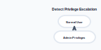


AI identifies unusual behavior.

### PRIVILEGE ESCALATION (MITRE ATT&CK T1548)

This is one of the most important concepts in cybersecurity because attackers rarely start with full administrative access.

Most attacks follow this pattern:


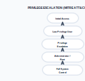


A great statement for class:

> "Getting into a system is often easy. Becoming root is where the real battle begins."

---

## Slide 37 — Why Logs Are The Foundation Of

**On slide:**

- DETECTION
- Without logs, an attacker can operate invisibly. Logs
- are the raw material feeding every detection rule,
- alert, and investigation.
- Log coverage gaps are a deliberate attacker
- advantage.
- Logs capture authentication events, process execution,
- network connections, and file access
- The challenge is not generating logs, but collecting,
- parsing, and retaining them usefully
- In cloud environments, logs must be actively routed to a
- central store

**Speaker notes:**

### Logs

```bash
/var/log
```

### Why?

Imagine attacker exploits Nginx.

Question:

What permissions does attacker get?

---

If Nginx runs as:

 `root`

attacker gains:

 `root access`

---

Very bad.

---

## Slide 38 — Linux Logging — Journald And

**On slide:**

- AUDITD
- Two subsystems handle most security-relevant logging on
- modern Linux systems. Understanding both is essential for
- collecting the evidence needed in a SOC investigation.
- journald (systemd-journald):
- Captures structured output from system services including sshd
- and sudo
- Queried with journalctl; supports time ranges, unit filters, and
- JSON output
- auditd (Linux Audit Daemon):
- Low-level kernel subsystem recording syscall activity and file
- access
- Configured via auditctl rules; logs to /var/log/audit/audit.log
- Captures privilege escalation attempts, sensitive file reads, and
- process execution

**Speaker notes:**

### LINUX LOGGING — JOURNALD AND AUDITD

This slide introduces the two most important logging systems on modern Linux servers:

1. **systemd-journald (journald)**
2. **Linux Audit Daemon (auditd)**

A SOC analyst will frequently use both when investigating Linux incidents.

### auditd

Focuses on:

- Security auditing
- System calls
- File access
- Privilege changes
- Process execution

Examples:

- Sensitive file access
- Privilege escalation
- User creation
- Policy violations

### Linux

Linux uses:

 `/`

called:

---

## Slide 39 — Collecting Ssh Evidence

**On slide:**

- SSH authentication events are among the most
- common signals analysts work with. Knowing where
- these events appear and what they look like is a
- prerequisite for writing detection logic.
- Relevant event types:
- Failed password — wrong credential for a valid user
- Invalid user — authentication attempt for a
- username that does not exist
- Did not receive identification string — scanner or
- automated probe behavior
- Accepted publickey — successful key-based login
- (who logged in, and from where)

**Speaker notes:**

### COLLECTING SSH EVIDENCE

This slide introduces one of the most important evidence sources for SOC analysts: **SSH authentication logs**.

Every Linux server exposed to the internet receives SSH traffic. Analysts use these logs to identify:

* Brute-force attacks
* Password spraying
* Successful logins
* Unauthorized access attempts
* Automated scanning activity
* Initial access events

---

## Slide 40 — Evidence And The Analyst Workflow

**On slide:**

- A SOC investigation is only as credible as the evidence
- collected. Analysts must gather, validate, and preserve
- evidence before drawing conclusions.
- Structured evidence workflow:
- Capture — export raw log data with defined time
- boundaries
- Parse — extract structured fields (IP, user,
- timestamp, event type)
- Filter — isolate events relevant to the suspected
- behavior
- Correlate — connect events across sources (SSH
- logs, sudo logs, audit logs)
- Document — record findings with supporting
- evidence for handoff or escalation

**Speaker notes:**

### EVIDENCE AND THE ANALYST WORKFLOW

This slide introduces the core investigative process used by SOC analysts. The key message is simple:

> **Good decisions come from good evidence.**
Analysts should never jump directly from an alert to a conclusion. Instead, they follow a structured workflow to collect, validate, analyze, and document evidence.

---

## Slide 41 — Risk Scoring Fundamentals

**On slide:**

- Not all security events carry equal weight. Risk
- scoring assigns a numerical priority to entities
- based on the type and volume of suspicious
- activity they generated. This helps analysts focus
- effort on the highest-value targets first.

**Speaker notes:**

### RISK SCORING FUNDAMENTALS

This slide introduces one of the most important concepts in modern SOC operations:

> **Not every alert deserves the same level of attention.**
Risk scoring helps analysts prioritize investigations by assigning a numerical value to suspicious activity, users, hosts, IP addresses, or alerts.

### Example: User Risk Score

Events observed:

- 5 Failed Logins = 10 points
- Successful Login from New Country = 30 points
- Privilege Escalation = 40 points

Total:

 `Risk Score = 80`

Result:

 `Very High Risk`

Immediate analyst review required.

---

## Slide 42 — Risk Scoring Fundamentals

**On slide:**

- Weighted signals — different event types score
- differently (e.g., ssh_burst_scan: 8 vs ssh_ident_probe: 2)
- Entity-based aggregation — scores accumulate per
- source IP or user, not per event
- Severity thresholds — high, medium, low tiers based on
- total accumulated score
- Explainability — every score must trace back to specific,
- reviewable evidence
- Scoring is a triage tool, not a verdict — the analyst
- validates the findings

**Speaker notes:**

### Why Risk Scoring Exists

A SOC may receive:

 `10,000+ alerts per day`

Analysts cannot investigate everything immediately.

Without prioritization:

- Critical attacks may be missed
- Analysts waste time on low-value alerts
- Alert fatigue increases
- Response times slow down

Risk scoring helps answer:

 `What should I investigate first?`

### PYTHON FOR SECURITY AUTOMATION

Python is the most widely used programming language for security automation because it combines simplicity, readability, and a powerful standard library. Security analysts use Python to automate repetitive tasks such as log parsing, threat detection, IOC enrichment, reporting, and alert generation.

### Security Automation

Reduce analyst workload.

---

## Slide 43 — Python For Security Automation

**On slide:**

- Python is the de facto scripting language for security
- automation. Its standard library covers file I/O, regular
- expressions, JSON parsing, and CSV output —
- everything needed to build a basic log analysis pipeline
- without installing any dependencies.
- json module — parse JSON Lines log exports line by
- line
- re module — extract IPs, usernames, and event types
- with compiled regex patterns
- collections.defaultdict — aggregate counts per entity
- with minimal boilerplate
- File I/O — write analyst-ready findings CSV files for
- handoff
- Python produces repeatable, auditable results, unlike
- one-off manual grep workflows

**Speaker notes:**

### Why Python Is Popular in Cybersecurity

* Easy to learn and maintain
* Cross-platform (Windows, Linux, macOS)
* Extensive security ecosystem
* Excellent support for APIs and cloud services
* Large community and open-source tooling

Common cybersecurity use cases:

* Log analysis
* Threat intelligence processing
* Vulnerability scanning
* Security monitoring
* Incident response automation
* Malware analysis
* SIEM integrations

### Example Security Automation Workflow


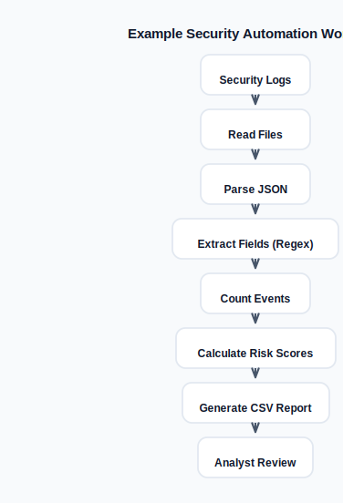


### Scoring Is a Triage Tool, Not a Verdict

Risk scoring helps prioritize investigations but does not prove malicious activity.

Analyst responsibilities:

1. Review supporting evidence
2. Validate event context
3. Eliminate false positives
4. Determine actual impact
5. Decide response actions

Example:

- Risk Score: 75
- Reason:
- Administrator performed approved maintenance
- Result:
- False Positive

High score does not automatically mean compromise.

---

## Slide 44 — Triage Notes And Documentation

**On slide:**

- A triage note is the analyst's
- written record of what was found,
- what it means, and what should
- happen next.
- Entity — the IP address, username, or
- host under investigation
- Severity — high, medium, or low,
- based on scored evidence
- Evidence — the specific log lines or
- events that triggered the finding
- Next pivot — what the analyst
- recommends as the next investigation
- step
- Written immediately after scoring —
- context degrades quickly as analysts
- move between cases

**Speaker notes:**

### TRIAGE NOTES AND DOCUMENTATION

A triage note is the analyst’s written record of an investigation. It captures what was observed, why it matters, and what actions should follow. Good documentation ensures investigations can be reviewed, validated, escalated, and audited later.

### Why Documentation Matters

Documentation enables:

- Handoffs
- Escalations
- Management reporting
- Incident response
- Legal review
- Compliance audits

---

## Slide 45 — Pop Quiz:

**Speaker notes:** Discuss the question; reveal answer after student responses.

---

## Slide 46 — Pop Quiz:

**Speaker notes:** Discuss the question; reveal answer after student responses.

---

## Slide 47 — Pop Quiz:

**On slide:**

- Your Python risk-scoring script reports the following for a source
- IP: entity: 203.0.113.47  severity: high  score: 26 hit_summary:
- ssh_burst_scan:1 | ssh_failed_password:4 | ssh_invalid_user:2
- What does this output tell you?
- A. The IP is a confirmed malicious address and should be blocked automatically
- B. The IP generated a high volume of SSH failures in a short window, including a burst scan pattern —
- the score warrants analyst investigation
- C. The script has a bug; scores above 20 indicate a parsing error
- D. The IP successfully authenticated and should be treated as a compromised account

**Speaker notes:** Discuss the question; reveal answer after student responses.

---

## Slide 48 — Pop Quiz:

**On slide:**

- Your Python risk-scoring script reports the following for a source
- IP: entity: 203.0.113.47  severity: high  score: 26 hit_summary:
- ssh_burst_scan:1 | ssh_failed_password:4 | ssh_invalid_user:2
- What does this output tell you?
- A. The IP is a confirmed malicious address and should be blocked automatically
- B. The IP generated a high volume of SSH failures in a short window, including a burst scan
- pattern — the score warrants analyst investigation
- C. The script has a bug; scores above 20 indicate a parsing error
- D. The IP successfully authenticated and should be treated as a compromised account

**Speaker notes:** Discuss the question; reveal answer after student responses.

---

## Slide 49 — Pop Quiz:

**On slide:**

- A junior analyst says: "I can just read the raw log file — why do
- we need to run a scoring script?" Which response best explains
- the value of scored, ranked output over raw logs?
- A. Scoring scripts are required by compliance frameworks; raw log review is not permitted
- B. Raw logs cannot be read by humans and must always be pre-processed before review
- C. A raw log file may contain thousands of events; scoring aggregates them by entity and surfaces the
- highest-risk items first, reducing analysis time
- D. Scoring eliminates false positives, so analysts no longer need to validate findings manually

**Speaker notes:** Discuss the question; reveal answer after student responses.

---

## Slide 50 — Pop Quiz:

**On slide:**

- A junior analyst says: "I can just read the raw log file — why do
- we need to run a scoring script?" Which response best explains
- the value of scored, ranked output over raw logs?
- A. Scoring scripts are required by compliance frameworks; raw log review is not permitted
- B. Raw logs cannot be read by humans and must always be pre-processed before review
- C. A raw log file may contain thousands of events; scoring aggregates them by entity and
- surfaces the highest-risk items first, reducing analysis time
- D. Scoring eliminates false positives, so analysts no longer need to validate findings manually

**Speaker notes:** Discuss the question; reveal answer after student responses.

---

## Slide 51 — Lab 1.2

**Speaker notes:** Discuss the question; reveal answer after student responses.

---

## Slide 52 — Ai In Cybersecurity — Overview

**On slide:**

- AI tools are increasingly
- embedded in every layer of the
- security stack, from writing
- detection rules to triaging alerts
- and reviewing code.
- For security practitioners, AI is
- most useful as an assistant that
- accelerates work while the analyst
- remains the decision-maker.

**Speaker notes:**

### How CIA Relates to AI in Cybersecurity

This is the bridge to the rest of your course.

AI helps security teams:

- Detect Confidentiality Violations
- Detect Integrity Violations
- Detect Availability Attacks

Examples:

* AI detecting data exfiltration
* AI detecting suspicious changes
* AI detecting service outages

### AI IN CYBERSECURITY — OVERVIEW

Artificial Intelligence (AI) is transforming cybersecurity by helping security teams analyze large volumes of data, detect threats faster, automate repetitive tasks, and improve decision-making. Rather than replacing analysts, AI acts as a force multiplier that allows security professionals to focus on higher-value investigations.

---

## Slide 53 — Ai In Cybersecurity — Overview

**On slide:**

- Code generation from drafting log
- parsers, scripts, and automation
- utilities
- Log analysis — surfacing anomalies in
- large datasets
- Policy review — identifying over-
- permissive configurations in IAM and
- cloud policies
- Alert triage — generating initial
- hypotheses for analyst review
- Threat intelligence — summarizing and
- correlating indicator data

**Speaker notes:**

### How This Relates to AI in Cybersecurity

Later in the course:

### AI IN CYBERSECURITY — OVERVIEW (PRACTICAL APPLICATIONS)

Artificial Intelligence is rapidly becoming an operational tool within Security Operations Centers (SOCs), cloud security teams, and incident response workflows. Rather than replacing analysts, AI helps automate repetitive tasks, accelerate investigations, and surface insights hidden within large datasets.

### Limitations of AI

AI is powerful but imperfect.

Common challenges:

##### False Positives

Benign activity may be flagged as malicious.

##### False Negatives

Real threats may be missed.

##### Hallucinations

Generative AI may provide incorrect information.

##### Bias

Training data can influence model behavior.

##### Lack of Context

AI often lacks business-specific knowledge.

---

## Slide 54 — Ai Coding Assistants For Security

**On slide:**

- WORK
- AI coding assistants like Amazon Q, Claude, and ChatGPT can
- produce functional Python, bash, and configuration code from
- plain English prompts. For security analysts, this dramatically
- lowers the barrier to building custom tooling without needing
- a software engineering background.
- Write a log parser for a custom or proprietary log format
- Generate a regex pattern for extracting fields from auth log
- entries
- Draft an IAM policy with least-privilege constraints
- Troubleshoot a broken Python script by pasting the error
- and asking for a fix
- Translate a detection idea into a working Logs Insights or
- Sigma rule

**Speaker notes:**

### AI CODING ASSISTANTS FOR SECURITY WORK

AI-powered coding assistants such as Amazon Q, Claude, ChatGPT, GitHub Copilot, and Cursor have become valuable productivity tools for cybersecurity professionals. They enable analysts, engineers, and responders to generate scripts, queries, detection rules, and automation workflows using natural language instructions instead of writing everything from scratch.

### Why Security Teams Use AI Coding Assistants

Security work often requires:

* Parsing large log files
* Writing automation scripts
* Building detection logic
* Creating cloud security policies
* Investigating incidents

AI assistants reduce development time by generating initial working code that analysts can review, test, and refine.

---

## Slide 55 — Prompt Engineering For Security

**On slide:**

- TASKS
- The quality of AI output depends heavily on the
- quality of the prompt and domain knowledge of
- person building the prompt.
- Specify the environment — "Amazon Linux 2023, Python
- 3.11, no third-party libraries"
- Define the task precisely — include input format,
- expected output format, and edge cases
- Add constraints — "do not use eval(), do not write to
- paths outside the working directory"
- Request explanation — "explain each function before
- the code block" aids human review
- Iterate — treat first output as a draft; follow up with
- corrections rather than accepting it as final

**Speaker notes:**

### PROMPT ENGINEERING FOR SECURITY TASKS

Prompt engineering is the process of crafting clear, structured instructions that guide AI systems to produce accurate, useful, and secure outputs. In cybersecurity, the quality of generated scripts, detection rules, policies, and investigations depends heavily on the quality of the prompt provided.

### Example SOC Prompt

- Analyze these SSH logs and identify
- suspicious authentication activity.
- Provide:
- - Summary
- - Risk level
- - Supporting evidence
- - Recommended next steps

Possible AI Output:

- Risk: High
- Evidence:
- - 27 failed logins
- - Password spray behavior
- - Successful login from same IP
- Recommendation:
- Investigate account compromise and
- review subsequent activity.

---

## Slide 56 — Reviewing And Validating Ai Output

**On slide:**

- AI-generated code can contain logic errors, insecure patterns, and
- outdated practices. Every piece of AI-generated code used in a
- security context must pass a human review step before execution.
- A practical review checklist:
- Does the code do exactly what the prompt asked — nothing
- more, nothing less?
- Are there hardcoded credentials, tokens, or file paths that
- should not be there?
- Does it write to, delete, or modify files outside the expected
- working directory?
- Does it use eval(), exec(), or subprocess with shell=True?
- Does it handle errors gracefully, or will it silently fail and
- produce misleading output?

**Speaker notes:**

### REVIEWING AND VALIDATING AI OUTPUT

As AI-generated code becomes more common in cybersecurity operations, validation becomes a critical skill. While AI can rapidly generate scripts, detection rules, IAM policies, and automation workflows, it can also introduce security flaws, logical errors, and unsafe practices. Security professionals must treat AI output as a draft that requires thorough review before use.

---

## Slide 57 — Iam Fundamentals

**On slide:**

- AWS Identity and Access
- Management (IAM) controls
- who can take what actions
- on which resources.
- It is the central access
- control system for every
- AWS account and one of the
- most commonly
- misconfigured services in
- cloud environments.

**Speaker notes:**

### IAM

Identity and permissions.

Most directly related.

### What is IAM?

IAM stands for:

---

## Slide 58 — Iam Policy Structure

**On slide:**

- An IAM policy is a JSON document that grants or
- denies AWS API actions. Understanding policy
- structure is essential for both writing secure policies
- and identifying dangerous ones during a review.
- Key fields:
- Effect — Allow or Deny
- Action — the specific API call(s) being controlled (e.g.,
- s3:GetObject)
- Resource — the ARN of the specific resource(s) the rule
- applies to
- "Action": "*" combined with "Resource": "*" grants full
- access to everything — a critical finding

**Speaker notes:**

### Policy

Permission document.

Example:

```json
Allow:
Read S3
```

### IAM Policy Structure

Every policy contains:

---

## Slide 59 — The Principle Of Least Privilege

**On slide:**

- Least privilege means granting the minimum
- permissions required for a task. It is one of the most
- important and most frequently violated security
- principles in cloud environments.
- A compromised role with Administrator Access can
- destroy an entire AWS account
- A compromised role scoped to s3:GetObject on one
- bucket has a limited blast radius
- Over permissive policies are easy to create and hard to
- roll back once services depend on them
- Practical approach:

**Speaker notes:**

### Principle of Least Privilege

Very important security concept.

Give only:

 `Minimum Required Access`

Example:

Bad:

```json
Action: *
Resource: *
```

---

Good:

 `Read Specific Bucket`

Only.

### Principle of Least Privilege and Cybersecurity

This principle exists everywhere.

---

## Slide 60 — The Principle Of Least Privilege

**On slide:**

- Practical approach:
- 1.
- Start with zero permissions and add only what is
- needed
- 2.
- Use IAM Access Analyzer to identify permissions
- granted but never actually used
- 3.
- Review policies quarterly — permissions accumulate
- over time and are rarely removed

**Speaker notes:**

### IAM Roles, Least Privilege, EC2, VPC and S3 Access

This slide is extremely important because it introduces one of the **most fundamental security principles in cloud security**:

### 6. Lambda

Serverless Computing

Run code without managing servers.

Example:

- Upload Function
- Run When Needed

---

## Slide 61 — Lambda Execution Roles

**On slide:**

- An AWS Lambda function runs code in response to events.
- Every Lambda function assumes an IAM execution role at
- runtime. The policies attached to that role determine what
- the function can do across your entire account.
- Security considerations for Lambda roles:
- Scope logging permissions to exactly three actions:
- CreateLogGroup, CreateLogStream, PutLogEvents
- Use resource-level ARNs for S3 actions — never "Resource":
- "*"
- Never attach AdministratorAccess to a Lambda execution
- role
- Use a separate role per function — never share one role
- across all Lambdas
- The execution role is a common lateral movement target after
- a Lambda code injection attack

**Speaker notes:**

### Execution

Run malicious code.

Examples:

- PowerShell
- Python
- Shell Scripts

---

### Role

Temporary permissions.

Used by:

- EC2
- Lambda
- Applications

---

---

## Slide 62 — S3 Resource-Level Access Control

**On slide:**

- S3 permissions must be scoped to specific buckets
- and prefixes, not left open to all resources. Resource-
- level ARNs are the mechanism that enforces this
- scope in an IAM policy.
- S3 ARN format:
- Granting s3:GetObject on arn:aws:s3:::reports/2025/*
- limits reads to that prefix only
- "Resource": "*" on any S3 action grants access to
- every bucket in the account
- s3:::bucket-name (missing arn:aws:) is an invalid ARN
- that can cause silent policy failures

**Speaker notes:**

### Resource

```json
"arn:aws:s3:::my-app-data/*"
```

Means:

 `Only This Bucket`

### Source

Who is allowed?

Example:

 `203.0.113.15/32`

means:

 `Only One IP`

---

## Slide 63 — Detecting Iam Misconfigurations

**On slide:**

- IAM misconfigurations are difficult to spot by reading
- individual policies in isolation. A systematic approach that
- combines CLI enumeration with automated scanning is
- required to surface the most dangerous issues.
- Common misconfigurations to hunt for:
- Policies with both "Action": "*" and "Resource": "*" (full
- wildcard)
- Users or roles with AdministratorAccess attached directly
- Unused IAM users with active access keys still in place
- Cross-account trust relationships not reviewed in the past
- 90 days
- Roles accessible by services with known code injection
- risk (e.g., Lambda, EC2 user data)

**Speaker notes:**

### Misconfigurations

Most common issue.

Examples:

- Public S3 Bucket
- Open Security Group
- Weak IAM Policy

---

---

## Slide 64 — Human-In-The-Loop Validation

**On slide:**

- Human oversight is not optional when using AI to generate
- security-sensitive code and configurations. The human in
- the loop is the safeguard that catches errors AI will not flag
- on its own.
- Skipping any step converts AI-assisted work from an
- accelerator into a liability.
- The loop in practice:
- Prompt — describe the task precisely, including constraints
- Review — read the output critically before acting on it
- Test — run in a safe, isolated environment; confirm the
- output matches expectations
- Validate — check security properties (no excess
- permissions, no risky patterns)
- Document — record what was generated, what was
- changed, and why

**Speaker notes:**

### Human-in-the-Loop Security

The most effective security model combines:


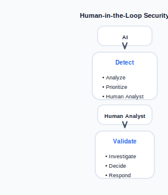


AI assists.

Humans remain accountable for security decisions.

### Human-in-the-Loop Principle

The most effective model is:


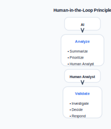


The analyst remains responsible for final decisions.

---

## Slide 65 — Ai Limitations In Security Contexts

**On slide:**

- AI tools have genuine blind spots that are especially
- consequential in security work.
- Outdated knowledge — training data has a cutoff; new
- CVEs and API changes may be unknown
- Confident hallucination — AI can state incorrect facts or
- invent non-existent APIs with high apparent confidence
- No execution context — AI cannot test whether code
- actually works in your environment
- No security accountability — AI will often generate unsafe
- patterns without warning
- Prompt injection risk — malicious content in log data
- passed to an AI tool can manipulate its output

**Speaker notes:**

### AI Limitations in Security Contexts

Artificial Intelligence can significantly improve analyst productivity, automate repetitive tasks, and accelerate investigations. However, AI is not a replacement for security expertise. Understanding its limitations is critical to using it safely in security operations.

Security decisions impact confidentiality, integrity, and availability. A single incorrect recommendation can introduce vulnerabilities, expose sensitive data, or disrupt business operations.

---

### Security

Compromised credentials cause less damage.

---

## Slide 66 — Pop Quiz:

**On slide:**

- A Lambda function reads objects from a single S3 bucket prefix
- (`reports/2025/`) and writes to CloudWatch Logs. Which IAM
- policy best follows the principle of least privilege?
- A. `"Action": "s3:*", "Resource": "*"`
- B. `"Action": ["s3:GetObject", "logs:*"], "Resource": "*"`
- C. `"Action": ["s3:GetObject", "logs:CreateLogGroup", "logs:CreateLogStream", "logs:PutLogEvents"], "Resource":
- ["arn:aws:s3:::my-bucket/reports/2025/*", "arn:aws:logs:*"]`
- D. `"Action": "iam:PassRole", "Resource": "*"`

**Speaker notes:** Discuss the question; reveal answer after student responses.

---

## Slide 67 — Pop Quiz:

**On slide:**

- A Lambda function reads objects from a single S3 bucket prefix
- (`reports/2025/`) and writes to CloudWatch Logs. Which IAM
- policy best follows the principle of least privilege?
- A. `"Action": "s3:*", "Resource": "*"`
- B. `"Action": ["s3:GetObject", "logs:*"], "Resource": "*"`
- C. `"Action": ["s3:GetObject", "logs:CreateLogGroup", "logs:CreateLogStream", "logs:PutLogEvents"],
- "Resource": ["arn:aws:s3:::my-bucket/reports/2025/*", "arn:aws:logs:*"]`
- D. `"Action": "iam:PassRole", "Resource": "*"`

**Speaker notes:** Discuss the question; reveal answer after student responses.

---

## Slide 68 — Pop Quiz:

**On slide:**

- A developer asks an AI assistant to generate a Lambda IAM policy. The
- AI returns: { "Effect": "Allow", "Action": "*", "Resource": "*" } The
- developer deploys it without review because "the AI usually gets it
- right." What is the primary security risk?
- A. The policy will be rejected by AWS because wildcard actions are not permitted in IAM
- B. The Lambda function now has unrestricted access to every service and resource in the account,
- turning any code vulnerability into a full account compromise
- C. The policy grants read-only access because Lambda functions cannot perform write operations
- D. The risk is low because Lambda functions run in isolated execution environments

**Speaker notes:** Discuss the question; reveal answer after student responses.

---

## Slide 69 — Pop Quiz:

**On slide:**

- A developer asks an AI assistant to generate a Lambda IAM policy. The
- AI returns: { "Effect": "Allow", "Action": "*", "Resource": "*" } The
- developer deploys it without review because "the AI usually gets it
- right." What is the primary security risk?
- A. The policy will be rejected by AWS because wildcard actions are not permitted in IAM
- B. The Lambda function now has unrestricted access to every service and resource in the
- account, turning any code vulnerability into a full account compromise
- C. The policy grants read-only access because Lambda functions cannot perform write operations
- D. The risk is low because Lambda functions run in isolated execution environments

**Speaker notes:** Discuss the question; reveal answer after student responses.

---

## Slide 70 — Pop Quiz:

**On slide:**

- Under which circumstance is it appropriate to deploy AI-generated
- security code directly to a production environment without human
- review?
- A. When the AI tool is specifically marketed as a "security-focused" assistant
- B. When the generated code is under 50 lines and therefore appears simple enough to be safe
- C. When the task seems low-risk, such as generating a log formatting utility
- D. None of the above — AI-generated code in a production security context always requires human
- review before deployment

**Speaker notes:** Discuss the question; reveal answer after student responses.

---

## Slide 71 — Pop Quiz:

**On slide:**

- Under which circumstance is it appropriate to deploy AI-generated
- security code directly to a production environment without human
- review?
- A. When the AI tool is specifically marketed as a "security-focused" assistant
- B. When the generated code is under 50 lines and therefore appears simple enough to be safe
- C. When the task seems low-risk, such as generating a log formatting utility
- D. None of the above — AI-generated code in a production security context always requires
- human review before deployment

**Speaker notes:** Discuss the question; reveal answer after student responses.

---

## Slide 72 — Cloud Security Posture Management

**On slide:**

- Cloud Security Posture Management (CSPM) is
- the continuous process of identifying, assessing,
- and remediating misconfigurations across cloud
- environments.

**Speaker notes:**

### Cloud Security Posture Management (CSPM)

Cloud Security Posture Management (CSPM) is a continuous security discipline focused on discovering, assessing, prioritizing, and remediating misconfigurations across cloud environments. CSPM solutions provide automated visibility into cloud resources and compare configurations against security best practices, compliance frameworks, and organizational policies.

As cloud environments scale, manual reviews become impractical. CSPM helps organizations continuously monitor their security posture and reduce the risk of breaches caused by configuration mistakes.

---

### Why CSPM Matters

Industry studies consistently show that cloud misconfigurations are one of the leading causes of cloud security incidents.

Common examples include:

* Publicly accessible S3 buckets
* Overly permissive IAM policies
* Unrestricted security groups
* Unencrypted storage resources
* Disabled logging and monitoring
* Unused privileged accounts

A single configuration error can expose sensitive data or create opportunities for attackers.

### What?

`What action occurred?`

Example:

- Login
- File deletion
- Program execution

---

## Slide 73 — Cloud Security Posture Management

**On slide:**

- CSPM checks run continuously against your live
- cloud account configuration
- Findings are mapped to compliance frameworks: CIS,
- NIST, PCI-DSS, and others
- Unlike vulnerability scanners, CSPM works through
- cloud APIs — no network access or agents required
- AWS-native CSPM: Security Hub combined with AWS
- Config, no additional tooling needed
- The most common CSPM findings: open ports, over
- permissive IAM, unencrypted storage, missing MFA

**Speaker notes:**

### The CSPM Lifecycle




CSPM is not a one-time audit—it is an ongoing process.

---

## Slide 74 — Aws Security Services Overview

**On slide:**

- AWS provides a suite of native security services
- covering detection, posture management, access
- analysis, and audit logging.
- Each service addresses a different layer of the
- security stack. Used together, they provide broad
- visibility.
- Service
- Primary Function
- Security Hub
- Aggregates findings from
- multiple services into a
- central dashboard
- GuardDuty
- Threat detection via log
- analysis and behavioral ML
- IAM Access Analyzer
- Identifies resources
- accessible from outside the
- account
- CloudTrail
- Audit log of every API call
- made in the account
- AWS Config
- Tracks resource
- configuration changes over
- time
- Inspector
- Vulnerability scanning for
- EC2 and container
- workloads

**Speaker notes:**

### AWS Security Services Overview

AWS provides a comprehensive set of native security services that help organizations detect threats, monitor configurations, enforce access controls, identify vulnerabilities, and maintain compliance. Rather than relying on a single security product, AWS follows a defense-in-depth approach where multiple services work together to provide visibility across the entire cloud environment.

### Integration with Other AWS Security Services

| Service          | Contribution              |
| ---------------- | ------------------------- |
| GuardDuty        | Threat detection findings |
| Inspector        | Vulnerability findings    |
| AWS Config       | Configuration compliance  |
| Access Analyzer  | External access findings  |
| Firewall Manager | Network security findings |
| CloudTrail       | Investigation evidence    |

Security Hub becomes the central investigation portal.

---

## Slide 75 — Aws Security Hub

**On slide:**

- Security Hub is a central aggregation point for
- security findings across your AWS account.
- It continuously evaluates resources against
- industry security standards and collects findings
- from integrated AWS services and third-party
- tools.

**Speaker notes:**

### Security Hub

Finds security issues.

### AWS Security Hub

Centralized security findings aggregation.

Capabilities:

* CIS benchmark checks
* Security scorecards
* Cross-service visibility

---

---

## Slide 76 — Aws Security Hub

**On slide:**

- Standards supported: CIS AWS Foundations
- Benchmark, AWS Foundational Security Best
- Practices (FSBP), PCI-DSS
- Findings carry a severity rating: Critical, High,
- Medium, or Low
- Aggregates findings from GuardDuty, Inspector,
- Macie, and IAM Access Analyzer automatically
- Provides an overall Security Score representing the
- percentage of controls currently passing
- Does not perform remediation, it surfaces findings
- for analyst or engineer action

**Speaker notes:**

### Security Hub Findings

AWS Security Hub can identify:

* Root account usage
* Missing MFA
* Excessive permissions
* IAM best-practice violations

---

### Finding Aggregation

Collects findings from multiple AWS security services and partner tools.

### GuardDuty

Detects threats.

---

## Slide 77 — Amazon Guardduty

**On slide:**

- GuardDuty is AWS's managed threat detection service. It
- continuously analyzes CloudTrail logs, VPC Flow Logs, and DNS
- query logs to identify malicious or unexpected behavior.  Without
- requiring agents, network taps, or manual configuration.
- GuardDuty detects:
- Reconnaissance — unusual API enumeration, port scanning
- from EC2 instances
- Credential compromise — API calls from Tor exit nodes or
- unexpected geographic locations
- Cryptomining — EC2 network traffic to known mining pools
- Policy violations — root credential use, public S3 bucket
- modifications
- Findings are classified as Low, Medium, or High with a
- description and recommended action

**Speaker notes:** Expand on the on-slide bullets using your own examples.

---

## Slide 78 — Root Account Security And Mfa

**On slide:**

- The AWS root account has unrestricted access to every
- service and resource in the account, including the ability
- to close the account entirely. It should never be used for
- day-to-day operations.
- Root account security requirements:
- Enable MFA immediately — hardware security key
- preferred; an authenticator app is the minimum
- Do not create access keys for the root account —
- they cannot be scoped and should never exist
- Reserve root access for the specific tasks that require
- it (e.g., changing account contact details or payment
- information)

**Speaker notes:**

### /root

Home directory of the root user.

### Multi-Factor Authentication (MFA)

- Password
- +
- Phone Verification

### User

Represents a person.

Example:

- gurinder
- john
- alice

---

---

## Slide 79 — Iam Credential Hygiene

**On slide:**

- IAM credential hygiene is the ongoing practice of keeping
- access keys, user accounts, and permissions in a minimal,
- audited state. Stale and unused credentials are a significant
- exposure vector. Attackers actively search for forgotten
- access keys in code repositories and configuration files.
- Regular hygiene tasks:
- Generate and review the IAM Credential Report regularly
- (aws iam get-credential-report)
- Rotate or delete access keys older than 90 days
- Disable or delete IAM users who have not logged in for 90
- or more days
- Enforce MFA for all IAM users with console access
- Use IAM roles instead of long-term access keys wherever
- the service supports it

**Speaker notes:**

### IAM Credential Hygiene

IAM credential hygiene is the ongoing process of managing identities, credentials, and permissions to minimize security risk. Poor credential management is one of the most common causes of cloud security incidents because attackers frequently target forgotten accounts, exposed access keys, and excessive permissions.

Credential hygiene ensures that only authorized users have access, credentials are regularly reviewed, and unused access paths are removed before they can be exploited.

### Why use Roles instead of Access Keys?

Roles provide:

- Temporary Credentials
- Automatic Rotation
- No Secrets Stored

Much safer.

### What Is an IAM Credential?

IAM credentials include:

---

## Slide 80 — Network Exposure — Security Groups

**On slide:**

- An internet-exposed port is an open door. Every
- port reachable from 0.0.0.0/0 is discoverable by
- automated scanners within minutes of an instance
- going live. Attackers run continuous internet-wide
- scans.
- Correct configuration: scope each port to the
- minimum required source range; use AWS
- Systems Manager Session Manager to eliminate
- port 22 entirely.

**Speaker notes:**

### Security Groups

Virtual firewalls.

Extremely important.

### su

Switch user accounts.

---

These are expected.

---

## Slide 81 — Network Exposure — Security Groups

**On slide:**

- High-risk security group misconfigurations:
- SSH (port 22) open to 0.0.0.0/0 — brute-force and
- credential-spray target
- RDP (port 3389) open to 0.0.0.0/0 — extremely high-
- value target for ransomware groups
- Database ports (3306, 5432, 27017) open to the
- internet
- Administrative panels (8080, 8443) exposed to public
- addresses

**Speaker notes:**

### 4. Security Groups

This is the most important part of the slide.

### Network Exposure — Security Groups

A security group acts as a virtual firewall that controls inbound and outbound traffic for AWS resources such as EC2 instances, RDS databases, and load balancers. Misconfigured security groups are one of the most common causes of cloud security incidents because they can unintentionally expose services directly to the internet.

An open security group rule allowing traffic from **0.0.0.0/0** or **::/0** makes a service reachable from anywhere in the world.

### SSH Login

```bash
ssh -i mykey.pem ec2-user@server
```

The private key proves your identity.

---

## Slide 82 — S3 Bucket Security

**On slide:**

- S3 is one of the most commonly misconfigured services in
- AWS. Publicly accessible S3 buckets have been the source of
- some of the largest data breaches in cloud history.
- S3 security controls to verify:
- Block Public Access — a four-flag setting preventing public
- ACLs and policies; enable on every bucket
- Bucket policy — review for "Principal": "*" which grants
- public read or write access
- ACLs — legacy mechanism; should be disabled on all new
- buckets
- Server-side encryption — verify all objects are encrypted at
- rest
- Security Hub S3.1 flags any bucket with Block Public Access
- disabled as a finding

**Speaker notes:**

### S3 Bucket Security

Amazon S3 is one of the most widely used AWS services and one of the most frequent sources of cloud security incidents. Misconfigured S3 buckets have led to major data breaches involving customer records, financial data, healthcare information, source code, and intellectual property.

Because S3 is designed for scalable data sharing, security controls must be carefully configured to prevent accidental public exposure.

### Why S3 Security Matters

A single misconfigured bucket can expose millions of records.

```text
Sensitive Data
      ↓
Misconfigured Bucket
      ↓
Public Access
      ↓
Data Breach
```

Examples of exposed data:

* Customer information
* Financial records
* Source code repositories
* Backup files
* Internal documents
* Application logs

### Block Public Access

Prevents accidental public exposure.

---

## Slide 83 — Aws Cloudtrail — Audit Logging

**On slide:**

- CloudTrail records every AWS API call made in
- your account, who made it, from where, what was
- requested, and what the response was.
- It is the foundational audit log for cloud security
- investigations and forensics.

**Speaker notes:**

### CloudTrail

Records:

- Who modified IAM?
- Who deleted S3 bucket?
- Who changed permissions?

CloudTrail primarily supports integrity and accountability.

### Logging

`Monitor access.log`

---

## Slide 84 — Finding Prioritization And Severity

**On slide:**

- Not all security findings require the same urgency. A
- structured prioritization framework ensures the most
- dangerous issues are addressed before lower-risk
- items consume analyst time and attention.
- Always address Critical findings before moving to
- High. Internet-facing resource exposure almost
- always outranks identity or logging gaps.
- Priority
- Criteria
- Example
- Critical
- Active exploitation
- risk, identity
- breach
- Root access keys
- active
- High
- Internet exposure
- of critical services
- SSH open to
- 0.0.0.0/0
- Medium
- Configuration gap
- that increases risk
- MFA not enforced
- for IAM users
- Low
- Best-practice
- deviation, minimal
- direct risk
- Unused IAM
- group with no
- members

**Speaker notes:**

### Finding Prioritization


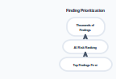


### Severity Thresholds

Organizations define thresholds to classify risk levels.

Example:

| Score Range | Severity |
| ----------- | -------- |
| 0–19        | Low      |
| 20–39       | Medium   |
| 40–69       | High     |
| 70+         | Critical |

As additional suspicious activity occurs, an entity can move from Low to Critical.

Example:

- Current Score = 35 (Medium)
- Privilege Escalation Event = +25
- New Score = 60 (High)

---

## Slide 85 — Controlled Remediation Principles

**On slide:**

- Remediation in a cloud environment must be
- planned and reversible. Hasty changes in
- production can break running services or create
- new exposures if they are not carefully scoped
- and validated.
- Never use broad "fix everything at once"
- approaches in production. Isolate each
- remediation step.

**Speaker notes:**

### Controlled Remediation Principles

Cloud security findings should never be remediated through large-scale, untested changes. Every remediation action must be planned, tested, documented, and reversible. The objective is to reduce security risk without introducing service outages, data loss, or operational instability.

Security teams must balance **risk reduction** with **business continuity**.

---

## Slide 86 — Controlled Remediation Principles

**On slide:**

- Safe remediation workflow:
- Document the current state before
- making any change
- Scope the change to the minimum
- required action
- Test — verify the resource still
- functions correctly after the change
- Verify — confirm the finding is
- resolved in Security Hub or by re-
- running the CLI check
- Record — log what changed, when,
- and who authorized it

**Speaker notes:**

### Why Controlled Remediation Matters

A poorly executed fix can be more damaging than the original security issue.

Example:




Instead:


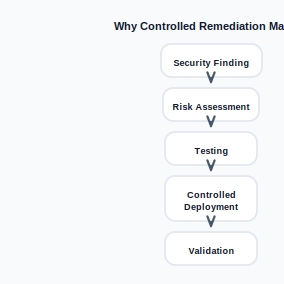


### 5. Remediation Guidance

Modern CSPM tools provide:

* Detailed findings
* Recommended fixes
* Infrastructure-as-Code remediation
* Automated remediation workflows

Example:

- Finding:
- S3 Bucket Publicly Accessible
- Recommendation:
- Disable Public Access Block
- Remove Public ACLs
- Review Bucket Policy

---

## Slide 87 — Continuous Compliance Monitoring

**On slide:**

- A one-time security audit tells you the posture at a single point in
- time. Continuous monitoring detects when configuration drift
- reintroduces a finding that was previously resolved, which is far
- more common than most teams expect.
- Continuous monitoring in AWS:
- AWS Config rules — evaluate resource configurations against
- defined policies on every detected change
- Security Hub — re-evaluates findings automatically and marks
- them resolved when the condition clears
- GuardDuty — runs continuously with no manual refresh or re-
- scan needed
- Set up Security Hub cross-account and cross-region aggregation
- for a single view across the organization

**Speaker notes:**

### Compliance

Track sensitive resources.

### 3. Compliance Monitoring

Map configurations to standards such as:

* CIS AWS Foundations Benchmark
* NIST Cybersecurity Framework
* ISO 27001
* SOC 2
* PCI DSS
* HIPAA

Example:

- Control:
- S3 buckets must be encrypted
- Status:
- PASS / FAIL

---

---

## Slide 88 — Building A Security Findings Baseline

**On slide:**

- A security findings baseline is a structured snapshot of the
- current state of your environment. It provides a reference point
- to measure improvement, demonstrate compliance, and
- communicate risk clearly to stakeholders.
- Baseline components:
- Finding list — severity, title, resource type, resource ID, and
- current status for each finding
- Finding count by severity — Critical, High, Medium, and
- Low totals at a glance
- Remediation status — which items are open, in-progress, or
- resolved
- Stored as a structured file (CSV or JSON), not a screenshot
- — parseable, diffable, and auditable over time
- A baseline produced today becomes the comparison point
- for every future assessment

**Speaker notes:**

### Finding

`SSH Open to 0.0.0.0/0`

Bad remediation:

 `Remove Port 22 Immediately`

Possible impact:

 `Administrators Locked Out`

Controlled remediation:


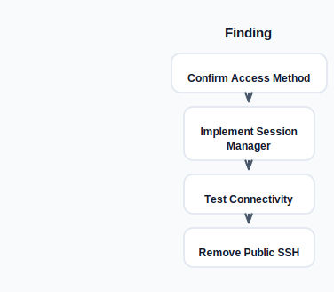


### Building a Security Findings Baseline

A security findings baseline is a documented snapshot of the security posture of an environment at a specific point in time. It establishes a measurable starting point that organizations can use to track improvement, demonstrate compliance progress, and identify trends in security risk over time.

Without a baseline, it is difficult to answer critical questions such as:

* Are we becoming more secure?
* Which findings were newly introduced?
* Which risks have been successfully remediated?
* How quickly are issues being resolved?

---

## Slide 89 — Pop Quiz:

**Speaker notes:** Discuss the question; reveal answer after student responses.

---

## Slide 90 — Pop Quiz:

**Speaker notes:** Discuss the question; reveal answer after student responses.

---

## Slide 91 — Pop Quiz:

**On slide:**

- You run `aws iam get-account-summary` and see: {
- "AccountMFAEnabled": 0, "AccountAccessKeysPresent": 0 } How
- should this finding be classified, and what does it mean?
- A. Low severity — `AccountAccessKeysPresent: 0` means the account is secure
- B. Medium severity — MFA is recommended but not enforced on AWS root accounts
- C. High severity — the root account has no MFA, meaning anyone who obtains the root password has
- unrestricted access to the entire account
- D. Critical severity — `AccountAccessKeysPresent: 0` means the root user's access has already been
- revoked

**Speaker notes:** Discuss the question; reveal answer after student responses.

---

## Slide 92 — Pop Quiz:

**On slide:**

- You run `aws iam get-account-summary` and see: {
- "AccountMFAEnabled": 0, "AccountAccessKeysPresent": 0 } How
- should this finding be classified, and what does it mean?
- A. Low severity — `AccountAccessKeysPresent: 0` means the account is secure
- B. Medium severity — MFA is recommended but not enforced on AWS root accounts
- C. High severity — the root account has no MFA, meaning anyone who obtains the root
- password has unrestricted access to the entire account
- D. Critical severity — `AccountAccessKeysPresent: 0` means the root user's access has already been
- revoked

**Speaker notes:** Discuss the question; reveal answer after student responses.

---

## Slide 93 — Pop Quiz:

**On slide:**

- A security group rule is changed from `source: 0.0.0.0/0, port: 22` to
- `source: 203.0.113.42/32, port: 22`. What is the practical effect of this
- change?
- A. SSH is now fully disabled on the instance and no one can connect remotely
- B. The instance is now protected by a Web Application Firewall that inspects all SSH traffic
- C. SSH access is now restricted to a single IP address, eliminating exposure to automated internet
- scanners and unauthorized remote users
- D. The change has no effect on existing connections and only applies to new connection attempts
- from previously blocked addresses

**Speaker notes:** Discuss the question; reveal answer after student responses.

---

## Slide 94 — Pop Quiz:

**On slide:**

- A security group rule is changed from `source: 0.0.0.0/0, port: 22`
- to `source: 203.0.113.42/32, port: 22`. What is the practical effect
- of this change?
- A. SSH is now fully disabled on the instance and no one can connect remotely
- B. The instance is now protected by a Web Application Firewall that inspects all SSH traffic
- C. SSH access is now restricted to a single IP address, eliminating exposure to automated internet scanners
- and unauthorized remote users
- D. The change has no effect on existing connections and only applies to new connection attempts from previously
- blocked addresses

**Speaker notes:** Discuss the question; reveal answer after student responses.

---

## Slide 95 — Lab 1.3

**Speaker notes:** Discuss the question; reveal answer after student responses.
