# From Detection to Investigation — Day 2 Overview

Day 1 established the security monitoring foundation. You deployed cloud resources, collected evidence, configured monitoring controls, and created an initial security posture baseline.
Day 2 shifts from **identifying security findings** to **investigating and responding to security events**. You will learn how AWS-native AI and security services work together to detect threats, analyze evidence, identify root causes, and support incident response activities.
---

### Day 1 Foundation

The following components were established on Day 1:
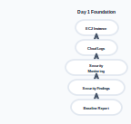

Key outcomes: Running EC2 environment, CloudTrail audit logging, GuardDuty threat detection, Security Hub findings aggregation, IAM and S3 security assessments, Security findings baseline, and AI-assisted security analysis workflow.
---

### Day 2 Focus Areas

Day 2 connects these building blocks into a complete investigation pipeline.
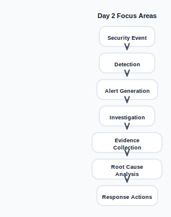

---

### What You Will Learn

#### Threat Detection

Understand how AWS services identify suspicious activity: Amazon GuardDuty, AWS Security Hub, CloudTrail analysis, VPC Flow Log analysis, and IAM anomaly detection.

#### Security Investigation

Learn how to investigate findings using: CloudTrail event history, User activity analysis, Resource change tracking, Timeline reconstruction, and Security evidence collection.

#### AI-Assisted Analysis

Use AI to accelerate investigation tasks: Log summarization, Finding explanation, Threat intelligence enrichment, Incident report generation, and Detection rule development.

#### Incident Response

Apply structured response procedures:
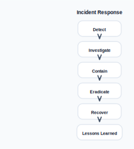

---

### Day 2 Learning Journey

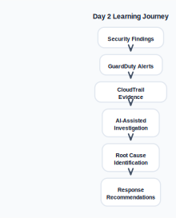

---

### End-of-Day Outcome

By the end of Day 2, you will be able to: Investigate AWS security findings, Analyze CloudTrail evidence, Correlate multiple security signals, Use AI to accelerate investigations, Identify root causes of security incidents, Generate investigation reports, and Recommend remediation actions.
---

### Key Takeaway

**Day 1 focused on building visibility into cloud security posture. Day 2 focuses on transforming that visibility into actionable investigations by combining AWS security services, cloud audit evidence, and AI-assisted analysis to detect, understand, and respond to security threats.**

## What You Will Build Today

Day 2 moves beyond finding security issues and focuses on **investigating, analyzing, and responding to security events using AI-assisted cloud security operations**.
You will build a complete detection-to-investigation workflow that combines AWS logging, CloudWatch, AI-powered analysis, automated alerting, and incident reporting.
---

### Lab 2.2 — AI-Assisted Security Investigations

#### Objective

Use CloudWatch AI Operations and natural language queries to analyze cloud security logs without writing complex search syntax.

#### What You Will Build

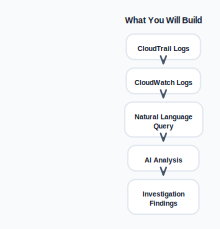

#### Activities

* Query CloudTrail events using plain English
* Search for suspicious IAM activity
* Investigate failed authentication attempts
* Analyze API activity patterns
* Generate AI-assisted summaries
* Identify unusual user behavior

#### Skills Developed

* Security log analysis
* Threat hunting
* AI-assisted investigations
* Evidence collection
* Root cause identification

---

### Lab 2.3 — Real-Time SOC Dashboard

#### Objective

Create a Security Operations Center (SOC) dashboard capable of monitoring cloud security activity in real time.

#### Architecture


#### Activities

* Create custom metric filters
* Detect failed login attempts
* Detect root account activity
* Monitor IAM policy changes
* Configure CloudWatch alarms
* Build a centralized security dashboard

#### Dashboard Components

* Security alerts
* Investigation metrics
* Login failures
* Privilege escalation events
* Geographic activity distribution
* Alert severity trends

#### Skills Developed

* SOC dashboard design
* Security monitoring
* CloudWatch metrics
* Alert engineering
* Operational visibility

---

### Lab 2.4 — End-to-End Detection Pipeline Project

#### Objective

Design and implement a complete detection and investigation pipeline independently.

#### Project Workflow

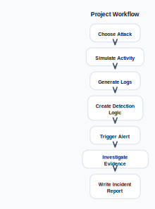

#### Example Attack Scenarios

You may choose: Multiple failed login attempts, Root account activity, Public S3 bucket exposure, IAM privilege escalation, Unauthorized API activity, Security group modification, and Access key misuse.
---

### Structured Incident Report

Each participant will produce a professional incident report containing:

#### Executive Summary

- What happened?
- When did it occur?
- Who was involved?
- Impact level?

#### Investigation Evidence

- CloudTrail Events
- Affected Resources
- User Activity
- Timeline

#### Root Cause Analysis

- Misconfiguration
- Credential Misuse
- Excessive Permissions
- Human Error

#### Remediation Actions

- Immediate Actions
- Long-Term Controls
- Preventive Measures

---

### End-to-End Architecture Built During Day 2

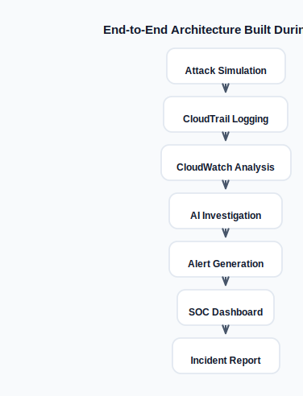

---

### Learning Outcomes

By completing Day 2, you will be able to: Investigate cloud security events using AI, Query security logs using natural language, Build security monitoring dashboards, Configure automated alerts, Correlate security evidence, Conduct structured investigations, Create professional incident reports, and Design complete cloud detection pipelines.
---

### Key Takeaway

**Day 2 transforms raw security data into actionable intelligence. You will build a complete cloud security operations workflow—from log collection and AI-assisted analysis to real-time monitoring, alerting, investigation, and incident reporting—mirroring the responsibilities of modern SOC and cloud security teams.**

## What is a Security Information and Event Management (SIEM) System?

A **Security Information and Event Management (SIEM)** system is a centralized platform that collects, stores, normalizes, correlates, analyzes, and alerts on security-related events generated across an organization's infrastructure.
SIEM platforms help security teams answer critical questions: What happened?, When did it happen?, Who performed the action?, Which systems were affected?, Is the activity malicious?, and What should we investigate next?.
SIEM solutions form the operational backbone of modern Security Operations Centers (SOCs).

## Why SIEM Systems Exist

Modern organizations generate millions of events every day. Firewalls, Endpoints, Servers, Applications, Cloud Services, Identity Systems, and Network Devices.
Without a SIEM:

With a SIEM:
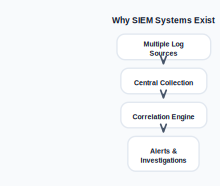

## Core SIEM Functions

### 1. Log Aggregation

Collect logs from many sources.
Example sources: CloudTrail, VPC Flow Logs, Windows Event Logs, Linux Syslog, Firewalls, Web Servers, and Endpoint Detection Tools.
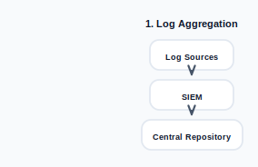

---

### 2. Log Normalization

Different systems use different formats.
Example:

#### Windows

`User: Administrator`

#### Linux

`user=root`

#### AWS

```json
{ "userIdentity": { "userName": "admin" }
}
```

SIEM normalizes them into a common schema:
`Username = admin` This enables consistent searching and reporting.
---

### 3. Event Correlation

Correlation combines multiple events to identify suspicious activity.

#### Individual Events

`Failed Login` `Privilege Escalation` `Sensitive File Access` Each alone may appear normal.

#### Correlated Sequence


This pattern may indicate compromise.
---

### 4. Alerting

SIEM systems generate alerts when predefined conditions occur.
Example:
- IF
- Failed Logins > 10
- Within 5 Minutes
- THEN
- Generate Alert

Example alert: Severity: High, Type: Brute Force Attempt, and Source IP: 203.0.113.10.
---

### 5. Search and Investigation

Security analysts use SIEM platforms to investigate incidents.
Example queries:
`Show all root account activity` `Show all failed logins from China` `Show IAM policy changes last 24 hours`

## Typical SIEM Architecture

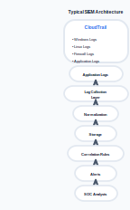

## Example SIEM Investigation

Suppose an attacker gains access to an AWS account.

#### CloudTrail Events

`CreateAccessKey` `AttachAdministratorPolicy` `CreateUser`
Individually:
`Normal Administrative Actions`
Together:
`Possible Privilege Escalation` SIEM correlation identifies the pattern and generates an alert.

## Common SIEM Data Sources

| Source            | Example Events        |
| ----------------- | --------------------- |
| AWS CloudTrail    | API calls             |
| VPC Flow Logs     | Network traffic       |
| Windows Logs      | Authentication events |
| Linux Syslog      | System activity       |
| Firewalls         | Connection attempts   |
| DNS Logs          | Domain lookups        |
| Endpoint Security | Malware detections    |
| Applications      | User actions          |

## SIEM in the SOC Workflow

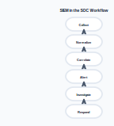

Security analysts spend much of their day working within this workflow.

## SIEM vs Traditional Logging

| Traditional Logging      | SIEM                       |
| ------------------------ | -------------------------- |
| Stores logs              | Stores and analyzes logs   |
| Single system view       | Enterprise-wide visibility |
| Manual review            | Automated correlation      |
| Limited alerting         | Advanced alerting          |
| Difficult investigations | Centralized investigations |

## SIEM Challenges

Large SIEM deployments face several challenges:

#### Alert Fatigue

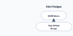

#### Data Volume

Organizations may generate:
`Millions of Events Per Day`

#### False Positives

Rules may trigger on legitimate activity.

#### Cost

Log storage and processing can become expensive.

## Cloud-Native SIEM on AWS

AWS services can collectively provide SIEM capabilities:
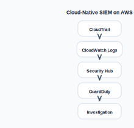

AWS-native SIEM-style workflows often include: CloudTrail, CloudWatch Logs, CloudWatch Alarms, Security Hub, GuardDuty, and OpenSearch.

## Modern AI-Enhanced SIEM

Traditional workflow:

AI-enhanced workflow:
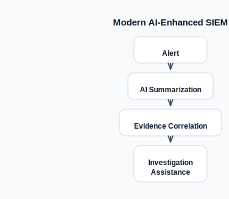

AI can help: Summarize logs, Explain alerts, Identify patterns, Generate incident reports, and Recommend next investigative steps.

## Example Security Event Lifecycle


## Key Takeaway

**A SIEM system serves as the central nervous system of a Security Operations Center by collecting logs from diverse sources, normalizing data into a common format, correlating related events, generating alerts, and providing investigators with the tools needed to detect, analyze, and respond to security threats efficiently.**

## SIEM (Security Information and Event Management)

A SIEM (Security Information and Event Management) platform is a centralized security solution that collects, stores, normalizes, correlates, analyzes, and manages security events from across an organization's infrastructure.
Its primary purpose is to help security teams detect threats faster, investigate incidents efficiently, maintain compliance, and coordinate response activities.

## Breaking Down SIEM

### S — Security

Focuses on protecting organizational assets by identifying security threats and suspicious activity.

#### Security Functions

* Threat detection
* Incident response
* Compliance monitoring
* Risk management
* Security monitoring

#### Examples

- Failed Login Attempts
- Privilege Escalation
- Malware Detection
- Unauthorized Access

---

### I — Information

Collects raw security information from many sources.

#### Information Sources

- Servers
- Endpoints
- Firewalls
- Cloud Services
- Applications
- IAM Systems
- Network Devices
- Databases

#### Information Processing

* Log collection
* Data normalization
* Data enrichment
* Centralized storage

Example:
- CloudTrail Logs
- Windows Event Logs
- Firewall Logs
- DNS Logs

---

### E — Event

An event is any recorded activity occurring within a system.
Examples:
- User Login
- File Access
- API Call
- Firewall Block
- Password Change

The SIEM identifies meaningful events from millions of records.

#### Event Processing

* Event parsing
* Event correlation
* Rule matching
* Anomaly detection

Example:
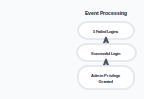

Potential account compromise.
---

### M — Management

Manages security operations and response workflows.

#### Management Functions

* Alert generation
* Case management
* Investigation tracking
* Dashboard reporting
* Compliance reporting

Example:
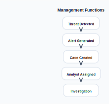

## How SIEM Works

### Step 1: Collect

SIEM gathers logs from multiple sources. Servers, Firewalls, Cloud Logs, Applications, and Endpoints ↓.

`Central SIEM Platform`
---

### Step 2: Analyze

The SIEM analyzes and correlates data.
Example:

↓ `Suspicious Activity Detected`
---

### Step 3: Alert

When predefined conditions are met:
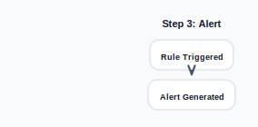

Example:
- Severity: High
- Type: Brute Force Attack

---

### Step 4: Respond

Security analysts investigate and remediate.
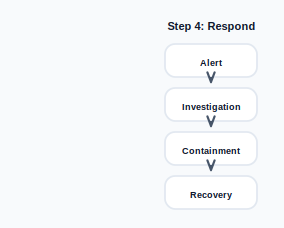

## SIEM Architecture

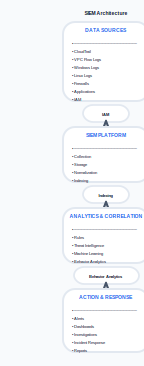

## Key SIEM Capabilities

| Capability      | Purpose                           |
| --------------- | --------------------------------- |
| Log Collection  | Gather data from multiple sources |
| Normalization   | Convert logs into a common format |
| Correlation     | Connect related events together   |
| Alerting        | Notify analysts of threats        |
| Search          | Investigate historical events     |
| Dashboards      | Visualize security posture        |
| Reporting       | Support audits and compliance     |
| Case Management | Track investigations              |

## Example AWS SIEM Workflow

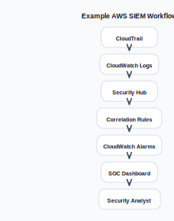

## Real Security Example

#### Individual Events

`Failed Login` `IAM Policy Change` `Create Access Key` Each event alone may seem normal.

#### Correlated View

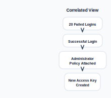

↓ `Possible Account Compromise` A SIEM identifies this pattern automatically.

## Benefits of SIEM

#### Improved Visibility

Single view across the environment.

#### Faster Detection

Threats identified in minutes rather than days.

#### Efficient Investigation

Centralized evidence and searching.

#### Compliance Support

Supports: CIS Controls, NIST, PCI-DSS, ISO 27001, and SOC 2.

#### Better Incident Response

Structured workflows for analysts.

## Traditional Logging vs SIEM

| Traditional Logging      | SIEM                       |
| ------------------------ | -------------------------- |
| Stores logs              | Stores and analyzes logs   |
| Individual systems       | Centralized visibility     |
| Manual review            | Automated detection        |
| Limited alerting         | Intelligent alerting       |
| Difficult investigations | Centralized investigations |

## Modern AI-Enhanced SIEM

Traditional SIEM:

AI-Enhanced SIEM:
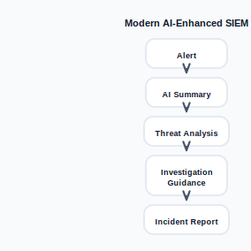

AI can help: Summarize large log volumes, Explain alerts, Correlate evidence, Recommend response actions, and Generate investigation reports.

## Key Takeaway

**SIEM is the central nervous system of a Security Operations Center. It collects security data from multiple sources, normalizes and correlates events, detects threats, generates alerts, supports investigations, and enables organizations to respond quickly and effectively to security incidents.**

## Cloud-Native Monitoring vs. Traditional SIEMs

As organizations move workloads from on-premises data centers to the cloud, security monitoring approaches have evolved significantly. Traditional SIEM platforms were built for physical infrastructure, whereas cloud-native monitoring services are designed specifically for elastic cloud environments.

## Traditional SIEM Architecture

Traditional SIEMs were originally designed for enterprise data centers.

#### Typical Workflow

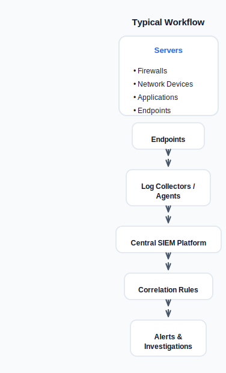

#### Characteristics

* Requires log forwarding agents
* Dedicated SIEM infrastructure
* Manual scaling and capacity planning
* Complex deployment and maintenance
* Often expensive licensing models
* Vendor-specific query languages

#### Common Examples

* Splunk Enterprise Security
* IBM QRadar
* ArcSight
* LogRhythm
* Microsoft Sentinel

## Cloud-Native Monitoring Architecture

Cloud-native monitoring services are integrated directly into cloud infrastructure.

#### AWS Example

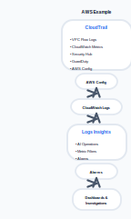

#### Characteristics

* Native service integration
* No agent required for AWS-native services
* Automatic scaling
* Pay-as-you-use pricing
* Managed infrastructure
* Built-in AI capabilities

## Traditional SIEM vs Cloud-Native Monitoring

| Dimension         | Traditional SIEM      | Cloud-Native Monitoring |
| ----------------- | --------------------- | ----------------------- |
| Log Collection    | Agents and collectors | Native integrations     |
| Deployment        | Self-managed          | Fully managed           |
| Scaling           | Manual                | Automatic               |
| Infrastructure    | Customer-owned        | Provider-managed        |
| Cost Model        | License + hardware    | Pay-as-you-go           |
| AI Features       | Usually add-ons       | Often built-in          |
| Maintenance       | High                  | Low                     |
| Cloud Integration | Limited               | Native                  |

## Log Collection Comparison

### Traditional SIEM

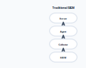

Challenges: Agent installation, Version management, Network configuration, and Resource overhead.
---

### AWS Cloud-Native

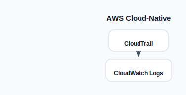

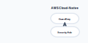

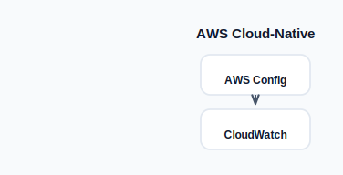

Benefits: Minimal configuration, Native integration, and Reduced operational overhead.

## Scaling Comparison

### Traditional SIEM

When log volume increases: More Storage, +, More CPU, +, More Memory, +, and More Licensing.
Required actions: Capacity planning, Hardware procurement, and Infrastructure upgrades.
---

### Cloud-Native Monitoring

When log volume increases:
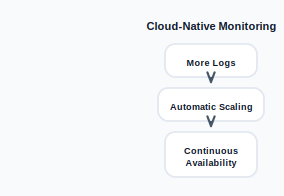

Benefits: No hardware procurement, Elastic growth, and Faster adoption.

## Query Language Comparison

### Traditional SIEM

Examples:
`Splunk SPL` `KQL` `Vendor-Specific Syntax`
Learning curve: Platform dependent and Vendor lock-in risks.
---

### AWS CloudWatch Logs Insights

Example Query
```sql
fields @timestamp, @message
| filter @message like /Failed/
| sort @timestamp desc
| limit 20
```

Advantages: Native AWS support, Integrated investigation workflow, and Works directly on CloudWatch data.

## Cost Comparison

### Traditional SIEM

Typical Costs Software License, +, Infrastructure, +, Storage, +, Maintenance, +, and Operations Team.
Costs often increase substantially as log volume grows.
---

### Cloud-Native Monitoring

Typical Costs Log Ingestion, +, Storage, +, and Queries Executed.
Advantages: No upfront infrastructure investment, Pay only for usage, and Easier budgeting for smaller environments.

## AI Integration Comparison

### Traditional SIEM

- SIEM
- +
- Separate AI Tool

Usually requires: Additional licensing, Third-party integrations, and Custom configuration.
---

### AWS Cloud-Native Monitoring

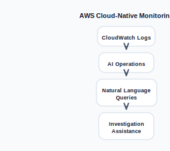

Capabilities include: AI-generated queries, Log summarization, Root cause guidance, and Investigation acceleration.

## Security Operations Comparison

### Traditional SOC Workflow

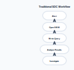

---

### Cloud-Native SOC Workflow

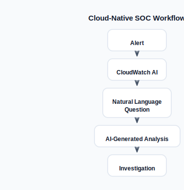

Example:
- Show failed SSH logins
- during the last 24 hours

Instead of manually writing complex queries.

## When Traditional SIEMs Still Make Sense

Traditional SIEMs remain valuable when:
* Large hybrid environments exist
* Multiple cloud providers are used
* Regulatory requirements mandate specific tooling
* Existing SOC workflows are deeply integrated
* Advanced correlation across many technologies is required

## When Cloud-Native Monitoring Is Ideal

Cloud-native monitoring is often preferred when: Most workloads run in AWS, Teams want minimal operational overhead, Fast deployment is required, AI-assisted investigations are desired, Cost efficiency is important, and Infrastructure management should be minimized.

## AWS Services Supporting Cloud-Native Monitoring

Key AWS services include: CloudWatch Logs, CloudWatch Alarms, CloudWatch Dashboards, CloudWatch Logs Insights, CloudWatch AI Operations, CloudTrail, AWS Config, Security Hub, GuardDuty, and Systems Manager.

## Key Takeaway

**Traditional SIEMs centralize logs from many systems using dedicated infrastructure, while cloud-native monitoring integrates directly with cloud services, providing automatic scaling, lower operational overhead, pay-as-you-go pricing, and increasingly powerful AI-assisted investigation capabilities. For AWS-centric environments, CloudWatch, Security Hub, GuardDuty, and AI Operations together provide many of the capabilities traditionally delivered by a SIEM platform.**

## Amazon CloudWatch — Architecture Overview

Amazon CloudWatch is AWS's native observability platform that provides monitoring, logging, alerting, visualization, and operational intelligence across AWS environments. It acts as the central monitoring layer for cloud-native applications and infrastructure.
---

### What is CloudWatch?

CloudWatch collects and processes:

#### Metrics (Numerical Time-Series Data)

Examples:
* EC2 CPU utilization
* Memory utilization (custom metric)
* Network traffic
* Disk I/O
* Lambda invocations
* API Gateway requests
* RDS connections

Example:

Metrics are optimized for: Performance monitoring, Capacity planning, Trend analysis, and Alerting.

#### Logs (Text-Based Events)

Examples:
`User login successful` `Failed SSH authentication` `Database connection timeout` `API request returned 500 error`
Logs are optimized for: Troubleshooting, Security investigations, Root cause analysis, and Compliance auditing.

## CloudWatch Architecture

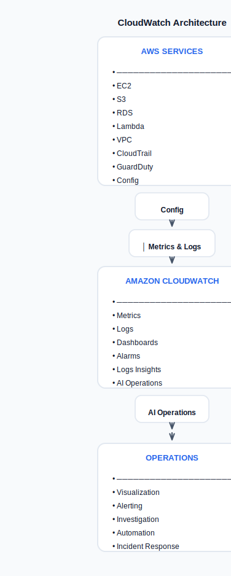

## Data Sources

### AWS Native Sources

#### Compute

* EC2
* Auto Scaling Groups
* Lambda
* ECS
* EKS

#### Storage

* S3
* EBS
* FSx

#### Database

* RDS
* DynamoDB
* Aurora

#### Networking

* VPC
* NAT Gateway
* Load Balancers
* Route 53

---

### Custom Sources

CloudWatch can also collect data from: On-premises servers, Applications, Containers, Third-party software, and Security tools.
Using: CloudWatch Agent, API integrations, and Embedded Metric Format (EMF).

## Core CloudWatch Components

### 1. Metrics

Metrics are numerical measurements over time.
Example:
- CPUUtilization
- NetworkIn
- NetworkOut
- DiskReadOps

Benefits: Lightweight, Fast aggregation, and Ideal for dashboards.
---

### 2. Logs

CloudWatch Logs stores: Application logs, System logs, CloudTrail events, Security logs, and VPC Flow Logs.
Security examples:
`Failed login attempts` `Privilege escalation activity` `Unauthorized API calls`
---

### 3. CloudWatch Logs Insights

Logs Insights provides powerful log querying.
Example:
```sql
fields @timestamp, @message
| filter @message like /ERROR/
| sort @timestamp desc
| limit 20
```

Use Cases: Security investigations, Troubleshooting, Threat hunting, and Incident response.
---

### 4. CloudWatch Dashboards

Dashboards visualize: Metrics, Logs, Alarms, and Custom KPIs.
Example SOC Dashboard:
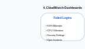

Benefits: Single-pane visibility, Executive reporting, and Security monitoring.
---

### 5. CloudWatch Alarms

Alarms continuously evaluate metrics.
Example:
`CPU > 80%` `Failed Login Count > 20` `Network Traffic Spike`
Possible actions: Send SNS notification, Trigger Lambda, Open ticket, and Execute automation.

## CloudWatch Operational Workflow

### Step 1: Collect

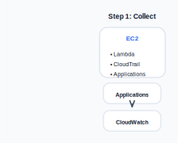

---

### Step 2: Analyze

`Logs Insights Queries` `Metrics Analysis` `AI Operations`
---

### Step 3: Alert

`Alarm Triggered`
Examples:
* High CPU
* Brute-force attack
* Failed API requests

---

### Step 4: Respond

`SNS Notification` `Lambda Automation` `Incident Ticket` `Security Investigation`

## CloudWatch for Security Operations

CloudWatch is frequently used as the monitoring layer in AWS SOC environments.
Security data sources include: CloudTrail, VPC Flow Logs, Route53 DNS Logs, Application Logs, Security Hub Findings, and GuardDuty Findings.
Common detection scenarios:

#### Brute Force Detection

`Multiple failed logins`

#### Privilege Escalation

`IAM policy changes`

#### Unauthorized Access

`Root account usage`

#### Suspicious API Activity

- DeleteBucket
- StopLogging
- DisableSecurityHub

## CloudWatch AI Operations

CloudWatch AI Operations introduces generative AI capabilities.
Examples:

#### Natural Language Query

**Reflect:**

- Show failed SSH login attempts
- during the last 24 hours

AI generates the query automatically.

#### Log Summarization

AI can summarize: Top error patterns, Root causes, and Affected systems.

#### Investigation Assistance

AI helps analysts: Identify anomalies, Explain errors, and Recommend next steps.

## CloudWatch Integration Ecosystem

CloudWatch integrates with:

#### Security

* Security Hub
* GuardDuty
* AWS Config
* IAM Access Analyzer

#### Automation

* Lambda
* Systems Manager
* EventBridge

#### Notification

* SNS
* Email
* Slack integrations

#### Visualization

* Dashboards
* Grafana
* QuickSight

## CloudWatch vs Traditional Monitoring Tools

| Feature         | Traditional Monitoring    | CloudWatch        |
| --------------- | ------------------------- | ----------------- |
| Deployment      | Self-managed              | Fully managed     |
| Scaling         | Manual                    | Automatic         |
| AWS Integration | Limited                   | Native            |
| Alerting        | External tools            | Built-in          |
| Log Analytics   | Separate solution         | Built-in          |
| AI Operations   | Usually add-on            | Native capability |
| Cost Model      | Infrastructure + licenses | Pay-as-you-go     |

## Key Takeaway

**Amazon CloudWatch serves as AWS's central observability platform. It collects metrics and logs from AWS services and custom sources, provides powerful querying through Logs Insights, visualizes operational data with dashboards, generates alerts through alarms, and increasingly leverages AI Operations to accelerate troubleshooting and security investigations.**

## Amazon CloudWatch — Key Components

After logs and metrics enter CloudWatch, several core components work together to provide monitoring, alerting, visualization, and investigation capabilities.
---

### 1. Log Groups

A **Log Group** is a logical container that organizes related log streams.

#### Purpose

* Organize logs by application, service, or environment
* Apply retention policies
* Manage permissions
* Simplify searches and investigations

#### Examples

`/soc-lab/secure` `/aws/lambda/auth-service` `/aws/vpc/flowlogs` `/aws/cloudtrail/security`

#### Example Structure

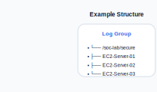

Think of a Log Group as a folder containing related logs.
---

### 2. Log Streams

A **Log Stream** is a sequence of log events generated by a single source.

#### Examples

A log stream may represent: One EC2 instance, One Lambda execution environment, One container, and One application server.

#### Example

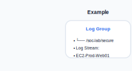

Log Events:
`User login successful` `Failed password attempt` `sudo command executed` `Service restarted`

#### Analogy

- Log Group  = Folder
- Log Stream = File
- Log Event  = Line in the file

---

### 3. Metrics

Metrics are numerical measurements captured over time.

#### Examples

AWS Metrics `CPUUtilization` `NetworkIn` `DiskReadOps`
`MemoryUtilization` Custom Security Metrics `FailedLoginAttempts` `SudoFailedAttempts`
`UnauthorizedAPICalls`

#### Example Timeline

- Time       CPU
- 12:00      20%
- 12:05      35%
- 12:10      80%
- 12:15      92%

Metrics are ideal for: Trend analysis, Capacity planning, Alert generation, and Dashboard visualization.
---

### 4. Alarms

CloudWatch Alarms continuously evaluate metrics against defined thresholds.

#### Example

`CPU > 80%`
When threshold is exceeded:
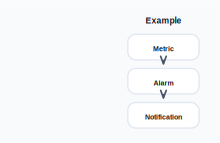

#### Security Examples

##### Failed Login Alarm

`FailedLoginAttempts > 20`

##### Root Usage Alarm

`RootAccountLogin > 0`

##### Privilege Escalation Alarm

`SudoFailures > 5`

#### Alarm Actions

CloudWatch can:
`Send SNS notification` `Invoke Lambda` `Create Incident` `Trigger Automation`
---

### 5. Dashboards

Dashboards provide visual monitoring of metrics and logs.

#### Example SOC Dashboard

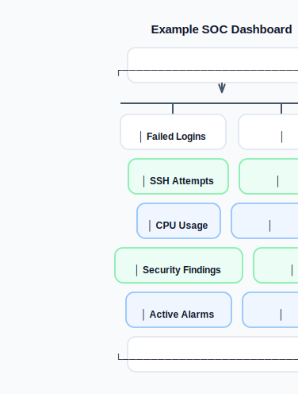

#### Dashboard Benefits

* Centralized visibility
* Security monitoring
* Executive reporting
* Operational awareness

---

### How Components Work Together

#### Example Security Workflow

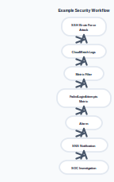

---

### CloudWatch Component Relationship

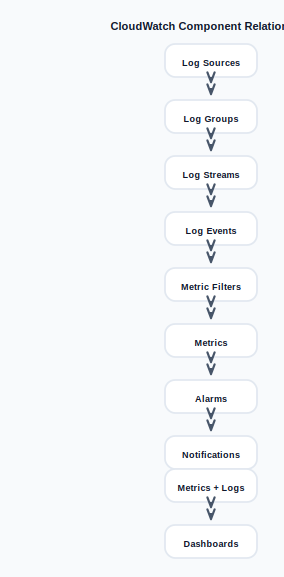

---

### Security Operations Example

#### Log Event

- Failed password for ubuntu
- from 203.0.113.10

#### Metric Filter

- Pattern:
- "Failed password"

#### Metric

`FailedSSHLogins`

#### Alarm

- FailedSSHLogins > 10
- within 5 minutes

#### Result

`SNS Alert Sent` `Security Team Notified` `Investigation Started`

## Key Takeaway

**CloudWatch is built around five primary components: Log Groups organize logs, Log Streams store events from individual sources, Metrics provide numerical measurements, Alarms detect abnormal conditions, and Dashboards visualize operational and security data. Together they form the foundation of AWS-native monitoring and security operations.**

## The CloudWatch Agent and Log Ingestion

CloudWatch can automatically collect metrics from many AWS services, but it cannot see inside an EC2 instance by default. To collect operating system logs, application logs, and custom metrics, AWS uses the **CloudWatch Agent**.

## Why the CloudWatch Agent Exists

Without the CloudWatch Agent:
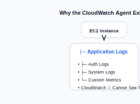

CloudWatch only receives: EC2 infrastructure metrics, AWS service metrics, and Cloud-managed service telemetry.
It cannot access: Linux log files, Windows Event Logs, Application logs, Security logs, and Custom performance counters.

## What is the CloudWatch Agent?

The CloudWatch Agent is a lightweight software service installed on: Amazon EC2 instances, On-premises servers, Virtual machines, and Hybrid infrastructure.
Its purpose is to collect:

#### Logs

`/var/log/secure` `/var/log/messages` `/var/log/auth.log` `Apache Logs`
`Nginx Logs` `Application Logs`

#### Metrics

`Memory Usage` `Disk Utilization` `Swap Usage` `Process Counts`
`Custom Security Metrics` and send them to CloudWatch.

## CloudWatch Agent Architecture


## Log Ingestion Workflow

#### Step 1

Application writes log entries.
Example:
- Failed password for ubuntu
- from 203.0.113.25

#### Step 2

CloudWatch Agent monitors the log file. `/var/log/secure`

#### Step 3

Agent forwards new log entries.


#### Step 4

CloudWatch stores the logs.


#### Step 5

Analysts query the logs. `CloudWatch Logs Insights` or `CloudWatch AI Operations`

## Security Monitoring Example

### Linux Authentication Monitoring

Source file:
`/var/log/secure`
Sample events:
`Accepted publickey for ec2-user` `Failed password for ubuntu` `sudo authentication failure` `User added to sudo group`

#### Detection Pipeline


## Common Security Logs Collected

### Linux

`/var/log/secure` `/var/log/messages` `/var/log/audit/audit.log` `/var/log/syslog`
---

### Windows

`Security Event Log` `Application Event Log` `System Event Log`
---

### Applications

`Apache Access Logs` `Apache Error Logs` `Nginx Logs` `Custom Application Logs`

## Metrics Collected by the Agent

Native EC2 provides:
`CPU Utilization` `Network Traffic` `Disk I/O`
---

The CloudWatch Agent adds:
`Memory Usage` `Disk Space` `Swap Usage` `Processes Running`
`Custom Metrics`

## Example Security Metric

Suppose we count failed SSH logins.
Agent collects:
`Failed password`
Metric Filter creates:
`FailedSSHLogins`
Alarm: FailedSSHLogins > 10 and within 5 minutes.
Response:
`SNS Notification` `Security Alert` `Incident Investigation`

## CloudWatch Agent Configuration

Typical configuration defines:

#### Logs to Collect

```json
{ "file_path": "/var/log/secure", "log_group_name": "/soc-lab/secure" }
```

#### Metrics to Collect

```json
{ "metrics_collection_interval": 60 }
```

## Security Benefits

The CloudWatch Agent provides:

#### Host Visibility

- OS Events
- User Activity
- Authentication Attempts
- Privilege Escalation

#### Faster Detection

- Failed Logins
- Unauthorized Changes
- Suspicious Processes

#### Centralized Monitoring


## Agent vs No Agent

| Capability          | Without Agent | With Agent      |
| ------------------- | ------------- | --------------- |
| CPU Metrics         | Yes           | Yes             |
| Memory Metrics      | No            | Yes             |
| Disk Utilization    | Limited       | Yes             |
| Linux Logs          | No            | Yes             |
| Windows Event Logs  | No            | Yes             |
| Application Logs    | No            | Yes             |
| Security Monitoring | Limited       | Full Visibility |

## Key Takeaway

**The CloudWatch Agent extends CloudWatch beyond AWS-managed infrastructure metrics by collecting operating system logs, application logs, and custom metrics directly from servers. It serves as the critical bridge between host-level activity and centralized monitoring, enabling security investigations, threat detection, dashboards, alarms, and AI-assisted analysis within CloudWatch.**

## The CloudWatch Agent and Log Ingestion Process

The CloudWatch Agent continuously monitors configured log files on a server and forwards new log entries to CloudWatch Logs. This process is called **log ingestion**.

## Why Log Ingestion Matters

Security investigations depend on collecting evidence from servers.
Without log ingestion:


SOC analysts cannot: Detect attacks, Investigate incidents, Build dashboards, and Create alerts.

## Log Ingestion Workflow

### Step 1 — Agent Runs as a Service

The CloudWatch Agent runs continuously on the EC2 instance.
Linux:
```bash
sudo systemctl status amazon-cloudwatch-agent
```

Windows:
`AmazonCloudWatchAgent Service`
Responsibilities: Monitor configured files, Read new entries, and Send data to CloudWatch.
---

### Step 2 — Configuration Defines What to Monitor

The agent reads a configuration file.
Example:
```json
{ "logs": { "logs_collected": { "files": {
"collect_list": [ { "file_path": "/var/log/secure", "log_group_name": "/soc-lab/secure"
} ] } }
} }
```

This tells the agent:
- Watch:
- /var/log/secure
- Send To:
- /soc-lab/secure

---

### Step 3 — Agent Tails the File

The agent continuously watches the file.
Example log file:
`/var/log/secure`
New event appears: Jun 10 12:01 Failed password for ubuntu and from 203.0.113.10.
Agent detects:


No manual upload is required.
---

### Step 4 — Logs Sent to CloudWatch

The event is transmitted securely.


The transfer is near real-time.
Typical delay:
`Few Seconds`

## Log Group and Log Stream Organization

CloudWatch stores logs using:

### Log Group

Logical container.
Example:
`/soc-lab/secure`
Contains:
`Authentication Events`
---

### Log Stream

Individual source inside the group.
Example:
`i-0123456789abcdef`
Another server:
`i-0987654321abcdef`
Structure:


## Example End-to-End Flow

Authentication attempt:
`Failed password for ubuntu`
Workflow:


## Searching Across Multiple Servers

Suppose: Server A, Server B, and Server C.
All write to:
`/soc-lab/secure`
CloudWatch stores:


Logs Insights can query them together.
Example:
```sql
fields @timestamp,@message
| filter @message like /Failed password/
| sort @timestamp desc
```

Result: All Failed Logins and Across All Servers.

## Security Monitoring Example

#### Log Event

- Failed password for admin
- from 203.0.113.50

#### Agent

`Reads Event`

#### CloudWatch

`Stores Event`

#### Metric Filter

- Pattern:
- Failed password

#### Metric

`FailedSSHLogins`

#### Alarm

`FailedSSHLogins > 10`

#### Result

`SOC Alert Triggered`

## Benefits of Centralized Log Ingestion

#### Unified Visibility


#### Faster Investigations

- Single Search
- Across Entire Environment

#### Security Monitoring

- Failed Logins
- Privilege Escalation
- Root Usage
- Policy Changes

#### Alerting


## Common Security Logs Collected

| Log Source                 | Purpose                          |
| -------------------------- | -------------------------------- |
| `/var/log/secure`          | Authentication activity          |
| `/var/log/auth.log`        | Login events                     |
| `/var/log/messages`        | System events                    |
| `/var/log/audit/audit.log` | Linux auditing                   |
| Apache Logs                | Web activity                     |
| Nginx Logs                 | HTTP traffic                     |
| Windows Security Log       | Authentication and authorization |
| Application Logs           | Business application events      |

## Key Takeaway

**The CloudWatch Agent runs continuously on servers, monitors configured log files, and forwards new entries to CloudWatch Logs in near real time. Logs are organized into Log Groups and Log Streams, enabling centralized search, security monitoring, dashboards, alarms, and AI-assisted investigations across an entire environment.**

## CloudWatch Logs Insights — Query Language

CloudWatch Logs Insights is AWS's interactive query engine for analyzing log data stored in CloudWatch Logs. It allows SOC analysts, cloud engineers, and security teams to quickly search, filter, aggregate, and visualize log events without exporting data to another system.
Unlike traditional SIEM query languages, Logs Insights is lightweight, easy to learn, and optimized specifically for cloud log analysis.

## Why Logs Insights Matters

A modern AWS environment can generate millions of log events per day.
Examples:
- Authentication Events
- Application Logs
- CloudTrail Events
- VPC Flow Logs
- Web Server Logs
- System Logs

Without a query engine, finding suspicious activity becomes extremely difficult.
Logs Insights enables: Rapid threat hunting, Incident investigation, Security monitoring, Operational troubleshooting, and Compliance reporting.

## How Logs Insights Works


Analysts write queries against one or more log groups and receive results within seconds.

## Query Structure

Most queries follow a simple pattern:
```sql
fields
| filter
| stats
| sort
| limit
```

Example:
```sql
fields @timestamp,@message
| filter @message like /Failed password/
| sort @timestamp desc
| limit 20
```

## Command 1 — fields

Selects which columns to display.
Example:
```sql
fields @timestamp,@message
```

Output:


Common fields:
| Field      | Purpose                |
| ---------- | ---------------------- |
| @timestamp | Event time             |
| @message   | Full log text          |
| @logStream | Source stream          |
| @log       | Log group              |
| @ptr       | Internal event pointer |

## Command 2 — filter

Filters events matching specific conditions.
Example:
```sql
fields @timestamp,@message
| filter @message like /Failed password/
```

Returns only matching events.
---

### Exact Match

```sql
filter username="admin"
```

---

### Numeric Comparison

```sql
filter responseTime > 1000
```

---

### Multiple Conditions

```sql
filter status="FAILED" and username="admin"
```

## Using Regular Expressions

Logs Insights supports regex patterns.
Example:
```sql
filter @message like /Failed password/
```

Matches: Failed password for admin, Failed password for root, and Failed password for ubuntu.

## Command 3 — stats

Performs aggregation. Equivalent to SQL GROUP BY operations.
---

### Count Events

```sql
stats count()
```

Result:
`1543`
---

### Count by User

```sql
stats count() by username
```

Output: admin      250, root       110, and ubuntu      90.
---

### Average Value

```sql
stats avg(responseTime)
```

---

### Maximum Value

```sql
stats max(responseTime)
```

## Command 4 — sort

Orders results.
Newest first:
```sql
sort @timestamp desc
```

Oldest first:
```sql
sort @timestamp asc
```

## Command 5 — limit

Controls result volume.
Example:
```sql
limit 50
```

Returns only:
`Top 50 Results` Useful during investigations.

## Security Investigation Example 1

### Find Failed SSH Logins

```sql
fields @timestamp,@message
| filter @message like /Failed password/
| sort @timestamp desc
| limit 50
```

Result: Jun 10 10:01 Failed password for root, Jun 10 10:03 Failed password for admin, and Jun 10 10:05 Failed password for ubuntu.

## Security Investigation Example 2

### Count Failed Logins Per Minute

```sql
fields @timestamp
| filter @message like /Failed password/
| stats count() by bin(1m)
```

Output: 10:00   3, 10:01   5, 10:02   14, and 10:03   28.
Possible brute-force attack detected.

## Understanding bin()

The `bin()` function groups events into time windows.
Example:
```sql
stats count() by bin(5m)
```

Produces: 09:00-09:05   25, 09:05-09:10   31, and 09:10-09:15   44.
Useful for trend analysis.

## Security Investigation Example 3

### Find Sudo Activity

```sql
fields @timestamp,@message
| filter @message like /sudo/
| sort @timestamp desc
```

Result: sudo user=ubuntu, sudo user=admin, and sudo user=root.
Useful for privilege escalation investigations.

## Security Investigation Example 4

### Detect Root Login Activity

```sql
fields @timestamp,@message
| filter @message like /root/
```

Potential output:
`Accepted password for root` Often considered a high-priority finding.

## Security Investigation Example 5

### Top Source IP Addresses

Suppose logs contain: 203.0.113.10, 198.51.100.22, 203.0.113.10, and 203.0.113.10.
Query:
```sql
stats count() by sourceIP
| sort count desc
```

Output: 203.0.113.10     120 and 198.51.100.22     25.
Helps identify attackers.

## Visualizing Query Results

Logs Insights can automatically generate charts.
Example:
```sql
stats count() by bin(5m)
```

Produces: Line Chart, Bar Chart, and Area Chart.
Useful for SOC dashboards.

## Threat Hunting Workflow


## Comparison with SQL

| SQL      | Logs Insights |
| -------- | ------------- |
| SELECT   | fields        |
| WHERE    | filter        |
| GROUP BY | stats by      |
| ORDER BY | sort          |
| LIMIT    | limit         |

Example:
SQL:
```sql
SELECT * FROM logs WHERE message LIKE '%Failed password%' ORDER BY timestamp DESC
LIMIT 50;
```

Logs Insights:
```sql
fields @timestamp,@message
| filter @message like /Failed password/
| sort @timestamp desc
| limit 50
```

## Common SOC Queries

#### Failed Logins

```sql
filter @message like /Failed password/
```

#### Successful Logins

```sql
filter @message like /Accepted password/
```

#### Sudo Usage

```sql
filter @message like /sudo/
```

#### Root Activity

```sql
filter @message like /root/
```

#### Authentication Trends

```sql
stats count() by bin(5m)
```

#### Top Attack Sources

```sql
stats count() by sourceIP
```

## Key Takeaway

**CloudWatch Logs Insights is AWS's log analytics engine that enables analysts to search, filter, aggregate, and visualize log data using a simple query language. Core commands such as `fields`, `filter`, `stats`, `sort`, and `limit` provide everything needed for most SOC investigations, threat hunting activities, and security monitoring workflows.**

## AI-Powered Query Generation in CloudWatch

### What Is AI Query Generation?

CloudWatch Logs Insights includes generative AI capabilities that convert natural language prompts into valid Logs Insights queries. Instead of manually writing query syntax, analysts can describe what they want to investigate and CloudWatch generates a starting query automatically.
Examples:
- Show all failed SSH logins
- Find sudo activity from the last hour
- Count authentication failures by source IP
- Show top users with failed login attempts

↓
```sql
fields @timestamp,@message
| filter @message like /Failed password/
| sort @timestamp desc
```

## Why AWS Added AI Query Generation

Many analysts understand security investigations but are not experts in query languages.
Traditional workflow:


AI-assisted workflow:


Result: Faster investigations, Reduced learning curve, Improved productivity, and More focus on analysis rather than syntax.

## How AI Query Generation Works

CloudWatch AI uses:


The AI translates the analyst's intent into valid Logs Insights commands.

## Example 1 — Failed SSH Logins

Prompt:
`Show failed SSH login attempts`
Generated query:
```sql
fields @timestamp,@message
| filter @message like /Failed password/
| sort @timestamp desc
| limit 50
```

## Example 2 — Sudo Activity

Prompt:
`Show all logs containing sudo`
Generated query:
```sql
fields @timestamp,@message
| filter @message like /sudo/
| sort @timestamp desc
| limit 25
```

This is similar to the example shown on the slide.

## Example 3 — Root Account Activity

Prompt:
`Find root account activity`
Generated query:
```sql
fields @timestamp,@message
| filter @message like /root/
| sort @timestamp desc
```

## Example 4 — Authentication Failures Over Time

Prompt:
`Count failed login attempts every 5 minutes`
Generated query:
```sql
fields @timestamp
| filter @message like /Failed password/
| stats count() by bin(5m)
```

Produces a time-series graph.

## Example 5 — Top Attack Sources

Prompt:
`Show source IPs generating the most failed logins`
Generated query:
```sql
stats count() by sourceIP
| sort count desc
```

Useful for threat hunting.

## Query Refinement

CloudWatch AI can also modify existing queries.
Original:
```sql
fields @timestamp,@message
| filter @message like /sudo/
```

Prompt:
`Only show the last 24 hours`
Refined query:
```sql
fields @timestamp,@message
| filter @message like /sudo/
| sort @timestamp desc
| limit 100
```

## Benefits of AI Query Generation

#### Faster Investigations

Reduce time spent writing syntax.

#### Lower Learning Curve

New analysts become productive quickly.

#### Better Threat Hunting

Generate multiple investigative queries rapidly.

#### Increased Productivity

Focus shifts from coding to analysis.

#### Improved Accessibility

Security teams without SIEM expertise can still perform investigations.

## Limitations of AI Query Generation

AI-generated queries are not always correct.
Analysts must verify: Selected fields, Filters used, Time ranges, Regex patterns, Aggregation logic, and Log source assumptions.
Never assume the generated query is accurate without validation.

## Common Failure Scenarios

### Incorrect Field Names

AI generates:
```sql
filter sourceIP="10.0.0.1"
```

But actual logs use:
```sql
client_ip
```

Result:
`No results returned`
---

### Wrong Log Format Assumptions

AI assumes Linux authentication logs:
```sql
filter @message like /Failed password/
```

Actual environment:
`Windows Event Logs`
Result:
`Query returns nothing`
---

### Overly Broad Searches

Prompt:
`Show suspicious activity` Generated query may be too generic and return thousands of events.
Better prompt:
`Show failed SSH logins from the last hour`

## Best Practices for Using AI Query Generation

#### Be Specific

Good:
`Show failed SSH logins from the last 24 hours`
Bad:
`Find attacks`

#### Validate Results

Check: Field Names, Filters, Regex, Time Range, and Returned Events.

#### Start Simple

Generate a basic query first.
Then refine: Add grouping, Add aggregation, Add IP filtering, and Add time windows.

#### Understand the Generated Query

Analysts should still know: fields, filter, stats, sort, and limit.
AI assists but does not replace investigation skills.

## Human-in-the-Loop Model


The analyst remains responsible for the final investigation.

## SOC Use Cases

AI query generation is particularly useful for: Threat hunting, Failed login investigations, Privilege escalation analysis, Malware investigations, CloudTrail event searches, IAM activity monitoring, Security incident triage, and Compliance auditing.

## Key Takeaway

**CloudWatch AI-powered query generation allows analysts to convert plain English security questions into Logs Insights queries. It significantly accelerates investigations and lowers the barrier to log analysis, but analysts must still validate the generated query and understand the underlying log data to ensure accurate results.**

## AI-Powered Query Generation in CloudWatch

### Step-by-Step Workflow

CloudWatch AI-assisted query generation helps analysts transform natural language questions into executable CloudWatch Logs Insights queries.
The process follows four simple steps:


## Step 1 — Enter a Natural Language Prompt

The analyst describes the investigation goal in plain English.
Examples:
- Find failed SSH attempts in the last hour
- Show all sudo activity
- List root account logins
- Count failed authentications by source IP
- Show the top 10 users generating login failures

No knowledge of query syntax is required.

## Example Prompts

#### Authentication Investigation

`Show failed login attempts in the last 24 hours`

#### Privilege Escalation Investigation

`Show all sudo commands executed today`

#### Threat Hunting

`Find connections from suspicious IP addresses`

#### CloudTrail Investigation

`Show all IAM policy changes during the last 6 hours`

## Step 2 — AI Generates a Logs Insights Query

The AI analyzes: Prompt intent, Selected log groups, Available fields, and Common security investigation patterns.
Then produces a complete query.
Example prompt:
`Find failed SSH attempts in the last hour`
Generated query:
```sql
fields @timestamp,@message
| filter @message like /Failed password/
| sort @timestamp desc
| limit 100
```

## What the AI Determines Automatically

The AI attempts to identify:

#### Relevant Fields

- @timestamp
- @message
- sourceIP
- username
- eventName

#### Appropriate Filters

- Failed password
- sudo
- root
- AssumeRole
- AccessDenied

#### Output Structure

- Display Fields
- Sorting
- Aggregation
- Result Limits

## Example Query Generation

Prompt:
`Show all logs containing sudo`
AI-generated query:
```sql
fields @timestamp,@message
| filter @message like /sudo/
| sort @timestamp desc
| limit 25
```

This is the example shown on the slide.

## Step 3 — Review the Generated Query

AI-generated queries should always be reviewed before execution.
Verify:

#### Correct Log Source

- Linux Authentication Logs
- CloudTrail Logs
- Application Logs

#### Correct Field Names

- sourceIP
- client_ip
- username
- user

#### Correct Time Window

- Last Hour
- Last 24 Hours
- Last 7 Days

#### Appropriate Filters

- Failed password
- sudo
- root

## Why Human Review Is Important

AI does not understand the environment perfectly.
Potential issues:

#### Wrong Field Names

Generated:
```sql
filter sourceIP="10.0.0.1"
```

Actual field:
```sql
client_ip
```

Result:
`No matching records`

#### Wrong Log Type Assumption

Generated query:
```sql
filter @message like /Failed password/
```

Actual environment:
`Windows Event Logs`
Result:
`Incorrect search criteria`

## Query Editing

Before execution, analysts can modify: Fields, Filters, Sorting, Time Range, Aggregations, and Limits.
Example:
Generated:
```sql
limit 100
```

Analyst changes:
```sql
limit 20
```

Generated:
```sql
sort @timestamp desc
```

Analyst changes:
```sql
sort @timestamp asc
```

## Step 4 — Run the Query

Once validated:
`Click Run Query` CloudWatch executes the query against selected log groups. Results appear immediately.

## Query Execution Flow


## Result Types

CloudWatch may return:

#### Raw Events

- Failed password for root
- Failed password for ubuntu

#### Aggregated Results

- Source IP      Count
- 203.0.113.10   245
- 198.51.100.7    91

#### Charts

- Line Charts
- Bar Charts
- Area Charts

## Example Investigation Workflow

### Scenario: Failed SSH Logins

Prompt:
`Find failed SSH attempts in the last hour`
Generated Query:
```sql
fields @timestamp,@message
| filter @message like /Failed password/
| sort @timestamp desc
```

Results: 10:01 Failed password for root, 10:02 Failed password for admin, and 10:03 Failed password for ubuntu.
Analyst conclusion:
`Potential brute-force activity`

## Benefits of AI Query Generation

#### Faster Investigation Startup

Analysts spend less time writing syntax.

#### Reduced Training Time

New SOC analysts become productive quickly.

#### Increased Consistency

Common investigations use standardized query patterns.

#### Better Accessibility

Security professionals can focus on investigations instead of query language details.

#### Faster Threat Hunting

Multiple hypotheses can be tested quickly.

## Limitations

AI-generated queries: May use incorrect fields, May miss relevant log sources, May produce overly broad searches, and May misunderstand environment-specific formats.
Always validate before trusting results.

## Best Practices

#### Be Specific

Good:
`Find failed SSH attempts in the last hour`
Poor:
`Find suspicious activity`

#### Review Every Query

Never run blindly.
Check: Fields, Filters, Time Range, and Output.

#### Understand the Query

Even when AI writes it, analysts should understand: fields, filter, stats, sort, and limit.

## Key Takeaway

**CloudWatch AI-powered query generation converts natural language investigation requests into executable Logs Insights queries. The workflow is simple: describe the question, let AI generate the query, review the output, and execute it. AI accelerates investigations, but analysts remain responsible for validating the query and interpreting the results.**

## CloudWatch AI Operations — What It Is

### The Evolution from Monitoring to Investigation

Traditional monitoring tools answer questions such as: What happened?, When did it happen?, and Which resource generated the alert?.
CloudWatch AI Operations goes further and attempts to answer: Why did it happen?, What evidence supports that conclusion?, What systems are affected?, and What should the analyst investigate next?.
Instead of simply displaying logs and metrics, it performs AI-assisted investigations across multiple data sources.

## What Is CloudWatch AI Operations?

CloudWatch AI Operations is an AI-powered operational analysis capability that helps analysts investigate incidents using: CloudWatch Logs, CloudWatch Metrics, CloudWatch Alarms, CloudTrail Events, AWS Resource Data, and Application Telemetry.
The system automatically examines evidence, identifies patterns, generates hypotheses, and presents findings to the analyst.

## Traditional Investigation vs AI Operations

### Traditional Workflow


Human effort required at every step.
---

### AI Operations Workflow


The analyst reviews findings instead of manually gathering evidence.

## Core Capabilities

#### Automated Investigation

AI explores relevant logs, metrics, and alarms automatically.

#### Cross-Source Correlation

Correlates: CloudTrail Events, System Logs, Application Logs, Metrics, and Security Findings to identify relationships.

#### Hypothesis Generation

Examples:
- Possible brute-force attack
- Application deployment failure
- Resource exhaustion event
- Privilege escalation activity

#### Evidence Collection

AI gathers supporting evidence from multiple sources.
Example:
- Failed Logins
- CPU Spike
- Security Alert
- IAM Policy Change

#### Investigation Summary

Provides a structured explanation of findings.
Example:
- Root cause likely related to repeated authentication failures
- originating from source IP 203.0.113.10.

## Investigation Lifecycle


## Example Security Investigation

### Alert

`Multiple Failed SSH Logins` CloudWatch Alarm fires.
---

### AI Operations Collects Data

Sources examined: Authentication Logs, CloudTrail, Network Logs, and Instance Metrics.
---

### Evidence Found

- 245 Failed Logins
- 12 Minutes Duration
- Single Source IP
- Root Username Targeted

---

### Generated Hypothesis

`Potential SSH Brute-Force Attack`
Confidence:
`High`
---

### Recommended Actions

- Block Source IP
- Review Security Groups
- Enable MFA
- Check Successful Logins

## Multi-Source Correlation Example

Without AI, CloudTrail, CloudWatch Logs, VPC Logs, and GuardDuty must be reviewed separately.

---

With AI Operations:


## Security Operations Benefits

#### Faster Triage

Analysts spend less time collecting evidence.

#### Reduced Alert Fatigue

AI helps prioritize meaningful events.

#### Improved Root Cause Analysis

Patterns are identified more quickly.

#### Consistent Investigations

Investigations follow repeatable procedures.

#### Better Incident Documentation

Evidence and findings are automatically summarized.

## AI Operations vs AI Query Generation

| AI Query Generation             | AI Operations                                |
| ------------------------------- | -------------------------------------------- |
| Generates queries               | Performs investigations                      |
| Single query focus              | Multi-step analysis                          |
| User-driven                     | Investigation-driven                         |
| Requires analyst interpretation | Provides conclusions and evidence            |
| Searches logs                   | Correlates logs, metrics, alarms, and events |

## Human-in-the-Loop Principle

AI Operations assists analysts but does not replace them.
AI Responsibilities: Collect Evidence, Generate Hypotheses, Summarize Findings, and Recommend Next Steps.
Analyst Responsibilities: Validate Conclusions, Confirm Root Cause, Make Security Decisions, and Execute Remediation.

## Typical Use Cases

#### Security Incidents

- Brute-force attacks
- Privilege escalation
- Unauthorized access
- Credential abuse

#### Operational Incidents

- Application failures
- Service outages
- Deployment problems
- Resource exhaustion

#### Compliance Investigations

- Configuration drift
- Unauthorized changes
- Audit evidence gathering

## Benefits for SOC Teams

CloudWatch AI Operations helps SOC analysts: Investigate incidents faster, Correlate evidence automatically, Reduce manual log review, Improve root cause identification, Generate investigation summaries, and Focus on decision-making rather than data collection.

## Key Takeaway

**CloudWatch AI Operations is an AI-assisted investigation capability that goes beyond simple log queries. It automatically collects evidence, correlates data across multiple AWS sources, generates hypotheses, identifies likely root causes, and presents structured findings for analyst review. The analyst remains responsible for validating conclusions and taking action.**

## CloudWatch AI Operations — Investigation Hypotheses and Analyst Review

### From Data Collection to Reasoning

Traditional monitoring tools provide: Logs, Metrics, Alerts, and Events.
The analyst must manually determine: What happened?, Why did it happen?, Is it malicious?, and What should be done next?.
CloudWatch AI Operations adds an AI reasoning layer that generates and evaluates multiple explanations (hypotheses) for an observed event.

## What Is a Hypothesis?

A hypothesis is a possible explanation for observed evidence.
For example, if multiple failed SSH logins are detected:

#### Hypothesis A

`Potential SSH Brute-Force Attack`

#### Hypothesis B

`Internal Vulnerability Scan`

#### Hypothesis C

`Application Misconfiguration` AI Operations evaluates each possibility before presenting findings.

## Example Investigation

### Initial Observation

CloudWatch detects:
`Multiple Failed SSH Authentication Attempts` Raw evidence alone does not determine intent.
Possible explanations include: Attacker activity, Automated security scanning, Configuration error, and Application failure.

## AI Investigation Process


Instead of showing only logs, AI provides possible explanations supported by evidence.

## Evidence-Based Analysis

Each hypothesis includes supporting evidence.
Example:

### Evidence Collected

- Failed SSH attempts
- Source IP addresses
- Authentication logs
- CloudTrail activity
- System metrics
- Historical behavior

The AI links evidence directly to its conclusions.

## Hypothesis Ranking

Not all hypotheses are equally likely.
Example:
| Rank | Hypothesis                   | Confidence |
| ---- | ---------------------------- | ---------- |
| 1    | Internal Security Scan       | High       |
| 2    | SSH Compromise Attempt       | Medium     |
| 3    | Application Misconfiguration | Low        |

The analyst can review the reasoning behind each ranking.

## Why This Matters

Traditional alerting often creates uncertainty.
Alert:
`Failed SSH Logins`
Questions remain: Is it an attacker?, Is it a vulnerability scan?, and Is it a broken application?.
AI Operations attempts to narrow these possibilities automatically.

## AI Operations Is Not a Black Box

A key design principle is explainability.
For every conclusion, the system provides:

#### Supporting Evidence

- Logs
- Metrics
- Events
- Correlations

#### Investigation Steps

- What was examined
- What was ignored
- Why conclusions were reached

Analysts can inspect the reasoning process.

## Human Analyst Remains in Control

AI Operations does not make security decisions.
The analyst can:

#### Accept

`Finding appears valid`

#### Reject

`Conclusion is incorrect`

#### Escalate

`Requires further investigation`

#### Perform Remediation

- Block IP
- Disable Account
- Update Configuration

Human oversight remains mandatory.

## Investigation Trigger Options

Investigations can start in multiple ways.

### Manual Investigation

Analyst selects:
`Investigate` and launches an AI investigation.
---

### Automatic Investigation

Triggered by: CloudWatch Alarm, Security Event, and Threshold Breach allowing immediate evidence collection.

## Investigation Retention

Each investigation is stored for future review.
Typical contents include: Evidence, Hypotheses, Analysis Results, and Analyst Decisions.
Organizations can configure retention policies.
Example:
- 30 Days
- 90 Days
- 180 Days
- 1 Year

depending on compliance requirements.

## Negative Findings Are Valuable

A useful outcome may be:
`No Threat Detected`
Example:
`Failed SSH Logins`
AI discovers: Internal vulnerability scanner, Authorized source, and Expected behavior.
Result:
`Benign Activity` Eliminating false positives saves analyst time.

## Security Operations Benefits

#### Faster Triage

AI gathers evidence automatically.

#### Reduced Investigation Time

Less manual searching through logs.

#### Better Consistency

Investigations follow repeatable processes.

#### Improved Explainability

Every conclusion is linked to evidence.

#### Reduced False Positives

Benign events can be identified quickly.

## Example End-to-End Scenario


## Key Takeaway

**CloudWatch AI Operations uses AI to generate and evaluate multiple hypotheses for security and operational events. Every conclusion is backed by evidence, analysts remain in control of decisions, investigations can be triggered automatically or manually, and a valid outcome may be either confirmation of a threat or proof that no threat exists.**

## How AI Investigations Work

### The Traditional Investigation Problem

When an alert occurs, analysts typically perform a series of manual steps:


This process can take minutes or hours depending on the volume of data and complexity of the incident.

## What AI Operations Changes

CloudWatch AI Operations automates much of the investigative work while keeping humans in control.
Instead of manually collecting evidence, the AI: Searches relevant logs, Examines metrics, Correlates events, Builds hypotheses, Evaluates evidence, and Produces investigation summaries.
The analyst then reviews the results.

## High-Level Investigation Pipeline


## Step 1: Define the Scope

Every investigation begins with a scope.
Examples:

#### Failed SSH Activity

- Log Group:
- /soc-lab/secure

#### Unauthorized API Calls

`CloudTrail Events`

#### Performance Incident

`Application Logs + Metrics` The scope determines which data sources AI will examine.

## Step 2: Evidence Collection

AI Operations gathers available evidence.
Potential sources include: CloudWatch Logs, CloudWatch Metrics, CloudTrail Events, AWS Service Events, Alarm History, Application Logs, and System Logs.
The goal is to build a complete picture before making conclusions.

## Step 3: Hypothesis Generation

The AI generates multiple possible explanations.
Example alert:
`Multiple Failed SSH Logins`
Possible hypotheses:

#### Hypothesis 1

`External Brute Force Attack`

#### Hypothesis 2

`Internal Vulnerability Scan`

#### Hypothesis 3

`Misconfigured Automation Script` Multiple possibilities are explored rather than assuming a single answer.

## Step 4: Evidence Evaluation

For each hypothesis, the AI examines supporting and contradictory evidence.
Example:
| Evidence         | Supports Attack? | Supports Scanner? |
| ---------------- | ---------------- | ----------------- |
| External IP      | Yes              | No                |
| Internal IP      | No               | Yes               |
| Scheduled Job    | No               | Yes               |
| Repeated Pattern | Maybe            | Yes               |

The system weighs available evidence before ranking findings.

## Step 5: Correlation Across Sources

AI can correlate information from multiple datasets.
Example:
- CloudTrail
- +
- VPC Flow Logs
- +
- Authentication Logs
- +
- CloudWatch Metrics

Correlation often reveals relationships that would be difficult to detect manually.

## Step 6: Finding Prioritization

After analysis, findings are ranked by relevance and risk.
Example:
| Rank | Finding                | Confidence |
| ---- | ---------------------- | ---------- |
| 1    | Internal Security Scan | High       |
| 2    | SSH Compromise Attempt | Medium     |
| 3    | Misconfiguration       | Low        |

This helps analysts focus on the most likely explanation first.

## Step 7: Investigation Summary

AI produces a structured report.
Typical contents:

#### Overview

`What was investigated`

#### Evidence

`Logs and metrics examined`

#### Findings

`Most likely explanation`

#### Confidence

`Strength of evidence`

#### Recommended Next Steps

`Validation actions`

## Human-in-the-Loop Review

The investigation is not automatically accepted.
The analyst reviews: Evidence, Hypotheses, Findings, and Recommendations.
Possible actions:

#### Accept

`Finding is valid`

#### Reject

`Finding is incorrect`

#### Escalate

`Requires deeper investigation`

## Example Investigation Walkthrough

#### Alert

`25 Failed SSH Logins`

#### AI Actions


#### Result

- Most Likely Cause:
- Internal Security Scanner
- Confidence:
- High
- Recommended Action:
- Document as expected activity

## Why Analysts Remain Essential

AI assists investigations but does not replace analysts.
Analysts provide:

#### Business Context

`Is this expected behavior?`

#### Risk Assessment

`What is the impact?`

#### Final Decisions

- Escalate?
- Ignore?
- Remediate?

#### Incident Response

`Containment and recovery actions` The analyst remains accountable for decisions.

## Benefits of AI-Assisted Investigations

#### Faster Investigations

Less manual searching.

#### Consistent Methodology

Every investigation follows a structured process.

#### Better Evidence Correlation

Multiple data sources analyzed together.

#### Reduced Alert Fatigue

Analysts spend less time on low-value triage.

#### Improved Documentation

Findings and evidence are automatically recorded.

## Key Takeaway

**CloudWatch AI Operations follows a structured workflow: define scope, collect evidence, generate hypotheses, analyze data, rank findings, and present results for analyst review. AI accelerates investigations and evidence collection, but the analyst remains the final decision-maker responsible for validation, escalation, and response actions.**

## How AI Investigations Work

### Purpose of AI Investigations

Traditional monitoring tools generate alerts and provide raw data. The analyst must manually determine: What happened?, Why did it happen?, Is it malicious?, and What should be done next?.
CloudWatch AI Operations automates much of the investigative process while keeping the analyst in control of decisions.

## Investigation Workflow Overview


The AI performs the analysis, but the analyst remains responsible for the final decision.

## Step 1: Define the Scope

Every investigation begins by defining what should be examined.
Examples:
| Investigation Type         | Scope                   |
| -------------------------- | ----------------------- |
| Failed SSH logins          | Authentication logs     |
| Unauthorized API activity  | CloudTrail events       |
| High CPU utilization       | Metrics and system logs |
| Suspicious network traffic | VPC Flow Logs           |

A clear scope helps the AI focus on the most relevant evidence.

## Step 2: Evidence Collection

The AI gathers data from multiple sources.
Common sources include: CloudWatch Logs, CloudWatch Metrics, CloudTrail, VPC Flow Logs, Security Hub Findings, GuardDuty Findings, Application Logs, and System Logs.
Instead of requiring analysts to manually search each source, AI Operations collects and organizes the evidence automatically.

## Step 3: Hypothesis Generation

The AI creates multiple possible explanations for the observed activity.
Example alert:
`Multiple Failed SSH Login Attempts`
Possible hypotheses:

#### Hypothesis 1

`External Brute Force Attack`

#### Hypothesis 2

`Internal Vulnerability Scanner`

#### Hypothesis 3

`Misconfigured Automation Script` Generating multiple hypotheses reduces the risk of premature conclusions.

## Step 4: Evidence Analysis

The AI evaluates evidence against each hypothesis.
Example:
| Evidence             | Attack | Scanner |
| -------------------- | ------ | ------- |
| Internal source IP   | Weak   | Strong  |
| Scheduled occurrence | Weak   | Strong  |
| Known scanner host   | Weak   | Strong  |
| Failed SSH logins    | Strong | Strong  |

The AI weighs supporting and contradicting evidence before ranking hypotheses.

## Step 5: Correlation Across Data Sources

A key strength of AI investigations is cross-source analysis.
Example correlation: CloudTrail Events, +, Authentication Logs, +, CloudWatch Metrics, +, and VPC Flow Logs.
Correlating information across datasets often reveals relationships that individual logs cannot show.

## Step 6: Ranking Findings

After analysis, the AI ranks the most likely explanations.
Example:
| Rank | Finding                      | Confidence |
| ---- | ---------------------------- | ---------- |
| 1    | Internal Security Scan       | High       |
| 2    | SSH Compromise Attempt       | Medium     |
| 3    | Application Misconfiguration | Low        |

This allows analysts to focus first on the most probable cause.

## Step 7: Investigation Report Generation

The AI creates a structured investigation summary.
Typical report sections:

#### Investigation Scope

`What was examined`

#### Evidence

`Logs, metrics, and events reviewed`

#### Findings

`Most likely explanation`

#### Confidence Assessment

`Strength of supporting evidence`

#### Recommended Actions

`Suggested validation or response steps`

## Human-in-the-Loop Review

AI Operations does not make final security decisions.
The analyst reviews: Evidence, Hypotheses, Findings, and Recommendations.
Possible actions:

#### Accept

`Finding is correct`

#### Reject

`Finding is incorrect`

#### Escalate

`Requires deeper investigation`

#### Remediate

`Apply corrective action` The analyst remains accountable for all operational and security decisions.

## Example Investigation

### Alert

`25 Failed SSH Login Attempts`

#### AI Investigation


#### Result

- Most Likely Cause:
- Internal Security Scanner
- Confidence:
- High
- Recommended Action:
- Document as expected activity

The AI may determine that no threat exists, which is a valuable outcome that reduces false positives.

## Benefits of AI-Assisted Investigations

#### Faster Triage

Evidence is collected automatically.

#### Reduced Manual Effort

Less time spent searching through logs.

#### Consistent Investigations

Every investigation follows a structured methodology.

#### Better Correlation

Multiple data sources are analyzed together.

#### Improved Documentation

Findings and evidence are automatically recorded.

#### Reduced Alert Fatigue

Benign activity can be identified more quickly.

## Key Takeaway

**CloudWatch AI Operations follows a structured workflow: define scope, collect evidence, generate hypotheses, analyze and correlate data, rank findings, and present results for analyst review. AI accelerates investigations and improves consistency, but the analyst remains the final decision-maker responsible for validation, escalation, and response actions.**

## How AI Investigations Work

### From Alert to Decision

CloudWatch AI Operations follows a structured investigation pipeline that combines AI-driven analysis with human validation.
The goal is not to replace analysts, but to accelerate evidence gathering, hypothesis formation, and decision-making.

## Investigation Lifecycle


Each stage contributes to building confidence in the final outcome.

## Step 1 — Scope Definition

The investigation begins by defining what data should be analyzed.
Typical scope parameters:

#### Log Source

- /soc-lab/secure
- CloudTrail
- Application Logs
- VPC Flow Logs

#### Time Range

- Last 15 minutes
- Last hour
- Last 24 hours
- Custom period

#### Starting Query

- Failed SSH logins
- Unauthorized API calls
- Privilege escalation events

A properly defined scope ensures the investigation remains focused and efficient.

## Step 2 — Automated Analysis

Once the scope is established, AI Operations performs analysis across the selected data.
The AI automatically: Executes log queries, Searches relevant events, Identifies recurring patterns, Detects anomalies, and Correlates related activities.
Example:


The analyst is no longer required to manually sift through thousands of records.

## Step 3 — Hypothesis Generation

After analyzing the evidence, AI generates one or more possible explanations.
Example alert:
`Repeated Failed SSH Logins`
Possible hypotheses:

#### Hypothesis 1

`External Brute Force Attempt`

#### Hypothesis 2

`Internal Vulnerability Scanner`

#### Hypothesis 3

`Misconfigured Automation Process` The AI considers multiple explanations instead of jumping directly to a conclusion.

## Why Multiple Hypotheses Matter

Security data is often ambiguous.
The same evidence may indicate:
`Attack Activity` or `Legitimate Administrative Activity`
Generating multiple hypotheses helps reduce: False positives, Confirmation bias, and Premature escalation.

## Step 4 — Evidence Citation

Every hypothesis must be supported by evidence.
Example:

#### Hypothesis

`Internal Security Scanner`

#### Supporting Evidence

- Source IP = Internal subnet
- Scheduled execution time
- Known scanner host
- Consistent historical behavior

The AI links specific log entries and events to its conclusions. This makes investigations explainable and auditable.

## Example Evidence Chain


Analysts can review every step in the reasoning process.

## Step 5 — Analyst Review

Human review remains mandatory.
The analyst evaluates:

#### Scope

`Was the correct data analyzed?`

#### Evidence

`Does the evidence support the conclusion?`

#### Findings

`Are the hypotheses reasonable?`

#### Recommendations

`Should action be taken?` The AI assists but does not make final security decisions.

## Analyst Decision Options

After reviewing the investigation, the analyst can:

### Confirm

`Finding is accurate`
Example:
`Authorized vulnerability scan`
---

### Challenge

`Evidence is incomplete`
Example:
`Additional logs required`
---

### Escalate

`Potential security incident`
Example:
- Possible compromise
- Incident Response Required

## Real Investigation Example

#### Initial Alert

`50 Failed SSH Logins`

#### AI Analysis

- Authentication Logs
- CloudTrail Events
- Source IP History
- Host Activity

#### Generated Hypotheses

- Internal Security Scan
- SSH Brute Force Attack
- Automation Failure

#### Evidence Ranking


#### Analyst Decision

- Confirm
- Document
- Close Investigation

## Benefits of Structured AI Investigations

#### Faster Triage

Less time spent gathering data.

#### Better Consistency

Every investigation follows the same methodology.

#### Evidence-Based Decisions

Findings are backed by actual logs and events.

#### Improved Explainability

Analysts can understand how conclusions were reached.

#### Reduced Alert Fatigue

Benign events are identified more quickly.

## Investigation Ownership

A critical principle:

#### AI Provides

- Evidence
- Patterns
- Hypotheses
- Recommendations

#### Analysts Provide

- Business Context
- Risk Assessment
- Decision Making
- Response Actions

The AI provides a starting hypothesis, not a verdict.

## Key Takeaway

**CloudWatch AI Operations investigations follow a structured workflow: define scope, analyze data, generate hypotheses, cite supporting evidence, and present findings for analyst review. The AI accelerates analysis and reasoning, but analysts remain responsible for validating conclusions and making final security decisions.**

## Signal vs. Noise in Log Data

### The Reality of Modern Security Monitoring

In a production environment, systems continuously generate logs from: Operating systems, Applications, Databases, Network devices, Cloud services, and Security tools.
A large enterprise can generate millions—or even billions—of log events every day. The challenge is rarely a lack of data. The challenge is identifying the few meaningful security events hidden within vast amounts of normal activity.

## Understanding Signal and Noise

### Signal

Signal refers to information that helps identify a meaningful event or security issue.
Examples:
- Repeated failed SSH logins
- Privilege escalation attempt
- Root account usage
- Unauthorized API calls
- Suspicious outbound connections

These events may indicate malicious activity or operational risk.
---

### Noise

Noise consists of routine events that provide little investigative value.
Examples:
- Successful user logins
- Normal application requests
- Routine health checks
- Scheduled backup jobs
- Expected system activity

Most log data falls into this category.

## Typical Log Distribution

A simplified example:
| Event Type                 | Daily Events |
| -------------------------- | ------------ |
| Routine application logs   | 9,500,000    |
| Health checks              | 300,000      |
| Scheduled jobs             | 150,000      |
| User authentication events | 49,000       |
| Failed logins              | 900          |
| Suspicious activities      | 100          |

Total:
`10,000,000 log events`
Potentially important:
`100 events` The signal may represent less than 0.001% of total data.

## Why Noise Creates Problems

Excessive noise can lead to:

#### Alert Fatigue

Analysts become overwhelmed by large numbers of alerts.

#### Missed Threats

Important events may be buried among routine activity.

#### Slow Investigations

Time is spent filtering irrelevant data.

#### Increased Costs

More data means more storage and query expenses.

## Traditional Investigation Approach

Without AI assistance:


Analysts spend significant effort reducing noise before actual investigation begins.

## How AI Helps Reduce Noise

CloudWatch AI Operations can automatically:

#### Group Similar Events


#### Detect Anomalies


#### Identify Patterns

- Repeated activity
- Recurring sources
- Common indicators

#### Prioritize High-Risk Findings

- Most suspicious events
- appear first

## Example: Failed SSH Logins

Raw logs: Failed login, Failed login, Failed login, Failed login, Failed login, Failed login, and ....
Potentially thousands of entries.
AI investigation may summarize: 1 Source IP, 500 Failed Attempts, Occurred within 10 Minutes, and Likely SSH Brute Force Activity.
Instead of reviewing thousands of events, the analyst reviews a single summarized finding.

## Pattern Recognition

AI systems excel at identifying relationships across large datasets.
Example:
- Failed Login
- +
- Privilege Escalation
- +
- New User Created
- +
- Suspicious API Activity

Individually these may appear harmless. Together they may indicate compromise.

## Anomaly Detection

Most environments develop predictable behavior patterns.
Normal activity:
`20 Failed Logins per Hour`
Observed activity:
`2,000 Failed Logins per Hour` The sudden deviation becomes a signal worth investigating.

## Risk-Based Prioritization

AI can rank events based on:

#### Frequency

How often it occurs.

#### Severity

Potential business impact.

#### Novelty

Whether it has occurred before.

#### Correlation

Whether it relates to other suspicious events. This helps analysts focus on the highest-value investigations first.

## SOC Analyst Goal

The objective is not to read every log.
The objective is to answer: What matters?, What is unusual?, What represents risk?, and What requires action?.
AI assists by reducing the amount of irrelevant information analysts must process.

## Signal-to-Noise Ratio

A useful concept in security operations: High Signal and Low Noise.
Produces: Faster detection, Better investigations, Lower analyst workload, and Reduced alert fatigue.
Organizations strive to continuously improve this ratio.

## Key Takeaway

**Modern environments generate enormous volumes of log data, most of which is routine operational noise. The primary challenge for security analysts is identifying meaningful signals hidden within that data. CloudWatch AI Operations helps by grouping similar events, detecting anomalies, correlating patterns, and prioritizing high-risk findings, allowing analysts to focus on the events that matter most.**

## Signal vs. Noise in Log Data — Common Sources of Noise

### What Creates Noise in Log Analysis?

Not every log event represents a security threat. Most production environments generate a large amount of routine operational activity that can obscure important security signals.
Common noise sources include:

#### Scheduled Jobs and Health Checks

Automated tasks frequently execute on predictable schedules.
Examples:
* Cron jobs
* Backup processes
* Monitoring probes
* Application heartbeat checks

These activities often generate identical log entries repeatedly and can account for a significant portion of daily log volume.

#### Infrastructure Retries and Timeouts

Modern distributed systems automatically recover from transient failures.
Examples:
- Connection retry
- Temporary timeout
- DNS lookup retry
- Load balancer health probe failure

These events are usually expected behavior and do not necessarily indicate a security issue.

#### Internet Background Scanning

Public-facing systems are continuously scanned by automated bots.
Examples:
- Port scanning
- SSH login attempts
- Web directory enumeration
- Automated vulnerability probes

Most organizations receive thousands of such events every day. While they appear suspicious, many are simply background internet noise.

#### Excessive Debug Logging

Applications sometimes run with verbose logging enabled.
Examples:
- Detailed API traces
- Variable dumps
- Database query traces
- Framework debug messages

This can dramatically increase log volume while providing little value for security investigations.

## Why Noise Matters

Excessive noise creates several operational challenges:

#### Alert Fatigue

Security analysts become overwhelmed by large numbers of events and alerts.

#### Slower Investigations

Time is spent filtering irrelevant events before reaching meaningful evidence.

#### Missed Threats

Important indicators can be hidden within massive volumes of routine activity.

#### Higher Costs

Cloud logging platforms charge for log ingestion, storage, and query execution.
More noise means: More Storage, More Queries, and More Cost.

## Example: Signal Hidden in Noise

A log group may contain: 500,000 Health Check Events, 200,000 Application Logs, 50,000 Retry Messages, 10,000 User Activities, and 50 Failed SSH Attempts.
The analyst is usually interested in:
`50 Failed SSH Attempts` Finding those 50 events among hundreds of thousands of routine entries is the core challenge.

## How AI Helps Reduce Noise

CloudWatch AI Operations assists by:

#### Grouping Similar Events


#### Removing Redundancy


#### Identifying Outliers


#### Prioritizing Risk

- Highest-Risk Events
- Appear First

## Analyst Best Practice

During investigations:
1. Understand what "normal" looks like.
2. Identify recurring benign events.
3. Build filters to exclude known noise.
4. Focus on anomalies and unusual patterns.
5. Continuously refine dashboards and alarms.

Effective security monitoring is not about collecting more logs—it is about reducing noise and increasing visibility into meaningful signals.

## Key Takeaway

**Most log data represents routine operational activity rather than security threats. Scheduled jobs, retries, internet scanning, and verbose logging can overwhelm analysts with noise. Successful SOC operations depend on filtering irrelevant events, identifying anomalies, and focusing attention on the small number of signals that indicate real risk.**

## MITRE ATT&CK Mapping in Investigations

### Why ATT&CK Mapping Matters

Raw security events can be difficult to interpret consistently. The MITRE ATT&CK framework provides a common language for describing attacker behaviors, techniques, and tactics.
By mapping detections to ATT&CK techniques, analysts can:
* Standardize investigations across teams
* Understand attacker objectives
* Prioritize incidents based on risk
* Identify gaps in detection coverage
* Communicate findings using industry-recognized terminology

---

### What is MITRE ATT&CK?

MITRE ATT&CK is a knowledge base of real-world adversary behaviors organized into:

#### Tactics

The attacker's goal.
Examples:
- Initial Access
- Execution
- Persistence
- Privilege Escalation
- Defense Evasion
- Credential Access
- Discovery
- Lateral Movement
- Collection
- Exfiltration
- Impact

#### Techniques

Specific methods used to achieve those goals.
Examples:
- T1078 – Valid Accounts
- T1059 – Command and Scripting Interpreter
- T1110 – Brute Force
- T1021 – Remote Services
- T1003 – OS Credential Dumping

---

### How ATT&CK Mapping Helps Investigations

Without ATT&CK, Failed SSH Login, Successful Login, sudo Command, and New User Created.
These appear as isolated events.
With ATT&CK: T1110 – Brute Force, T1078 – Valid Accounts, T1059 – Command Execution, and T1136 – Create Account.
The investigation now follows a recognizable adversary workflow.
---

### Example: SSH Investigation

Observed Events: Multiple Failed SSH Attempts, Successful SSH Login, and Privilege Escalation via sudo.
Potential ATT&CK Mapping:
| Event                 | ATT&CK Technique                          |
| --------------------- | ----------------------------------------- |
| Failed login attempts | T1110 – Brute Force                       |
| Successful login      | T1078 – Valid Accounts                    |
| sudo execution        | T1548 – Abuse Elevation Control Mechanism |
| Remote shell access   | T1021 – Remote Services                   |

Instead of viewing four unrelated logs, analysts see a complete attack chain.
---

### Prioritizing Findings with ATT&CK

Not all techniques carry the same risk.
Example:

#### Lower Priority

`T1059 – Command and Scripting Interpreter`
May represent: System administration, Automation scripts, and Routine maintenance.

#### Higher Priority

`T1078 – Valid Accounts`
May indicate: Credential theft, Account compromise, and Unauthorized access.
Requires immediate validation.
---

### ATT&CK in AI Operations

CloudWatch AI Operations can:
1. Analyze log evidence
2. Identify suspicious behaviors
3. Associate findings with ATT&CK techniques
4. Present supporting evidence
5. Assist analyst prioritization

Example output:
- Hypothesis:
- Potential Credential Abuse
- ATT&CK Technique:
- T1078 – Valid Accounts
- Evidence:
- Successful SSH login from unusual source
- Multiple authentication failures beforehand
- Privilege escalation activity observed

---

### Benefits for SOC Teams

#### Faster Investigations

Analysts immediately recognize common attack patterns.

#### Consistent Reporting

Everyone uses the same terminology.

#### Threat Hunting Alignment

Hunts can be organized around ATT&CK techniques.

#### Coverage Measurement

Teams can identify: Techniques We Detect, Techniques We Partially Detect, and Techniques We Do Not Detect.
---

### ATT&CK Coverage Example

| Technique | Description                      | Detection Status |
| --------- | -------------------------------- | ---------------- |
| T1110     | Brute Force                      | Covered          |
| T1078     | Valid Accounts                   | Covered          |
| T1021     | Remote Services                  | Covered          |
| T1003     | Credential Dumping               | Partial          |
| T1555     | Credentials from Password Stores | Not Covered      |

This helps guide future detection engineering efforts.

## Key Takeaway

**MITRE ATT&CK mapping transforms raw security events into recognized adversary behaviors. By associating detections with ATT&CK tactics and techniques, analysts gain a structured framework for investigation, prioritization, reporting, and threat hunting. The result is faster incident response and a more mature security operations capability.**

## MITRE ATT&CK Mapping in Investigations — Common Techniques

### Why Analysts Map Events to ATT&CK

During investigations, analysts convert raw log events into known adversary behaviors. This allows teams to: Speak a common language, Prioritize incidents consistently, Measure detection coverage, Compare activity against real-world attack patterns, and Build repeatable investigation workflows.
---

### T1110 — Brute Force

#### Technique

Attackers attempt multiple passwords against one or more accounts.

#### Typical Log Indicators

- Failed password for root
- Failed password for admin
- Authentication failure
- Invalid user attempted login

#### Example

- 100 failed SSH logins
- from IP 203.0.113.10
- within 5 minutes

#### Investigation Questions

* Is the source IP known?
* Did any login eventually succeed?
* Were multiple usernames targeted?
* Has this source appeared before?

#### AWS Sources

- CloudWatch Logs
- Linux auth.log
- Security logs
- VPC Flow Logs

---

### T1087 — Account Discovery

#### Technique

An attacker attempts to identify valid users and groups.

#### Common Commands

```bash
whoami id groups cat /etc/passwd
getent passwd
```

#### Log Indicators

- User enumeration activity
- Repeated identity queries
- Directory lookups

#### Why It Matters

Attackers frequently perform discovery before privilege escalation or lateral movement.
---

### T1059 — Command and Scripting Interpreter

#### Technique

Execution of commands or scripts on a target system.

#### Examples

```bash
bash sh python powershell
cmd.exe
```

#### Typical Events

- sudo commands
- Shell execution
- Script launches
- Automation tasks

#### Investigation Focus

Determine whether execution was: Administrative, Automated, User-driven, and Malicious.

#### Important Note

T1059 is very common and does not automatically indicate compromise.
---

### T1078 — Valid Accounts

#### Technique

Use of legitimate credentials to gain access.

#### Typical Indicators

- Successful authentication
- Normal credentials
- Unusual behavior

Examples:
- Login at 3:00 AM
- Login from new country
- Login from unusual IP

#### Why It Is Dangerous

The attacker appears as a legitimate user. Traditional security controls often fail to detect it.

#### Investigation Questions

* Is the user expected to log in?
* Is the source location normal?
* Has MFA been satisfied?
* Was there preceding brute-force activity?

---

### T1526 — Cloud Service Discovery

#### Technique

Enumeration of cloud resources to understand the environment.

#### AWS Examples

```bash
aws iam list-users aws s3 ls aws ec2 describe-instances aws sts get-caller-identity
```

#### Typical Objectives

Discover: IAM Users, Roles, S3 Buckets, EC2 Instances, Security Groups, and Lambda Functions.

#### Log Sources

- CloudTrail
- CloudWatch Logs
- AWS API activity

#### Why It Matters

Cloud discovery often occurs immediately after account compromise.

### Example Attack Chain

A realistic investigation may reveal:
| Step | ATT&CK Technique              | Evidence                                  |
| ---- | ----------------------------- | ----------------------------------------- |
| 1    | T1110 Brute Force             | Hundreds of failed SSH logins             |
| 2    | T1078 Valid Accounts          | Successful login using stolen credentials |
| 3    | T1087 Account Discovery       | User and group enumeration                |
| 4    | T1526 Cloud Service Discovery | AWS resource enumeration                  |
| 5    | T1059 Command Execution       | Shell commands executed                   |

This sequence provides far more context than isolated log entries.
---

### ATT&CK Mapping Benefits

#### Faster Prioritization

- T1078 + T1526
- Higher Priority

versus Single T1059 Event and Lower Priority.

#### Better Threat Hunting

Search environments for: All T1110 Activity, All T1078 Activity, and All T1526 Activity rather than searching individual log messages.

#### Improved Reporting

Instead of saying:
`Many SSH failures observed`
report: Observed ATT&CK T1110 and Brute Force Activity which is far more meaningful to security teams.

## Key Takeaway

**MITRE ATT&CK mapping transforms technical log events into recognizable adversary behaviors. Techniques such as T1110 (Brute Force), T1087 (Account Discovery), T1059 (Command Execution), T1078 (Valid Accounts), and T1526 (Cloud Service Discovery) help analysts understand attack progression, prioritize investigations, and communicate findings using a standardized threat intelligence framework.**

## IAM Roles for CloudWatch Access

### Why IAM Matters for CloudWatch

Amazon CloudWatch is a managed service, but it still requires authorization to: Collect logs, Publish metrics, Read log data, Run investigations, Create alarms, and Access dashboards.
AWS Identity and Access Management (IAM) controls who and what can perform these actions.
Without the correct IAM permissions:


---

### IAM Roles vs IAM Users

#### IAM User

Represents a human identity.
Examples:
- SOC Analyst
- Cloud Engineer
- Security Administrator

#### IAM Role

Represents a set of permissions assumed by: EC2 Instances, Lambda Functions, AWS Services, and Applications.
For CloudWatch monitoring, IAM roles are preferred.
---

### Role 1: CloudWatch Agent Role

The CloudWatch Agent running on an EC2 instance requires permission to write logs and metrics.

#### Typical Flow


#### Required Permissions

```json
{ "Action": [ "logs:CreateLogGroup", "logs:CreateLogStream",
"logs:PutLogEvents", "cloudwatch:PutMetricData" ] }
```

#### AWS Managed Policy

`CloudWatchAgentServerPolicy` This is the standard policy attached to monitored EC2 instances.
---

### Role 2: Analyst Investigation Role

SOC analysts need permissions to: View log groups, Run Logs Insights queries, View dashboards, Review alarms, and Launch investigations.

#### Typical Permissions

- logs:GetLogEvents
- logs:FilterLogEvents
- logs:StartQuery
- logs:GetQueryResults
- cloudwatch:GetDashboard
- cloudwatch:DescribeAlarms

---

### Role 3: AI Operations Service Role

CloudWatch AI Operations needs permission to:

#### Read

- CloudWatch Logs
- Metrics
- Alarms
- Investigation Data

#### Analyze

- Logs Insights Results
- Historical Events
- Investigation Evidence

#### Generate

- Hypotheses
- Evidence References
- Investigation Summaries

The service role grants CloudWatch controlled access to the required resources.
---

### Trust Relationships

IAM roles contain a trust policy defining who may assume the role.

#### Example

EC2 Instance Role:
```json
{ "Principal": { "Service": "ec2.amazonaws.com" }
}
```

Meaning: EC2 Instance, ✓, and May Assume Role.
---

### Principle of Least Privilege

Always grant only the permissions required.

#### Bad Example

`AdministratorAccess`
Allows: Read Everything, Modify Everything, and Delete Everything.

#### Better Example

- Read Specific Log Groups
- Run Queries
- View Dashboards

Only the permissions needed for investigations.

### Example SOC Architecture


Each component has its own permissions boundary.
---

### Common Permission Problems

#### Agent Cannot Send Logs

Cause:
`Missing CloudWatchAgentServerPolicy`
Symptoms: No New Log Events and No Log Streams.

#### Analyst Cannot Query Logs

Cause:
`Missing logs:StartQuery`
Symptoms:
`Access Denied`

#### AI Investigation Fails

Cause:
`Insufficient Read Permissions`
Symptoms:
`Investigation Cannot Access Evidence`
---

### Security Best Practices

#### Use IAM Roles Instead of Access Keys

Preferred:
```text
EC2 → IAM Role
```

Avoid:
`Hardcoded Access Keys`

#### Separate Duties

Different roles for: Monitoring, Investigation, Administration, and Automation.

#### Audit Permissions

Review: Unused Permissions, Excessive Privileges, and Role Usage.
Regularly using IAM Access Analyzer and CloudTrail.

## Key Takeaway

**CloudWatch monitoring, log ingestion, and AI Operations depend on properly configured IAM roles. The CloudWatch Agent requires permissions to publish logs, analysts need permissions to query and investigate data, and AI Operations requires controlled access to logs and metrics. Following the principle of least privilege ensures secure and reliable monitoring while reducing operational risk.**

## IAM Roles for CloudWatch Access — Required Roles

### Why Multiple IAM Roles Are Needed

CloudWatch monitoring involves multiple AWS components that perform different tasks: EC2 instances generate logs, CloudWatch Agent ships logs, CloudWatch stores and analyzes logs, AI Operations investigates findings, and Analysts review results.
Each component should have only the permissions required for its function.
---

### 1. EC2 Instance Profile Role

#### Purpose

Attached directly to the EC2 instance.
Allows the CloudWatch Agent running on the server to: Create Log Streams, Write Log Events, Publish Metrics, and Read Configuration.

#### Typical Managed Policy

`CloudWatchAgentServerPolicy`

#### Architecture


Without this role:


### Example Permissions

#### CloudWatch Logs

```json
{ "Effect": "Allow", "Action": [ "logs:CreateLogGroup",
"logs:CreateLogStream", "logs:PutLogEvents" ] }
```

#### CloudWatch Metrics

```json
{ "Effect": "Allow", "Action": [ "cloudwatch:PutMetricData"
] }
```

---

### 2. CloudWatch AI Operations Role

#### Purpose

An account-level service role used by CloudWatch AI Operations.
CloudWatch assumes this role during investigations to: Read Logs, Read Metrics, Read Alarms, Review Investigation Data, Correlate Evidence, and Generate Hypotheses.

#### Investigation Flow


---

### Permissions Required

#### Read Log Data

- logs:GetLogEvents
- logs:FilterLogEvents
- logs:StartQuery
- logs:GetQueryResults

#### Read Metrics

- cloudwatch:GetMetricData
- cloudwatch:ListMetrics

#### Read Alarms

`cloudwatch:DescribeAlarms`

#### Read CloudTrail Events

`cloudtrail:LookupEvents` when cloud audit activity is part of the investigation.
---

### Least Privilege Principle

#### Correct Design


#### Incorrect Design


This creates unnecessary security risk.
---

### Why Read-Only Access Is Usually Enough

AI Operations performs: Observe, Analyze, Correlate, and Recommend.
It does **not** need to: Modify EC2, Delete S3 Objects, Create IAM Users, and Change Security Groups.
Therefore read-only permissions are typically sufficient.
---

### Trust Relationships

#### EC2 Instance Profile

Trust Policy:
```json
{ "Principal": { "Service": "ec2.amazonaws.com" }
}
```

Meaning: EC2 Instances and Can Assume This Role.

#### AI Operations Role

Trust Policy:
```json
{ "Principal": { "Service": "cloudwatch.amazonaws.com" }
}
```

Meaning: CloudWatch Service and Can Assume This Role.
---

### Lab Environment Best Practice

For training and lab environments:

#### Recommended Approach


Benefits: Faster setup, Reduced configuration errors, Consistent permissions, and Simplified troubleshooting.
---

### Common IAM Problems

#### No Logs Appearing

Possible Cause:
`Missing CloudWatchAgentServerPolicy`

#### Investigation Cannot Start

Possible Cause:
`AI Operations Role Missing`

#### Query Access Denied

Possible Cause:
`Missing Logs Insights Permissions`

#### Investigation Shows Partial Results

Possible Cause:
`Role Cannot Access Required Log Groups`

## Key Takeaway

**CloudWatch monitoring relies on two primary IAM roles: the EC2 instance profile role, which allows the CloudWatch Agent to publish logs and metrics, and the AI Operations service role, which allows CloudWatch to read logs, metrics, and alarms during investigations. Both roles should follow the principle of least privilege, granting only the permissions required to perform their specific responsibilities.**

## Log Retention and Investigation Retention

### Why Retention Matters

Security logs and AI investigations consume storage and incur ongoing costs. Retaining data indefinitely is rarely necessary and may increase compliance, privacy, and operational risks.
Organizations should define retention policies that balance: Security investigation requirements, Compliance obligations, Storage costs, Data privacy considerations, and Incident response needs.
---

### Log Retention

#### What It Is

Log retention determines how long CloudWatch stores log events before automatically deleting them.

#### CloudWatch Retention Options

- 1 Day
- 3 Days
- 5 Days
- 7 Days
- 14 Days
- 30 Days
- 60 Days
- 90 Days
- 120 Days
- 150 Days
- 180 Days
- 1 Year
- 3 Years
- 5 Years
- 10 Years
- Indefinite

#### Example


---

### Why Retention Is Important

#### Cost Control

CloudWatch charges for: Log ingestion, Log storage, and Query execution.
Large environments may generate:
`Millions of Events per Day`
Without retention controls:


---

### Investigation Retention

#### What It Is

AI Operations investigations are stored separately from raw logs.
An investigation contains: Hypotheses generated by AI, Evidence references, Analyst decisions, Investigation history, and Findings and conclusions.

#### Example


while underlying logs may remain available longer.
---

### Sample Retention Strategy

| Data Type          | Suggested Retention |
| ------------------ | ------------------- |
| Security Logs      | 90–365 Days         |
| CloudTrail Logs    | 1–7 Years           |
| AI Investigations  | 30–180 Days         |
| Temporary Lab Logs | 7–30 Days           |
| Development Logs   | 14–90 Days          |

---

### Compliance Considerations

Different industries often require longer retention periods.

#### Financial Services

`1–7 Years`

#### Healthcare

`Several Years Depending on Regulations`

#### Corporate IT

`90–365 Days Typically` Retention requirements should align with internal governance policies.
---

### Investigation Lifecycle


---

### Risks of Over-Retention

#### Security Risks

Sensitive data remains accessible longer.

#### Compliance Risks

Storing unnecessary personal information.

#### Operational Risks

Investigators searching through excessive historical data.

#### Financial Risks

Paying for data that provides little value.
---

### Risks of Under-Retention

#### Missing Evidence

Logs may be deleted before an incident is discovered.

#### Audit Failures

Required historical records unavailable.

#### Reduced Forensic Capability

Unable to reconstruct attack timelines.
---

### Best Practices

* Define retention per log group.
* Use shorter retention in development environments.
* Use longer retention for security-critical logs.
* Periodically review storage growth.
* Align retention policies with compliance requirements.
* Configure investigation retention separately from log retention.
* Avoid indefinite retention unless explicitly required.

## Key Takeaway

**Log retention controls how long raw events remain available, while investigation retention controls how long AI-generated findings and evidence remain accessible. Proper retention policies reduce costs, support compliance requirements, and ensure investigators have the data they need without storing information longer than necessary.**

#### Speaker Notes – Log Retention and Investigation Retention

**Key message:** Retention settings directly affect cost, compliance, and investigation capability.

#### CloudWatch Log Retention

By default, CloudWatch Logs retain data indefinitely. AWS will continue storing logs until you explicitly configure a retention period or delete the log group.
This means:
* No automatic deletion occurs by default
* Storage costs continue to accumulate over time
* Large environments can generate significant long-term storage expenses

CloudWatch allows retention to be configured per log group, with options ranging from **1 day to 10 years**.

#### Typical SOC Strategy

Most Security Operations Centers use a tiered approach:
**Hot retention (immediately searchable):**
* 30 to 90 days in CloudWatch Logs
* Fast access for investigations and threat hunting

**Long-term retention:** Export or archive logs to Amazon S3, Lower storage costs, and Supports compliance and audit requirements.
Example:


This provides a balance between investigation speed and storage cost optimization.

#### AI Operations Investigation Retention

CloudWatch AI Operations investigations have a separate retention lifecycle.
An investigation stores: AI-generated hypotheses, Evidence references, Analyst decisions, Investigation history, and Findings and conclusions.
Retention is configured at the AWS account level.
For training or lab environments:
`7 Days` is often sufficient because investigations are temporary learning artifacts. For production environments, organizations may choose longer periods based on governance requirements.

#### Automatic Cleanup

When an investigation reaches its configured retention period: AWS automatically removes the investigation, No manual cleanup is required, Storage consumption remains controlled, and Old investigations do not accumulate indefinitely.

#### Why Retention Matters

Retention settings help organizations balance:
**Cost**
* Reduce unnecessary storage expenses

**Compliance**
* Meet regulatory requirements

**Privacy**
* Avoid storing sensitive data longer than necessary

**Operations**
* Keep investigations and log searches manageable

#### Key Point

Ask participants:
> If your organization generated 100 GB of logs every day and retained everything forever, what would happen after two years?
Expected answers: Very high storage costs, Longer search times, Increased compliance risk, and Difficult data management.
This naturally leads into discussions about lifecycle management, S3 archival, and governance policies.

#### Speaker Notes – Evaluating AI-Generated Hypotheses

**Key message:** AI-generated hypotheses are suggestions, not conclusions. The analyst remains responsible for validation and decision-making.

#### AI Does Not Determine Truth

When CloudWatch AI Operations generates a hypothesis, it is attempting to explain observed behavior based on patterns found in logs, metrics, alarms, and related evidence.
The AI is answering:
> What is the most likely explanation for these events?
It is not answering:
> What definitely happened?
That distinction is critical.

#### AI Hypothesis = Starting Point

Think of an AI-generated hypothesis as:


The AI helps narrow the search space and accelerate investigations, but the analyst must determine whether the explanation is correct.

#### Questions to Ask During Investigation

Before accepting an AI-generated finding:

##### 1. Is the Evidence Real?

Verify:
* The cited log events actually exist
* The timestamps align with the incident timeline
* The evidence supports the stated conclusion

---

##### 2. Does It Match the Environment?

Example:
`Repeated SSH failures detected`
Possible explanations: Brute-force attack, Internal vulnerability scan, Automated security assessment, and Misconfigured application.
The same logs may support multiple explanations. Context matters.
---

##### 3. Is There Supporting Evidence?

Look for corroboration from: CloudTrail logs, VPC Flow Logs, GuardDuty findings, IAM activity, Endpoint telemetry, and Application logs.
Strong conclusions require multiple supporting data points.

#### Example

AI Hypothesis:
`Potential SSH Brute Force Attack`
Evidence: 500 failed login attempts, Single source IP, and 5-minute period.
Analyst Review: Source IP belongs to internal and vulnerability scanner.
Result:
`False Positive` The AI identified a pattern correctly but interpreted the cause incorrectly.

#### Avoid Escalating Unverified Findings

A key SOC principle:
> Never escalate a hypothesis that cannot be supported by evidence.
Before escalation: Validate logs, Confirm affected systems, Verify user activity, Check threat intelligence, and Review historical behavior.

#### Common Analyst Actions

##### Accept

Evidence supports the hypothesis.
Example:
`Confirmed credential attack`
---

##### Challenge

Evidence is incomplete or contradictory.
Example:
- AI suggests malware activity
- but endpoint telemetry disagrees

---

##### Escalate

High confidence finding requiring response.
Example:
`Confirmed unauthorized access`
---

##### Reject

Evidence disproves the hypothesis.
Example:
- Maintenance activity mistaken
- for malicious behavior

#### Human-in-the-Loop Security Model


The analyst remains the final authority.

#### Common AI Investigation Pitfalls

* Trusting AI output without validation
* Ignoring environmental context
* Failing to verify evidence citations
* Escalating low-confidence findings
* Assuming correlation equals causation
* Treating AI explanations as facts

#### Key Point

Ask participants:
> If an AI reports a possible SSH compromise but the source IP belongs to your company's vulnerability scanner, would you escalate it?
Expected answer:
**No.** The analyst should validate the context and evidence before taking action.

#### Key Takeaway

**AI-generated hypotheses accelerate investigations by identifying likely explanations, but they are not conclusions. Effective analysts validate evidence, apply environmental knowledge, and make the final decision before any escalation or response action is taken.**

#### Speaker Notes – Evaluating AI-Generated Hypotheses (Analyst Validation Framework)

**Key message:** A good analyst does not ask "What did the AI say?" They ask "Why did the AI say it, and does the evidence support it?"
---

### Question 1: What Evidence Did the AI Cite?

The first step is always evidence validation.
**Reflect:**

* Which specific log events support the hypothesis?
* Can you locate those events yourself?
* Are the timestamps relevant?
* Are the events complete or only partial observations?

Example:
AI states:
`Potential SSH Brute Force Attack`
Evidence: 500 Failed SSH Logins and Source IP: 10.0.5.20.
The analyst should verify that these events actually exist in the logs before accepting the finding.
---

### Question 2: Is the Conclusion Consistent With the Data?

AI systems are pattern-recognition engines. Sometimes they identify a pattern correctly but interpret it incorrectly.
Example:
`Repeated Login Failures`
Could indicate: Brute-force attack, Security scan, Misconfigured service, Expired credentials, and Application bug.
The same evidence can support multiple explanations. The analyst must determine which explanation best fits the environment.
---

### Question 3: Is the Activity Actually Expected?

Context is often more important than the logs themselves.
Example:
`Hundreds of SSH Authentication Failures`
Without context:
`Suspicious`
With context:
`Weekly Internal Vulnerability Scan`
Result:
`Expected Behavior` Many alerts become harmless once operational context is understood.
---

### Question 4: What Did the AI Not Consider?

AI investigations are limited by: Selected log groups, Chosen time range, Available telemetry, and Investigation scope.
The AI cannot analyze information it cannot see.
Example:
AI reviews:
`EC2 Security Logs`
But cannot see: EDR Data, Threat Intelligence, Ticketing Systems, and Change Requests.
The analyst may possess critical context unavailable to the AI.
---

### Investigation Scope Matters

Think of AI Operations as operating inside a boundary:


Anything outside that boundary is invisible. This is why human review remains essential.
---

### Practical Review Checklist

Before accepting any AI-generated finding:

#### Evidence

✓ Can I find the cited events? ✓ Do timestamps align? ✓ Are events complete?

#### Context

✓ Is the activity expected? ✓ Was maintenance occurring? ✓ Were automated scanners active?

#### Corroboration

✓ Do CloudTrail logs agree? ✓ Do VPC Flow Logs agree? ✓ Do endpoint logs agree? ✓ Do IAM logs agree?

#### Confidence

✓ Is there enough evidence to support escalation? ✓ Are alternative explanations possible?

### Example Walkthrough

#### AI Hypothesis

`Potential Account Compromise`

#### Evidence

- Login at 02:00 AM
- New Source IP

#### Analyst Review

Additional findings: Approved maintenance window, Known VPN exit node, and Authorized administrator.

#### Final Outcome

`Benign Activity` The AI correctly identified an unusual pattern, but the analyst correctly determined that it was not malicious.
---

### Human-in-the-Loop Principle


The AI assists. The analyst decides.
---

### Key Point

Ask participants:
> If an AI flags a login from an unusual IP address, what additional information would you want before escalating?
Expected answers: User identity, VPN information, Geolocation, Recent change requests, Maintenance activities, Historical login behavior, and Threat intelligence reputation.
This demonstrates why evidence plus context is required for effective security investigations.

#### Key Takeaway

**AI-generated hypotheses should always be challenged, validated, and contextualized. Analysts should verify evidence, understand the operational environment, consider alternative explanations, and remember that AI investigations are limited to the data included within their scope.**

#### Speaker Notes – What is a SOC Dashboard?

**Key message:** A SOC dashboard is the analyst's command center. It provides immediate visibility into security posture, active threats, and operational health without requiring analysts to manually search through logs.
---

### What Is a SOC Dashboard?

A Security Operations Center (SOC) dashboard is a centralized visual interface that displays security information from multiple sources in real time.
Instead of manually running queries every few minutes, analysts can immediately see: Active security alerts, Suspicious activity, System health, Threat trends, Investigation status, and Incident response metrics.
Think of it as:


---

### Why Dashboards Matter

Modern environments generate: Millions of log events, Thousands of metrics, and Hundreds of alerts.
Analysts cannot manually review everything.
Dashboards help by:

#### Prioritizing Attention

Highlighting: Critical alerts, High-risk systems, and Active investigations.

#### Reducing Investigation Time

Instead of searching:
`Where should I start?`
The dashboard immediately shows:
`What needs attention now?`

#### Improving Situational Awareness

Analysts can quickly answer: Are we under attack?, Which systems are affected?, What changed recently?, and Are there active incidents?.
---

### Typical SOC Dashboard Components

#### Alert Summary

Shows: Critical alerts, High alerts, Medium alerts, and Low alerts.
Example:
- Critical: 3
- High: 12
- Medium: 45
- Low: 110

#### Failed Authentication Activity

Tracks: Failed SSH logins, Failed RDP logins, and Failed IAM authentications.
Helps identify: Brute-force attacks, Credential stuffing, and Misconfigurations.

#### Top Threat Sources

Displays: Source IP addresses, Countries, User accounts, and Applications.
Analysts quickly identify attack origins.

#### Investigation Status

Shows: Open Investigations, In Progress, Escalated, and Resolved.
This helps manage workload across the SOC.

#### System Health Metrics

Includes: CPU utilization, Memory usage, Service availability, and Agent health.
Security teams often need operational context when investigating incidents.
---

### Good Dashboard Design Principles

A dashboard should support analyst workflows.

#### Good Dashboard

Answers: What requires attention?, What changed?, and What should I investigate?.

#### Poor Dashboard

Displays: Too many charts, Too much raw data, and No prioritization.
A dashboard full of information can still provide little insight.

### Example SOC Workflow


The dashboard becomes the starting point for the investigation.
---

### CloudWatch Dashboard Integration

CloudWatch dashboards can combine: Metrics, Logs Insights queries, Alarms, and AI Operations findings into a single view.

Example widgets: Failed SSH Attempts, Top IAM Errors, Critical Alarms, CPU Utilization, and Active Investigations.
---

### What Makes a Dashboard Valuable?

A valuable dashboard:
✓ Reduces time to detect ✓ Highlights anomalies ✓ Supports decision making ✓ Provides operational context
✓ Helps prioritize analyst effort It should answer questions rather than create new ones.
---

### Key Point

Ask participants:
> If you walked into a SOC and could only see five dashboard widgets, what would they be?
Typical answers: Critical alerts, Failed login attempts, Active investigations, High-risk assets, and Security incidents by severity.
This exercise helps students understand that dashboards should focus on decision-making, not data volume.
---

### Key Takeaway

**A SOC dashboard is a real-time security workspace that consolidates alerts, logs, metrics, and investigations into a single view. Its purpose is not to display everything, but to help analysts quickly identify what matters most and take action efficiently.**

#### Speaker Notes – What is a SOC Dashboard? (Dashboard Design Principles)

**Key message:** The value of a SOC dashboard comes from helping analysts make decisions quickly. Every widget should support an investigation, action, or operational decision.
---

### Principle 1: Actionable Signals

A dashboard should display information that leads to action.
**Reflect:**

- If this widget changes, what will the analyst do?
Good widget:
`Failed SSH Logins > 100`
Possible action:
`Investigate Authentication Activity`
Poor widget:
`Total Log Events Processed` Without context, this rarely drives a security decision.
---

### Principle 2: Time-Range Consistency

All dashboard widgets should generally use the same time window.
Example:
- Failed Logins
- Last 24 Hours
- Critical Alerts
- Last 24 Hours
- Top Source IPs
- Last 24 Hours

This allows meaningful comparisons.

#### Bad Example

- Failed Logins
- Last Hour
- Critical Alerts
- Last 7 Days
- Top Source IPs
- Last 30 Days

Different time windows create confusion and make trend analysis difficult.
---

### Principle 3: Layered Views

A dashboard should provide:

#### Executive View

High-level summaries: Critical Alerts: 5, Open Investigations: 3, and Active Incidents: 2.

#### Analyst Drill-Down

Clicking a widget should reveal: Alert Details, Source IP, Affected User, Evidence, and Timeline.
This follows a natural workflow:


---

### Principle 4: Alert Integration

Critical alarms should appear directly on the dashboard.
Analysts should not have to:


Instead:


This reduces detection and response time.
---

### Information Overload Problem

Many dashboards fail because they attempt to show everything.
Example:
- 50 Charts
- 30 Tables
- 100 Metrics

Result: No Prioritization, No Focus, and No Decisions.
More data does not automatically create more visibility.
---

### Good Dashboard Layout Example

#### Top Row

- Critical Alerts
- Open Incidents
- Active Investigations

#### Middle Row

- Failed Logins
- Threat Sources
- MITRE ATT&CK Techniques

#### Bottom Row

- Detailed Events
- Recent Alerts
- Investigation Queue

This structure supports how analysts actually work.
---

### Dashboard Design Rule

A useful rule:
> If a widget never influences a decision, remove it.
Every widget should answer one of three questions: What happened?, What is happening?, and What should I investigate next?.
---

### CloudWatch Dashboard Example

Useful widgets might include: Critical CloudWatch Alarms, Failed SSH Authentication Attempts, Top IAM Access Denied Events, GuardDuty Findings by Severity, Active AI Operations Investigations, MITRE ATT&CK Technique Distribution, and Top Source IP Addresses.
Each widget supports investigation and response workflows.
---

### Key Point

Ask participants:
> Would you rather have 50 dashboard widgets or 5 widgets that immediately tell you where to investigate?
Expected answer:
**The 5 useful widgets.** This reinforces the principle that dashboards should maximize decision-making value rather than maximize displayed data.
---

### Key Takeaway

**Effective SOC dashboards prioritize actionable information, maintain consistent time ranges, support drill-down investigations, and surface active alerts directly. The goal is not to display everything—it is to help analysts identify and respond to important security events as quickly as possible.**

#### Speaker Notes – Metric Filters: Turning Log Events into Numbers

**Key message:** Metric filters are one of the most important CloudWatch concepts. They transform log messages into measurable metrics that can drive alarms, dashboards, and automated responses.
---

### The Problem with Raw Logs

CloudWatch Logs store text.
Example:
- Jun 18 10:15:01 sudo: authentication failure
- Jun 18 10:15:05 sudo: authentication failure
- Jun 18 10:15:09 sudo: authentication failure

Humans can recognize a problem. CloudWatch alarms cannot directly trigger on arbitrary text. CloudWatch needs a **numeric value**.
---

### What a Metric Filter Does

A metric filter continuously scans incoming log events.
When it finds a matching pattern:
`authentication failure` it increments a counter.
Example:


After multiple matches:
`Failure Count = 15` Now CloudWatch has a metric it can graph, monitor, and alarm on.
---

### Visualization


This is the fundamental detection pipeline.
---

### Why Raw Logs Cannot Trigger Alarms

CloudWatch alarms evaluate numbers.
Examples:
- CPU > 80%
- Memory > 90%
- Failed Logins > 10

All alarm conditions require metrics.
Without metric filters:


With metric filters:


---

### Example: Detecting Sudo Failures

Suppose Linux logs contain:
`sudo: authentication failure`
Metric filter pattern:
`"authentication failure"`
Metric name:
`SudoFailures`
Namespace:
`SOCLab`
Every match increases:
`SOCLab/SudoFailures`
---

### Why Namespaces Matter

Custom metrics are organized into namespaces.
Examples:
- AWS/EC2
- AWS/Lambda
- AWS/S3

Your own metrics might use: SOCLab, Security, Production, and CloudWatchTraining.
Example metric: Namespace: SOCLab and Metric: FailedSSHLogins.
---

### Practical Security Examples

#### Failed SSH Logins

Pattern:
`Failed password`
Metric:
`SSHFailedLogins`

#### Root Login Detection

Pattern:
`root`
Metric:
`RootLoginEvents`

#### Sudo Failures

Pattern:
`authentication failure`
Metric:
`SudoFailures`

#### Account Lockouts

Pattern:
`account locked`
Metric:
`AccountLockouts`
---

### One Metric Filter, Multiple Consumers

A common misconception is that a metric filter only supports alarms.
Actually:


One metric can support many monitoring functions.
---

### Real SOC Example

Suppose:
`authentication failure` occurs 25 times within one minute.
Metric Filter:
`SudoFailures`
CloudWatch Metric:
`25`
Alarm Condition:
`SudoFailures > 20`
Result:
`Alarm Triggered` Security team receives notification. Without metric filters, analysts would need to manually inspect logs.
---

### Benefits of Metric Filters

* Convert text into measurable signals
* Enable CloudWatch alarms
* Feed dashboard widgets
* Support trend analysis
* Reduce manual log review
* Enable automated detection workflows

---

### Common Mistake

Creating metric filters that are too broad.
Bad example:
`error` This may generate thousands of matches.
Better:
`sudo: authentication failure` Specific patterns create higher-quality security signals.
---

### Key Point

Ask participants:
> If CloudWatch alarms require numbers, how do we create a number from a text log entry?
Expected answer:
> Using a metric filter.
This reinforces the central concept of the slide.
---

### Key Takeaway

**Metric filters convert unstructured log text into CloudWatch metrics. These metrics become the foundation for alarms, dashboards, trend analysis, and automated security monitoring. Without metric filters, log events remain text; with metric filters, they become actionable security signals.**

#### Speaker Notes – Metric Filters Pipeline (Logs → Metrics → Alarms → Alerts)

**Key message:** This diagram shows the complete CloudWatch detection pipeline. Every SOC monitoring solution follows this same pattern: collect data, convert it into metrics, evaluate thresholds, and notify responders.
---

### End-to-End Detection Flow


Think of this as the CloudWatch security monitoring assembly line.

## Step 1: Logs

Everything starts with raw log events.
Examples:
- ERROR User login failed
- ERROR Access denied
- ERROR Authentication failure

CloudWatch Logs stores these events exactly as they arrive.
At this stage: Data is unstructured text, Cannot trigger alarms directly, and Requires analysis or filtering.
The log group is essentially the evidence repository.

## Step 2: Metric Filters

Metric filters continuously scan incoming logs.
Example filter:
`ERROR *`
Meaning:
> Match every log entry containing the word ERROR.
Each match increments a counter.
Example:
`ERROR User login failed`
Metric value becomes:
`ErrorCount +1`
Another error arrives:
`ERROR Access denied`
Metric becomes:
`ErrorCount +2`
The metric filter is acting like a translator:


## Step 3: Metrics

CloudWatch creates a custom metric.
Example:
- Namespace:
- Application
- Metric:
- ErrorCount

Over time CloudWatch stores:
| Time  | Value |
| ----- | ----- |
| 10:00 | 3     |
| 10:05 | 7     |
| 10:10 | 11    |
| 10:15 | 15    |
| 10:20 | 23    |

Now the data can be: Graphed, Compared, Trended, Forecasted, and Alarmed upon.
This is why metrics are so important.

## Step 4: Alarms

Alarms evaluate metrics against rules.
Example:
- Application/ErrorCount > 20
- for 5 minutes

CloudWatch continuously checks: Current Metric Value = 23 and Threshold = 20.
Result:
`23 > 20`
Alarm state becomes:
`ALARM`
CloudWatch alarms answer:
> Has something important happened?

## Alarm States

CloudWatch alarms operate in three states.

#### OK

`Metric below threshold`
Example:
- ErrorCount = 5
- Threshold = 20

#### ALARM

`Metric exceeds threshold`
Example:
- ErrorCount = 23
- Threshold = 20

#### INSUFFICIENT DATA

`Not enough metric data available` Common during startup or testing.

## Step 5: Alerts

An alarm by itself does not notify anyone. It must trigger an action.
Common destinations:

#### Email

`SOC Team`

#### SNS Topic

`Multiple subscribers`

#### Chat Platforms

- Slack
- Microsoft Teams

#### Webhooks

- ServiceNow
- Jira
- SOAR platform
- Custom application

This is how alerts reach people and systems.

## Security Example

Failed SSH Login Detection

#### Log Entry

`Failed password for invalid user`

#### Metric Filter

`Failed password`

#### Metric

`SSHFailedLogins`

#### Alarm

- SSHFailedLogins > 20
- within 5 minutes

#### Alert

`Email SOC Team`
Full pipeline:


## Why This Architecture Matters

Without metric filters:


Analysts must manually search.
With metric filters:


CloudWatch becomes proactive instead of reactive.

## One Metric Can Feed Multiple Services

A single metric can power:


This makes metric design extremely important.

## Common SOC Use Cases

Metric Filters for: Failed SSH logins, Authentication failures, Root login attempts, Privilege escalation events, Access denied errors, Application exceptions, Malware detection messages, and Firewall deny events.
All follow the same pipeline shown in the diagram.

## Key Point

Ask participants:
> Why can't CloudWatch simply trigger an alarm directly from a log message?
Expected answer:
> Because alarms operate on metrics, not text logs. Metric filters convert log events into numerical values.

## Key Takeaway

**Metric Filters are the bridge between logs and detection. They convert raw log events into CloudWatch metrics, which alarms evaluate against thresholds. When thresholds are exceeded, alerts notify analysts and response systems. This Logs → Metrics → Alarms → Alerts pipeline is the foundation of CloudWatch-based security monitoring.**

#### Speaker Notes – Writing Effective Metric Filter Patterns

**Key message:** The effectiveness of your monitoring depends heavily on the quality of your metric filter patterns. Poor filters create noise and false positives. Good filters create reliable security signals.

## Why Metric Filter Design Matters

Metric filters determine: Which log events become metrics, Which metrics trigger alarms, and Which alarms generate alerts.
A poorly written pattern can result in:
`Thousands of false alerts`
A well-written pattern produces:
`Actionable security detections` The filter is the foundation of the detection pipeline.

## Always Test Before Saving

CloudWatch provides a **Test Pattern** feature.
Before creating the metric filter:
1. Paste real log samples
2. Apply the filter pattern
3. Verify matches
4. Verify non-matches
5. Save only after validation

Never deploy a filter without testing.

## Pattern Type 1: Literal String Matching

Simplest filter type.
Example:
`exe="/usr/bin/sudo"`
Matches: exe="/usr/bin/sudo" and user=alice.
Does NOT match:
`exe="/usr/bin/passwd"`
Use when: Exact values are known, Specific commands must be tracked, and Security events contain predictable text.

### Example Security Use Cases

Monitor: sudo, passwd, root, failed password, and authentication failure.
Example filter:
`failed password`
Used for:
`SSH brute-force detection`

## Pattern Type 2: AND Logic

Require multiple conditions.
Example:
`exe="/usr/bin/sudo" res=failed` CloudWatch only matches when BOTH conditions exist.
Matches: exe="/usr/bin/sudo" and res=failed.
Does NOT match: exe="/usr/bin/sudo" and res=success or.

- exe="/usr/bin/passwd"
- res=failed

---

### Why AND Logic Matters

Without AND logic:
`sudo`
might match: Successful commands, Failed commands, and Routine administration.
With AND logic:
`sudo AND failed` you focus only on suspicious activity.

## Pattern Type 3: Wildcards

Wildcard:
`%` represents zero or more characters.
Example:
`failed%`
Matches: failed, failure, failed-password, and failed-authentication.
Useful when: Log formats vary slightly, Application versions change wording, and Vendor products generate inconsistent messages.
---

### Wildcard Example

Pattern:
`user=admin%`
Matches: user=admin, user=administrator, and user=admin-service.

## Pattern Type 4: JSON Field-Based Matching

Modern applications frequently log JSON.
Example log:
```json
{ "eventType": "AuthenticationFailure", "username": "alice", "sourceIP": "10.0.1.5"
}
```

Filter:
`{ $.eventType = "AuthenticationFailure" }` CloudWatch evaluates the actual field.
---

### Benefits of JSON Matching

Instead of:
`AuthenticationFailure` searching raw text,
CloudWatch can target:
`$.eventType`
Benefits: More precise, Fewer false positives, Easier maintenance, and Structured detections.

## Example: SSH Failure Detection

Log:
`Failed password for invalid user`
Filter:
`Failed password`
Metric:
`SSHFailedLogins`
Result:
`Every failed login increments the metric`

## Example: Privilege Escalation Detection

Log: exe="/usr/bin/sudo" and res=failed.
Filter:
`exe="/usr/bin/sudo" res=failed`
Metric:
`FailedSudoAttempts`
Alarm:
`FailedSudoAttempts > 10`

## Common Mistake #1: Too Broad

Bad pattern:
`error`
Matches: Critical failures, Minor warnings, Debug messages, and Temporary network issues.
Result:
`Alert fatigue`

## Common Mistake #2: Too Narrow

Bad pattern:
`ERROR User login failed user=alice ip=10.0.1.5` Only matches one exact event. Future failures may never trigger.
Result:
`Missed detections`

## Common Mistake #3: Testing with Synthetic Logs Only

Bad practice: Create filter, Deploy, and Hope it works.
Good practice: Create filter, Test against real production logs, Validate matches, and Deploy.

## SOC Design Recommendation

Create filters for:

#### Authentication

- Failed password
- authentication failure

#### Privilege Escalation

`sudo failed`

#### Account Lockouts

`account locked`

#### Access Denied

- AccessDenied
- Unauthorized

#### CloudTrail Security Events

JSON-based:
`{ $.eventName = "DeleteTrail" }` `{ $.eventName = "StopLogging" }` `{ $.eventName = "CreateAccessKey" }`

## Testing Checklist

Before saving a metric filter ask:
✓ Does it match the intended events? ✓ Does it ignore routine events? ✓ Does it produce meaningful metrics? ✓ Would I trust an alarm generated by this filter?
✓ Have I tested against real logs?

## Key Point

Ask participants:
> Which filter is better for detecting suspicious sudo activity?
Option A:
`sudo`
Option B:
`exe="/usr/bin/sudo" res=failed`
Expected answer:
> Option B, because it reduces noise and focuses on failed privilege escalation attempts.

## Key Takeaway

**Good metric filters are specific enough to reduce noise but broad enough to catch meaningful events. Always test filters against real log data, use structured field matching whenever possible, and remember that every CloudWatch alarm is only as good as the metric filter feeding it.**

#### Speaker Notes – CloudWatch Alarms: Configuration and Thresholds

**Key message:** CloudWatch Alarms are the decision-making layer of the monitoring pipeline. Metrics provide measurements, but alarms determine when those measurements require attention or action.

## Where Alarms Fit

Recall the monitoring pipeline:


Metrics collect information.
Alarms evaluate that information and determine:
> Is this normal or abnormal?

## What Is a CloudWatch Alarm?

A CloudWatch alarm continuously monitors a metric and compares it against a threshold.
Example:
`FailedSSHLogins > 20`
CloudWatch repeatedly evaluates: Current Value = ? and Threshold = 20.
If the threshold is crossed:
`ALARM`
Otherwise:
`OK`

## Alarm States

CloudWatch alarms operate in three states.

#### 1. OK

Everything is operating normally.
Example:
- FailedSSHLogins = 5
- Threshold = 20

Result:
`OK` No action required.

#### 2. ALARM

Threshold exceeded.
Example:
- FailedSSHLogins = 25
- Threshold = 20

Result:
`ALARM` Actions can now be triggered.

#### 3. INSUFFICIENT_DATA

CloudWatch lacks enough data to evaluate.
Common causes: Newly created metric, Instance offline, No recent log events, and Testing environments.
Example:
`No datapoints available`
Result:
`INSUFFICIENT_DATA`

## Alarm Components

Every alarm contains four major elements.

#### Metric

What are we monitoring?
Example:
`SOCLab/FailedSSHLogins`

#### Threshold

What value is concerning?
Example:
`> 20`

#### Evaluation Period

How long must the condition exist?
Example:
`5 minutes`

#### Action

What happens when the alarm triggers?
Example:
- Email
- SNS
- Lambda
- AI Investigation

## Example Security Alarm

Metric:
`SSHFailedLogins`
Threshold:
`> 20`
Evaluation Window:
`5 minutes`
Condition: SSHFailedLogins > 20 and for 5 minutes.
Outcome:
`ALARM` Notification sent to SOC.

## Why Evaluation Periods Matter

Suppose a metric spikes briefly. Minute 1 = 25, Minute 2 = 3, and Minute 3 = 4.
A single spike may not represent a real attack.
Instead of:
`1 datapoint`
you might require:
`3 consecutive datapoints` before alarming. This reduces false positives.

## Alarm Design Example

#### Poor Design

`FailedSSHLogins > 1`
Result:
`Constant alerts` Every typo generates a notification.

#### Better Design

- FailedSSHLogins > 20
- for 5 minutes

Result:
`Meaningful detection` Focus on suspicious behavior.

## Security Use Cases

Common CloudWatch alarms include:

#### Authentication Failures

`Failed Logins`

#### Root Login Detection

`Root Account Usage`

#### Privilege Escalation

`Failed Sudo Attempts`

#### Access Denied Events

`IAM AccessDenied Count`

#### CloudTrail Activity

- DeleteTrail
- StopLogging
- CreateAccessKey

#### Infrastructure Monitoring

- CPU Utilization
- Memory Usage
- Disk Space

## Alarm Actions

When an alarm enters ALARM state, CloudWatch can perform actions automatically.
---

### SNS Notification

Most common.


---

### Lambda Invocation

CloudWatch can execute code.
Example:


---

### Auto Scaling

Example:


---

### AI Operations Investigation

Example:


CloudWatch begins an automated analysis.

## Security Operations Perspective

Think of metrics as sensors. Think of alarms as detectors.
Example:
- Metric:
- Temperature = 95°C

The metric only reports information.
The alarm decides:
`95°C > 80°C` and triggers action. Same concept applies to security events.

## Common Alarm Mistakes

#### Threshold Too Low

`FailedSSHLogins > 2` Creates alert fatigue.

#### Threshold Too High

`FailedSSHLogins > 1000` Misses attacks.

#### No Evaluation Window

Single spikes trigger unnecessary alarms.

#### No Action Configured

Alarm triggers but nobody is notified.

## Recommended SOC Approach

Start with:
`Meaningful metric`
Then determine:
`Normal activity level`
Then define:
`Threshold`
Then configure:
`Notification`
Finally:
`Test alarm behavior` before production deployment.

## Key Point

Ask participants:
> If a server normally experiences 2–3 failed SSH logins per hour, would a threshold of 5 be appropriate?
Discussion should lead to:
> Probably not. Normal behavior must be understood before selecting alarm thresholds.
This reinforces that alarm tuning is based on understanding the environment.

## Key Takeaway

**CloudWatch Alarms monitor metrics and determine when activity becomes significant enough to warrant attention. Effective alarms require well-designed metrics, realistic thresholds, appropriate evaluation periods, and meaningful actions. Poorly configured alarms create noise; properly configured alarms create actionable security intelligence.**

#### Speaker Notes – CloudWatch Alarms: Configuration and Threshold Tuning

**Key message:** Creating an alarm is easy. Creating a useful alarm is difficult. The effectiveness of a SOC depends heavily on selecting the correct alarm configuration, thresholds, and actions.

## Alarm States Review

Every CloudWatch alarm exists in one of three states.
---

### OK State

The monitored metric is operating within expected limits.
Example:
- FailedSSHLogins = 3
- Threshold = 20

Result:
`OK` No action is required.
Think of this as:
> Everything appears normal.

---

### ALARM State

The monitored metric exceeds the configured threshold.
Example:
- FailedSSHLogins = 25
- Threshold = 20

Result:
`ALARM`
CloudWatch can now: Send notifications, Trigger Lambda functions, Launch AI investigations, and Execute automated remediation.
---

### INSUFFICIENT_DATA State

CloudWatch cannot determine whether the condition is true or false.
Common causes: Newly created alarm, New metric with limited history, No recent datapoints, and Instance offline.
Example:
`No metric data received`
Result:
`INSUFFICIENT_DATA`

## Key Configuration Decision #1: Statistic

CloudWatch stores multiple datapoints during an evaluation period. The statistic determines how those datapoints are interpreted.
---

### Sum

Adds all datapoints together.
Example:
- Failed Login Events
- 1
- 1
- 1
- 1
- 1

Sum:
`5`
Best for: Security event counting, Failed logins, Access denied events, and Malware detections.
For most SOC use cases:
`Statistic = Sum` is the correct choice.
---

### Average

Calculates the mean value.
Example:
- CPU Usage
- 40%
- 60%
- 80%

Average:
`60%`
Best for: CPU, Memory, Response times, and Latency monitoring.
Less common for security event counts.
---

### Maximum

Uses the highest datapoint.
Useful for: Peak CPU, Peak Latency, and Peak Throughput.

## Key Configuration Decision #2: Period

The period defines the evaluation window.
Example:
`1 Minute`
CloudWatch evaluates:
`Last 60 seconds` of metric activity.
---

### Short Periods

Example:
`1 Minute`
Advantages: Fast detection, Fast response, and Near real-time alerting.
Disadvantages: More noise and More false positives.
---

### Long Periods

Example:
`15 Minutes`
Advantages: Reduced noise and Better trend detection.
Disadvantages:
* Slower response

---

### SOC Recommendation

For security monitoring:
`1 Minute` is typically appropriate. You want suspicious activity detected quickly.

## Key Configuration Decision #3: Threshold

The threshold determines when the alarm fires.
Example:
`FailedSSHLogins >= 20`
Question:
> What number represents abnormal activity?
This depends entirely on the environment.
---

### Example: Root Login Detection

Metric:
`RootLoginEvents`
Expected activity:
`Zero`
Threshold:
`>= 1`
Reason:
A single root login may warrant investigation.
---

### Example: Failed SSH Logins

Metric:
`SSHFailedLogins`
Normal activity:
`2–5 per hour`
Threshold:
`>= 20` within a short period.
Reason:
This may indicate brute-force activity.

## Security Event Thresholds

Many security alarms use:
`Threshold >= 1`
Examples:

#### CloudTrail Logging Disabled

`StopLogging`

#### Audit Trail Deleted

`DeleteTrail`

#### Root Login

`Root Console Access`

#### Privilege Escalation Failure

`Unauthorized Sudo`
For these events:
> One occurrence is enough.

## Key Configuration Decision #4: Alarm Actions

This is arguably the most important setting. An alarm without an action is useless.
---

### Email Notification

Most common.


---

### Slack / Teams

Modern SOC environments often use:


for faster visibility.
---

### Lambda Function

Example:


Automatic response.
---

### AI Operations Investigation

Example:


CloudWatch automatically starts an investigation.

## Example Security Alarm

Metric:
`FailedSudoAttempts`
Configuration: Statistic: Sum, Period: 1 Minute, Threshold: >= 5, and Action: SNS Notification.
Evaluation:
`Minute 1 = 7 failures`
Result:
`ALARM` Notification sent.

## Alarm Tuning Strategy

A good process is:

#### Step 1

Collect data. Observe normal behavior.

#### Step 2

Establish baseline.
Example:
`Average Failed Logins = 3/hour`

#### Step 3

Set threshold above normal.
Example:
`20 failures in 5 minutes`

#### Step 4

Monitor alert quality.

#### Step 5

Adjust as needed.

## Common Mistakes

#### Threshold Too Low

`FailedSSHLogins >= 1`
Result:
`Constant alerts`

#### Threshold Too High

`FailedSSHLogins >= 1000`
Result:
`Attack missed`

#### Wrong Statistic

Using:
`Average`
instead of:
`Sum` for event counting.

#### No Alarm Action

Alarm triggers but nobody knows.

## SOC Best Practice

For security detections: Statistic = Sum, Period = 1 Minute, Threshold = Risk-Based, and Action = SNS + Investigation.
Always test alarms using real events before production deployment.

## Discussion Question

Ask participants:
> Which security event would justify a threshold of 1?
Expected answers: Root login, CloudTrail deletion, IAM administrator creation, and Audit logging disabled.
Follow-up:
> Which events would require a higher threshold?
Expected answers: Failed logins, Network scans, and Access denied events.

## Key Takeaway

**CloudWatch alarms transform metrics into decisions. Effective alarms require the correct statistic, evaluation period, threshold, and action. The goal is not to generate more alerts—it is to generate alerts that matter.**

#### Speaker Notes – Alert Runbooks & Documentation

**Key message:** An alert is only useful if analysts know exactly what to do when it fires. Runbooks transform alerts into repeatable operational procedures and dramatically reduce investigation time.

## Why Runbooks Matter

Imagine a CloudWatch alarm fires at:
`2:00 AM` A Tier-1 analyst receives the alert.
Without documentation they must figure out, What triggered the alert?, Is it a real issue?, Where should they investigate?, Who owns the system?, and When should they escalate?.
This wastes valuable response time. A runbook provides these answers immediately.

## What is a Runbook?

A runbook is a documented response procedure associated with a specific alert.
Think of it as:
> A step-by-step guide explaining how to investigate and respond to an alert.
Every production alert should have one.

## Benefits of Alert Documentation

Runbooks provide:

#### Consistency

Different analysts follow the same process.

#### Faster Investigation

Analysts don't start from scratch.

#### Reduced Errors

Critical steps are not forgotten.

#### Easier Training

New analysts become productive faster.

#### Knowledge Preservation

Institutional knowledge survives staff turnover.

## Best Practice: One Alert = One Runbook

Every alert should contain a link directly to its runbook.
Example:
- CloudWatch Alarm:
- Failed SSH Login Spike
- Runbook:
- https://wiki.company.com/runbooks/ssh-bruteforce

The analyst clicks the link and begins immediately.

## Runbook Section 1: Alert Description

Start by explaining:

#### What triggered?

Example:
- FailedSSHLogins > 20
- within 5 minutes

#### Why it matters

Example:
- Potential SSH brute-force attack
- against Linux infrastructure

#### Expected severity

Example:
`Severity: Medium`

## Runbook Section 2: Investigation Locations

Tell analysts exactly where to look.
Examples:

#### CloudWatch Dashboard

`SOC Dashboard`

#### Log Groups

- /var/log/secure
- CloudTrail Logs
- Application Logs

#### Metrics

- FailedSSHLogins
- UnauthorizedAccessCount

#### AI Investigation Results

- CloudWatch AI Operations
- Investigation Summary

## Runbook Section 3: Validation Steps

Help analysts determine:
> Is this a real incident?
Example workflow:

#### Step 1

Review source IP.

#### Step 2

Count affected hosts.

#### Step 3

Check if maintenance is occurring.

#### Step 4

Look for successful login events after failures.

#### Step 5

Determine whether escalation is required.

## Example Validation Checklist


## Runbook Section 4: Remediation Guidance

Provide recommended actions.
Example:

#### SSH Brute Force

Possible responses: Block source IP, Update firewall rules, Disable exposed service, Enable MFA, and Notify infrastructure team.

#### IAM Credential Abuse

Possible responses: Disable user, Rotate credentials, Review CloudTrail activity, and Perform account audit.

## Runbook Section 5: Escalation Path

One of the most important sections.
Analysts must know:

#### When to escalate

Example:
- Successful compromise observed
- OR
- More than 3 hosts affected

#### Who to escalate to

Example:
- Tier-2 SOC
- Security Incident Response Team
- Cloud Operations Team

#### Contact information

Example:
- Slack: #incident-response
- PagerDuty: Security-OnCall
- Email:
- security@company.com

## Common Causes Section

Runbooks should document known false positives.
Example:
- Alert:
- Failed Login Spike

Known causes: Vulnerability scanner, Password audit tools, Internal penetration testing, and Automated health checks.
This helps analysts avoid unnecessary escalations.

## Example Runbook Structure

- Alert Name
- Purpose
- Severity
- Trigger Condition
- Investigation Steps
- Validation Checklist
- Remediation Actions
- Escalation Criteria
- Escalation Contacts
- Known False Positives
- Related Documentation

## Runbooks and AI Operations

AI-generated investigations can enhance runbooks.
Example:


AI provides context. Runbooks provide process. Analysts provide judgment. All three work together.

## Documentation Storage Best Practices

Store runbooks in a centralized location:

#### Internal Wiki

Examples:
* Confluence
* SharePoint
* Notion

#### Git Repository

Version-controlled runbooks.

#### Security Knowledge Base

Dedicated SOC documentation portal.
---

Avoid: PDFs on laptops, Local files, and Personal notes.
Documentation must be accessible to everyone.

## Common Runbook Mistakes

#### Too Generic

`Investigate issue` Not useful.

#### Too Long

20-page runbooks are rarely followed during incidents.

#### Outdated Contacts

Escalation information becomes useless.

#### No False Positive Guidance

Causes unnecessary escalations.

#### No Ownership Information

Analysts don't know who owns the system.

## Discussion Question

Ask participants:
> If a failed-login alarm fired at 3 AM and a new analyst was on call, what information would they need immediately?
Expected answers: What triggered the alert, Where to investigate, How to validate it, How to respond, Who to contact, and When to escalate.
Explain:
> Those answers are exactly what a runbook should contain.

## Key Takeaway

**Alerts detect problems. Runbooks explain how to respond. A mature SOC ensures every alert has a documented investigation path, remediation guidance, escalation procedure, and knowledge base entry so analysts can act quickly and consistently.**

#### Speaker Notes – Connecting Alarms to AI Investigations

**Key message:** The real power of CloudWatch AI Operations comes from automation. Instead of waiting for an analyst to manually investigate every alert, CloudWatch alarms can automatically trigger AI investigations and generate initial findings within seconds.

## Why Connect Alarms to AI Operations?

Traditional SOC workflow:


The problem:
* Investigation starts only after a human notices the alert
* Valuable response time is lost
* Analysts spend time gathering context before analyzing

## Automated AI Workflow

With AI Operations:


The investigation begins immediately when the alarm triggers.
By the time the analyst opens the alert: Relevant logs are already analyzed, Hypotheses are already generated, and Evidence is already cited.

## Understanding the Diagram

The slide shows a complete automated detection pipeline.

#### Step 1: CloudWatch Agent Ships Logs

The CloudWatch agent collects: Linux logs, Windows logs, Application logs, and Security logs and sends them to CloudWatch Logs.

Example:
`Failed SSH Login` appears in a log group.

#### Step 2: Metric Filter Matches Event

The metric filter watches the log stream.
Example pattern:
`sudo res=failed`
When a match occurs:
`FailedLoginCount += 1` A metric is updated automatically.

#### Step 3: Alarm Evaluates Threshold

CloudWatch continuously evaluates the metric.
Example:
- FailedLoginCount > 5
- within 1 minute

When exceeded:
`Alarm State = ALARM`

#### Step 4: AI Investigation Starts

Instead of only sending an email notification:


CloudWatch automatically launches an investigation.
The AI immediately begins analyzing: Logs, Metrics, Related events, Temporal patterns, and Environmental context.

## What Happens During Investigation?

AI Operations performs several tasks automatically.

#### Event Correlation

It groups related events together.
Example:
- 50 Failed Logins
- 1 Successful Login
- Privilege Escalation Event

These are analyzed as one story rather than separate alerts.

#### Pattern Analysis

The AI searches for behavior patterns.
Example:
- Repeated login failures
- from one IP address

Possible hypothesis:
`Brute Force Attack`

#### Evidence Collection

The AI cites supporting evidence.
Example:
- Event IDs
- Timestamps
- Source IPs
- User Accounts
- Affected Hosts

Everything is linked back to actual logs.

#### Hypothesis Generation

The AI creates potential explanations.
Example:
- Hypothesis #1:
- External SSH Brute Force
- Confidence: High
- Hypothesis #2:
- Internal Security Scan
- Confidence: Medium

## Analyst Still Makes Decisions

A critical concept:
> AI investigates. Humans decide.
The AI does NOT: Close incidents, Block users, Change infrastructure, and Make response decisions.
Instead: AI = Assistant and Analyst = Decision Maker.

## Benefits of Automated Investigations

#### Faster Triage

Investigation begins immediately.

#### Reduced Alert Fatigue

Analysts receive context, not just alarms.

#### Consistent Analysis

Every alarm receives the same initial investigation process.

#### Better Prioritization

High-risk alerts become visible faster.

#### Lower Mean Time to Investigate (MTTI)

Less manual log searching.

## Example Scenario

Imagine:
`02:15 AM`
An attacker performs:
`20 Failed SSH Logins`
The workflow becomes:


Before the analyst even opens the ticket, the investigation already contains: Suspected attack type, Source IP, Evidence, Related events, and MITRE ATT&CK mappings.

## SOC Value

Without AI:
```text
Alert → Manual Investigation
```

With AI:
```text
Alert → Investigation Ready
```

The analyst spends time validating findings rather than collecting data.

## Best Practices

When connecting alarms to AI Operations:

#### Use Meaningful Alarms

Avoid noisy alarms that trigger constantly.

#### Tune Thresholds Carefully

Poor thresholds create unnecessary investigations.

#### Use Quality Metric Filters

Bad detection logic produces bad investigations.

#### Retain Relevant Logs

The AI can only analyze data that exists.

#### Review Investigation Quality

Continuously improve alarm definitions and query scopes.

## Common Mistake

Many organizations think:
`More Alarms = Better Security` Not true.
Poor-quality alarms generate:


The goal is: Fewer, Higher-Quality, and Actionable Alerts.

## Walkthrough Notes

When demonstrating in AWS:
1. Generate a failed login event.
2. Show the metric filter incrementing.
3. Show the alarm entering ALARM state.
4. Open the automatically created AI investigation.
5. Review the generated hypotheses and evidence.

This demonstrates the complete end-to-end security automation pipeline.

## Key Takeaway

**Connecting CloudWatch alarms to AI Operations creates an automated triage system. Logs generate metrics, metrics trigger alarms, alarms launch investigations, and analysts receive evidence-backed findings immediately. This reduces investigation time, improves consistency, and allows security teams to focus on decision-making rather than data collection.**

#### Speaker Notes – Privilege Escalation Detection: `sudo` and `su`

**Key message:** Privilege escalation is one of the most dangerous stages of an attack. An attacker may initially gain access as a low-privilege user, but their real objective is often to obtain administrator or root access. Monitoring `sudo` and `su` activity helps detect these attempts early.

## Why Privilege Escalation Matters

Most attackers do not start with administrative privileges.
Typical attack progression:


Without elevated privileges, attackers are often limited in what they can do.
With root access, they can: Disable security controls, Modify system files, Create backdoor accounts, Access sensitive data, and Move laterally through the environment.
This is why privilege escalation is a critical detection category.

## Understanding `sudo`

`sudo` stands for:
`Super User Do` It allows an authorized user to execute commands with elevated privileges.
Example:
```bash
sudo systemctl restart apache2
```

The command runs with root permissions even though the user is not logged in as root.

## Understanding `su`

`su` stands for:
`Switch User` It allows a user to switch to another account.
Most commonly:
```bash
su -
```

or
```bash
su root
```

to obtain a root shell.

## Why Attackers Target `sudo` and `su`

Attackers frequently attempt:

#### Password Guessing

`sudo password attempts`

#### Stolen Credentials

Using compromised admin passwords.

#### Misconfigured Permissions

Abusing overly permissive sudoers rules.

#### Vulnerability Exploitation

Using local privilege escalation exploits.

## Security Perspective

A failed `sudo` attempt is often valuable intelligence.
Even though the attacker failed: Failed Attempt, ≠, and No Threat.
It demonstrates intent. Someone is actively trying to gain elevated privileges.

## Typical Linux Log Events

Successful sudo: sudo: user alice executed and /usr/bin/systemctl.
---

Failed sudo:
`sudo: authentication failure`
---

Failed su:
`su: authentication failure`
These events often appear in:
`/var/log/secure` or `/var/log/auth.log` depending on the Linux distribution.

## What Should Trigger Investigation?

#### Multiple Failed Attempts

Example:
- 10 failed sudo attempts
- within 2 minutes

Could indicate: Password guessing, Automated attack, and Malicious insider activity.

#### Repeated `su root`

Example:
- su root
- su root
- su root

from a non-admin user.

#### Activity Outside Normal Hours

Example:
`03:00 AM` privilege escalation attempt by a user who normally works during business hours.

#### Unusual Source Systems

A developer workstation suddenly generating root escalation attempts.

## Real-World Example

Imagine: User: john and Host: app-server-01.
Normal behavior: Application deployment and Log review.
Observed behavior: sudo passwd root, sudo useradd admin2, and sudo chmod 777 /.
This is highly suspicious. Even if some commands fail, the activity warrants investigation.

## MITRE ATT&CK Mapping

Privilege escalation attempts commonly map to:

#### T1548

`Abuse Elevation Control Mechanism`
Examples:
* sudo abuse
* UAC bypass
* privilege escalation utilities

#### T1078

`Valid Accounts` Using legitimate credentials to gain higher privileges.

#### T1068

`Exploitation for Privilege Escalation` Using software vulnerabilities to become root.

## Detection Strategy

A common SOC pipeline:


This provides automatic detection and triage.

## Example Metric Filter Patterns

Failed sudo attempts:
`sudo authentication failure`
---

Failed su attempts:
`su authentication failure`
---

Successful root escalation:
`session opened for user root` These patterns can be converted into metrics and monitored continuously.

## What AI Operations Might Conclude

Suppose 25 failed sudo attempts occur.
AI may generate hypotheses such as:

#### Hypothesis 1

- Password Guessing Attack
- Confidence: High

Evidence: Repeated failures, Same user, and Short time interval.

#### Hypothesis 2

- Administrator Mistyped Password
- Confidence: Medium

Evidence: Known administrator account, Only a few failures, and Normal working hours.
---

The analyst reviews the evidence and determines which explanation is most likely.

## Common False Positives

Not every sudo failure is malicious.
Examples:

#### Forgotten Password

A legitimate user repeatedly enters the wrong password.

#### New Administrator

An inexperienced administrator learning procedures.

#### Automation Errors

Scripts running with outdated credentials.

#### Configuration Changes

Recently modified sudoers rules. This is why context matters.

## Investigation Questions

When reviewing privilege escalation alerts: Who performed the action?, Was the user authorized?, Is the host sensitive?, Were commands successful?, Were multiple hosts affected?, and Did other suspicious activity occur before or after?.

## Walkthrough

If demonstrating in a lab:
Run:
```bash
sudo ls
```

with an incorrect password.
Observe:
`Authentication failure` in the logs.
Then show:


You will see the complete detection workflow.

## Key Takeaway

**Privilege escalation is one of the highest-risk attack stages because successful escalation can provide root-level control of a system. Monitoring `sudo` and `su` activity—especially failed attempts—helps security teams detect malicious behavior early, often before an attacker successfully gains administrative access.**

#### Speaker Notes – Privilege Escalation Detection: `sudo`, `su`, and SetUID Abuse

**Key message:** Detecting privilege escalation is not limited to monitoring failed `sudo` commands. Security teams should also monitor `su` usage, modifications to privilege-control files, and suspicious SetUID executions. Together, these signals help identify attackers attempting to gain administrative control of Linux systems.

## Building on Previous Concepts

In the previous section we discussed: sudo and su as common privilege escalation mechanisms.

This section focuses on:
`How we detect them` using audit logs and security telemetry.

## Why Audit Logs Matter

Linux audit logging records: Commands executed, Authentication attempts, File modifications, Privilege changes, and Security policy changes.
Think of auditd as:
> The system's security flight recorder.
Most privilege escalation attempts leave evidence in audit logs even if they fail.

## Detection Signal 1: Failed sudo

Example audit event: exe="/usr/bin/sudo" and res=failed.
Meaning: A user attempted to execute, a privileged command, and Authentication failed.
Possible causes:

#### Benign

* User mistyped password

#### Suspicious

* Password guessing
* Stolen account testing
* Privilege escalation attempt

## Example Attack Scenario

Attacker compromises:
`user: webuser`
They try:
```bash
sudo su -
```

and repeatedly enter passwords.
Audit log records: exe="/usr/bin/sudo" and res=failed.
Even though the attack failed:
`Intent is visible` which makes this a valuable detection signal.

## Detection Signal 2: Failed su

Example:
- exe="/usr/bin/su"
- res=failed

Meaning:
A user attempted:
```bash
su root
```

or
```bash
su admin
```

but authentication failed.

## Why This Matters

Normal users rarely perform:
```bash
su root
```

multiple times.
Repeated failures often indicate: Password guessing, Credential abuse, Lateral movement, and Privilege escalation activity.

## Detection Signal 3: Sudoers Modification

Critical files:
`/etc/sudoers` and `/etc/sudoers.d/` control who can run privileged commands.

## Example

Normal rule:
`alice ALL=(ALL) ALL`
---

Malicious modification:
`attacker ALL=(ALL) NOPASSWD:ALL` This grants root access without requiring a password.

## Why Monitor These Files?

Attackers often modify sudo configuration to create:

#### Backdoors

`Permanent administrative access`

#### Persistence

Access remains even after reboots.

#### Hidden Privilege Escalation Paths

Future access becomes easier.

## Detection Signal 4: Unexpected SetUID Execution

A very important Linux concept.

## What is SetUID?

SetUID means: Run as file owner and instead of current user.
Example:
`-rwsr-xr-x`
Notice:
`s`
instead of:
`x` This indicates the SetUID bit is enabled.

## Example

File owner:
`root`
User:
`alice`
When Alice runs the binary:
`Program executes as root`

## Legitimate SetUID Programs

Examples:
- passwd
- sudo
- ping

These require elevated privileges to function correctly.

## Why Attackers Love SetUID

If a vulnerable SetUID binary exists:


Instant privilege escalation.

## Suspicious SetUID Behavior

Examples:

#### Uncommon Binary

`backup_tool` running with SetUID.

#### Unexpected User

Non-admin user executing SetUID binaries repeatedly.

#### Newly Created SetUID File

A major red flag.
Example:
```bash
chmod u+s malicious_binary
```

## MITRE ATT&CK Mapping

These detections align directly with ATT&CK.
---

### T1548.003

#### Abuse Elevation Control Mechanism: sudo

Examples:
- sudo misuse
- sudo password guessing
- sudo privilege abuse

---

### T1548.001

#### Abuse Elevation Control Mechanism: SetUID

Examples:
- Exploiting SetUID binaries
- Misconfigured SetUID programs
- Malicious SetUID backdoors

## Why ATT&CK Mapping Helps

ATT&CK provides:

#### Common Language

SOC teams communicate consistently.

#### Threat Prioritization

Privilege escalation techniques receive higher attention.

#### Reporting

Executives and auditors understand attack coverage.

#### Investigation Context

Analysts know what attacker objective is being pursued.

## Example Detection Workflow

Suppose audit logs contain: exe="/usr/bin/sudo", res=failed, exe="/usr/bin/sudo", res=failed, exe="/usr/bin/sudo", and res=failed.
Metric filter matches:
`sudo res=failed`
---

Pipeline:


## What AI Operations Might Conclude

Example hypothesis: Privilege Escalation Attempt and Confidence: High.
Evidence: Multiple sudo failures, Same user account, Short timeframe, and Sensitive host.
---

Alternative hypothesis: Administrator Password Error and Confidence: Medium.
Evidence: Known admin account, Normal business hours, and Few failed attempts.
The analyst validates which explanation is correct.

## Investigation Questions

When reviewing these alerts:

#### Who executed the command?

#### Was the account expected to perform admin actions?

#### Were attempts successful?

#### Did sudoers files change?

#### Was SetUID abuse observed?

#### What happened afterward?

Examples:
- Root shell
- New user account
- Service modification
- Data access

## Walkthrough

In a lab:
Generate a failed sudo event:
```bash
sudo ls
```

Enter an incorrect password.
Observe:
`res=failed`
Then show:


You can see how privilege escalation attempts become actionable security detections.

## Key Takeaway

**Effective privilege escalation monitoring goes beyond failed logins. Security teams should detect failed `sudo` and `su` attempts, monitor changes to sudo configuration files, and watch for suspicious SetUID activity. These signals provide early visibility into attackers attempting to obtain administrative control of Linux systems and map directly to MITRE ATT&CK privilege escalation techniques.**

#### Speaker Notes – Red Team and Purple Team Operations

**Key message:** Red Teams simulate real-world attackers to identify weaknesses in security controls, while Purple Teams bring attackers and defenders together to improve detection, alerting, and incident response capabilities. Both are critical for measuring and improving SOC effectiveness.

## Why Organizations Conduct Security Exercises

Most organizations already have: Firewalls, EDR solutions, SIEM platforms, SOC analysts, and Security policies.
The challenge is:
> Do these controls actually work against a real attacker?
The only reliable way to answer this question is through controlled adversary simulations.

## What is a Red Team?

A Red Team is an offensive security team that acts like a real attacker. Their goal is not simply to find vulnerabilities.
Their goal is to: Compromise systems, Evade detection, and Achieve objectives while remaining as realistic as possible.

## Red Team Objectives

A Red Team attempts to answer:

#### Can we get in?

Initial access.

#### Can we move around?

Lateral movement.

#### Can we gain privileges?

Privilege escalation.

#### Can we avoid detection?

Defense evasion.

#### Can we access sensitive data?

Collection and exfiltration.

## Red Team Mindset

Red Teams think like attackers.
Questions they ask: What would a ransomware group do?, How would a nation-state operate?, and How would a real adversary evade controls?.
Their focus is realism.

## Common Red Team Activities

Examples include:

#### Phishing Campaigns

Simulated credential theft.

#### Password Attacks

Credential spraying and brute force.

#### Privilege Escalation

Abusing sudo, SetUID, misconfigurations.

#### Lateral Movement

Moving between hosts.

#### Cloud Exploitation

Abusing IAM permissions and cloud resources.

#### Data Exfiltration

Attempting to steal sensitive information.

## What Does Success Look Like?

A successful Red Team engagement may demonstrate: Obtained Domain Admin, Accessed Sensitive Database, Exfiltrated Test Data, and Bypassed Monitoring.
The objective is not damage. The objective is learning.

## Testing More Than Technology

Red Team exercises evaluate:

#### People

Can employees identify phishing?

#### Processes

Do escalation procedures work?

#### Technology

Do controls detect attacks?
---

This is why Red Teaming provides a comprehensive assessment.

## Example Red Team Scenario

Suppose attackers send:
`Phishing Email` ↓ Employee clicks. ↓
Malware executes. ↓ Credentials stolen. ↓
Privilege escalation. ↓ Sensitive data accessed.
---

Questions for the SOC: Was the email detected?, Was malware detected?, Was lateral movement detected?, Were alerts generated?, and Did analysts respond?.

## What is a Purple Team?

Purple Teaming combines: Red Team, +, and Blue Team working together.

Rather than attacking secretly, the teams collaborate throughout the exercise.

## Purple Team Goal

Purple Teaming focuses on: Learning, Improvement, and Validation instead of simply measuring success or failure.

## How Purple Teaming Works

Red Team performs an attack. ↓ Blue Team observes. ↓
Detection gaps identified. ↓ Rules improved. ↓
Attack repeated. ↓ Detection validated.
---

This cycle continues until defenses improve.

## Example Purple Team Exercise

Red Team executes:
```bash
sudo su -
```

and generates failed sudo events.
---

Blue Team checks: CloudWatch Logs, Metric Filters, Alarms, and AI Investigations.
---

Questions: Was an alert generated?, Was the alarm timely?, Was the MITRE mapping correct?, and Was AI analysis useful?.
---

If detection fails:
`Detection Rule Updated` and the test is repeated.

## Benefits of Purple Teaming

#### Faster Learning

Attackers explain techniques directly.

#### Better Detection Coverage

Blind spots become visible.

#### Improved Alert Quality

Less noise. More meaningful alerts.

#### Stronger SOC Maturity

Teams become more effective.

## Purple Team and MITRE ATT&CK

Many Purple Team exercises are organized around ATT&CK techniques.
Examples:
| Technique | Example              |
| --------- | -------------------- |
| T1110     | Brute Force          |
| T1078     | Valid Accounts       |
| T1059     | Command Execution    |
| T1548     | Privilege Escalation |
| T1562     | Defense Evasion      |

---

The Red Team performs the technique. The Blue Team validates detection.

## Example Mapping to Today's Labs

Privilege escalation:
`sudo failures` ↓ Metric filter detects activity. ↓
Alarm fires. ↓ AI investigation starts. ↓
SOC analyst reviews findings.
---

Purple Team validates:
`Did the entire pipeline work?`

## Red Team vs Purple Team

| Red Team            | Purple Team         |
| ------------------- | ------------------- |
| Offensive focus     | Collaborative focus |
| Simulates attackers | Improves defenders  |
| Measures weaknesses | Fixes weaknesses    |
| Tests controls      | Enhances controls   |
| Adversarial         | Cooperative         |

## Common Outcome

Red Team finding: Failed sudo attempts and not detected.
---

Purple Team response: Create metric filter, Create alarm, Create runbook, Map to MITRE, and Validate detection.
---

The organization becomes measurably stronger after the exercise.

## Role of AI in Purple Teaming

Modern AI systems can help:

#### Analyze attack telemetry

#### Correlate related events

#### Generate investigation hypotheses

#### Recommend MITRE mappings

#### Accelerate analyst triage

---

However: AI assists and Humans validate always remains the rule.

## Key Takeaway

**Red Teams simulate real attackers to expose weaknesses in people, processes, and technology. Purple Teams combine offensive and defensive expertise to improve detection, alerting, investigation, and response capabilities. Together they provide one of the most effective methods for continuously strengthening an organization's cybersecurity posture and SOC effectiveness.**

#### Speaker Notes – Creating a Test Attacker Account

**Key message:** To safely perform attack simulations in a lab environment, we create a dedicated low-privilege user account that represents an attacker. This allows us to generate realistic security events while ensuring the system remains controlled and recoverable.

## Why Create a Test Attacker Account?

In real-world security investigations, attacks originate from: Compromised user accounts, Insider threats, Stolen credentials, and Low-privilege users attempting escalation.
To simulate these scenarios safely, we create a dedicated account specifically for testing.
Example:
```bash
attacker
```

or
```bash
redteam
```

## Benefits of Using a Dedicated Account

#### Isolation

Activities are separated from administrator accounts.

#### Safety

No risk of accidentally damaging the lab environment.

#### Repeatability

Every participant generates the same attack patterns.

#### Visibility

SOC tools can clearly identify attack activity.

## Why Not Use Root?

Using root defeats the purpose of attack simulation.
An attacker typically begins with:
`Low Privilege`
and attempts to obtain:
`High Privilege` The escalation process is what we want to detect.

## Real Attack Lifecycle

A typical attack follows:


The test attacker account represents the starting point.

## Lab Objective

The attacker account will be used to generate events such as:

#### Failed sudo attempts

```bash
sudo su -
```

#### Invalid password attempts

```bash
sudo ls
```

with incorrect credentials.

#### Unauthorized access attempts

Trying to access restricted files.

#### Enumeration activities

Running commands such as:
```bash
whoami id groups sudo -l
```

## What Security Events Are Generated?

These actions create:

#### Linux audit logs

`auditd`

#### Authentication logs

`/var/log/auth.log` or `/var/log/secure`

#### CloudWatch log entries

Forwarded by the CloudWatch Agent.

#### Metric filter matches

Converted into security metrics.

#### Alarm triggers

Initiating automated investigations.

## Example Attack Scenario

The attacker logs in:
```bash
ssh attacker@server
```

↓
Attempts privilege escalation:
```bash
sudo su -
```

↓ Authentication fails. ↓ Audit event generated.
↓ Metric filter matches. ↓ Alarm fires.
↓ AI investigation starts.

## Why Low Privilege Matters

Many security detections are specifically designed to identify:

#### Unauthorized privilege escalation

#### Suspicious command execution

#### Credential abuse

#### Insider threat behavior

---

These activities are most visible when performed by non-administrative users.

## Red Team Perspective

A Red Team rarely starts with administrator privileges.
Instead they:


Our attacker account mimics this process.

## Purple Team Perspective

Purple Teams use attacker accounts to validate:

#### Log Collection

Are events reaching CloudWatch?

#### Detection Rules

Are metric filters matching?

#### Alerting

Are alarms firing?

#### Investigation Quality

Is AI producing useful findings?

## Example Commands Used During Labs

Information gathering:
```bash
whoami hostname id
```

---

Privilege checks:
```bash
sudo -l
```

---

Failed escalation:
```bash
sudo su -
```

---

Permission testing:
```bash
cat /etc/shadow
```

(should fail)

## Expected Detection Flow


This is the complete detection pipeline you will validate.

## Security Best Practices

When creating test attacker accounts:

#### Use strong passwords

#### Avoid administrative group membership

#### Remove account after testing

#### Restrict access to the lab environment

#### Clearly label as a testing account

Example:
```bash
redteam-lab
```

## Key Takeaway

**A dedicated low-privilege attacker account provides a safe and realistic way to simulate adversary behavior. It enables Red Team and Purple Team exercises, generates authentic security telemetry, and allows SOC analysts to validate logging, detection, alerting, and AI-powered investigation workflows without risking the integrity of the lab environment.**

#### Speaker Notes – Dashboard Design for Security Operations

**Key message:** A SOC dashboard should help analysts answer critical security questions immediately. It is not a replacement for investigations—it is the starting point that highlights where attention is needed and provides rapid visibility into the security posture of the environment.

## What is the Purpose of a SOC Dashboard?

A SOC dashboard provides: Situational awareness, Threat visibility, Alert monitoring, Operational metrics, and Investigation entry points.
The goal is simple:
> Reduce the time required to identify and respond to security events.

## Dashboard Philosophy

A good dashboard answers questions. A bad dashboard displays data.
Analysts should be able to quickly determine: What is happening?, Where is it happening?, How serious is it?, and What should I investigate first? without manually building queries.

## Why Dashboards Matter

Without dashboards:


This consumes valuable time.
---

With dashboards:


Much faster.

## Dashboard Design Principles

#### Actionable

Every widget should support a decision.

#### Relevant

Display only information analysts need.

#### Consistent

Use the same time range across widgets.

#### Focused

Prioritize signal over noise.

#### Drillable

Allow movement from summary to detail.

## The "First Stop" Principle

A dashboard is:
`Starting Point` not `Final Investigation`
Analysts should use dashboards to: Identify issues, Prioritize work, and Launch investigations.
Detailed analysis occurs afterward.

## Common Questions a Dashboard Should Answer

#### How many active alerts exist?

#### Which systems are generating alerts?

#### Are attacks increasing?

#### Which users are affected?

#### Which detection rules are firing?

#### What requires immediate attention?

## Security Dashboard Layers

A mature dashboard typically contains:

#### Layer 1

Executive overview.

#### Layer 2

SOC operational metrics.

#### Layer 3

Investigation detail.
---

Information becomes more detailed as analysts drill down.

## Example Dashboard Architecture


This prevents information overload.

## Security Widgets Commonly Used

#### Active Alarms

Current alarm count.

#### Failed Logins

Authentication failures.

#### Privilege Escalation Attempts

sudo and su activity.

#### Top Source IPs

Potential attack origins.

#### Threat Trends

Security activity over time.

#### MITRE ATT&CK Coverage

Detection mapping visibility.

## Query-Driven Dashboard Design

Every widget should be backed by: One Purpose, One Query, and One Metric.
Avoid creating generic widgets that attempt to display everything.

## Good Widget Example

Widget: Failed Sudo Attempts and Last 24 Hours.
Query:
```sql
filter @message like /sudo/
| stats count() by bin(5m)
```

Purpose:
Detect privilege escalation activity.

## Poor Widget Example

Widget:
`All Security Logs`
Problem: Too much data, No focus, No actionable insight, and Difficult to interpret.

## Time Range Consistency

One common dashboard mistake: Widget A = 1 hour, Widget B = 24 hours, and Widget C = 7 days.
Comparisons become misleading.
---

Best practice:
Use a consistent timeframe whenever possible.

## Alert-Centric Design

Analysts spend most of their time responding to alerts.
Therefore dashboards should prominently display: Active alarms, New alarms, Alarm trends, and Alarm severity.
These should be visible immediately.

## Supporting AI Investigations

In environments using AI Operations:
Dashboard widgets can highlight: Investigation Count, Open Investigations, High-Risk Findings, and Recent AI Summaries allowing analysts to focus on the most important issues first.

## Example SOC Dashboard Layout

#### Top Row

Security health overview.


#### Middle Row

Trend analysis.


#### Bottom Row

Investigation details.


## Common Dashboard Mistakes

#### Too Many Widgets

Creates noise.

#### No Prioritization

Everything appears equally important.

#### Excessive Detail

Analysts become overwhelmed.

#### No Drill-Down Capability

Difficult to investigate.

#### Inconsistent Time Windows

Misleading results.

## CloudWatch Dashboard Best Practices

For CloudWatch dashboards: Use metric filters as data sources, Keep widgets focused, Standardize time ranges, Display active alarms prominently, Link dashboards to investigation workflows, and Regularly remove unused widgets.

## Key Takeaway

**A well-designed SOC dashboard is an analyst’s starting point for security monitoring. It should answer common operational questions immediately, prioritize actionable signals, maintain consistent visibility across metrics, and provide clear paths into deeper investigations. Effective dashboards reduce investigation time and improve overall SOC efficiency.**

#### Speaker Notes – Dashboard Design for Security Operations (SOC Dashboard Components)

**Key message:** A SOC dashboard should present the most important security signals in a way that allows analysts to quickly identify threats, prioritize investigations, and drill into details when needed. Every widget should have a clear purpose and support a specific security workflow.

## From Data to Decisions

Security environments generate: Authentication events, Audit logs, Network activity, Application logs, and Cloud events.
A dashboard converts this large volume of information into:
`Actionable Security Intelligence` The objective is not displaying data. The objective is enabling decisions.

## Core Dashboard Categories

A mature SOC dashboard typically includes:

#### Activity Monitoring

What is happening?

#### Threat Detection

What looks suspicious?

#### Alert Status

What requires action?

#### Investigation Support

What evidence is available?
---

The widgets in this section support each of these goals.

## Event Volume Over Time

#### Purpose

Measure overall activity trends.

#### Example Widget

Authentication events per 5-minute interval.
This might include: Successful Logins, Failed Logins, Account Lockouts, and Password Changes.

#### Why It Matters

Unexpected spikes may indicate: Brute-force attacks, Automated scanning, Misconfigured applications, and Credential stuffing attempts.

## Example Interpretation

Normal traffic: 100 Events, 110 Events, 95 Events, and 105 Events.
Sudden increase: 100, 120, 150, and 1,500.
This immediately warrants investigation.

## Failed Authentication by Source

#### Purpose

Identify who is generating the most authentication failures.

#### Example Widget

| Source IP    | Failures |
| ------------ | -------- |
| 10.0.1.5     | 350      |
| 10.0.1.8     | 270      |
| 192.168.1.25 | 4        |

#### Why It Matters

High failure counts often indicate: Password spraying, Brute-force attempts, Misconfigured scripts, and Stolen credential testing.

## SOC Analyst Question

The dashboard should immediately answer: Which systems or users and are generating failures? instead of requiring manual queries.

## Privilege Escalation Attempts

#### Purpose

Monitor attempts to gain elevated privileges.
Examples:
```bash
sudo su
```

#### Detection Sources

* auditd
* auth.log
* CloudWatch Logs

#### Dashboard Visualization

Could be: Counter, Trend chart, and Alarm widget.

## Why Privilege Escalation Matters

MITRE ATT&CK classifies privilege escalation as a major attack phase.
Successful escalation often precedes: Persistence, Lateral movement, Data theft, and Ransomware deployment.

## Active Alarms Widget

#### Purpose

Display current security alarms.
---

Examples:
- Failed Authentication Alarm
- Privilege Escalation Alarm
- Unauthorized Access Alarm
- Cloud Discovery Alarm

#### Why It Matters

Analysts should never need to search for alarms. Critical alerts should be visible immediately upon opening the dashboard.

## Alarm Visualization Options

Common approaches:

#### Alarm Count

`Active Alarms: 4`

#### Alarm Severity

- Critical: 1
- High: 2
- Medium: 1

#### Alarm State Table

Shows current alarm status.

## Recent Raw Events

#### Purpose

Provide immediate context.
---

Metrics show:
`Something happened`
Raw events show:
`What happened`

## Example Raw Event Table

- Time       Event
- 10:01      sudo failed
- 10:02      login failed
- 10:04      sudo failed
- 10:05      account locked

---

This allows analysts to quickly validate findings.

## Why Raw Events Are Important

Suppose a metric shows:
`Privilege Escalation Attempts = 5`
An analyst immediately asks: Which commands?, Which users?, and Which systems?.
The raw event table answers those questions.

## Dashboard Layout Example

#### Top Row

High-level status. Active Alarms, Open Investigations, and Security Health.

#### Middle Row

Trend analysis. Authentication Volume, Failed Logins, and Privilege Escalation.

#### Bottom Row

Detailed context. Top Source IPs, Recent Events, and Investigation Links.

## Relationship Between Widgets

The workflow should be:


Each widget supports the next step.

## Dashboard Design Rule

Every widget should answer a question.
Examples:
| Widget               | Question                          |
| -------------------- | --------------------------------- |
| Event Volume         | Is activity increasing?           |
| Failed Auth Sources  | Who is failing authentication?    |
| Privilege Escalation | Is someone trying to gain access? |
| Active Alarms        | What needs action now?            |
| Raw Events           | What exactly happened?            |

If a widget cannot answer a question, it probably does not belong on the dashboard.

## CloudWatch Dashboard Mapping

For today's lab:
| Widget               | Data Source              |
| -------------------- | ------------------------ |
| Event Volume         | CloudWatch Logs Insights |
| Failed Auth Sources  | Logs Insights Query      |
| Privilege Escalation | Metric Filter            |
| Active Alarms        | CloudWatch Alarm         |
| Raw Events           | Log Table Query          |

## Key Takeaway

**An effective SOC dashboard combines activity trends, authentication monitoring, privilege escalation detection, active alarms, and raw event visibility into a single operational view. Together, these widgets provide analysts with the information needed to rapidly identify threats, prioritize investigations, and respond efficiently to security incidents.**

#### Speaker Notes – CloudWatch Dashboard Widgets

**Key message:** Choosing the correct widget type is just as important as choosing the correct data source. Effective dashboards present information in a format that helps analysts quickly identify trends, anomalies, and actionable events rather than overwhelming them with raw data.

## Why Widget Selection Matters

A dashboard is only useful if information is presented in the right way.
The same data can appear as: A line chart, A bar chart, A number widget, A table, and An alarm status panel.
Each serves a different purpose.

## The Goal of Dashboard Widgets

Dashboard widgets should help analysts answer questions such as: What is happening?, How bad is it?, Is it getting worse?, and What should I investigate next?.
The wrong widget often hides important information. The right widget makes patterns obvious.

## CloudWatch Dashboard Widget Types

CloudWatch provides several visualization options:

#### Line Charts

Trend analysis.

#### Number Widgets

Single key metrics.

#### Logs Tables

Raw event visibility.

#### Alarm Status Widgets

Current alarm health.

#### Bar Charts

Category comparisons.
---

Each should be used for a specific purpose.

## Line Charts

#### Best For

Monitoring activity over time.
Examples:
- Authentication Events
- Failed Logins
- Privilege Escalation Attempts
- Network Connections

## Why Line Charts Work

Humans recognize trends visually.
Example:
- 10
- 12
- 15
- 18
- 150

A sudden spike is immediately visible.

## Security Use Cases

Line charts are ideal for:

#### Failed Login Trends

#### Attack Volume Trends

#### Security Event Growth

#### Threat Activity Monitoring

## Example Query Behind a Line Chart

```sql
filter @message like /failed/
| stats count() by bin(5m)
```

Result:
Number of failed logins every five minutes.

## Number Widgets

#### Best For

Displaying one important value.
Examples:
- Active Alarms
- Open Investigations
- Critical Findings
- Events Today

## Why Number Widgets Work

Sometimes analysts only need one answer.
Example:
`Critical Alarms: 3` No chart required. No detailed table required. The information is immediately visible.

## Good Uses of Number Widgets

#### Current Alarm Count

`5`

#### Open AI Investigations

`2`

#### Privilege Escalation Attempts Today

`17`

## Logs Table Widgets

#### Best For

Viewing raw security events.
---

Metrics answer:
`How many?`
Tables answer:
`What exactly happened?`

## Example Logs Table

| Time  | Event          |
| ----- | -------------- |
| 10:01 | sudo failed    |
| 10:03 | login failed   |
| 10:05 | account locked |

## Why Logs Tables Matter

When a chart shows:
`Privilege Escalation = 8`
Analysts immediately ask: Which users?, Which hosts?, and Which commands?.
The logs table provides that context.

## Alarm Status Widgets

#### Best For

Providing immediate visibility into alarm health.
---

CloudWatch alarm states include: OK, ALARM, and INSUFFICIENT DATA.

## Why Alarm Status Widgets Matter

Analysts should never need to open multiple pages to determine:
`What is currently broken?` Alarm status widgets provide this answer instantly.

## Example Alarm Status Panel

- Failed Login Alarm      ALARM
- Privilege Escalation    OK
- Unauthorized Access     OK
- Cloud Discovery         ALARM

---

This allows rapid prioritization.

## Bar Charts

#### Best For

Comparing categories.
Examples:
- Top Source IPs
- Top Users
- Top Hosts
- Top Attack Types

## Example

| IP Address | Failures |
| ---------- | -------- |
| 10.0.1.5   | 350      |
| 10.0.1.8   | 280      |
| 10.0.1.20  | 15       |

---

A bar chart makes these differences obvious.

## Why Bar Charts Are Useful

They answer questions like: Which source is generating and the most security events? or.

- Which user is generating
- the most failed logins?

## The Three-Panel SOC Dashboard

For today's lab environment, the most useful design includes:

#### Panel 1

Trend analysis. (Line Chart)

#### Panel 2

Event details. (Logs Table)

#### Panel 3

Current alert state. (Alarm Status Widget)
---

This provides:


## Example Dashboard Layout

#### Top

Number Widgets Active Alarms, Open Investigations, and Critical Events.

#### Middle

Line Charts Authentication Trends and Privilege Escalation Trends.

#### Bottom

Logs Tables and Alarm Status Recent Events and Current Alarm States.

## Common Dashboard Mistakes

#### Too Many Number Widgets

No visibility into trends.

#### Too Many Tables

Difficult to identify patterns.

#### Too Many Charts

Hard to determine priorities.

#### Wrong Visualization Type

Information becomes difficult to interpret.

## Widget Selection Rule

Choose the widget that best answers the question:
| Question                     | Widget        |
| ---------------------------- | ------------- |
| Is activity increasing?      | Line Chart    |
| What is the current value?   | Number Widget |
| What exactly happened?       | Logs Table    |
| What needs attention now?    | Alarm Status  |
| Which source is most active? | Bar Chart     |

## CloudWatch SOC Dashboard Example


This creates a complete detection workflow.

## Key Takeaway

**CloudWatch provides multiple widget types, each designed for a different analytical purpose. Effective SOC dashboards combine line charts for trends, number widgets for key indicators, logs tables for investigation context, alarm status widgets for operational awareness, and bar charts for category comparisons. Selecting the correct widget dramatically improves analyst efficiency and decision-making.**

#### Speaker Notes – The Full Detection Pipeline

**Key message:** Security monitoring is not a single tool. It is a chain of connected components that transforms raw operating system activity into actionable intelligence for analysts. Understanding every stage helps identify where detection failures occur and ensures reliable security operations.

## Why Detection Pipelines Matter

Security events do not magically become alerts.
A detection pipeline converts:


Every stage has a specific purpose. If any stage fails, the entire detection process breaks.

## What Is a Detection Pipeline?

A detection pipeline is an automated workflow that:
1. Collects activity from systems
2. Stores activity as logs
3. Extracts important signals
4. Creates metrics
5. Evaluates thresholds
6. Generates alarms
7. Starts investigations
8. Delivers findings to analysts

## End Goal

The goal is not to collect logs. The goal is not to create dashboards.
The goal is: Detect, Investigate, and Respond.
Everything else exists to support those objectives.

## Step 1 – Activity Occurs on the Host

The process begins on an EC2 instance.
Examples include: User login attempts, Failed authentications, File modifications, Privilege escalation attempts, Process execution, and Configuration changes.

## Example Event

A user attempts to run:
```bash
sudo su
```

But enters an incorrect password. The action fails. This is the security event we want to detect.

## Step 2 – auditd Captures the Event

Linux auditd records security-relevant activity.
Audit records are written to:
```bash
/var/log/audit/audit.log
```

This becomes the authoritative source of host security events.

## Why auditd Matters

Auditd provides: Detailed system visibility, User activity tracking, Command execution monitoring, Privilege escalation auditing, and Compliance evidence.
Without logging, detection is impossible.

## Example Audit Record

- type=USER_AUTH
- exe="/usr/bin/sudo"
- res=failed
- uid=1001
- user=attacker

This record contains the evidence needed for detection.

## Step 3 – CloudWatch Agent Ships Logs

The CloudWatch Agent continuously reads log files. It forwards entries to AWS.
Process:


## Why This Step Is Important

Without log forwarding, Events exist locally and But AWS never sees them.
No metrics. No alarms. No investigations.

## Step 4 – Logs Arrive in CloudWatch

Logs are stored inside a log group.
Example:
`/secure-lab/audit`
Now analysts can: Search events, Query events, Visualize events, and Build detections.

## Verification Check

When troubleshooting, first confirm: Do events appear and inside the log group?.
If not: Agent issue, Permission issue, Configuration issue, and Network issue.

## Step 5 – Metric Filter Evaluates Events

Metric filters scan incoming logs.
Example pattern: exe="/usr/bin/sudo" and res=failed.
When a match occurs:
`Counter +1`

## Why Metric Filters Exist

CloudWatch Alarms cannot directly monitor raw log text. They require metrics.
Metric filters perform the conversion:


## Example Metric

Namespace:
`SOCLab`
Metric:
`SudoFailedAttempts`
Result:
`Current Value = 7`

## Step 6 – CloudWatch Alarm Evaluates Metric

The alarm continuously checks the metric.
Example rule: SudoFailedAttempts >= 1 and within 1 minute.
When true:
`ALARM`

## Alarm States

CloudWatch alarms have three states:

#### OK

Normal operation

#### ALARM

Threshold exceeded

#### INSUFFICIENT DATA

Not enough data available

## Why Thresholds Matter

Thresholds determine sensitivity.
Examples:
`>= 1 event` Very sensitive
---

`>= 20 events` Less sensitive
---

Finding the correct threshold reduces false positives.

## Step 7 – AI Operations Investigation Begins

When the alarm fires:
AI Operations automatically launches an investigation.
The system gathers: Relevant logs, Related signals, Context information, and Potential causes.

## AI Operations Responsibilities

The investigation engine: Collects Evidence, Generates Hypotheses, Provides Context, and Suggests Findings.
It does not make final decisions.

## Example AI Hypothesis

- Multiple failed sudo attempts
- were observed from user attacker.
- Potential privilege escalation
- activity detected.

This is a hypothesis, not a conclusion.

## Step 8 – Analyst Reviews Findings

Human analysts validate AI-generated results.
Responsibilities include: Reviewing evidence, Confirming accuracy, Identifying false positives, Escalating incidents, and Closing investigations.

## Why Human Validation Is Required

AI may: Miss context, Misinterpret activity, Lack environmental knowledge, and Produce weak hypotheses.
Analysts provide judgment.

## Example Review Process

Analyst asks: Did the logs support and the AI conclusion?.
If yes:
`Escalate`
If no:
`Close Investigation`

## End-to-End Pipeline Flow


## Troubleshooting the Pipeline

If an alert never appears:
Check each stage individually.

#### Stage 1

Did the activity occur?

#### Stage 2

Did auditd log it?

#### Stage 3

Did CloudWatch Agent ship it?

#### Stage 4

Did it arrive in CloudWatch Logs?

#### Stage 5

Did the metric filter match?

#### Stage 6

Did the metric increase?

#### Stage 7

Did the alarm trigger?

#### Stage 8

Did the investigation start?

## Common Failure Points

#### Missing Audit Rules

Event never logged.

#### Agent Misconfiguration

Logs never shipped.

#### Incorrect Filter Pattern

Metric never increments.

#### Bad Alarm Threshold

Alarm never fires.

#### Missing Alarm Action

Investigation never starts.

## Real SOC Perspective

Professional SOC teams spend significant time validating: Collection, Detection, Alerting, and Investigation.
A detection is only valuable if the entire chain functions correctly.

## Key Takeaway

**A complete security detection pipeline transforms raw host activity into actionable analyst decisions. Events are captured by auditd, shipped through CloudWatch, converted into metrics using metric filters, evaluated by alarms, investigated by AI Operations, and ultimately reviewed by SOC analysts. Understanding every stage allows security teams to build reliable detections and quickly troubleshoot failures when alerts do not appear.**

#### Speaker Notes – ATT&CK Techniques in the Lab Environment

**Key message:** MITRE ATT&CK provides a common language for describing adversary behavior. Mapping detections to ATT&CK techniques helps security teams understand coverage, identify detection gaps, and communicate security capabilities in a standardized way.

## Why Use MITRE ATT&CK?

MITRE ATT&CK is a knowledge base of real-world attacker behaviors.
Instead of describing detections as:
`"Failed sudo alarm"`
we can describe them as: T1548.003 and Abuse Elevation Control Mechanism: sudo.
This provides a standardized framework used across the cybersecurity industry.

## Benefits of ATT&CK Mapping

ATT&CK mapping helps organizations: Measure detection coverage, Identify monitoring gaps, Prioritize engineering efforts, Support threat hunting, Improve reporting and compliance, and Compare security maturity across teams.

## ATT&CK Coverage Philosophy

A mature SOC should be able to answer: Which ATT&CK techniques and can we currently detect? and.

- Which techniques
- are invisible to us?

If you cannot answer those questions, coverage is unknown.

## ATT&CK in This Lab

The lab focuses on common Linux attack behaviors.
Examples include: Authentication abuse, Privilege escalation, Command execution, and Unauthorized access attempts.
Each detection is mapped to an ATT&CK technique whenever possible.

## Technique 1 – Brute Force

#### ATT&CK ID

- T1110
- Brute Force

#### What It Means

An attacker repeatedly attempts passwords until access is obtained.

#### Example

```bash
ssh attacker@server
```

Repeated login failures.

#### Detection Signal

Monitor:
`Failed SSH authentication events`
Examples:
- Failed password for invalid user
- Failed password for ec2-user

## Why Brute Force Matters

Brute-force attacks are often: Early-stage attack indicators, Internet-facing threats, and Credential attack attempts.
Detecting them provides early warning before compromise occurs.

## Technique 2 – Valid Accounts Abuse

#### ATT&CK ID

- T1078
- Valid Accounts

#### What It Means

An attacker uses legitimate credentials. No exploit is required. The attacker simply logs in using a valid account.

#### Why It Is Dangerous

These attacks often appear normal.
Security tools may see:
`Successful login` even though the activity is malicious.

#### Detection Signals

Examples include: Logins at unusual times, Logins from unusual locations, Unexpected account activity, and Dormant account usage.

#### Example

A service account suddenly opens an interactive shell. That behavior may indicate credential compromise.

## Technique 3 – Abuse Elevation Control Mechanism: sudo

#### ATT&CK ID

`T1548.003`

#### What It Means

An attacker attempts to gain higher privileges using sudo.

#### Why Attackers Target sudo

Successful privilege escalation may provide: Root access, Administrative control, Full system visibility, and Persistence opportunities.

#### Detection Signal

Auditd records: exe="/usr/bin/sudo" and res=failed.
This signal is used in our metric filter.

#### Example

```bash
sudo su
```

Incorrect password:
`Authentication failure` Metric increments. Alarm may fire. Investigation begins.

## Technique 4 – Command and Scripting Interpreter

#### ATT&CK ID

`T1059`

#### What It Means

Attackers execute commands and scripts to interact with systems.

#### Examples

```bash
bash sh python perl
powershell
```

#### Why It Matters

Almost every intrusion eventually involves command execution.
Attackers use shells to: Explore systems, Download malware, Create persistence, and Escalate privileges.

#### Detection Signals

Audit logs showing:
`Command execution`
Examples:
```bash
bash whoami sudo cat /etc/passwd
```

## Understanding Detection Gaps

Not every ATT&CK technique is currently monitored. The slide highlights examples of known gaps. This is normal in real-world SOC environments.

## Gap Example 1 – Scheduled Task/Job

#### ATT&CK ID

`T1053`

#### What It Means

Attackers create scheduled tasks to execute malicious actions automatically.
Linux example:
```bash
crontab -e
```

#### Current Status

The lab currently has:
`No metric filter` for cron modifications.

#### Impact

An attacker could create persistence through cron jobs without generating an alert. This represents a detection gap.

## Gap Example 2 – Create Account

#### ATT&CK ID

`T1136`

#### What It Means

Attackers create new user accounts for persistence.

#### Example

```bash
useradd attacker
```

#### Current Status

The ADD_USER audit event exists but is not currently monitored by an alarm.

#### Impact

The activity is logged but not detected automatically. This is visibility without detection.

## Visibility vs Detection

Understanding the difference is important.

#### Visibility

`Event is logged`

#### Detection

- Event generates
- an alert or investigation

---

Many organizations have visibility but lack detection.

## Coverage Analysis

When reviewing ATT&CK coverage ask:

#### What can we detect?

Example:
`Failed sudo`

#### What can we see?

Example:
`User creation events`

#### What is completely invisible?

Example:
- No logging
- No monitoring
- No alerting

## ATT&CK Coverage Matrix Example

| Technique | Logged  | Alerted | Investigated |
| --------- | ------- | ------- | ------------ |
| T1110     | Yes     | Yes     | Yes          |
| T1548.003 | Yes     | Yes     | Yes          |
| T1059     | Yes     | Partial | Partial      |
| T1053     | Partial | No      | No           |
| T1136     | Yes     | No      | No           |

This type of matrix is commonly used by SOC teams.

## Real SOC Usage

Security leaders often ask: How much ATT&CK coverage and do we have?.
The answer is not a percentage. The answer comes from mapped detections like those shown in this slide.

## Building Better Coverage

To improve security visibility:
1. Identify ATT&CK gaps
2. Create metric filters
3. Build alarms
4. Create runbooks
5. Validate detections
6. Map new detections to ATT&CK

Coverage should improve continuously.

## Key Takeaway

**MITRE ATT&CK mapping transforms individual detections into a structured security coverage model. In this lab, detections cover techniques such as Brute Force (T1110), Valid Accounts (T1078), Privilege Escalation via sudo (T1548.003), and Command Execution (T1059). The framework also highlights gaps such as Scheduled Tasks (T1053) and Account Creation (T1136), helping SOC teams prioritize future detection engineering efforts.**

#### Speaker Notes – Testing and Validating Detection Rules

**Key message:** A detection rule is only valuable if it has been tested. Detection engineering is not complete when a metric filter or alarm is created—it is complete when the entire detection pipeline has been validated end-to-end using known test events.

## Why Validation Matters

Many security teams assume that:
`Rule Created = Detection Working` Unfortunately, this is often false. A detection that has never fired under controlled conditions is simply a hypothesis. Until testing confirms the expected behavior, nobody knows whether the rule actually works.

## The Detection Engineering Mindset

Detection engineering follows the same principle as software development:


A rule without testing is equivalent to software that was never executed.

## What Does Validation Mean?

Validation means intentionally generating known activity and confirming that:
1. The activity is logged
2. The metric filter matches
3. The metric increments
4. The alarm triggers
5. The investigation starts
6. The analyst receives expected results

Every component must be verified.

## End-to-End Validation Process


Testing stops only when the entire chain succeeds.

## Example: Testing Failed sudo Detection

Suppose we created a metric filter for: exe="/usr/bin/sudo" and res=failed.
We must now intentionally create matching activity.
Example:
```bash
sudo su
```

Enter an incorrect password. This creates a known test event.

## Expected Outcome

The following should occur:

#### Step 1

Auditd logs the failure. `res=failed`

#### Step 2

CloudWatch receives the event.

#### Step 3

Metric filter matches.

#### Step 4

Counter increases. `SudoFailedAttempts = 1`

#### Step 5

Alarm enters ALARM state.

#### Step 6

AI Operations investigation begins.

## Validation Questions

After testing, ask:

#### Did the log arrive?

#### Did the filter match?

#### Did the metric increment?

#### Did the alarm trigger?

#### Did the investigation start?

#### Did the analyst see the alert?

Only when every answer is "Yes" is validation complete.

## Common Validation Failure #1

#### Event Never Logged

Activity occurred but auditd never recorded it.
Possible causes: Missing audit rules, Logging misconfiguration, and Wrong log source.
Result: No log and No detection.

## Common Validation Failure #2

#### Log Never Reached CloudWatch

Audit log exists locally. CloudWatch never receives it.
Possible causes: Agent stopped, Permission issues, Network problems, and Incorrect configuration.
Result: Detection pipeline breaks and before filtering.

## Common Validation Failure #3

#### Metric Filter Never Matches

Log exists. Metric remains zero.
Possible causes: Typo in filter pattern, Wrong field name, and Incorrect assumptions about log format.
Result: Events visible and Detection invisible.

## Common Validation Failure #4

#### Alarm Never Fires

Metric increments correctly. Alarm remains in OK state.
Possible causes: Threshold too high, Evaluation period too long, and Incorrect statistic selection.
Result: Detection exists and Alerting fails.

## Common Validation Failure #5

#### Investigation Never Starts

Alarm enters ALARM state. Nothing happens afterward.
Possible causes: Missing alarm action, SNS integration issue, and AI Operations workflow issue.
Result: Alert generated and Response absent.

## Positive Testing

Positive testing verifies:


Example:
```bash
sudo su
```

Wrong password.
Expected:
`ALARM`

## Negative Testing

Negative testing verifies:


Example:
```bash
ls pwd whoami
```

Expected:
`No Alarm`

## Why Negative Testing Is Important

Without negative testing:
You may create noisy detections.
Example:
- Every sudo execution
- creates an alarm

Analysts quickly become overwhelmed. This contributes to alert fatigue.

## Testing for False Positives

A false positive occurs when:


Example:
A system administrator performing routine maintenance triggers an attack detection. Validation helps identify these problems before production deployment.

## Testing for False Negatives

A false negative occurs when:


This is often more dangerous than a false positive. Validation helps uncover detection blind spots.

## Validation Checklist

Before declaring a rule complete:
✅ Event generated ✅ Event logged ✅ Event forwarded ✅ Filter matched
✅ Metric increased ✅ Alarm fired ✅ Investigation created ✅ Analyst reviewed results

## Detection-as-Code Principle

Modern SOC teams treat detections like software.
Every detection should have: Documentation, ATT&CK mapping, Test procedure, Expected results, and Validation evidence.
This ensures detections remain reliable over time.

## Continuous Validation

Detection testing should not happen only once.
Validate: After rule changes, After infrastructure changes, After CloudWatch modifications, After agent updates, and After operating system upgrades.
Security controls can break silently.

## Real SOC Practice

Mature security teams regularly run: Purple team exercises, Detection validation tests, Adversary simulations, and Attack emulations.
The purpose is not merely to attack systems. The purpose is to verify that detections actually work.

## Key Takeaway

**A detection rule that has never fired is an unproven assumption. Every metric filter, alarm, and investigation workflow must be validated using known test events to confirm the entire detection pipeline functions correctly. Effective detection engineering requires both positive testing (alerts should fire when expected) and negative testing (alerts should not fire when they should not).**

#### Speaker Notes – Testing and Validating Detection Rules (Validation Workflow)

**Key message:** Detection validation should follow a repeatable process. A rule is not considered operational until every stage of the detection pipeline has been verified, documented, and cleaned up after testing.

## Why Use a Validation Procedure?

Many detection failures occur because teams only verify one component.
For example:
`Metric Filter Created ✓`
but never confirm: Alarm Fires ✗ and Investigation Starts ✗.
Validation requires testing the entire workflow.

## Validation Workflow

The recommended validation process is:


Each step should be documented.

## Step 1 – Generate Test Events

The first step is creating activity that should trigger the detection.
The event must be: Intentional, Controlled, Documented, and Repeatable.
This ensures the detection can be tested consistently.

## Example Test Event

For the privilege escalation rule:
```bash
sudo su
```

Enter an incorrect password.
This generates: exe="/usr/bin/sudo" and res=failed which should match the metric filter.

## Why Controlled Testing Matters

Security teams should never wait for a real attacker to validate detections.
Instead: Simulate, Validate, and Improve.
This is the foundation of detection engineering.

## Step 2 – Verify Log Entry

After generating the event, confirm the log appears in CloudWatch.
Expected timeframe:
`Within 60 seconds` depending on CloudWatch Agent configuration.

## Questions to Ask

Did the event arrive? Can the expected log entry be located? Does it contain the expected fields?
Example:
- exe="/usr/bin/sudo"
- res=failed

## Troubleshooting Missing Logs

If no log appears:
Check: auditd configuration, CloudWatch Agent status, IAM permissions, Log group configuration, and Network connectivity.
No log means the pipeline stops immediately.

## Step 3 – Verify Metric Increment

Next verify the metric filter matched the event.
CloudWatch Metric:
`SOCLab/SudoFailedAttempts` should increase.

## Expected Result

Before test:
`SudoFailedAttempts = 0`
After test:
`SudoFailedAttempts = 1` This confirms the metric filter worked.

## Why This Step Is Critical

Many detection failures occur here.
Common causes: Incorrect pattern syntax, Unexpected log format, Wrong field names, and Typographical errors.
If the metric does not increment, alarms cannot fire.

## Step 4 – Verify Alarm State

The next step is confirming alarm evaluation.
Expected transition:


after the threshold is exceeded.

## Example Configuration

- Threshold:
- SudoFailedAttempts >= 1
- Evaluation Period:
- 1 Minute

One matching event should trigger the alarm.

## Alarm Validation Questions

Did the state change? How long did it take? Did the threshold behave as expected? Did the alarm return to OK afterward?

## Step 5 – Verify Investigation Creation

Once the alarm fires:
AI Operations should automatically create an investigation.

## Expected Outcome

The investigation should include: Related logs, Timeline information, Generated hypotheses, and Suggested findings.

## Verification Questions

Was an investigation created? Did it contain relevant evidence? Did it reference the triggering alarm? Did the AI-generated hypothesis make sense?

## Human Validation

Remember: Investigation Created, ≠, and Incident Confirmed.
Analysts still review: Accuracy, Context, Severity, and Escalation requirements.

## Example Validation Record

A simple validation record may contain:
| Step                  | Status |
| --------------------- | ------ |
| Test Event Generated  | Pass   |
| Log Received          | Pass   |
| Metric Incremented    | Pass   |
| Alarm Triggered       | Pass   |
| Investigation Created | Pass   |

This provides evidence that the detection works.

## Step 6 – Clean Up

Testing should not leave unnecessary artifacts. Remove temporary objects created during validation.

## Example Cleanup Activities

Delete:
```bash
sudo userdel -r testattacker
```

Remove: Test users, Temporary files, Test scripts, Scheduled tasks, and Validation artifacts.

## Why Cleanup Is Important

Leaving test artifacts can: Create confusion, Generate false positives, Pollute dashboards, and Impact future testing.
A clean environment improves reliability.

## Detection Validation Documentation

Every detection should have documented:

#### Purpose

What is being detected?

#### Test Procedure

How do we trigger it?

#### Expected Results

What should happen?

#### Validation Date

When was it last tested?

#### Owner

Who maintains it?

## Positive Validation Example

#### Action

```bash
sudo su
```

Incorrect password.

#### Expected Outcome

- Audit Log Created
- Metric Incremented
- Alarm Fired
- Investigation Created

#### Result

PASS

## Negative Validation Example

#### Action

```bash
whoami
```

#### Expected Outcome

`No Alert`

#### Result

PASS Both positive and negative tests should succeed.

## Validation as a Continuous Process

Rules should be revalidated: After configuration changes, After agent updates, After OS upgrades, After detection tuning, and After CloudWatch changes.
Detection health can degrade over time.

## SOC Best Practice

Treat detections like production software: Build, Test, Validate, Document, Monitor, and Retest.
This approach creates reliable and trustworthy security monitoring.

## Key Takeaway

**Detection validation is a structured process that confirms every stage of the detection pipeline functions correctly. Security teams should generate controlled test events, verify logs, metrics, alarms, and investigations, document the results, and remove testing artifacts afterward. A detection is only operational when it has been successfully validated end-to-end.**

#### Speaker Notes – Detection Engineering: What It Is

**Key message:** Detection engineering is the process of designing, building, testing, tuning, and maintaining security detections that identify adversary behavior. It transforms raw telemetry into actionable alerts that analysts can investigate.

## What Is Detection Engineering?

Detection engineering is a specialized cybersecurity discipline focused on creating mechanisms that identify malicious or suspicious activity within an environment.
Its goal is simple: Detect Attacker Behavior and Before Significant Damage Occurs.
Rather than waiting for incidents to happen, detection engineers proactively build systems that recognize threats.

## The Core Mission

Detection engineering answers a critical question:
> How will we know when an attack is occurring?
To answer that question, detection engineers create: Detection rules, Correlation logic, Alerting mechanisms, Investigation workflows, and Validation procedures.
These components collectively form the organization's detection capability.

## Detection Engineering vs Incident Response

Many people confuse these disciplines.

#### Detection Engineering

Builds the alarm.

#### Incident Response

Responds to the alarm.
Example:


One creates visibility; the other acts on it.

## Detection Engineering in the SOC

Detection engineering sits between:


Threat intelligence identifies attacker techniques. Detection engineering converts those techniques into detections. SOC analysts investigate the resulting alerts.

## Building a Detection

A typical detection includes:


Each stage must function correctly for the detection to provide value.

## Example: Privilege Escalation Detection

Threat:
`Attacker attempts sudo access`
Detection Logic: exe="/usr/bin/sudo" and res=failed.
Metric:
`SudoFailedAttempts`
Alert:
`Count ≥ 1`
Investigation:
`SOC Review` This entire workflow is detection engineering.

## Why Detection Engineering Exists

Organizations collect enormous amounts of telemetry.
Examples include: Authentication logs, System logs, Audit logs, Network logs, Cloud logs, and Application logs.
Without detection engineering:


With detection engineering:


## The Three Major Inputs

Detection engineering combines knowledge from multiple domains.

#### Threat Intelligence

Understanding attacker behavior.

#### Log Analysis

Understanding available telemetry.

#### Software Engineering

Building reliable detection pipelines. All three are equally important.

## Threat Intelligence Component

Threat intelligence tells us: What attackers do, How they operate, and Which techniques are common.
Example:
- MITRE ATT&CK T1548.003
- Abuse Elevation Control Mechanism

A detection engineer converts this knowledge into detection logic.

## Log Analysis Component

Detections depend on visibility.
The engineer must understand: What logs exist, What fields are available, How events are structured, and Which actions generate logs.
No visibility means no detection.

## Software Engineering Component

Modern detection engineering increasingly resembles software development.
Detection content requires: Version control, Testing, Documentation, Maintenance, and Continuous improvement.
Many organizations store detections in Git repositories.

## Detections Are Not Static

Attackers constantly evolve.
As a result: Build, Test, Tune, Validate, and Improve must happen continuously.

A detection that worked last year may no longer be effective today.

## Common Detection Engineering Activities

Daily activities may include: Writing new detection rules, Reviewing threat intelligence, Mapping ATT&CK techniques, Testing detections, Eliminating false positives, Improving alert quality, and Validating telemetry sources.
The role combines analytical and technical skills.

## Detection Quality Matters

A poor detection creates:

#### False Positives

Benign activity generates alerts.
Example:
`Hundreds of unnecessary alerts`

#### False Negatives

Real attacks go undetected.
Example:
- Attack occurs
- No alert generated

Detection engineers continuously balance both risks.

## Detection Lifecycle

A mature detection follows a lifecycle:


Detection engineering manages the entire lifecycle.

## Example in This Lab

In our SOC lab:
Detection:
`Failed sudo attempts`
Data Source:
`auditd logs`
Metric Filter:
`res=failed`
Alarm:
`SudoFailedAttempts ≥ 1`
Investigation:
`AI Operations Investigation` This represents a complete detection engineering workflow.

## Detection Engineering Is an Ongoing Discipline

One of the most important concepts: Detection Engineering, ≠, and One-Time Project.
It is an operational discipline. New threats emerge daily. New logs become available. Existing detections require tuning.
Continuous maintenance is required to remain effective.

## Key Takeaway

**Detection engineering is the discipline of building, testing, deploying, and maintaining the rules and pipelines that identify adversary behavior. It combines threat intelligence, log analysis, and software engineering to transform raw security telemetry into actionable alerts that analysts can investigate. Effective detection engineering is a continuous process, not a one-time activity.**

#### Speaker Notes – Detection Engineering: What It Is (Role of a Detection Engineer)

**Key message:** A detection engineer converts attacker knowledge into reliable detections, continuously tests and improves those detections, and ensures analysts receive actionable alerts instead of noise.

## Who Is a Detection Engineer?

A detection engineer is responsible for designing, testing, deploying, and maintaining security detections across an organization's environment.
Think of them as: Threat Intelligence, +, Log Data, +, Engineering, =, and Detection Engineer.
Their job is to ensure that malicious activity generates meaningful alerts that analysts can investigate.

## Translating Threat Intelligence into Detections

Threat intelligence tells us: What attackers are doing, Which techniques they use, and How attacks typically progress.
However, intelligence alone does not stop attacks.
A detection engineer converts intelligence into: Detection rules, Log queries, Correlation logic, Metrics, and Alerts.
Example:


This conversion process is one of the most important responsibilities of a detection engineer.

## Using MITRE ATT&CK

Most detection programs map detections to ATT&CK techniques.
Example:
| ATT&CK Technique        | Detection Signal                  |
| ----------------------- | --------------------------------- |
| T1110 Brute Force       | Multiple failed logins            |
| T1078 Valid Accounts    | Authentication from unusual users |
| T1548.003 sudo Abuse    | Failed sudo attempts              |
| T1059 Command Execution | Suspicious shell commands         |

This mapping helps organizations measure coverage and identify detection gaps.

## Testing Detection Rules

Creating a rule is only the first step.
Detection engineers must verify that:


If any stage fails, the detection is ineffective.

## Testing with Malicious Activity

Rules should be validated using realistic attack simulations.
Examples:
* Failed SSH logins
* Failed sudo attempts
* Unauthorized account creation
* Privilege escalation attempts
* Suspicious command execution

The engineer verifies that alerts are generated when expected.

## Testing with Benign Activity

Testing against normal activity is equally important. Why? Because every alert has a cost.
Too many false positives create: Alert fatigue, Analyst burnout, Reduced trust in alerts, and Slower investigations.
The goal is not simply detecting attacks. The goal is detecting attacks **without overwhelming analysts**.

## Understanding False Positives

False Positive:


Example:
A system administrator performs an approved sudo action and the rule incorrectly generates a high-priority alert.
Excessive false positives reduce operational effectiveness.

## Understanding False Negatives

False Negative:


Example:
An attacker successfully escalates privileges but the detection never fires. False negatives are often more dangerous because attacks remain invisible.

## Tuning Detections

Threats evolve continuously. As environments change, detections must be updated.
Detection engineers routinely: Adjust thresholds, Modify filter patterns, Improve correlation logic, Add exclusions, and Expand coverage.
Detection engineering is never "finished."

## Example: Detection Tuning

Initial Rule:
- Alert if:
- Failed Login Count ≥ 1

Problem:
`Hundreds of alerts every day`
Improved Rule:
- Alert if:
- Failed Login Count ≥ 10
- within 5 minutes
- from same IP

Result: Higher signal and Less noise.

## Maintaining Detection Content

Detection content must be reviewed regularly.
Questions detection engineers ask: Does the rule still work?, Has log format changed?, Are attackers using new techniques?, Are analysts finding value in the alert?, and Does the rule need tuning?.
Maintenance is a major part of the role.

## Documentation Responsibilities

Every detection should be documented.
A detection engineer records:

#### What the rule detects

Example:
`Failed sudo attempts`

#### Required evidence

Example:
`auditd log entries`

#### Alert logic

Example:
- exe="/usr/bin/sudo"
- res=failed

#### Response guidance

Example:
- Review source user
- Check recent activity
- Investigate privilege escalation attempts

## Why Documentation Matters

Without documentation, Analysts waste time, Investigations become inconsistent, and Knowledge is lost when employees leave.
Good documentation enables:


This improves SOC efficiency significantly.

## Detection Engineer vs SOC Analyst

| Detection Engineer          | SOC Analyst         |
| --------------------------- | ------------------- |
| Builds detections           | Uses detections     |
| Writes rules                | Investigates alerts |
| Tunes thresholds            | Performs triage     |
| Maps ATT&CK techniques      | Escalates incidents |
| Maintains detection content | Responds to threats |

Both roles work closely together.

## In Our Lab Environment

The detection engineer creates:


The SOC analyst then reviews and validates the investigation results.

## Key Takeaway

**A detection engineer transforms threat intelligence and ATT&CK techniques into practical detection logic, continuously tests and tunes rules to reduce false positives and false negatives, and documents every detection so analysts can investigate and respond consistently. Their goal is to ensure attackers are detected quickly while minimizing unnecessary alerts.**

#### Speaker Notes – Choosing What to Detect

**Key message:** Detection engineering is about prioritization. Since resources, visibility, and analyst time are limited, organizations should focus on detecting the threats that are most likely, most impactful, and most visible through available telemetry.

## The Reality of Detection Engineering

One of the first lessons in detection engineering is:
> You cannot detect everything.
Modern environments generate: Millions of log events, Thousands of potential attack paths, Hundreds of ATT&CK techniques, and Continuous infrastructure changes.
Attempting to detect every possible threat usually creates:


Successful detection programs focus on quality over quantity.

## Detection Prioritization

Detection engineering is fundamentally a prioritization exercise.
When deciding what to detect first, ask:
1. How likely is the attack?
2. How damaging would it be?
3. Do we have the required logs?
4. Can we create a reliable detection?

The best detections score highly in all four categories.

## Four Detection Selection Criteria

A useful framework is: Likelihood, +, Impact, +, Visibility, +, and Detection Quality.
Only techniques that score well across these dimensions should become high-priority detections.

## Factor 1: Likelihood

How likely is the technique to occur?
Example:

#### High Likelihood

* Password guessing
* SSH brute force
* Credential misuse
* Privilege escalation attempts

#### Lower Likelihood

* Advanced firmware attacks
* Specialized hardware exploits

Organizations should generally start with the attacks they are most likely to encounter.

## Factor 2: Impact

What happens if the attack succeeds?
Examples:

#### High Impact

- Privilege Escalation
- Account Creation
- Credential Theft

These activities can lead to complete system compromise.

#### Lower Impact

`Single Failed Login` Individually, a failed login is less severe. High-impact techniques deserve stronger coverage.

## Factor 3: Visibility

Can you actually observe the activity? Detection requires telemetry.
Example:


A technique may be important, but if the environment lacks visibility, detection becomes extremely difficult.

## Factor 4: Detection Quality

Can you detect it reliably?
Good detections have: High confidence, Low false positives, Clear evidence, and Consistent behavior.
Example:
`Failed sudo attempts` usually generate strong detection signals.
By contrast:
`User behavior anomalies` may be harder to detect accurately.

## Detection Coverage vs Detection Quality

Many organizations make a common mistake: More Rules, ≠, and Better Security.
A hundred noisy alerts may be less useful than ten highly reliable alerts.
The objective is: High Signal and Low Noise.

## Example: Linux EC2 Environment

In our lab we have: Linux EC2, auditd, CloudWatch, CloudWatch Alarms, and AI Operations.
Because of the available telemetry, several techniques become excellent detection candidates.

## Priority Detection 1: SSH Brute Force

Threat:
`Repeated SSH login failures` Why prioritize it?
* Common attack technique
* High likelihood
* Easy to log
* Reliable detection

MITRE ATT&CK: T1110 and Brute Force.

## Priority Detection 2: Privilege Escalation

Threat: sudo, su, and SetUID abuse.
Why prioritize it? High impact, Strong audit logs, Clear indicators, and Reliable alerts.
MITRE ATT&CK: T1548 and Abuse Elevation Control Mechanism.

## Priority Detection 3: New Account Creation

Threat:
`Unauthorized user creation` Why prioritize it?
* Often used for persistence
* Easy to monitor
* Strong audit evidence
* High security value

MITRE ATT&CK: T1136 and Create Account.

## Priority Detection 4: Sensitive File Access

Threat:
- Access to:
- /etc/shadow
- /etc/sudoers
- SSH keys

Why prioritize it? High-value targets, Strong indicators of compromise, Audit logs provide visibility, and High analyst value.

## Detection Maturity Progression

Most organizations mature gradually.

#### Stage 1

`Authentication Events`

#### Stage 2

`Privilege Escalation`

#### Stage 3

`Persistence Techniques`

#### Stage 4

`Advanced Behavioral Analytics` Start with strong, reliable detections before moving to more complex analytics.

## Mapping Priorities to ATT&CK

A practical ATT&CK-based detection roadmap might look like:
| Priority | Technique             | ATT&CK ID |
| -------- | --------------------- | --------- |
| High     | SSH Brute Force       | T1110     |
| High     | Privilege Escalation  | T1548     |
| High     | Account Creation      | T1136     |
| High     | Sensitive File Access | T1005     |
| Medium   | Scheduled Tasks       | T1053     |
| Medium   | Command Execution     | T1059     |
| Medium   | Valid Accounts Abuse  | T1078     |

This helps teams focus efforts where they provide the most value.

## Common Mistake

Avoid building detections solely because:
`A Technique Exists`
Instead build detections because: Technique Exists, +, Relevant To Environment, +, Visible In Logs, +, and Actionable.
This produces a much more effective SOC.

## Key Takeaway

**Effective detection engineering is not about detecting every possible attack. It is about selecting the techniques that are most likely to occur, most damaging if successful, and most visible through available telemetry. In a Linux EC2 environment with auditd and CloudWatch, SSH brute force, privilege escalation, account creation, and sensitive file access provide high-value, high-fidelity detection opportunities and should be prioritized first.**

#### Speaker Notes – Choosing What to Detect (Prioritization Framework)

**Key message:** Detection engineering is a resource allocation problem. The best detections are not necessarily the most advanced—they are the ones that provide the highest security value with the strongest signal and the lowest noise.

## Why Prioritization Matters

Organizations face hundreds of potential attack techniques.
MITRE ATT&CK contains: Hundreds of techniques, Thousands of procedures, and Countless variations.
No security team can build and maintain detections for everything simultaneously.
The question becomes:
> Which detections should we build first?
A prioritization framework helps answer that question objectively.

## The Four-Dimension Framework

This section covers four practical evaluation criteria: Signal Fidelity, +, ATT&CK Prevalence, +, Detection Gap, +, and Blast Radius.
Techniques scoring highly across all four dimensions become high-priority detection candidates.

## Dimension 1: Signal Fidelity

Signal fidelity measures:
> How reliably can we detect this activity?
A high-fidelity signal produces: Clear evidence, Consistent logs, Low false positives, and Strong analyst confidence.
Example:
- exe="/usr/bin/sudo"
- res=failed

This is a highly specific event. When it appears, analysts generally know exactly what happened.

## High vs Low Fidelity Examples

#### High Fidelity

- Failed sudo attempts
- User account creation
- Modification of /etc/sudoers

These activities generate distinct audit records.

#### Lower Fidelity

- High CPU usage
- Large network transfer
- Late-night login

These may indicate suspicious activity, but they also occur during normal operations. Higher-fidelity signals should usually be prioritized.

## Why Fidelity Matters

Poor fidelity creates:


High fidelity creates:


The SOC should spend time investigating threats—not filtering noise.

## Dimension 2: ATT&CK Prevalence

The second question is:
> How commonly do attackers use this technique?
Not all ATT&CK techniques occur equally often. Some techniques appear in nearly every intrusion. Others are relatively rare.

## Commonly Observed Techniques

Examples:
- T1110
- Brute Force
- T1078
- Valid Accounts
- T1059
- Command Execution
- T1548
- Privilege Escalation

These appear repeatedly across ransomware campaigns, cloud compromises, insider threats, and nation-state operations.
Because they occur frequently, they deserve higher priority.

## Real-World Example

Suppose you can only implement one new detection this week. Which should you choose?

#### Option A

`Firmware Manipulation` Rare in your environment.

#### Option B

`SSH Brute Force` Observed daily across internet-facing systems. Most organizations would prioritize SSH brute force because prevalence is significantly higher.

## Dimension 3: Detection Gap

The third question is:
> Are we already detecting this?
Detection engineering isn't only about building new detections. It is also about identifying blind spots.

## Understanding Detection Gaps

A detection gap exists when:


or


or


All three situations represent risk.

## Example Detection Gap

Consider:
`User Creation Events`
Audit logs contain:
`ADD_USER` events.
But: No Metric Filter, No Alarm, and No Investigation Workflow.
This represents a detection gap. An attacker could create persistence without visibility.

## Why Gap Analysis Is Important

Gap analysis helps answer:
`What are we missing?` Many mature SOCs spend more time closing detection gaps than building entirely new detections. Coverage improvement often yields higher value than creating additional overlapping alerts.

## Dimension 4: Blast Radius

The final question is:
> What happens if this attack succeeds?
Blast radius measures potential impact.

## Low Blast Radius Example

`Single Failed Login`
If undetected: Minimal impact and Limited risk.

## High Blast Radius Example

`Privilege Escalation`
If undetected: Administrator access obtained, Security controls bypassed, and Additional attacks possible.
Impact is dramatically higher.

## Another High Blast Radius Example

`New Administrative Account Created`
Potential outcomes: Persistent access, Credential abuse, Lateral movement, and Long-term compromise.
Because consequences are severe, these detections deserve higher priority.

## Applying the Framework

Let's evaluate failed sudo attempts.

#### Signal Fidelity

`High` Distinct audit logs.

#### ATT&CK Prevalence

`High` Privilege escalation is extremely common.

#### Detection Gap

`Possible` Many organizations do not monitor failed sudo activity.

#### Blast Radius

`Very High` Successful escalation may lead to full system compromise.
Result:
`Excellent Detection Candidate`

## Applying the Framework to Our Lab

For our Linux EC2 environment:
| Technique             | Fidelity | Prevalence | Gap Value | Blast Radius |
| --------------------- | -------- | ---------- | --------- | ------------ |
| SSH Brute Force       | High     | High       | Medium    | Medium       |
| Privilege Escalation  | High     | High       | High      | High         |
| Account Creation      | High     | Medium     | High      | High         |
| Sensitive File Access | High     | Medium     | High      | High         |
| Cron Persistence      | Medium   | Medium     | Medium    | Medium       |

This helps prioritize implementation efforts.

## Building a Detection Roadmap

A practical roadmap often follows:

#### Phase 1

- Brute Force
- Privilege Escalation

#### Phase 2

- Account Creation
- Sensitive File Access

#### Phase 3

- Persistence
- Command Execution

#### Phase 4

- Behavioral Analytics
- Threat Hunting Content

This progression delivers value quickly while steadily improving coverage.

## Key Takeaway

**Effective detection engineering prioritizes techniques using four factors: signal fidelity, ATT&CK prevalence, detection gaps, and blast radius. The best detection candidates generate strong, low-noise signals, are commonly used by attackers, fill important monitoring gaps, and would cause significant damage if they succeeded undetected. This framework helps security teams focus their efforts where they produce the greatest defensive value.**

#### Speaker Notes – Linux Endpoint Threat Catalog

**Key message:** Effective detection engineering begins with a threat catalog. Before building alerts, we must understand which attacker behaviors matter most, what evidence they generate, and how they map to MITRE ATT&CK techniques.

## What Is a Threat Catalog?

A threat catalog is a structured inventory of: Threat techniques, Expected attacker behavior, Detection signals, ATT&CK mappings, and Investigation priorities.
Think of it as the detection engineer's roadmap.
Instead of randomly building alerts, we first identify:


## Why Create a Threat Catalog?

Without a threat catalog:


With a threat catalog:


This creates a more systematic security program.

## Why These Five Techniques?

For our Linux EC2 lab environment, we selected techniques that are: Common in real attacks, Visible in auditd logs, Easy to validate, High security value, and Mappable to ATT&CK.
These techniques provide excellent learning opportunities while representing realistic attack scenarios.

## Threat 1: SSH Brute Force

#### What Happens?

An attacker repeatedly attempts to authenticate using different passwords.
Example:
- admin
- root
- ubuntu
- ec2-user

with hundreds or thousands of password guesses.

#### Why It Matters

Successful brute force attacks may lead to: Initial access, Credential compromise, Persistence, and Privilege escalation.
This is often one of the earliest attack stages.

#### Detection Signal

Typical audit evidence: exe="/usr/sbin/sshd" and res=failed.
Repeated occurrences from the same source indicate attack activity.

#### ATT&CK Mapping

- T1110
- Brute Force

One of the most common ATT&CK techniques observed across environments.

## Threat 2: New Account Backdoor

#### What Happens?

An attacker creates a new user account.
Example:
```bash
sudo useradd attacker
```

or
```bash
sudo adduser support-admin
```

The account provides persistence even if the original compromise is discovered.

#### Why It Matters

A malicious account can: Maintain long-term access, Bypass password resets, Enable future attacks, and Support privilege escalation.
Persistence is a critical attacker objective.

#### Detection Signal

Audit logs typically generate:
`type=ADD_USER` events. These are highly reliable detection opportunities.

#### ATT&CK Mapping

- T1136
- Create Account

A well-documented persistence technique.

## Threat 3: Sensitive File Access

#### What Happens?

An attacker attempts to access critical system files.
Examples:
- /etc/shadow
- /etc/passwd
- /etc/sudoers
- SSH private keys

These files often contain credentials or privilege configuration information.

#### Why It Matters

Access to these files may enable: Credential theft, Password cracking, Privilege escalation, and Lateral movement.
Attackers frequently target these resources after gaining initial access.

#### Detection Signal

Example:
`name="/etc/shadow"` appearing in audit records. Because these files are rarely accessed, detections often have excellent signal quality.

#### ATT&CK Mapping

- T1003
- OS Credential Dumping

A common credential access technique.

## Threat 4: su Abuse

#### What Happens?

An attacker attempts to switch to another account using:
```bash
su root
```

or
```bash
su administrator
```

Repeated failures often indicate password guessing or privilege escalation attempts.

#### Why It Matters

Successful execution may provide: Elevated privileges, Administrative access, and Complete system control.
Privilege escalation is a major milestone in an attack.

#### Detection Signal

Typical audit evidence: exe="/usr/bin/su" and res=failed.
This produces a highly reliable indicator.

#### ATT&CK Mapping

- T1548
- Abuse Elevation Control Mechanism

One of the highest-priority ATT&CK techniques.

## Threat 5: Cron Persistence

#### What Happens?

An attacker installs a scheduled task.
Examples:
```bash
crontab -e
```

or
```bash
echo "* * * * * malicious.sh"
```

The task executes automatically in the future.

#### Why It Matters

Cron jobs provide: Persistence, Scheduled execution, Long-term access, and Automated payload delivery.
Many attackers use scheduled tasks to survive reboots and maintain access.

#### Detection Signal

Potential indicators include:
`crontab` keywords appearing within audit logs. Additional monitoring can improve coverage.

#### ATT&CK Mapping

- T1053
- Scheduled Task / Job

A common persistence technique.

## Why ATT&CK Mapping Matters

ATT&CK mapping helps answer:
`What techniques are we detecting?` and `What techniques are we missing?`
This enables: Coverage measurement, Gap analysis, Detection planning, and Security reporting.
Without ATT&CK mapping, coverage becomes difficult to evaluate.

## Threat-to-Detection Workflow

Each catalog entry follows the same process:


This creates consistency across all detections.

## Coverage of the Lab Environment

Our lab covers several ATT&CK tactics:
| ATT&CK Tactic        | Example Technique        |
| -------------------- | ------------------------ |
| Initial Access       | T1110 Brute Force        |
| Persistence          | T1136 Create Account     |
| Persistence          | T1053 Scheduled Task     |
| Credential Access    | T1003 Credential Dumping |
| Privilege Escalation | T1548 sudo/su Abuse      |

This provides broad exposure to common attacker behaviors.

## Key Takeaway

**A threat catalog provides the foundation for detection engineering by identifying high-priority attacker techniques, the audit signals they generate, and their ATT&CK mappings. In this Linux lab environment, SSH brute force, account creation, sensitive file access, privilege escalation, and cron persistence provide strong detection opportunities because they generate distinctive audit evidence and represent common real-world attack behaviors.**

#### Speaker Notes – auditd: The Linux Audit Daemon

**Key message:** auditd is the foundation of Linux detection engineering. It provides highly reliable, kernel-level visibility into system activity and serves as the primary data source for security monitoring, threat detection, and forensic investigations.

## What is auditd?

**auditd (Linux Audit Daemon)** is the native Linux auditing framework that records security-relevant events occurring on a system.
Unlike traditional log files that record application messages, auditd captures events directly from the Linux kernel.
It provides visibility into: System calls, File access, User activity, Process execution, Privilege changes, Authentication events, and Configuration modifications.
Think of auditd as the operating system's security flight recorder.

## Why auditd Matters

Most Linux attacks eventually interact with the kernel.
Attackers may: Read files, Launch processes, Create users, Modify permissions, and Escalate privileges.
All of these actions generate system activity that auditd can record. Because auditd operates at the kernel level, it sees activity regardless of whether applications choose to log it.

## Traditional Logs vs auditd

#### Traditional Application Logs

Examples:
- /var/log/messages
- /var/log/syslog
- Application logs
- Web server logs

Strengths: Human readable and Easy to configure.
Limitations: Can be incomplete, Depend on application behavior, and Easier for attackers to manipulate.

#### auditd Logs

Strengths: Kernel-generated, Highly detailed, Consistent format, and Strong forensic value.
Limitations: Larger volume and More complex to interpret.
For security monitoring, the additional detail is often worth the complexity.

## How auditd Works

The workflow looks like this:


Example:
```bash
cat /etc/shadow
```

The kernel records: Process execution, File access, User identity, Timestamp, and Result auditd writes the event to the audit log.

## Understanding the Demo

The slide demonstrates a file watch rule:
```bash
sudo auditctl -w /tmp/audit-demo.txt -p rwxa -k demo_watch
```

This instructs auditd to monitor a specific file.

#### Rule Components

##### -w

`Watch` Tells auditd which file to monitor.
---

##### -p rwxa

Permissions to monitor:
| Flag | Meaning          |
| ---- | ---------------- |
| r    | Read             |
| w    | Write            |
| x    | Execute          |
| a    | Attribute change |

This captures virtually every interaction with the file.
---

##### -k demo_watch

Adds a searchable key:
`demo_watch` This makes later investigations much easier.

## What Happens Next?

The user accesses the file:
```bash
cat /tmp/audit-demo.txt
```

or
```bash
echo "new line" >> /tmp/audit-demo.txt
```

The kernel generates audit events.
auditd records: Who performed the action, What file was accessed, What operation occurred, When it happened, and Whether it succeeded.

## Searching Audit Events

The slide shows:
```bash
sudo ausearch -k demo_watch -i
```

This searches audit records associated with:
`demo_watch` and displays them in a human-readable format.

## Understanding the Output

Example fields: type=PATH and name=/tmp/audit-demo.txt.
Meaning:
`A file path was accessed`
---

Example:
`uid=1000`
Meaning:
`User ID 1000 performed the action`
---

Example:
`type=PROCTITLE`
Meaning:
`Command line information was captured` These fields allow investigators to reconstruct exactly what happened.

## Why Security Teams Love auditd

auditd records activity at the source.
For example:
An attacker executes:
```bash
sudo su
```

Traditional logs may miss important details.
auditd captures: User identity, Command executed, Result, Timestamp, and Process information.
This creates strong forensic evidence.

## Resistance to Tampering

One major advantage of auditd:
It operates inside the kernel. A standard user account cannot simply disable or suppress auditing.
An attacker generally needs:
`Root privileges` before they can meaningfully interfere with audit logging. This makes auditd a trusted source of security evidence.

## auditd in Detection Engineering

Nearly every detection in this course depends on auditd.
Examples:
| Threat                | auditd Evidence           |
| --------------------- | ------------------------- |
| SSH brute force       | Authentication failures   |
| Privilege escalation  | sudo / su execution       |
| Account creation      | ADD_USER events           |
| Sensitive file access | PATH records              |
| Cron persistence      | Process execution records |

auditd provides the raw signals from which detections are built.

## auditd and CloudWatch

In our lab architecture:


Everything begins with auditd generating reliable security telemetry.

## Real-World Use Cases

Organizations commonly use auditd for: Compliance monitoring, Insider threat detection, Privileged user monitoring, Forensic investigations, Security operations, Threat hunting, and Incident response.
Many regulatory frameworks require this level of auditing.

## Key Takeaway

**auditd is Linux's kernel-level auditing framework and the primary source of high-fidelity security telemetry. By recording system calls, file access, process execution, privilege changes, and user activity directly from the kernel, it provides detailed and trustworthy evidence that powers detection engineering, CloudWatch monitoring, ATT&CK-based detections, and forensic investigations.**

#### Speaker Notes – auditd: Rules, Keys, and Log Collection

**Key message:** auditd becomes powerful when we define audit rules that monitor specific activities. Those rules generate structured audit records that can be searched, filtered, forwarded to CloudWatch, and ultimately transformed into security detections.

## Recap: What is auditd?

auditd is the Linux auditing framework that records security-relevant events directly from the kernel.
It captures: System calls, File access, Permission changes, Process execution, User activity, and Privilege escalation attempts.
The events are stored in:
`/var/log/audit/audit.log` This file becomes the primary source of security telemetry.

## What This Slide Demonstrates

This example monitors permission changes using:
```bash
chmod
```

The command:
```bash
chmod 777 /tmp/audit-chmod.txt
```

changes file permissions and triggers a kernel system call.
Instead of simply logging that the command ran, auditd records: Who executed it, Which file was modified, What permissions changed, When it occurred, and Whether it succeeded.
This is far more useful for security investigations than standard shell history.

## Understanding Audit Rules

Audit rules define:
`What activity should be monitored` Without rules, auditd records limited information. With rules, we can target specific security events.
Examples:
- File access
- Permission changes
- User creation
- Privilege escalation
- Sensitive file monitoring

Think of audit rules as detection sensors installed inside the operating system.

## Breaking Down the Rule

The slide shows:
```bash
sudo auditctl -a always,exit -F arch=b64 \ -S chmod,fchmod,fchmodat -k chmod_watch
```

Let's break it down.

#### -a always,exit

Means:
`Always audit when the system call exits` Whether successful or failed, the event is recorded.

#### -F arch=b64

Filters events to:
`64-bit system calls` Most modern Linux servers use 64-bit architecture.

#### -S chmod,fchmod,fchmodat

Specifies which system calls to monitor. These calls perform permission modifications.
Examples:
- chmod
- fchmod
- fchmodat

Any process invoking these calls will generate an audit event.

#### -k chmod_watch

Adds a key:
`chmod_watch` Keys act like labels or tags. They make later searches much easier.

## Why Keys Matter

Without keys, searching large audit logs becomes difficult.
Example search:
```bash
ausearch -k chmod_watch -i
```

This retrieves only events associated with:
`chmod_watch` Keys are widely used in security monitoring because they allow us to organize related events into categories.

## Understanding the Audit Output

After executing:
```bash
chmod 777 /tmp/audit-chmod.txt
```

auditd generates several records. Each record describes a different aspect of the event.

#### PROCTITLE

Example:
`proctitle=chmod 777 /tmp/audit-chmod.txt` Records the command line used.
Answers:
`What command was executed?`

#### PATH

Example:
`name=/tmp/audit-chmod.txt` Records the affected file.
Answers:
`What object was modified?`

#### CWD

Example:
`cwd=/home/ec2-user` Records the working directory.
Answers:
`Where was the user operating from?`

#### SYSCALL

Contains the most important information.
Example fields: uid=, pid=, comm=, exe=, and success=.
Answers: Who performed the action?, What program executed?, and Did it succeed?.

## Why Permission Changes Matter

Attackers frequently modify permissions to: Gain persistence, Hide malware, Enable unauthorized access, Expose sensitive files, and Create backdoors.
Examples:
```bash
chmod 777 sensitive_file chmod +s binary chmod 600 evidence.log
```

Monitoring permission changes provides valuable security visibility.

## The Audit Log File

All audit records are written to:
`/var/log/audit/audit.log`
Characteristics: Append-only logging, Structured key-value format, Machine readable, and Forensically valuable.
A typical security investigation often starts here.

## Starting auditd

The service must be installed and running.
Example:
```bash
sudo systemctl enable --now auditd
```

This: Enables auditd at boot and Starts the service immediately.
Without auditd running, no audit records will be generated.

## Integration with CloudWatch

In our lab architecture:


The CloudWatch Agent continuously forwards audit records to AWS. This allows centralized monitoring and alerting.

## Detection Engineering Example

Suppose we want to detect unauthorized permission changes.
Step 1:
`auditd records chmod activity`
Step 2:
`CloudWatch receives the log`
Step 3:
`Metric filter matches chmod_watch`
Step 4:
`Metric increments`
Step 5:
`Alarm triggers`
Step 6:
`AI Operations investigation opens` A single Linux event becomes an automated security workflow.

## Why Security Teams Use auditd Keys

Good detection engineering practice is to assign a key for every important audit rule.
Examples:
- shadow_access
- sudo_watch
- chmod_watch
- user_creation
- cron_persistence

Benefits: Easier searching, Easier troubleshooting, Cleaner CloudWatch filters, and Better rule organization.

## Key Takeaway

**Audit rules tell auditd what to monitor, keys make events searchable, and all resulting records are stored in `/var/log/audit/audit.log`. By forwarding these audit records into CloudWatch, organizations can transform low-level Linux activities such as permission changes into centralized detections, alarms, investigations, and incident response workflows.**

#### Speaker Notes – File Permission & Access Monitoring (ATT&CK Mapping)

**Key message:** File permissions and sensitive file access are some of the most valuable Linux security signals. Attackers frequently modify permissions to gain elevated privileges and access protected files to steal credentials. These actions generate highly reliable audit events that map directly to MITRE ATT&CK techniques.

## Why Monitor File Permissions?

One of the most common goals of an attacker after gaining access to a Linux system is: Increase privileges, Gain persistence, and Access sensitive information.
File permissions control who can: Read files, Write files, Execute programs, and Modify system resources.
Unauthorized permission changes often indicate malicious activity.

## Why Permission Changes Are Dangerous

A normal Linux user should not typically modify permissions on: System binaries, Administrative scripts, Authentication files, and Security tools.
When attackers modify permissions, they may be attempting to: Create a backdoor, Bypass security controls, Escalate privileges, and Maintain persistence.
For this reason, permission modification events deserve close monitoring.

## Understanding setUID and setGID

Two special Linux permission bits are especially important:

#### setUID (Set User ID)

When a program runs:
`It executes with the owner's privileges` instead of the user's privileges.
Example:
```bash
passwd
```

runs with root privileges even when launched by a standard user.

#### setGID (Set Group ID)

A program runs with:
`The file owner's group permissions` instead of the user's group. This allows controlled access to shared resources.

## Why Attackers Abuse setUID

An attacker may modify permissions on a binary:
```bash
chmod u+s /usr/bin/bash
```

This creates a setUID-enabled executable.
If successful:


This is a classic privilege escalation technique.

## Monitoring chmod Activity

To detect this behavior, auditd can monitor: chmod, fchmod, and fchmodat system calls.

Example rule:
```bash
auditctl -a always,exit \ -S chmod,fchmod,fchmodat \ -k chmod_watch
```

Whenever permissions change: User, Target file, Permission modification, Timestamp, and Result are recorded.

## ATT&CK Mapping: T1548

Permission manipulation maps to:
**MITRE ATT&CK T1548** `Abuse Elevation Control Mechanism`
Sub-techniques include: setUID abuse, setGID abuse, sudo abuse, and other privilege elevation methods.
Detection engineers frequently prioritize this technique because successful execution often leads directly to administrator-level access.

## Sensitive File Access Monitoring

Attackers rarely stop at privilege escalation.
Their next objective is often:
`Credential theft`
Linux stores valuable credentials in files such as: /etc/passwd, /etc/shadow, ~/.ssh/id_rsa, and ~/.ssh/authorized_keys.
Unauthorized access to these files is a strong indicator of compromise.

## Monitoring /etc/passwd

This file contains: User account information, UID values, and Shell assignments.
Although readable by most users, abnormal access patterns may still provide valuable threat intelligence.

## Monitoring /etc/shadow

This file is significantly more sensitive.
It contains: Password hashes and Account security information.
Attackers frequently target:
```bash
cat /etc/shadow
```

to obtain hashes for offline password cracking. Because legitimate access is relatively rare, monitoring this file produces high-fidelity alerts.

## Monitoring SSH Keys

SSH keys often provide: Persistent access, Lateral movement capability, and Privilege escalation opportunities.
Files commonly targeted include: ~/.ssh/id_rsa, ~/.ssh/id_ed25519, and ~/.ssh/authorized_keys.
Unexpected access should be investigated immediately.

## Detecting Credential Harvesting

Credential harvesting typically follows this sequence:


Monitoring sensitive file access helps detect attackers before they move deeper into the environment.

## ATT&CK Mapping: T1003

Credential access activities map to:
**MITRE ATT&CK T1003** `OS Credential Dumping`
This technique includes: Password hash extraction, Credential dumping, and Sensitive authentication data collection.
It is one of the most frequently observed ATT&CK techniques in real-world incidents.

## Example Detection Logic

Suppose an attacker executes:
```bash
cat /etc/shadow
```

Detection workflow:


This turns a single command into a complete detection pipeline.

## Why These Signals Are High Fidelity

Detection engineers value signals that: Have low noise, Clearly indicate attacker behavior, and Generate actionable alerts.
Permission changes and sensitive file access satisfy all three requirements.
Benefits include: Easy ATT&CK mapping, Clear analyst response, Strong forensic evidence, and Low false-positive rates.

## Real-World Attack Examples

| Attacker Action          | Detection Opportunity              |
| ------------------------ | ---------------------------------- |
| chmod u+s /usr/bin/bash  | Privilege escalation monitoring    |
| chmod 777 sensitive_file | Suspicious permission modification |
| cat /etc/shadow          | Credential dumping                 |
| cp ~/.ssh/id_rsa         | SSH key theft                      |
| Modify authorized_keys   | Persistence establishment          |

Each activity creates a detectable audit trail.

## Key Takeaway

**File permission changes and sensitive file access are high-value security signals. Monitoring chmod activity helps detect privilege escalation attempts mapped to ATT&CK T1548 (Abuse Elevation Control Mechanism), while monitoring access to files such as `/etc/shadow` and SSH keys helps detect credential theft mapped to ATT&CK T1003 (OS Credential Dumping). Together, these detections provide strong coverage against common Linux attack techniques.**

#### Speaker Notes – From auditd Event to AI Operations Investigation

**Key message:** This section demonstrates the complete detection engineering workflow. A single Linux security event is transformed into a CloudWatch metric, evaluated by an alarm, and automatically escalated into an AI Operations investigation for analyst review.

## Why This Slide Matters

Everything we have covered so far comes together here.
This is the complete journey:


This is the foundation of modern automated security monitoring.

## Step 1 – Security Event Occurs

In this example, a user executes:
```bash
chmod 777 /tmp/audit-chmod.txt
```

This command changes file permissions to: Read, Write, Execute and for everyone.
Permission changes like this can indicate: Misconfiguration, Insider activity, Malware behavior, and Privilege escalation preparation.

## Step 2 – auditd Captures the Event

auditd records the operation.
The log contains: type=SYSCALL, syscall=fchmodat, a2=0777, and exe=/usr/bin/chmod.
Important information includes:
| Field   | Meaning                  |
| ------- | ------------------------ |
| syscall | What operation occurred  |
| a2=0777 | Permission value applied |
| exe     | Program executed         |
| uid     | User responsible         |
| success | Whether it succeeded     |

At this point the event is simply a log entry. No alert exists yet.

## Step 3 – Metric Filter Evaluates Logs

CloudWatch continuously scans incoming logs.
A metric filter searches for: syscall=fchmodat, permission=0777, and exe=/usr/bin/chmod.
Essentially asking:
`Did someone set permissions to 777?`
If yes:
`Metric += 1`

## Why Use Metric Filters?

Raw logs are difficult to alert on directly.
Metric filters convert:
`Unstructured log entries` into `Measurable security signals` This makes detection scalable.
Instead of reviewing thousands of logs:
`Count suspicious events` and alert on the count.

## Step 4 – CloudWatch Custom Metric

The metric filter creates:
- Namespace:
- SOCLab
- Metric:
- Chmod777Count

Every matching event increments the metric.
Example:


Over time the graph shows activity trends.

## Why Metrics Are Useful

Metrics provide: Trending, Baselines, Thresholding, Visualization, and Dashboards.
Instead of asking:
`Did this happen?`
we ask:
`How often is it happening?` That is much more useful operationally.

## Step 5 – Alarm Evaluation

The alarm watches the metric.
Condition: Chmod777Count >= 5 and for 5 minutes.
Meaning: If five or more suspicious chmod events occur and within the evaluation window then:.

`Alarm State = ALARM`

## Why Use Thresholds?

A single event may be: A mistake, A test, and Normal administration.
Multiple events indicate a stronger signal.
Thresholds help reduce:
`False positives`
while preserving:
`Threat visibility`

## Alarm States

CloudWatch alarms operate in three states:

#### OK

`Activity is normal`

#### ALARM

`Threshold exceeded`

#### INSUFFICIENT_DATA

`Not enough information yet` Only the ALARM state triggers investigations.

## Step 6 – AI Operations Investigation

Once the alarm enters:
`ALARM` AWS automatically creates an investigation.
AI Operations gathers: Related metrics, Alarm history, Recent events, Correlated evidence, and Possible root causes.
This significantly reduces analyst triage time.

## Traditional Workflow vs AI Operations

#### Traditional SOC


#### AI Operations


The analyst starts much further ahead.

## Step 7 – Analyst Review

The investigation is assigned to the analyst.
The analyst determines:

#### Is it legitimate?

Maybe:
`System administrator performing maintenance`
Result:
`Close alert`

#### Is it malicious?

Maybe:
`Attacker modifying permissions`
Result:
`Escalate incident` Human judgment remains essential.

## Why Analysts Still Matter

AI can: Correlate data, Summarize findings, and Suggest causes.
AI cannot reliably determine: Business context, Intent, and Operational impact.
Analysts make the final decision.

## Detection Engineering Perspective

This section represents a complete detection.
Detection engineers build:

#### Signal

`auditd log`

#### Detection Logic

`Metric filter`

#### Threshold

`Alarm`

#### Response

`AI investigation`

#### Runbook

`Analyst actions` A detection is much more than a simple alert rule.

## ATT&CK Perspective

This detection maps to: T1548 and Abuse Elevation Control Mechanism because changing permissions may enable:.

* Privilege escalation
* Persistence
* Unauthorized access

The ATT&CK mapping helps analysts understand: What attacker behavior and the detection represents.

## Real-World Example

Imagine malware executes:
```bash
chmod 777 /etc/shadow
```

Workflow:


Detection occurs within minutes.

## Key Takeaway

**A modern detection pipeline transforms raw auditd events into actionable security investigations. Metric filters convert suspicious activities into measurable signals, CloudWatch alarms identify meaningful patterns through thresholds, AI Operations automatically creates investigations, and SOC analysts validate and respond to the threat. This automation dramatically reduces detection and triage time while maintaining human oversight.**

#### Speaker Notes – Designing a Detection: From Technique to Rule

**Key message:** Detection engineering starts with attacker behavior, not technology. We begin with an ATT&CK technique, identify observable actions, determine what logs are generated, and then build detection logic around those artifacts.

## Why Detection Design Matters

Many organizations make the mistake of starting with:
`Available logs` or `Existing tools`
Instead, detection engineering should start with:
`What attacker behavior do we want to detect?` Once we understand the behavior, we can work backwards to build the detection.

## The Detection Engineering Workflow

The process follows a simple chain:


Every effective detection follows this pattern.

## Step 1 – Choose an ATT&CK Technique

Suppose we want to detect: T1548 and Abuse Elevation Control Mechanism.
This ATT&CK technique involves: Privilege escalation, Permission abuse, and Unauthorized elevation of privileges.
An attacker may attempt to gain elevated access without exploiting software vulnerabilities.

## Step 2 – Identify Observable Behavior

Next we ask:
`What would the attacker actually do?`
Examples:
```bash
chmod u+s /usr/bin/bash
```

```bash
chmod 777 sensitive_file
```

```bash
sudo su -
```

These are observable actions. The attacker may have many goals, but their actions leave traces.

## Step 3 – Determine What Logs Are Generated

Now we identify:
`Which log source records the activity?`
For Linux systems:
`auditd` is often the best source.
auditd records: System calls, File access, Permission changes, and Process execution.
Example log fields: syscall=fchmodat, exe=/usr/bin/chmod, and a2=0777.

## Step 4 – Find Unique Indicators

A good detection requires a signal that is: Specific, Observable, and Reliable.
For example:
`chmod` alone is too broad.
However:
`chmod 777` is more suspicious.
Even better: syscall=fchmodat, AND, a2=0777, AND, and exe=/usr/bin/chmod.
This creates a high-fidelity signal.

## What Makes a Good Detection Signal?

Good signals are:

#### Distinctive

Rare during normal operations.

#### Consistent

Always generated when the behavior occurs.

#### Difficult to evade

Attackers cannot easily bypass the logging.

#### Low-noise

Few false positives.

## Step 5 – Build the Detection Rule

Once the signal is identified, we write a filter.
Conceptually: IF, Permission change = 777, AND, Program = chmod, THEN, and Generate Detection.
CloudWatch Metric Filters implement this logic automatically.

## Example Detection Design

#### ATT&CK Technique

- T1110
- Brute Force

#### Attacker Action

```bash
ssh attacker@server
```

Repeated failed logins.

#### Observable Behavior

Multiple authentication failures.

#### Log Source

`auditd` or `/var/log/secure`

#### Detection Rule

`Count failed authentication events`

#### Alarm

`FailedAuthCount > Threshold`

## Another Example – New Account Creation

#### ATT&CK

- T1136
- Create Account

#### Behavior

```bash
useradd attacker
```

#### Observable Event

`ADD_USER`

#### Detection Logic

`Detect new account creation`

#### Response

Alert analyst for review.

## Why Work Backwards?

If we start with logs:
`Millions of events` we often build meaningless detections.
If we start with:
`Attacker behavior` we create detections tied to real threats. This is the core philosophy of detection engineering.

## ATT&CK as a Detection Framework

MITRE ATT&CK provides: Known attacker behaviors, Real-world threat mappings, Detection ideas, and Coverage measurement.
Instead of asking:
`What should we monitor?`
we ask:
`Which ATT&CK techniques matter most to us?`

## Detection Quality Questions

Before deploying any rule, ask:

#### Can I explain the attacker behavior?

#### Can I identify the exact log source?

#### Is the signal reliable?

#### Can I test it safely?

#### Will it generate excessive noise?

If the answer to any is "No," the detection needs improvement.

## Common Detection Engineering Mistakes

#### Alerting on Everything

Produces alert fatigue.

#### No ATT&CK Mapping

Difficult to measure coverage.

#### No Validation Testing

The rule may never work.

#### Overly Broad Conditions

Creates false positives.

#### Ignoring Business Context

Results in low-value alerts.

## Real-World Example From This Course

We designed:
- Technique:
- T1548

↓
- Behavior:
- chmod 777

↓ `auditd Event` ↓ `Metric Filter`
↓ `CloudWatch Metric` ↓ `Alarm`
↓ `AI Operations Investigation` This is a complete detection engineering lifecycle.

## Key Takeaway

**Detection engineering begins with attacker behavior, not logs. By starting with an ATT&CK technique, identifying the observable actions it generates, locating the relevant audit data, and then creating precise detection logic, we build reliable, high-fidelity detections that provide meaningful security coverage and actionable alerts.**

#### Speaker Notes – Designing a Detection: From Technique to Rule (Example: Detecting `su` Abuse)

**Key message:** This section demonstrates the complete thought process a detection engineer follows when transforming an ATT&CK technique into a working detection rule, metric, and alarm.

## Why Use This Example?

Rather than starting with logs or CloudWatch, we start with:
`Attacker behavior` and work forward through the detection pipeline. The goal is to show how a real attack technique becomes an actionable alert.

## ATT&CK Technique: T1548

The technique being detected is: T1548 and Abuse Elevation Control Mechanism.
This technique covers attempts to gain elevated privileges using mechanisms already built into the operating system.
Examples include: sudo misuse, su abuse, SetUID abuse, and Permission manipulation.
Attackers often use these methods after gaining initial access.

## Step 1 – Attacker Action

The attacker executes:
```bash
su - root
```

However, they do not know the root password. The authentication attempt fails. Even though access was not granted, the attempt itself is valuable evidence. In security monitoring, failed attacks are often just as important as successful ones.

## Why Failed Attempts Matter

A legitimate administrator typically: Knows the correct credentials, Has authorized access, and Performs elevation occasionally.
An attacker may: Guess passwords, Try repeatedly, and Attempt privilege escalation unexpectedly.
Therefore repeated failures can indicate malicious activity.

## Step 2 – System Behavior

When `su` is executed:
1. Linux launches the `su` binary.
2. PAM (Pluggable Authentication Modules) handles authentication.
3. Password validation occurs.
4. Authentication fails.
5. auditd records the event.

The attacker never interacts directly with auditd. The operating system automatically generates the audit trail.

## What is PAM?

PAM stands for:
`Pluggable Authentication Modules` It is the authentication framework used by Linux.
Many security events pass through PAM: SSH logins, sudo requests, su requests, and Service authentication.
This makes PAM-related logs extremely useful for detection engineering.

## Step 3 – Log Generation

auditd creates a record similar to: type=USER_AUTH, exe="/usr/bin/su", and res=failed.
This contains exactly what we need:

#### Executable

`exe="/usr/bin/su"` identifies the program used.

#### Result

`res=failed` identifies the outcome. Together these create a strong detection signal.

## Why This Signal Is Valuable

Consider these properties:

#### Specific

Only failed `su` attempts match.

#### Observable

auditd records it consistently.

#### Low Noise

Most users do not repeatedly fail `su` authentication.

#### ATT&CK Mapped

Directly tied to privilege escalation behavior. This is an example of a high-fidelity detection.

## Step 4 – Build the Filter Pattern

The detection engineer extracts the important fields: exe="/usr/bin/su" and res=failed and creates a metric filter.

Conceptually: IF, Program = su, AND, Authentication Failed, THEN, and Increment Counter.
This transforms raw logs into measurable security telemetry.

## Step 5 – Create a Metric

CloudWatch metrics allow us to count occurrences.
Metric:
`SOCLab/SuAbuse`
Every matching event:
`+1` to the counter. Now we can trend activity over time.

## Why Metrics Are Better Than Raw Logs

Logs tell us:
`Something happened.`
Metrics tell us:
`How often it is happening.`
Metrics enable: Trend analysis, Dashboards, Thresholds, Alerting, and Reporting.
This is why detections typically move from logs to metrics.

## Step 6 – Configure an Alarm

The alarm threshold is:
`>= 1 event in 1 minute`
When the threshold is crossed:


The security team is notified.

## Why Use a Threshold of One?

For this lab:
`One failed su attempt = suspicious` because the environment is controlled.
In production environments we might choose: 3 failures, 5 failures, and 10 failures within a specific time window.

Threshold selection depends on Environment size, User behavior, Noise levels, and Risk tolerance.

## End-to-End Detection Flow

The entire detection chain becomes:


This is the exact workflow used by modern detection engineering teams.

## Analyst Perspective

When the alarm fires, the analyst asks:

#### Who executed the command?

#### From which host?

#### How many times?

#### Was access eventually successful?

#### Is there related suspicious activity?

The alert starts the investigation. The investigation determines whether the activity is malicious.

## Detection Engineering Principle

A detection rule should never be:
`Random log matching`
It should always be:


That process ensures the rule is meaningful, testable, and aligned with real attacker behavior.

## Key Takeaway

**Detection engineering transforms attacker behavior into measurable security signals. In this example, a failed `su` privilege escalation attempt generates an auditd event, which becomes a CloudWatch metric, triggers an alarm, and ultimately initiates analyst investigation. This is the complete journey from ATT&CK technique to operational detection rule.**

#### Speaker Notes – Simulating Attacks Safely

**Key message:** Effective detection engineering requires generating realistic attack activity, but it must be done in a controlled and safe manner. The objective is to create the same logs a real attacker would generate without causing harm to systems, data, or users.

## Why Simulate Attacks?

Detection rules cannot be validated using theory alone. A detection that has never been triggered by a real event is only a hypothesis.
To verify that: auditd records the event, CloudWatch receives the log, metric filters match correctly, metrics increment properly, alarms trigger as expected, and investigations are created we must generate the activity ourselves.

## The Goal Is Not to Hack the Environment

Many people hear the word "attack" and assume the objective is to compromise a system. In a detection lab, the objective is different.
We are trying to answer:
`Can our monitoring detect the behavior?` not `Can we damage the system?` The focus is detection validation, not exploitation success.

## Controlled Attack Simulation

Every simulated attack should be:

#### Controlled

We know exactly what action will be executed.

#### Documented

We record what was performed and when.

#### Repeatable

The same activity can be generated again later.

#### Reversible

Any changes can be cleaned up safely.

#### Isolated

The activity occurs only inside the lab environment.

## What Are We Actually Trying to Generate?

The target is not the attack itself.
The target is the:
`Log Event`
For example:

#### Failed SSH login

Generates: sshd and res=failed.

#### Failed sudo attempt

Generates: exe="/usr/bin/sudo" and res=failed.

#### Failed su attempt

Generates: exe="/usr/bin/su" and res=failed.

#### Reading /etc/shadow

Generates: PATH and name="/etc/shadow".
These are the signals our detections consume.

## Think Like a Detection Engineer

An ethical hacker may ask:
`Can I gain root access?`
A detection engineer asks:
`What log does this action create?` The detection engineer is interested in observability. Every simulated attack is designed to create measurable evidence.

## Safe Examples in a Lab

Examples of safe attack simulations include:

#### Failed SSH Login Attempts

```bash
ssh wronguser@server
```

with an incorrect password.

#### Failed sudo Attempts

```bash
sudo cat /etc/shadow
```

using a non-privileged account.

#### Failed su Attempts

```bash
su - root
```

with an invalid password.

#### Sensitive File Access

```bash
cat /etc/shadow
```

performed under controlled conditions.

#### Account Creation Tests

```bash
sudo useradd testattacker
```

followed by cleanup. These actions generate realistic security telemetry without damaging the environment.

## Why Use a Dedicated Test Account?

The slide mentions a dedicated low-privilege account.
For example:
`testattacker`
Benefits include:

#### Realistic Attacker Perspective

The account starts with limited privileges.

#### Clear Audit Trail

All activity is attributable to the test account.

#### Reduced Risk

The account cannot accidentally perform administrative actions.

#### Easy Cleanup

The account can be removed after testing.

## Isolation Is Critical

Attack simulations should occur only in:
`Dedicated Lab Systems`
Never perform testing against: Production servers, Business-critical applications, Shared environments, and Systems containing sensitive data.
Detection validation should never create operational risk.

## Purple Team Philosophy

This section references a Purple Team approach.
Traditionally:

#### Red Team

Acts as the attacker.

#### Blue Team

Acts as the defender.

#### Purple Team

Combines both perspectives. The goal is collaboration and learning.

## Why Purple Teaming Is Valuable

In this lab:
The same person performs both roles.
They know:

#### The Attack

What is being executed.

#### The Detection

What should trigger.

#### The Logs

What should appear.

#### The Alarm

What should fire. This dramatically accelerates learning.

## Example Purple Team Workflow

Step 1:
```bash
su - root
```

with an incorrect password.
Step 2:
Verify auditd captured: exe="/usr/bin/su" and res=failed.
Step 3:
Verify CloudWatch received the log.
Step 4:
Verify metric increased.
Step 5:
Verify alarm entered:
`In Alarm`
Step 6:
Verify investigation creation. This validates the entire detection pipeline.

## Common Mistake

A common mistake is testing only part of the pipeline.
For example:
`I saw the log.` That is not enough.
A successful validation proves:


Every stage must work.

## Risk Management During Testing

Before every simulation:
**Reflect:**

#### What will change?

#### Can it be reversed?

#### Could it affect another user?

#### Could it affect system availability?

#### Is it documented?

If the answer is unclear, stop and reassess.

## Real-World Security Team Practice

Enterprise security teams routinely simulate: Brute force attacks, Privilege escalation attempts, Credential access, Persistence techniques, and Lateral movement.
The purpose is not to compromise systems. The purpose is to ensure detection coverage remains effective.

## Key Takeaway

**Attack simulation in a security lab is a controlled, documented, and isolated process designed to generate realistic attacker telemetry without causing harm. By safely reproducing attacker behaviors and validating every stage of the detection pipeline, security teams gain confidence that their monitoring, alerting, and investigation workflows will work when a real attack occurs.**

#### Speaker Notes – Simulating Attacks Safely (Lab Rules & Operational Guidelines)

**Key message:** Detection testing must be realistic, but it must also be disciplined. These rules ensure you generate useful security telemetry without creating risk to systems, other users, or the environment.

## Why Do We Need Rules?

As we move into attack simulation exercises, it is important to remember: This is a detection lab, and not a penetration testing engagement..
The objective is to generate observable security events and validate detections. We are not attempting to compromise systems, evade controls, or cause disruption. These rules keep the lab safe, repeatable, and educational.

## Rule 1 – Use Only Your Own Lab Instance

The first and most important rule:
`Run attack commands only on your own lab instance.`
Never target: Another participant's system, Shared environments, Corporate systems, and Public cloud resources you do not own.
Every exercise must remain within your assigned EC2 instance.

## Why This Rule Matters

Detection exercises should create: Logs, Metrics, Alerts, and Investigations.
They should never create: Operational impact, Service outages, and Unauthorized access.
Keeping activity isolated prevents accidental damage and ensures everyone can work safely.

## Rule 2 – Use the testattacker Account

Many exercises require a low-privilege user.
For these steps we use:
```bash
testattacker
```

This account represents an attacker who has gained limited access. Using a non-privileged account helps us simulate realistic attack behavior.

## Why Not Use Root?

If everything is performed as root:
`No privilege escalation occurs.` Many detections rely on observing attempts to gain higher privileges. The attacker simulation must begin from a lower trust level. This mirrors real-world attack paths.

## Typical Workflow

Example:


This sequence is impossible if we start as root.

## Rule 3 – Use ec2-user for Administrative Tasks

The slide notes:
`testattacker has no sudo privileges` That is intentional.
Administrative actions should be performed as:
```bash
ec2-user
```

Examples include:
```bash
sudo useradd testattacker sudo auditctl ... sudo systemctl restart auditd
```

The separation between administrator and attacker roles is important.

## Why Separate Roles?

This separation helps us understand:

#### Defender Actions

Performed by:
`ec2-user`

#### Attacker Actions

Performed by:
`testattacker` This creates a more realistic security scenario.

## Rule 4 – Document Everything

Every simulation should answer:

#### What command was executed?

#### When was it executed?

#### Which account executed it?

#### What log event was produced?

#### Did the detection trigger?

Documentation is a critical part of professional detection engineering.

## Why Documentation Matters

Imagine an alarm fires tomorrow.
Without documentation we may not know, Was this an attack?, or, and Was this our own test?.
Good documentation creates accountability and repeatability.

## Example Documentation Entry

Record information such as:
- Date/Time: 14:32
- User: testattacker
- Action: su - root
- Expected Signal:
- exe="/usr/bin/su"
- res=failed
- Result:
- Alarm triggered successfully

This creates an audit trail for validation activities.

## Rule 5 – Verify the Entire Pipeline

After running a simulation, do not stop when you see the command execute.
Verify:

#### Log Created

Visible in auditd logs.

#### Log Ingested

Visible in CloudWatch Logs.

#### Metric Updated

Counter increases.

#### Alarm Triggered

State changes to:
`In Alarm`

#### Investigation Created

AI Operations workflow starts.

## Rule 6 – Clean Up After Testing

The final step is often overlooked:
`Cleanup` Every exercise should end by removing temporary artifacts.
Examples:

#### Test Accounts

```bash
sudo userdel -r testattacker
```

#### Temporary Cron Jobs

Remove scheduled tasks created during testing.

#### Temporary Files

Delete test data.

#### Audit Rules

Remove temporary watch rules no longer needed.

## Why Cleanup Matters

Leaving artifacts behind can create:

#### False Positives

Old test configurations trigger future alerts.

#### Configuration Drift

Systems no longer match documented baselines.

#### Investigation Confusion

Analysts see alerts caused by previous testing. A clean environment produces more reliable detections.

## Professional Detection Engineering Mindset

Every simulation should follow this cycle:


Skipping any step reduces the quality of the validation.

## What Success Looks Like

A successful exercise is not:
`"I ran the attack."`
A successful exercise is: I ran the attack., I generated the expected logs., I validated the metric., I verified the alarm., I documented the results., and I cleaned up afterward..
That is professional detection validation.

## Key Takeaway

**Safe attack simulation requires strict operational discipline. Run tests only in your assigned lab environment, use the correct attacker and administrator accounts, document all activities, validate the entire detection pipeline, and clean up every artifact afterward. These practices ensure that detection testing remains safe, repeatable, and effective.**

#### Speaker Notes – Reading auditd Log Entries

**Key message:** Every detection begins with understanding the log data. Detection engineers must be able to read auditd records, identify important fields, and determine which values can be used to build reliable detection logic.

## Why Learn to Read auditd Logs?

Most security monitoring platforms eventually consume:
`auditd events`
Whether they are sent to: CloudWatch, SIEM platforms, Splunk, Sentinel, QRadar, and Elastic the original source remains the audit log.

If we cannot interpret the raw event, we cannot build accurate detections.

## auditd Uses a Key-Value Format

Unlike application logs that may contain free-form text, auditd records use:
`field=value` pairs.
Example:
- exe="/usr/bin/su"
- res=failed
- uid=1001

Each field represents a specific attribute of the event. This consistency makes audit logs ideal for automated detection.

## Example Event on the Slide

The example shows: type=USER_AUTH, ..., exe="/usr/bin/su", ..., and res=failed.
This represents: A failed authentication attempt and using the su command..
Exactly the type of event we want to detect for privilege escalation attempts.

## Understanding the Fields

Let's break the record apart.
---

### type=USER_AUTH

`type=USER_AUTH` This identifies the category of audit event.
In this case:
`Authentication Activity`
Common audit types include:
| Type       | Purpose                 |
| ---------- | ----------------------- |
| USER_AUTH  | Authentication attempts |
| USER_LOGIN | Login events            |
| SYSCALL    | System calls            |
| PATH       | File access             |
| EXECVE     | Process execution       |
| ADD_USER   | Account creation        |

The event type provides the first clue about what happened.
---

### msg=audit(...)

Example:
`msg=audit(1714300020.123:456)`
This contains:

#### Timestamp

`1714300020.123` The exact event time.

#### Event ID

`456` A unique identifier used to correlate related audit records.

## Why Event IDs Matter

A single activity often generates: USER_AUTH, SYSCALL, PATH, CWD, and EXECVE records simultaneously.

The event ID allows us to connect them together and reconstruct the full action.
---

### pid=12345

`pid=12345` Process ID. Identifies the specific running process responsible for the event. Useful during incident investigations.
---

### uid=1001

`uid=1001` User ID. Indicates the account that executed the action. Linux internally uses numeric identifiers rather than usernames.
---

### auid=1001

`auid=1001` Audit User ID. This is one of the most important fields.

## uid vs auid

#### uid

Current effective user.

#### auid

Original authenticated user.
Example:
```bash
sudo su -
```

The process may become:
`uid=0` (root)
but:
`auid=1001` still identifies the original user. This makes audit trails much harder to hide.
---

### ses=3

`ses=3` Session ID. Links related actions within the same login session. Useful for investigations and timeline reconstruction.
---

### subj=...

Example:
`subj=unconfined_u:...`
This field represents:
`SELinux security context` It identifies security labels applied by SELinux. For basic detection engineering it is often ignored. For advanced environments it may be useful.
---

### acct="root"

`acct="root"` Target account.
This indicates:
`Which account was being authenticated.`
In this example:
The user attempted to become:
`root`
---

### exe="/usr/bin/su"

`exe="/usr/bin/su"` One of the most valuable detection fields.
It tells us:
`Which executable generated the event.`
Examples:
- /usr/bin/sudo
- /usr/bin/su
- /usr/sbin/sshd
- /usr/bin/passwd

Many detection rules are built around executable paths.
---

### terminal=pts/1

`terminal=pts/1` Pseudo-terminal identifier. Shows where the action originated. Useful during investigations.
---

### hostname=? and addr=?

Example:
- hostname=?
- addr=?

No remote source information was available.
For SSH events these fields may contain: IP address and Hostname which can be useful for detecting brute-force attacks.

---

### res=failed

This is the most important field in the example. `res=failed`
means:
`Authentication failed.`
Other common values: res=success and res=failed.
Many detection rules rely heavily on this field.

## Building a Detection From This Event

Detection engineers look for:

#### Stable Fields

Fields that always appear.

#### Distinctive Fields

Fields unique to the activity.

#### Low-Noise Fields

Fields unlikely to match unrelated events.
For this example: exe="/usr/bin/su" and res=failed are excellent detection candidates.

## Example Detection Logic

Conceptually: IF, exe="/usr/bin/su", AND, res=failed, THEN, and Privilege Escalation Attempt.
This logic is simple, reliable, and easy to validate.

## What Makes a Good Detection Field?

Good fields are:

#### Consistent

Appear every time.

#### Specific

Identify the behavior uniquely.

#### Difficult to Spoof

Generated by the operating system.

#### Easy to Filter

Simple matching logic.
Examples:
- exe
- uid
- auid
- res
- syscall
- name

## Common Mistake

Many beginners focus on:
`Entire Log Lines`
Instead focus on:
`Key Fields` Detection engineering is field-based analysis, not text-based reading.
Think:
`What field proves the behavior occurred?`
rather than:
`What does the entire line say?`

## Detection Engineer Workflow

For every new technique:


This process is repeated for every ATT&CK technique.

## Key Takeaway

**auditd logs may appear complex, but they follow a predictable key-value structure. By learning to identify critical fields such as `type`, `uid`, `auid`, `exe`, and `res`, detection engineers can transform raw operating system events into accurate detection rules, metrics, and security alerts.**

#### Speaker Notes – Reading auditd Log Entries (Key Fields for Detection Engineering)

**Key message:** Detection engineers do not need to memorize every auditd field. They need to identify the fields that reliably distinguish malicious behavior from normal activity.

## Why Focus on Key Fields?

An auditd event may contain:
`20–50 individual fields` However, most detection rules rely on only a handful of highly valuable attributes.
The goal is to find fields that are: Consistent, Reliable, Easy to filter, and Difficult for attackers to manipulate.

## Example: Failed su Attempt

The slide shows an authentication failure generated by:
```bash
su - root
```

with an incorrect password.
The resulting auditd event contains: type=USER_AUTH, acct="root", exe="/usr/bin/su", res=failed, and auid=1001.
These fields tell us everything necessary to identify the behavior.

## Field 1: exe

Example:
`exe="/usr/bin/su"`

#### Meaning

The executable responsible for generating the event.
Think of this as:
`"What program performed the action?"`

#### Why It Matters

Many detections are built around executable paths.
Examples:
- /usr/bin/su
- /usr/bin/sudo
- /usr/sbin/sshd
- /usr/bin/passwd
- /usr/bin/crontab

#### Detection Example

- exe="/usr/bin/su"
- AND
- res=failed

can indicate a failed privilege escalation attempt.

## Field 2: res

Example:
`res=failed`

#### Meaning

The outcome of the operation.
Possible values: res=success and res=failed.

#### Why It Matters

Most security detections are interested in: Failed logins, Failed privilege escalation, Failed authentication, and Repeated access attempts.
These often represent attacker activity.

#### Example

- exe="/usr/bin/su"
- res=failed

is much more suspicious than: exe="/usr/bin/su" and res=success.

## Field 3: acct

Example:
`acct="root"`

#### Meaning

The target account involved in the operation.
This tells us:
`Which account the user attempted to access.`

#### Examples

- acct="root"
- acct="admin"
- acct="oracle"
- acct="postgres"

#### Security Relevance

Attackers often target: root, administrator accounts, service accounts, and privileged users.
Monitoring attempts against these accounts provides valuable visibility.

## Field 4: auid

Example:
`auid=1001`

#### Meaning

Audit User ID.
Represents:
`The original authenticated user.`

#### Why Not Just Use uid?

Consider:
```bash
sudo su -
```

The process may become:
`uid=0` (root)
but:
`auid=1001` still identifies the person who initiated the action.

#### Investigation Value

This field helps answer:
`Who actually started the activity?` even after privilege escalation occurs.

## Field 5: type

Example:
`type=USER_AUTH`

#### Meaning

The event category.
This immediately tells us:
`What type of activity occurred.`

#### Common Categories

| Event Type | Description               |
| ---------- | ------------------------- |
| USER_AUTH  | Authentication activity   |
| USER_LOGIN | Login activity            |
| ADD_USER   | User creation             |
| SYSCALL    | System calls              |
| EXECVE     | Process execution         |
| PATH       | File access activity      |
| CWD        | Current working directory |

#### Why It Matters

The event type determines: What behavior occurred, Which detection logic applies, and How the event should be investigated.

## Putting the Fields Together

When viewed together: type=USER_AUTH, acct="root", exe="/usr/bin/su", auid=1001, and res=failed we can interpret the event as:.

> User 1001 attempted to authenticate as root using the su command and the authentication failed.
This is exactly the type of reasoning a detection rule performs.

## Example Detection Logic

A simple rule might look for: type=USER_AUTH, AND, exe="/usr/bin/su", AND, and res=failed.
If matched:
- Generate Alert:
- Potential Privilege Escalation Attempt

## What Makes These Fields Valuable?

These fields are:

#### High Fidelity

Clearly identify behavior.

#### Low Noise

Rarely appear in unrelated activities.

#### Stable

Consistently present across events.

#### Actionable

Provide enough information for analysts to investigate.

## Detection Engineering Best Practice

When examining any new auditd event, always ask:
1. Which field identifies the executable?
2. Which field shows success or failure?
3. Which field identifies the target account?
4. Which field identifies the user?
5. Which field identifies the event category?

If you can answer those five questions, you usually have enough information to design a detection.

## Key Takeaway

**The most important auditd fields for detection engineering are `exe`, `res`, `acct`, `auid`, and `type`. Together they reveal who performed an action, what program was used, what account was targeted, whether it succeeded, and what category of activity occurred—forming the foundation of effective detection rules.**

#### Speaker Notes – Incident Reporting: Structure and Purpose

## What Is an Incident Report?

An incident report is the official record of a security incident from the moment it is detected until it is fully resolved and closed.
Think of it as the security team's version of a medical record.
Just as doctors document symptoms, diagnosis, treatment, and recovery, security teams document: What happened, When it happened, How it was detected, What actions were taken, and What the final outcome was.
If an incident is not documented, it effectively never happened from an audit and compliance perspective.

## Why Incident Reports Matter

Incident reports serve three major purposes:

#### 1. Operational Documentation

They provide a complete timeline of the event. Future analysts should be able to read the report and understand exactly what occurred without speaking to the original responder.

#### 2. Compliance and Audit Evidence

Many regulations require organizations to maintain records of security incidents.
Examples include: PCI-DSS, HIPAA, SOC 2, ISO 27001, and NIST Cybersecurity Framework.
Auditors frequently request incident reports as evidence that security events were properly managed.

#### 3. Organizational Learning

Every incident provides lessons.
Incident reports help organizations: Improve detection rules, Improve response procedures, Reduce future risk, and Train analysts.
A well-written report becomes a valuable knowledge asset.

## Lifecycle of an Incident Report

An incident report evolves throughout the investigation.

#### Detection

Alert generated by: SIEM, CloudWatch alarm, EDR, and Threat intelligence.

#### Investigation

Analysts determine: What happened, Who was involved, Scope of impact, and Severity.

#### Containment

Actions taken to stop further damage.
Examples:
* Disable account
* Block IP address
* Isolate system

#### Eradication

Remove malicious activity.
Examples:
* Delete malware
* Remove persistence mechanisms
* Reset credentials

#### Recovery

Restore normal operations.
Examples:
* Re-enable services
* Restore systems
* Validate functionality

#### Closure

Document: Root cause, Lessons learned, and Follow-up actions.

## Information Every Incident Report Should Contain

A complete incident report typically includes:

#### Incident Details

* Incident ID
* Date and time detected
* Analyst name
* Severity level

#### Executive Summary

A brief description of: What happened, Impact, and Resolution.
This section is often read by managers and executives.

#### Technical Findings

Evidence collected during investigation.
Examples:
- Failed SSH login attempts
- Suspicious sudo activity
- Unauthorized account creation
- Sensitive file access

#### Timeline

Chronological sequence of events.
Example:
- 10:02 Alert generated
- 10:05 Analyst assigned
- 10:12 Investigation started
- 10:20 Source IP blocked
- 10:45 Incident contained
- 11:10 Incident closed

#### Response Actions

Document every action taken.
Examples:
- Blocked attacker IP
- Disabled compromised account
- Removed malicious cron job
- Reset user credentials

#### Root Cause

Identify why the incident occurred.
Examples:
* Weak password
* Missing MFA
* Vulnerable software
* Misconfiguration

#### Lessons Learned

Describe improvements to prevent recurrence.
Examples:
* Create new detection rule
* Update security policy
* Add monitoring coverage
* Improve employee training

## Example from the SOC Lab

Suppose CloudWatch generates an alarm:
`Multiple failed su attempts detected`
The analyst investigates and finds: User: testattacker, Command: su - root, Result: failed, and Count: 15 attempts.
The incident report would document: Detection source, Evidence, Timeline, Investigation findings, and Resolution.
Even though this is a lab exercise, the reporting process mirrors real-world SOC operations.

## Common Reporting Mistakes

#### Poor Example

- Suspicious activity detected.
- Issue fixed.

This provides no useful information.

#### Better Example

- CloudWatch alarm detected 15 failed privilege escalation attempts originating from user testattacker between 10:05 and 10:08 UTC.
- Investigation confirmed repeated failed executions of "su - root". No successful escalation occurred.
- Test account was removed and incident was closed.

The second version provides context, evidence, and outcome.

## Who Uses Incident Reports?

Different stakeholders use reports for different reasons:
| Stakeholder         | Purpose                    |
| ------------------- | -------------------------- |
| SOC Analysts        | Investigation reference    |
| Incident Responders | Response coordination      |
| Security Managers   | Metrics and oversight      |
| Auditors            | Compliance verification    |
| Executives          | Business impact assessment |
| Detection Engineers | Detection improvement      |

## Incident Reporting and Detection Engineering

Detection engineers often review incident reports to answer: Did the alert detect the attack?, Was the alert useful?, Were there false positives?, Was anything missed?, and Should the rule be improved?.
Incident reports directly influence future detection development.

## Key Takeaway

**An incident report is the formal record of a security event from detection through closure. It supports operations, compliance, auditing, and continuous improvement, making it one of the most important deliverables produced by a security operations team.**

#### Speaker Notes – Incident Reporting: Required Report Sections

## Building a Professional Incident Report

Once an incident has been investigated, analysts must organize their findings into a structured report.
A good incident report allows someone who was not involved in the investigation to understand: What happened, When it happened, How it was detected, What evidence supports the conclusion, and What actions were taken.
The structure shown in this section represents a common SOC reporting format.

## Section 1: Incident Summary

This is the executive overview of the incident.
It should answer three basic questions:
1. What happened?
2. When did it happen?
3. How was it detected?

#### Example

> On 30 April 2026 at 14:12 UTC, CloudWatch generated an alarm indicating repeated failed privilege escalation attempts on the Linux SOC lab instance. Investigation confirmed multiple unsuccessful executions of `su - root` by the user `testattacker`.
A manager should be able to understand the event by reading only this section.

## Section 2: Timeline

The timeline documents the sequence of events in chronological order. Use UTC timestamps whenever possible to avoid timezone confusion.

#### Example Timeline

- 14:10 UTC  Attack begins
- 14:12 UTC  CloudWatch alarm triggered
- 14:13 UTC  AI investigation created
- 14:15 UTC  Analyst assigned
- 14:22 UTC  Evidence validated
- 14:30 UTC  Test account removed
- 14:35 UTC  Incident closed

Timelines are especially important during audits and post-incident reviews.

## Why Timelines Matter

Timelines help answer: How long did detection take?, How long did response take?, Was containment performed quickly?, and Were SLAs met?.
They also help reconstruct complex incidents involving multiple systems.

## Section 3: Attack Details

This section describes the adversary behavior.
Include: Technique used, Target account, Source user, Source IP (if applicable), and Target asset.

#### Example

- Technique:
- Privilege Escalation Attempt
- MITRE ATT&CK:
- T1548
- Source User:
- testattacker
- Target Account:
- root
- Target Host:
- SOC-Lab-EC2

The objective is to clearly describe the attack itself.

## Section 4: Detection Details

This section explains how the security controls identified the activity.
Include: Log source, Detection rule, Metric filter, Alarm configuration, and AI investigation results.

#### Example

- Log Source:
- auditd
- Metric Filter:
- SuAbuse
- Alarm:
- SuAbuse >= 1 event in 1 minute
- AI Finding:
- Likely failed privilege escalation attempt

This information helps validate that the detection pipeline worked correctly.

## Why Detection Details Are Important

Detection engineers use these reports to determine: Did the rule work?, Was the threshold appropriate?, Was the alert useful?, and Should the rule be modified?.
Incident reports often drive future detection improvements.

## Section 5: Analyst Assessment

This is where human judgment is documented.
Remember:
> AI can suggest hypotheses, but analysts make decisions.
The analyst should document: Evidence reviewed, Validation steps performed, and Agreement or disagreement with AI findings.

#### Example

- Reviewed audit logs.
- Confirmed 12 failed su attempts.
- No successful root access observed.
- AI conclusion validated.

This section demonstrates human verification.

## Why Analyst Assessment Matters

A security investigation is not complete until a human analyst evaluates the evidence.
This section records: Critical thinking, Validation process, and Final reasoning.
It becomes especially valuable during audits and incident reviews.

## Section 6: Closure

The final section documents the outcome.
Possible outcomes include:

#### Confirmed Incident

Attack occurred and was mitigated.

#### False Positive

Detection fired correctly but activity was legitimate.

#### Escalated

Requires additional investigation by another team.

#### Example

- Status:
- Closed
- Outcome:
- Confirmed malicious test activity
- Actions Taken:
- Removed test account
- Residual Risk:
- None

## Complete Example Structure

A finished report may look like: 1. Incident Summary, 2. Timeline, 3. Attack Details, 4. Detection Details, 5. Analyst Assessment, and 6. Closure.
This structure ensures consistency across investigations.

## Best Practices for Incident Reporting

#### Be Objective

Record facts, not assumptions.

#### Be Specific

Include usernames, timestamps, commands, and evidence.

#### Be Concise

Write clearly without unnecessary detail.

#### Be Reproducible

Someone else should be able to follow your investigation steps.

#### Document Evidence

Always support conclusions with logs and observations.

## SOC Lab Example

For the failed `su` detection exercise:

#### Summary

Repeated failed privilege escalation attempts detected.

#### Timeline

Alarm → Investigation → Validation → Closure.

#### Attack Details

User `testattacker` attempted `su - root`.

#### Detection Details

auditd → Metric Filter → CloudWatch Alarm.

#### Analyst Assessment

No successful escalation occurred.

#### Closure

Test account removed and environment restored.

## Key Takeaway

**A professional incident report contains six core sections: Incident Summary, Timeline, Attack Details, Detection Details, Analyst Assessment, and Closure. Together these sections provide a complete record of what happened, how it was detected, how it was investigated, and how it was resolved.**

#### Speaker Notes – Example Incident Report Walkthrough

## Bringing Everything Together

This section shows a completed incident report generated from a security event detected in our SOC lab environment.
Up to this point we have covered: auditd logging, CloudWatch metric filters, CloudWatch alarms, AI Operations investigations, Analyst validation, and Incident reporting.
This report demonstrates how all of those components come together into a single investigation record.

## Incident Overview

At the top of the report we see the key incident metadata.

#### Incident ID

`INC-2026-000123` Every incident receives a unique identifier for tracking and auditing.

#### Status

`Open` This indicates the incident is still being investigated.
Common statuses include: Open, Investigating, Contained, Resolved, and Closed.

#### Severity

`Medium` Severity reflects potential business impact and urgency.
Typical levels are: Low, Medium, High, and Critical.

#### Category

`Privilege Misuse` This classification helps reporting and trend analysis across incidents.

## Incident Summary Section

The summary provides a concise description of the event.
In this case: chmod 777 executed on /tmp/audit-chmod.txt and Detected via auditd logs and CloudWatch metric.
This section should answer: What happened?, Where did it happen?, and How was it detected?.
A security manager should understand the event after reading only this section.

## Timeline Section

The timeline records the sequence of events. Notice how every action is documented with a timestamp.

#### Step 1

- 04:16:57
- chmod 777 executed

The attack activity occurs. auditd captures the event.

#### Step 2

- 04:17:01
- Metric filter matched

CloudWatch identifies a matching log pattern. The custom metric increments.

#### Step 3

- 04:17:01
- Alarm threshold crossed

The metric reaches the configured threshold.

#### Step 4

- 04:17:02
- AI investigation created

AI Operations automatically begins analysis.

#### Step 5

- 04:20:15
- Analyst acknowledged

Human review begins. This demonstrates the complete detection pipeline.

## Detection Section

The report documents exactly how the event was detected.

#### Detection Method

`CloudWatch Alarm`

#### Rule / Metric

`Chmod777Count >= 5 for 5 minutes` This shows the detection logic used to generate the alert. A detection engineer reviewing the report can immediately understand why the alert fired.

## Key Evidence Section

This section contains the actual log evidence.
Example:
- syscall=fchmodat
- a2=0777
- comm=chmod

These values prove: chmod executed, permissions changed, and mode set to 777.
Evidence should always support conclusions. Never make conclusions without logs.

## AI Investigation Section

This is where AI Operations contributes. Notice that AI generates multiple hypotheses.

#### Hypothesis 1

- Unauthorized permission change
- Confidence: High

#### Hypothesis 2

- Potential persistence setup
- Confidence: Medium

#### Hypothesis 3

- Legitimate activity
- Confidence: Low

## Important Lesson

AI does not provide certainty. It provides ranked possibilities. The analyst must decide which explanation is correct. This is why human validation remains essential.

## Affected Resources Section

The report identifies impacted assets.

#### EC2 Instance

`i-0abc123def456`

#### File

`/tmp/audit-chmod.txt`
Permissions changed to:
`0777` This helps determine scope. Analysts need to know exactly what systems and files were involved.

## Impact Assessment

Every incident should include an impact analysis.
The report evaluates:

#### Impact Scope

`Single EC2 instance`

#### Data Sensitivity

`Low`

#### Business Impact

`Low`

#### Availability Impact

`None` Impact analysis helps management prioritize response activities.

## Next Steps Section

The report also recommends response actions.
Examples include: Validate change with system owner, Review surrounding activity, Determine if remediation is required, and Close or escalate incident.
This ensures investigations lead to action.

## Analyst Review Section

The final section is completed by the analyst.
The analyst records: Findings, Validation steps, Final disposition, and Resolution time.
This is where human judgment becomes part of the permanent record.

## Why This Report Is Valuable

This single document captures:

#### Detection

How the event was discovered.

#### Investigation

What evidence was collected.

#### Analysis

What AI and analysts concluded.

#### Impact

How serious the event was.

#### Response

What actions were taken.

#### Audit Trail

A permanent record for future review.

## Real-World SOC Workflow

The complete process represented in this report is:


This is the operational workflow followed by many modern security operations centers.

## Key Takeaway

**A professional incident report consolidates evidence, detections, AI findings, analyst conclusions, impact assessments, and response actions into a single auditable record. It is the final output of the entire security monitoring and incident response process.**

#### Speaker Notes – AI Hypothesis Triage

## AI Is an Assistant, Not the Decision Maker

One of the most important skills in modern security operations is learning how to evaluate AI-generated conclusions.
When AI Operations analyzes an incident, it may generate several possible explanations for the same evidence.
For example, a single event could be interpreted as: Malicious activity, Administrative maintenance, Security testing, Misconfiguration, and Normal business activity.
The analyst's job is to determine which explanation is most likely.

## What Is Hypothesis Triage?

Hypothesis triage is the process of reviewing, validating, ranking, and selecting the most credible explanation for an observed event.
Think of it as:
```text
Evidence → AI Hypotheses → Analyst Validation → Final Conclusion
```

AI provides possibilities. Analysts provide decisions.

## Why Multiple Hypotheses Exist

Security evidence is often ambiguous.
Consider this event:
```bash
chmod 777 /tmp/file.txt
```

AI might generate:

#### Hypothesis 1

Unauthorized permission modification Confidence: High

#### Hypothesis 2

Persistence preparation Confidence: Medium

#### Hypothesis 3

Legitimate maintenance activity Confidence: Low
---

All three explanations are technically possible. The analyst must determine which one matches reality.

## Step 1: Read All Hypotheses

A common mistake is accepting the first AI recommendation immediately. Analysts should always review every hypothesis generated. Why? Because the highest-confidence item is not always the most important.

#### Example

AI may report: 1. Unauthorized file modification, 2. Credential theft activity, and 3. Lateral movement preparation.
The third hypothesis might represent the greatest business risk even if it has lower confidence. Always review the full list.

## Step 2: Verify the Evidence

Every AI conclusion should point to supporting evidence. Locate the cited log entries.
**Reflect:**

* Does the evidence actually exist?
* Is it interpreted correctly?
* Is anything missing?

#### Example

AI claims:
`Failed privilege escalation attempt`
Verify by checking: exe="/usr/bin/su", res=failed, and acct="root".
If the evidence supports the conclusion, confidence increases.

## Step 3: Apply Environment Context

Logs alone rarely tell the whole story. Context matters.
**Reflect:**

#### Is this expected?

Examples:
* Scheduled maintenance?
* Security testing?
* Automated deployment?
* Backup process?

#### Example

A new user account appears.
Without context:
`Potential persistence mechanism`
With context:
`Approved onboarding process` The same event can have completely different meanings.

## Step 4: Prefer Specific Explanations

Good hypotheses are precise. Weak hypotheses are vague.

#### Weak

`Unusual activity detected`

#### Better

- User testattacker executed
- su - root twelve times
- between 14:05 and 14:07 UTC

#### Best

- Potential ATT&CK T1548
- Privilege Escalation Attempt
- via failed su executions
- against root account

Specific hypotheses are easier to investigate and respond to.

## Why Specificity Matters

Specific findings help analysts answer: Who?, What?, When?, Where?, and How?.
Without those details, response actions become difficult. The goal is actionable intelligence.

## Step 5: Challenge the AI

Good analysts do not try to prove AI correct. They try to prove it wrong.
**Reflect:**

* Is there another explanation?
* Could this be normal activity?
* Is evidence incomplete?
* Are assumptions being made?

This reduces confirmation bias.

## Example Triage Workflow

AI reports: Unauthorized permission change and Confidence: High.
Analyst investigates:
- Change performed by:
- deployment-service-account
- Change ticket:
- CHG-2026-145
- Maintenance window:
- Approved

Final conclusion: False Positive and Legitimate maintenance activity.
The analyst's validation prevented an unnecessary escalation.

## Document Your Decision

Regardless of the outcome, record your reasoning.
Examples:

#### Confirmed Incident

- Evidence validated.
- Activity unauthorized.
- Escalated to incident response.

#### False Positive

- Change associated with approved maintenance window.
- No malicious activity identified.

#### Benign Test Activity

- Activity originated from security testing account.
- Expected behavior.

Future analysts should understand why the decision was made.

## AI + Human Analyst Model

The most effective SOC workflow is:


AI accelerates analysis. Humans provide accountability and judgment.

## Common Mistakes During AI Triage

#### Accepting the first hypothesis

Review all possibilities.

#### Ignoring environment context

Logs alone are not enough.

#### Trusting confidence scores blindly

High confidence does not guarantee correctness.

#### Failing to validate evidence

Always verify citations.

#### Not documenting rationale

Every decision should be recorded.

## Key Takeaway

**AI hypothesis triage is the process of evaluating AI-generated conclusions using evidence, environmental context, and analyst judgment. The analyst's responsibility is not to accept AI recommendations automatically, but to validate them, select the most credible explanation, and document the reasoning behind the final decision.**

#### Speaker Notes – Detection Coverage and Gaps

## Detection Engineering Is About Coverage

Many organizations celebrate after building a few detection rules.
However, a mature detection program asks a much bigger question:
**What are we still not detecting?** The goal is not to create isolated alerts. The goal is to build measurable security coverage across the attack lifecycle.

## What Is Detection Coverage?

Detection coverage is the percentage of attacker behaviors that can be identified by existing monitoring and detection controls.
Coverage answers questions such as: Which attack techniques can we detect?, Which techniques can we partially detect?, Which techniques are completely invisible?, and Where should we invest next?.
Without measurement, detection programs become reactive rather than strategic.

## ATT&CK as a Coverage Framework

Most detection teams measure coverage using the MITRE ATT&CK framework.
ATT&CK provides a catalog of attacker behaviors organized into: Initial Access, Execution, Persistence, Privilege Escalation, Defense Evasion, Credential Access, Discovery, Lateral Movement, Collection, Exfiltration, and Impact.
Each detection rule should map to one or more ATT&CK techniques.

## Coverage Categories

When reviewing ATT&CK coverage, techniques typically fall into three categories.

#### Fully Covered

Reliable detection exists with high confidence.
Example:
- T1110 Brute Force
- Detected using SSH authentication failures

#### Partially Covered

Some evidence exists, but detection is incomplete.
Example:
- T1059 Command and Scripting Interpreter
- Detects bash execution but not Python execution

#### No Coverage

No data source or detection rule exists.
Example:
- T1041 Exfiltration Over C2 Channel
- No monitoring available

These are true blind spots.

## Why Coverage Gaps Matter

Attackers do not care which techniques we monitor. They look for techniques we do not monitor.
A single uncovered technique may allow: Credential theft, Persistence, Data exfiltration, and Privilege escalation without generating any alert.

Detection gaps often become the path attackers choose.

## Example From the Lab Environment

After completing the auditd and CloudWatch labs, we have coverage for several ATT&CK techniques.
Examples include:

#### Credential Access

- Sensitive file reads
- /etc/shadow
- /etc/passwd

Technique:
`T1003 OS Credential Dumping`

#### Privilege Escalation

- chmod u+s
- chmod g+s

Technique:
`T1548 Abuse Elevation Control Mechanism`

#### Account Manipulation

- useradd
- usermod
- passwd

Technique:
`T1098 Account Manipulation`

## But Coverage Is Still Limited

Even after building these detections, many ATT&CK techniques remain uncovered.
Examples:

#### Lateral Movement

- SSH pivoting
- Remote service abuse

#### Defense Evasion

- Log deletion
- Security tool tampering

#### Persistence

- Cron jobs
- Systemd services
- Startup scripts

#### Exfiltration

- Large outbound transfers
- Cloud storage uploads

These remain potential blind spots.

## Identifying a Detection Gap

A detection gap exists when:


The first step is determining why the gap exists.

## Two Questions for Every Gap

When a gap is identified, ask:

#### 1. What data source would detect it?

Examples:
* auditd
* CloudTrail
* VPC Flow Logs
* Endpoint telemetry
* DNS logs
* EDR platform

#### 2. What rule would identify it?

Examples:
- Detect repeated failed logins
- Detect new cron entries
- Detect outbound data spikes
- Detect service creation

A gap is not closed until both exist.

## Example Gap Analysis

Technique:
`T1053 Scheduled Task / Cron`
Current State:
`No monitoring`
Gap:
`Persistence activity invisible`
Solution:
- Data Source:
- auditd monitoring of /etc/crontab
- Detection Rule:
- Alert on cron modification

Coverage improved.

## Coverage Matrix Example


This type of matrix helps prioritize future work.

## Prioritizing Which Gaps to Close

Not all gaps have equal risk.
Prioritize based on:

#### Threat Frequency

How commonly attackers use the technique.

#### Business Impact

What damage occurs if it succeeds.

#### Data Availability

Can reliable telemetry be collected?

#### Detection Quality

Can false positives be managed?

## Continuous Improvement Cycle

Detection engineering is a continuous process:


This cycle never ends. As environments change, new gaps appear.

## What Mature Security Teams Track

Advanced detection teams maintain: ATT&CK coverage matrix, Detection inventory, Data source inventory, Gap register, Detection roadmap, and Coverage metrics over time.
This allows leadership to understand actual security visibility.

## Key Takeaway

**Detection rules provide value only when viewed as part of a larger coverage strategy. A mature detection engineering program continuously maps detections to ATT&CK techniques, identifies blind spots, prioritizes coverage gaps, and builds new detections until visibility across the attack surface steadily improves.**

#### Speaker Notes – Detection Coverage and Gaps (Gap Analysis Questions)

## Measuring Detection Maturity

Building detections is only the first step. A mature Security Operations Center continuously evaluates the effectiveness of its detection program by asking difficult questions about coverage, validation, data quality, and operational performance.
This section covers four key questions that security teams use to identify weaknesses and improve detection capability.

## Question 1:

### Which ATT&CK Techniques Affect My Environment and Have No Detection Rule?

The first step in gap analysis is identifying techniques that are relevant to the environment but completely lack monitoring.
Not every ATT&CK technique applies equally to every organization.
For example:
* Linux servers may be vulnerable to privilege escalation and credential dumping.
* Cloud environments may be exposed to IAM abuse.
* Web applications may face command injection attacks.

The goal is to determine: Relevant Threat, +, No Detection, =, and Blind Spot.
Blind spots represent the highest-priority coverage gaps because attackers can operate without generating alerts.

## Example

Current detections may cover: SSH brute force, Sensitive file access, Unauthorized account creation, and Failed su attempts.
However, the environment may still have no detection for: T1053 Scheduled Task / Cron, T1070 Indicator Removal, T1021 Remote Services, and T1041 Data Exfiltration.
These techniques become candidates for future detection development.

## Question 2:

### Which Detections Exist But Have Never Been Tested?

A detection rule that has never been tested should not be trusted. Many organizations deploy hundreds of alerts but never validate that they actually work.
Questions include: Does the alert fire?, Does it generate the expected metric?, Does the alarm trigger?, Does the investigation start correctly?, and Does the analyst receive enough context?.
Testing converts theoretical coverage into verified coverage.

## Why Testing Matters

Consider this example:


The organization believes it is protected. In reality, the detection is broken. This creates a false sense of security.

## Types of Detection Testing

Common validation approaches include:

#### Unit Testing

Validate individual log patterns.

#### Attack Simulation

Generate real attack activity safely.

#### Purple Team Exercises

Attackers and defenders work together.

#### Adversary Emulation

Replicate known threat actor techniques. A detection should not be considered production-ready until it has been tested.

## Question 3:

### Which Detections Fire Frequently But Rarely Produce True Positives?

Coverage alone is not enough. A detection that generates thousands of alerts per day may actually reduce security effectiveness. This is called detection noise.

## Understanding False Positives

False positives occur when:


Examples include: Administrators performing maintenance, Developers running scripts, Automated system processes, and Scheduled operational tasks.

## Measuring Detection Quality

Security teams often calculate:

#### Precision


Higher precision means less noise.

#### Analyst Workload

Questions include: How many alerts require review?, How many are benign?, and How much time is wasted?.
A noisy detection may require tuning or redesign.

## Example

Suppose a detection generates:
`100 Alerts`
After investigation: 95 False Positives and 5 True Positives.
The detection technically works. However, analysts may eventually ignore it because the signal quality is poor. This phenomenon is known as alert fatigue.

## Question 4:

### Which Techniques Require Data Sources That Are Not Yet Collected?

Sometimes a detection cannot be built because the necessary telemetry does not exist. This is a data collection gap.

## Example Data Sources

Common security telemetry includes:

#### Endpoint Sources

* auditd
* Sysmon
* EDR telemetry

#### Network Sources

* VPC Flow Logs
* Firewall logs
* IDS alerts

#### Cloud Sources

* CloudTrail
* CloudWatch Logs
* AWS Config

#### Identity Sources

* IAM logs
* Active Directory logs
* SSO events

## Example Gap

Suppose the team wants to detect:
`T1041 Exfiltration Over C2 Channel`
Required data source:
`Network traffic telemetry`
Current state: No VPC Flow Logs and No Packet Capture.
Result:
`Detection Impossible` The data source must be implemented before the rule can be created.

## Detection Roadmap Development

The answers to these four questions help create a detection roadmap.
Example:
| Gap                       | Priority | Action                  |
| ------------------------- | -------- | ----------------------- |
| No cron monitoring        | High     | Create auditd rule      |
| Untested SSH detection    | Medium   | Execute validation test |
| Excessive false positives | Medium   | Tune filter logic       |
| Missing network telemetry | High     | Enable VPC Flow Logs    |

This transforms gap analysis into actionable work.

## Continuous Detection Improvement

Detection engineering should follow a cycle:


Organizations that continuously repeat this cycle steadily improve visibility and reduce attacker opportunities.

## Key Takeaway

**Detection maturity is determined not by the number of alerts deployed, but by understanding where coverage is missing, validating that detections actually work, reducing false positives, and ensuring the necessary telemetry exists to monitor the threats that matter most.**

#### Speaker Notes – Closing an Investigation: Decision Framework

## Why Investigation Closure Matters

Finding suspicious activity is only part of a SOC analyst's job. Every investigation must eventually reach a documented conclusion. An investigation that remains open indefinitely provides little operational value. Likewise, simply clicking "resolved" without evidence is dangerous because it prevents organizations from learning from security events.
The purpose of closure is to: Record the analyst's conclusion, Preserve evidence, Support compliance requirements, Improve future detections, and Enable lessons learned.
A well-documented closure is just as important as the investigation itself.

## The Four Possible Outcomes

Most security investigations end in one of four categories: True Positive, False Positive, Inconclusive, and Escalated.
The analyst must determine which category best reflects the evidence collected.

## Outcome 1: True Positive

A True Positive means: The alert was correct. and Malicious activity occurred..
The investigation confirms that an attacker action, policy violation, or unauthorized activity actually happened.

## Examples of True Positives

Examples include: Successful privilege escalation, Unauthorized account creation, Credential theft, Malware execution, Sensitive file access by an attacker, and Unauthorized configuration changes.
The alert correctly identified a real security issue.

## Required Documentation for a True Positive

When confirming a True Positive, document:

#### Timeline

When events occurred.

#### Technique

Which ATT&CK technique was involved.

#### Impact

What systems or data were affected.

#### Remediation

What actions were taken.
Example:
- User "testattacker" repeatedly attempted
- su - root and successfully escalated privileges.
- Account disabled and credentials rotated.

## Outcome 2: False Positive

A False Positive means: The alert fired correctly, and but the activity was legitimate..
The detection worked technically, but the behavior was not malicious.

## Examples of False Positives

Examples include: System administrator maintenance, Approved software installation, Scheduled automation jobs, Security testing activities, and Patch deployment processes.
The activity generated a suspicious signal but was expected.

## Required Documentation for a False Positive

Never simply mark an event as "false positive."
Document:

#### Why the alert fired

What rule matched.

#### Why the activity is legitimate

Evidence supporting the conclusion.

#### Whether tuning is needed

Can the rule be improved?
Example:
- chmod 777 executed by approved
- maintenance script during deployment.

This documentation helps improve future detection quality.

## Outcome 3: Inconclusive

Sometimes evidence is insufficient. An analyst may not have enough information to confidently determine whether activity is malicious or benign.
This is classified as:
`Inconclusive`

## Examples of Inconclusive Cases

Examples include: Missing logs, Lost forensic evidence, Short data retention, Incomplete telemetry, and Unavailable system owners.
The investigation cannot support a confident conclusion.

## Required Documentation for Inconclusive Cases

Document:

#### What evidence was reviewed

#### What evidence was unavailable

#### What additional data is needed

#### Recommended next steps

Example:
- Unable to determine source of SSH activity.
- Firewall logs unavailable.
- Recommend collecting network telemetry.

## Outcome 4: Escalated

Some investigations exceed the authority or expertise of the current analyst. These cases should be escalated. Escalation is not a failure. It is often the correct decision.

## Common Escalation Scenarios

Examples include:

#### High Severity Incidents

Potential breach or compromise.

#### Specialized Investigations

Malware reverse engineering.

#### Compliance Requirements

Regulated data exposure.

#### Insufficient Permissions

Analyst cannot access required systems.

## Required Documentation for Escalation

Document:

#### What was found

#### Evidence collected

#### Current assessment

#### Why escalation is required

#### Who received the case

Example:
- Possible credential theft detected.
- Evidence collected and escalated
- to Tier 3 Incident Response team.

## The Importance of Explaining "Why"

A common mistake among new analysts is documenting only the final decision.
For example:
`Disposition: False Positive` This provides almost no value.
Instead, document:
- Disposition: False Positive
- Reason:
- Activity performed by approved
- backup service account during
- scheduled maintenance window.

The reasoning is often more valuable than the final label.

## Investigation Closure and Detection Improvement

Every closed investigation becomes feedback for the detection engineering team.
Questions include: Was the alert accurate?, Was the alert noisy?, Was evidence sufficient?, Were analysts confused?, and Does the rule need tuning?.
Investigation outcomes directly improve future detection quality.

## Example Closure Workflow


This creates a continuous improvement cycle for the SOC.

## Compliance and Audit Requirements

Many regulations require documented investigation outcomes.
Examples include: ISO 27001, SOC 2, PCI DSS, HIPAA, and NIST Cybersecurity Framework.
Auditors often review: What was detected, How it was investigated, Why decisions were made, and What actions were taken.
Poor documentation can create compliance issues even when the investigation itself was correct.

## Key Takeaway

**Every security investigation must end with a documented decision supported by evidence. Whether the outcome is True Positive, False Positive, Inconclusive, or Escalated, the analyst must clearly explain why the decision was made. High-quality closure documentation improves compliance, detection tuning, analyst consistency, and overall SOC effectiveness.**

#### Speaker Notes – Course Conclusion / Congratulations

## Congratulations on Completing the Program

Over the last two days, you have built much more than a collection of AWS services. You have built a complete detection and investigation pipeline that mirrors the core workflow used in modern Security Operations Centers.
From raw telemetry collection to AI-assisted investigations, every component you implemented represents a real-world cybersecurity capability.

## Reflect on What You Built

At the beginning of the course, we started with a simple Linux EC2 instance. By the end of the program, that instance became a complete security monitoring environment.
You successfully connected:


This is the same fundamental architecture used by many enterprise detection programs.

## Skills You Developed

Throughout the labs and exercises, you practiced several critical cybersecurity disciplines.

#### Telemetry Engineering

Learning how security data is generated, collected, and transported.
Examples:
* auditd configuration
* CloudWatch log ingestion
* Security event collection

#### Detection Engineering

Designing reliable detections from attacker behavior.
Examples:
* SSH brute force detection
* Sensitive file access monitoring
* Privilege escalation detection
* Account creation monitoring

#### ATT&CK-Based Analysis

Mapping technical events to attacker techniques.
Examples:
- T1110 Brute Force
- T1548 Privilege Escalation
- T1003 Credential Access
- T1136 Account Creation

This approach helps analysts think like attackers while building defensive controls.

#### Security Operations Analysis

You learned how to: Read raw logs, Validate alerts, Evaluate evidence, Review AI-generated hypotheses, and Determine whether activity is malicious or benign.
These are core SOC analyst skills.

#### Incident Reporting

You practiced creating structured investigations and documenting conclusions.
You learned how to: Build timelines, Identify affected resources, Evaluate impact, Record evidence, and Close investigations correctly.
Good documentation is often what separates junior analysts from experienced analysts.

## Understanding the Bigger Picture

A key lesson from this course is that security is not just about tools. Tools generate data. People create detections. Analysts interpret evidence.
Organizations make decisions. Technology alone does not create security. The combination of telemetry, detection logic, investigation processes, and analyst expertise creates security.

## The Importance of Continuous Improvement

One of the most important concepts covered today was detection coverage. No organization has perfect visibility.
Every detection program contains: Covered techniques, Partially covered techniques, and Undetected techniques.
The goal is not perfection. The goal is continuous improvement. Every new detection closes another gap. Every investigation improves future accuracy.
Every lesson learned strengthens the overall security posture.

## Taking This Beyond the Lab

The architecture you built can be expanded in many ways.
Possible next steps include:

#### Additional Data Sources

* CloudTrail
* VPC Flow Logs
* DNS Logs
* Windows Event Logs
* EDR Telemetry

#### Additional ATT&CK Coverage

* Persistence
* Defense Evasion
* Discovery
* Lateral Movement
* Exfiltration

#### Advanced Analytics

* Behavioral baselines
* Machine learning detections
* Threat intelligence enrichment
* User behavior analytics

#### Automation

* Automated remediation
* SOAR workflows
* Ticket creation
* ChatOps integrations

The foundation you built can grow into a full enterprise security monitoring platform.

## Real-World Relevance

Everything covered in this course directly applies to production environments.
Security teams around the world perform these activities every day: Collect telemetry, Build detections, Investigate alerts, Review AI findings, Close incidents, Measure coverage, and Improve visibility.
The difference between a lab and production is scale—not process. The workflow remains fundamentally the same.

## Final Message

Cybersecurity is a constantly evolving field. Attackers continuously develop new techniques. Defenders continuously improve visibility and detection capabilities. The most successful security professionals are those who remain curious, continuously test assumptions, validate detections, and learn from every investigation.

## Course Takeaway

**You now understand the complete lifecycle of modern detection and response: collecting telemetry, engineering detections, validating alerts, investigating incidents, evaluating AI-generated hypotheses, documenting outcomes, and measuring ATT&CK coverage. These skills form the foundation of effective Security Operations and Detection Engineering programs.** **Congratulations on successfully completing the course.** 🎉
