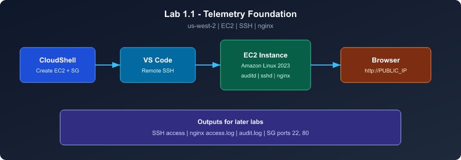

# Lab 1.1 Alternative Guide — Classroom EC2 Setup

Use this guide when the standard [Lab 1.1 instructions](1.1-Instance-Setup.md) fail at **EC2 launch**, or when your instructor directs you here for the class environment.

**Same learning goals as Lab 1.1** — only the **CloudShell EC2 creation** section is modified for training accounts in **`us-west-2`**.

---

## When to use this guide

| Symptom | Use this guide |
|---------|----------------|
| `t2.medium is not supported in ... us-west-2d` | Yes |
| Instructor says resources must stay in `us-west-2` | Yes (both guides use this region) |
| First-time setup with no errors | [Standard Lab 1.1](1.1-Instance-Setup.md) is fine |
| Wrong key, SSH errors, multiple broken instances | **Start from scratch** (section below) |

---

## Start completely from scratch (delete all + rebuild)

Use this when nothing else worked: wrong key paired with instance, multiple failed launches, or you want a clean Lab 1.1 environment.

**What it removes (AWS):** all EC2 instances using `soc-lab-key` or `soc-lab-sg`, security group `soc-lab-sg`, key pair `soc-lab-key`.

**What you must do on Windows after:** delete the old `soc-lab-key.pem` from Downloads, download the **new** key from CloudShell, update VS Code SSH config with the **new public IP**.

Run this **entire block** in CloudShell (`us-west-2`):

```bash
export AWS_PAGER=""

echo "========== STEP A: DELETE ALL LAB 1.1 RESOURCES =========="

VPC_ID=$(aws ec2 describe-vpcs \
  --filters Name=is-default,Values=true \
  --query 'Vpcs[0].VpcId' \
  --output text)

SG_ID=$(aws ec2 describe-security-groups \
  --filters Name=group-name,Values=soc-lab-sg Name=vpc-id,Values=$VPC_ID \
  --query 'SecurityGroups[0].GroupId' \
  --output text 2>/dev/null || true)

# Collect instance IDs (by lab key and/or lab security group)
INSTANCE_IDS=""
IDS_KEY=$(aws ec2 describe-instances \
  --filters Name=key-name,Values=soc-lab-key \
              Name=instance-state-name,Values=pending,running,stopping,stopped \
  --query 'Reservations[].Instances[].InstanceId' \
  --output text 2>/dev/null || true)
INSTANCE_IDS="$IDS_KEY"

if [ -n "$SG_ID" ] && [ "$SG_ID" != "None" ]; then
  IDS_SG=$(aws ec2 describe-instances \
    --filters Name=instance.group-id,Values=$SG_ID \
                Name=instance-state-name,Values=pending,running,stopping,stopped \
    --query 'Reservations[].Instances[].InstanceId' \
    --output text 2>/dev/null || true)
  INSTANCE_IDS="$INSTANCE_IDS $IDS_SG"
fi

# De-duplicate IDs
INSTANCE_IDS=$(echo $INSTANCE_IDS | tr ' ' '\n' | sort -u | grep -E '^i-' | tr '\n' ' ' | xargs)

if [ -n "$INSTANCE_IDS" ]; then
  echo "Terminating instances: $INSTANCE_IDS"
  aws ec2 terminate-instances --instance-ids $INSTANCE_IDS
  echo "Waiting for termination (about 1-2 minutes)..."
  aws ec2 wait instance-terminated --instance-ids $INSTANCE_IDS
else
  echo "No lab instances to terminate."
fi

if [ -n "$SG_ID" ] && [ "$SG_ID" != "None" ]; then
  aws ec2 delete-security-group --group-id $SG_ID && echo "Deleted security group $SG_ID" \
    || echo "Security group not deleted yet — wait 30s and run: aws ec2 delete-security-group --group-id $SG_ID"
  SG_ID=""
fi

aws ec2 delete-key-pair --key-name soc-lab-key 2>/dev/null && echo "Deleted key pair soc-lab-key" || true
rm -f soc-lab-key.pem

echo ""
echo "AWS cleanup complete."
echo "ON WINDOWS: delete old soc-lab-key.pem from Downloads before continuing."
echo ""
echo "========== STEP B: CREATE KEY, SG, AND EC2 (FRESH) =========="

aws ec2 create-key-pair \
  --key-name soc-lab-key \
  --query 'KeyMaterial' \
  --output text > soc-lab-key.pem
chmod 400 soc-lab-key.pem
echo "New key created — download soc-lab-key.pem from CloudShell now."

aws ec2 create-security-group \
  --group-name soc-lab-sg \
  --description "SOC Lab SG" || true

SG_ID=$(aws ec2 describe-security-groups \
  --filters Name=group-name,Values=soc-lab-sg Name=vpc-id,Values=$VPC_ID \
  --query 'SecurityGroups[0].GroupId' \
  --output text)

aws ec2 authorize-security-group-ingress \
  --group-id $SG_ID \
  --protocol tcp \
  --port 22 \
  --cidr 0.0.0.0/0 || true

aws ec2 authorize-security-group-ingress \
  --group-name soc-lab-sg \
  --protocol tcp \
  --port 80 \
  --cidr 0.0.0.0/0 || true

SUBNET_ID=$(aws ec2 describe-subnets \
  --filters Name=vpc-id,Values=$VPC_ID Name=default-for-az,Values=true \
  --query 'Subnets[?AvailabilityZone!=`us-west-2d`].SubnetId | [0]' \
  --output text)

if [ -z "$SUBNET_ID" ] || [ "$SUBNET_ID" = "None" ]; then
  SUBNET_ID=$(aws ec2 describe-subnets \
    --filters Name=vpc-id,Values=$VPC_ID Name=default-for-az,Values=true \
              Name=availability-zone,Values=us-west-2a,us-west-2b,us-west-2c \
    --query 'Subnets[0].SubnetId' \
    --output text)
fi

echo "Using subnet: $SUBNET_ID"
aws ec2 describe-subnets --subnet-ids $SUBNET_ID \
  --query 'Subnets[0].AvailabilityZone' --output text

AMI_ID=$(aws ssm get-parameter \
  --name /aws/service/ami-amazon-linux-latest/al2023-ami-kernel-default-x86_64 \
  --query 'Parameter.Value' \
  --output text)

INSTANCE_ID=$(aws ec2 run-instances \
  --image-id $AMI_ID \
  --instance-type t2.medium \
  --key-name soc-lab-key \
  --network-interfaces "AssociatePublicIpAddress=true,DeviceIndex=0,SubnetId=$SUBNET_ID,Groups=$SG_ID" \
  --query 'Instances[0].InstanceId' \
  --output text)

echo "Instance ID: $INSTANCE_ID"
echo "Waiting for public IP..."
sleep 20

PUBLIC_IP=$(aws ec2 describe-instances \
  --instance-ids $INSTANCE_ID \
  --query 'Reservations[0].Instances[0].PublicIpAddress' \
  --output text)

echo ""
echo "========== DONE =========="
echo "Public IP: $PUBLIC_IP"
echo "1. Download NEW soc-lab-key.pem from CloudShell to Windows Downloads"
echo "2. Update SSH config HostName to: $PUBLIC_IP"
echo "3. Connect in VS Code to SOC-Instance, then continue Lab 1.1 (nginx, etc.)"
```

### After the script — Windows checklist

1. **CloudShell** → Actions → **Download file** → `soc-lab-key.pem`
2. Delete any **old** `soc-lab-key.pem` in Downloads (avoid using the wrong file)
3. Update `C:\Users\<YOU>\.ssh\config`:
   ```text
   Host SOC-Instance
     HostName <PUBLIC_IP_FROM_SCRIPT>
     IdentityFile "C:\Users\<YOU>\Downloads\soc-lab-key.pem"
     User ec2-user
   ```
4. Fix `.pem` permissions if needed (see [SSH troubleshooting](#error-permission-denied-publickey-in-vs-code-remote-ssh))
5. Connect in VS Code and finish [Lab 1.1 steps 9–10 and nginx](1.1-Instance-Setup.md)

---

## Requirements (unchanged)

- AWS console region: **US West (Oregon) — `us-west-2`**
- VS Code with **Remote - SSH**
- Power User access (typical for student accounts)

> **Run this first in CloudShell** (once per session — stops AWS CLI from opening the `less` pager):
>
> ```bash
> export AWS_PAGER=""
> ```
>
> If you already see **"SUMMARY OF LESS COMMANDS"**, press **`q`** to return to the prompt, then run the command above.



---

## Steps 1–2 — Same as standard lab

Follow [Lab 1.1 steps 1–2](1.1-Instance-Setup.md) for:

1. Create and download `soc-lab-key.pem`
2. Save the key locally (e.g. Downloads folder)

---

## Step 3 — Create EC2 (modified subnet selection)

Run this **entire block** in **CloudShell** (`us-west-2`):

```bash
# create SG (firewall)
aws ec2 create-security-group \
  --group-name soc-lab-sg \
  --description "SOC Lab SG" || true

# get the default Virtual Private Cloud (network)
VPC_ID=$(aws ec2 describe-vpcs \
  --filters Name=is-default,Values=true \
  --query 'Vpcs[0].VpcId' \
  --output text)

# obtain the id of the SG recently created
SG_ID=$(aws ec2 describe-security-groups \
  --filters Name=group-name,Values=soc-lab-sg Name=vpc-id,Values=$VPC_ID \
  --query 'SecurityGroups[0].GroupId' \
  --output text)

# open SSH port 22 for SG
aws ec2 authorize-security-group-ingress \
  --group-id $SG_ID \
  --protocol tcp \
  --port 22 \
  --cidr 0.0.0.0/0 || true

# open http port 80 for SG
aws ec2 authorize-security-group-ingress \
  --group-name soc-lab-sg \
  --protocol tcp \
  --port 80 \
  --cidr 0.0.0.0/0 || true

# MODIFIED: avoid us-west-2d — t2.medium is often unavailable there
SUBNET_ID=$(aws ec2 describe-subnets \
  --filters Name=vpc-id,Values=$VPC_ID Name=default-for-az,Values=true \
  --query 'Subnets[?AvailabilityZone!=`us-west-2d`].SubnetId | [0]' \
  --output text)

# fallback: explicit AZs that support t2.medium
if [ -z "$SUBNET_ID" ] || [ "$SUBNET_ID" = "None" ]; then
  SUBNET_ID=$(aws ec2 describe-subnets \
    --filters Name=vpc-id,Values=$VPC_ID Name=default-for-az,Values=true \
              Name=availability-zone,Values=us-west-2a,us-west-2b,us-west-2c \
    --query 'Subnets[0].SubnetId' \
    --output text)
fi

echo "Using subnet: $SUBNET_ID"

# verify AZ before launch (must NOT be us-west-2d)
aws ec2 describe-subnets --subnet-ids $SUBNET_ID \
  --query 'Subnets[0].AvailabilityZone' --output text

# resolve latest Amazon Linux 2023 AMI for us-west-2
AMI_ID=$(aws ssm get-parameter \
  --name /aws/service/ami-amazon-linux-latest/al2023-ami-kernel-default-x86_64 \
  --query 'Parameter.Value' \
  --output text)

# create ec2 instance
INSTANCE_ID=$(aws ec2 run-instances \
  --image-id $AMI_ID \
  --instance-type t2.medium \
  --key-name soc-lab-key \
  --network-interfaces "AssociatePublicIpAddress=true,DeviceIndex=0,SubnetId=$SUBNET_ID,Groups=$SG_ID" \
  --query 'Instances[0].InstanceId' \
  --output text)

echo "Instance ID: $INSTANCE_ID"
```

### What changed vs the standard lab

| Standard lab | This alternative |
|--------------|------------------|
| Uses first default subnet (`Subnets[0]`) | Skips **`us-west-2d`** |
| No AZ check | Prints subnet AZ before launch |
| — | Fallback to **2a / 2b / 2c** if needed |

---

## Step 4 — Public IP

Wait 10–20 seconds, then:

```bash
aws ec2 describe-instances \
  --instance-ids $INSTANCE_ID \
  --query 'Reservations[0].Instances[0].PublicIpAddress' \
  --output text
```

If variables were lost, find the instance in **EC2 → Instances** and copy **Public IPv4 address**.

---

## Steps 5–10 and beyond — Same as standard lab

Continue with [Lab 1.1 from step 5](1.1-Instance-Setup.md) (VS Code SSH, terminal basics, nginx).

> **SSH config checklist before connecting:** Host name in config must match what you click in Remote Explorer (`SOC-Instance`). `User` must be **`ec2-user`**. `IdentityFile` must be the **actual path** to the `.pem` you downloaded from CloudShell — not the path from the lab if your Windows username is different (e.g. `C:\Users\Student02\Downloads\soc-lab-key.pem`).

---

## Troubleshooting

### Stuck on "SUMMARY OF LESS COMMANDS" (CloudShell pager)

**What you see:** After an AWS command (often security group setup), the terminal shows a help screen with lines like `q quit` and `SPACE next page` — you cannot paste the next command.

**Cause:** AWS CLI pipes long JSON output through **`less`**, a read-only pager.

**Fix:**

1. Press **`q`** (quit) to get your prompt back.
2. Disable the pager for this CloudShell session:

```bash
export AWS_PAGER=""
```

3. Re-run the command that failed or continue with the next lab step.

**Note:** JSON showing `"IpProtocol": "tcp"`, `"FromPort": 22`, `"CidrIpv4": "0.0.0.0/0"` means the SSH rule was created successfully — that output is expected, not an error.

### Error: `Permission denied (publickey)` in VS Code Remote SSH

**What you see:** *Could not establish connection to 'SOC-Instance': Permission denied (publickey,...)*

**Cause:** VS Code is not using the correct private key, IP, or username for your instance.

**Fix (check in order):**

1. **Confirm the `.pem` is on your PC** — download `soc-lab-key.pem` from CloudShell (Actions → Download file). It must live on your Windows machine, not only in CloudShell.

2. **Fix the path in SSH config** — open `C:\Users\<YOUR_WINDOWS_USER>\.ssh\config` and set `IdentityFile` to your real path:
   ```text
   Host SOC-Instance
     HostName YOUR_PUBLIC_IP
     IdentityFile "C:\Users\Student02\Downloads\soc-lab-key.pem"
     User ec2-user
   ```
   Replace `Student02` and the IP with your values. Use forward slashes or quoted backslashes; copy path from File Explorer (right-click → Copy as path).

3. **Match key to instance** — in **EC2 → Instances**, confirm **Key pair name** is `soc-lab-key`. If you recreated the key after launching the instance, terminate the instance and launch again with the current key.

4. **Windows key permissions** — only your user may read the `.pem`:
   - Right-click `soc-lab-key.pem` → **Properties** → **Security** → **Advanced**
   - Disable inheritance, remove extra users/groups, leave only your account with **Read**
   - Or in PowerShell (replace path):
     ```powershell
     icacls "C:\Users\Student02\Downloads\soc-lab-key.pem" /inheritance:r
     icacls "C:\Users\Student02\Downloads\soc-lab-key.pem" /grant:r "$env:USERNAME:(R)"
     ```

5. **Test outside VS Code** (PowerShell):
   ```powershell
   ssh -i "C:\Users\Student02\Downloads\soc-lab-key.pem" ec2-user@YOUR_PUBLIC_IP
   ```
   If this works, click **Retry** in VS Code. If it fails with the same error, the key path or IP is still wrong.

6. **Security group** — instance must allow SSH (port 22) from your IP or `0.0.0.0/0` (lab default).

### Error: `t2.medium is not supported in us-west-2d`

**Cause:** Subnet is in Availability Zone **us-west-2d**; many training accounts cannot run `t2.medium` there.

**Fix:** Re-run only the subnet + launch section from Step 3 above. Confirm AZ output is **`us-west-2a`**, **`us-west-2b`**, or **`us-west-2c`**.

**Manual fix (console):**

1. **VPC** → **Subnets**
2. Copy a subnet ID in **us-west-2a**, **2b**, or **2c**
3. In CloudShell:

```bash
export SUBNET_ID=subnet-xxxxxxxxxxxxxxxxx
# re-export VPC_ID, SG_ID, AMI_ID if needed, then run run-instances again
```

### Error: `InvalidGroup.NotFound` or duplicate security group rules

Usually safe to ignore if you see `|| true` on ingress rules. Confirm `echo $SG_ID` returns a value.

### Error: CloudShell region wrong

Top of CloudShell should show **Oregon**. Switch AWS console to **us-west-2** and restart CloudShell if needed.

### Variables lost after closing CloudShell

Re-run the Step 3 block from the top, or look up IDs in the console:

```bash
aws ec2 describe-instances --filters Name=instance-state-name,Values=running \
  --query 'Reservations[].Instances[].[InstanceId,PublicIpAddress,SubnetId]' \
  --output table
```

---

## Lab checkpoint (same as Lab 1.1)

- EC2 running in **`us-west-2`** with public IP
- VS Code SSH connects as **`ec2-user`**
- **`hello.sh`** runs
- **`find / -perm -4000`** includes `/usr/bin/sudo`
- **nginx** running; browser shows **SOC Lab Service Running** at `http://YOUR_PUBLIC_IP`

---

## For instructors

Share this link when participants hit the **us-west-2d / t2.medium** error or get **stuck in the CloudShell `less` pager** (`SUMMARY OF LESS COMMANDS` — have them press **`q`**, then run `export AWS_PAGER=""`). No change to Labs 1.2–2.3 once the instance is up.

**IIS-Admin:** If a student is still stuck, log into their account, confirm subnet AZ, and re-run the modified Step 3 block.

---

[← Back to Lab 1.1 standard guide](1.1-Instance-Setup.md) · [Course roadmap](README.md)
