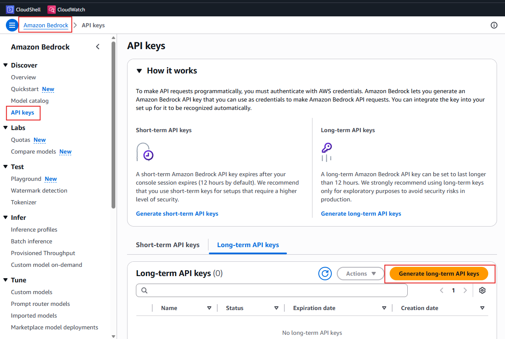

## Lab 1.2: Simulate Suspicious Activity and AI Triage

This lab bridges system administration skills into SOC-style investigation workflows. You will generate controlled suspicious activity on your Amazon Linux 2023 EC2 instance — failed SSH attempts, suspicious web requests, and a privilege escalation persistence technique — then collect evidence with journalctl and auditd. In the final step, you send those logs to **Mistral Large 3** via Amazon Bedrock and receive a structured SOC analysis. The logs you generate here also become the raw material that Day 2 streams to CloudWatch for automated detection.

### Safety Rails

- Run this lab only in your training environment.
- Do not run destructive tools, malware, or exploit frameworks.
- Keep all activity controlled and documented.
- **Never** commit, paste into chat/AI tools, or embed in lab files: Bedrock API keys, `.pem` SSH keys, instance IPs, or other credentials. Use placeholders (e.g. `YOUR_BEDROCK_API_KEY`, `YOUR_EC2_PUBLIC_IP`) in documentation and scripts.

## Attacker Objective (Cyber Lens)

Objective: Attempt initial access via SSH, probe web endpoints for common vulnerabilities, and simulate privilege escalation to generate realistic telemetry.
ATT&CK focus: T1110 (Brute Force), T1548 (Abuse Elevation Control Mechanism), T1190 (Exploit Public-Facing Application).
Defender outcome: Collect SSH, web, and privilege evidence, confirm auditd detection of a backdoor drop, and triage the full picture with AI.

## Learning Objectives

By the end of this lab, you will be able to:

1. Generate realistic, non-destructive suspicious activity for detection testing.
2. Collect and pivot Linux authentication and privilege events.
3. Set up auditd to detect privilege escalation persistence techniques.
4. Generate web request events visible in the nginx access log.
5. Use a Bedrock API key and Python to triage security logs with AI.

---

## Lab Flow


---

## Prerequisites

- Lab 1.1 complete (EC2 in `us-west-2`).
- Your EC2 instance running with nginx active.

---

## Part 1: Baseline

On your **EC2 instance**, capture the current state of both log sources before generating any suspicious activity.

> Capture baseline output in your lab notes — compare before/after in Parts 2–3.

1. Confirm the audit log is at baseline.

```bash
sudo tail -n 20 /var/log/audit/audit.log
```

2. Confirm nginx is running and the access log is at baseline.

```bash
sudo systemctl status nginx --no-pager || true
sudo tail -n 20 /var/log/nginx/access.log 2>/dev/null || true
```

---

## Part 2: Generate Controlled Suspicious Events

Run both sections below from **CloudShell**. Set your EC2 public IP first:

```bash
export PUBLIC_IP=YOUR_EC2_PUBLIC_IP
```

### A) Failed SSH Attempts (Primary Signal)

```bash
for i in {1..5}; do
  ssh -o BatchMode=yes \
      -o StrictHostKeyChecking=no \
      -o ConnectTimeout=3 \
      fakeuser@$PUBLIC_IP 2>/dev/null || true
done
```

Expected signal:
- Failed auth events in sshd logs.
- Source IP visible in the log message.

Back on your **EC2 instance**, confirm the failures were logged:

```bash
sudo journalctl -u sshd --since "10 minutes ago" --no-pager | tail -20
```

### B) Suspicious Web Requests

Probe your nginx server with paths an attacker would scan for exposed files and admin panels:

```bash
curl -s http://$PUBLIC_IP/admin > /dev/null
curl -s http://$PUBLIC_IP/login > /dev/null
curl -s http://$PUBLIC_IP/.env > /dev/null
curl -s http://$PUBLIC_IP/wp-admin > /dev/null
curl -s http://$PUBLIC_IP/config.php > /dev/null
```

You can also use your web browser instead of the `curl` command.

Back on your **EC2 instance**, confirm the requests landed in the nginx log:

```bash
sudo tail -n 20 /var/log/nginx/access.log
```

You should see five 404 entries.

---

## Part 3: Collect Evidence with journald and Audit Tools

1. Verify auditd is running.

```bash
sudo systemctl status auditd --no-pager
```

2. Clear the default audit suppression rule and watch `sudoers.d` for backdoor drops.

Amazon Linux ships with a `never,task` rule that suppresses syscall auditing for all forked processes. Remove it first or no file-watch events will appear.

```bash
# Check for the suppression rule (look for: -a never,task)
sudo auditctl -l

# Remove all loaded rules, including never,task
sudo auditctl -D

# Add a syscall-level watch on the sudoers.d directory (T1548 — Abuse Elevation Control)
sudo auditctl -a always,exit -F arch=b64 -S openat -F dir=/etc/sudoers.d/ -k sudoers_watch

# Confirm rule loaded — you should see sudoers_watch (never,task may reappear after reboot)
sudo auditctl -l
```

Simulate an attacker dropping a NOPASSWD backdoor rule:

```bash
echo "ec2-user ALL=(ALL) NOPASSWD: ALL" | sudo tee /etc/sudoers.d/lab-backdoor
```

Observe the audit event — filter to file creation only:

```bash
sudo ausearch -k sudoers_watch --start recent -i | grep -B8 "nametype=CREATE" || true
```

You should see evidence of the backdoor drop across multiple audit record types:

- A `PATH` record with `name=/etc/sudoers.d/lab-backdoor` and **`nametype=CREATE`** (file creation — the primary indicator).
- A `PROCTITLE` or `SYSCALL` record with **`comm=tee`** or `proctitle=tee /etc/sudoers.d/lab-backdoor`.
- Earlier `SYSCALL` lines with **`auid=ec2-user`** — the actual user who triggered the action, even though the command ran as root.

> `nametype=CREATE` appears on the `PATH` record, not the `SYSCALL` line. That is normal auditd behavior.

> Keep the `lab-backdoor` file and the auditd rule in place — both will be used in later labs.

3. Confirm the event is also visible in the raw audit log.

```bash
sudo grep "lab-backdoor" /var/log/audit/audit.log | grep "sudoers"
```

You should see at least one line with `nametype=CREATE` for `lab-backdoor`. Additional `nametype=NORMAL` lines may appear from later reads of the same file (e.g. `grep`, `ausearch`). This is the raw source that CloudWatch will ingest in Day 2.

---

## Part 4: AI SOC Triage

You now have two populated log sources, the audit log with privilege events and the nginx log with suspicious web requests. This part sends both to **Amazon Bedrock** using **Mistral Large 3** and receives a structured SOC analysis in seconds, without any CloudWatch setup.

### Bedrock model (Lab 1.2)

The triage script calls this model in **`us-west-2`**:

| Setting | Value |
|---------|--------|
| **Model ID** | `mistral.mistral-large-3-675b-instruct` |
| **Display name** | Mistral Large 3 (675B Instruct) |
| **Region** | `us-west-2` |
| **API** | `bedrock-runtime` → `converse()` |

**Instructors — quota increases:** AWS Console → **Service Quotas** → **Amazon Bedrock** → region **US West (Oregon)**.

You will **not** see `675b-instruct` in the quota list. That string is the **API model ID**; Service Quotas groups it under the **Mistral Large 3** product family. Request increases on these rows:

| Quota name in Service Quotas | Why it matters |
|------------------------------|----------------|
| **Model invocation max tokens per day (doubled for cross-region calls) for Mistral Large 3** | Fixes `ThrottlingException: Too many tokens per day` for `mistral.mistral-large-3-675b-instruct` |
| **On-demand model inference tokens per minute for Mistral Large 3** | Burst traffic during class |
| **On-demand model inference requests per minute for Mistral Large 3** | Concurrent student runs |

Do **not** use **Mistral AI Mistral Large** (24.02) or **Mistral Large 2407** quotas — those are for older model IDs.

**Suggested request:** raise **tokens per day** for **Mistral Large 3** to at least **500,000** (or higher for large classes) in `us-west-2`.

**Verify the model exists:** Bedrock → **Model catalog** → search **Mistral Large 3** → region **us-west-2** → model ID `mistral.mistral-large-3-675b-instruct`. Test in **Chat/Text playground** with that model before class.

### Get a Bedrock API Key

1. In the AWS console, confirm the region is **`us-west-2`** (same region as your EC2 instance from Lab 1.1).
2. Navigate to **Amazon Bedrock → API keys**.



3. On the **Long-term API keys** tab, click **Generate long-term API keys**.
4. Set expiration to **30 days** and click **Generate**. Copy and save the API key — it is shown only once.

> Save this key securely for Lab 1.2. Lab 2.1 uses CloudWatch AI (not this Bedrock key). Revoke the key when your training ends if your instructor requires it.
>
> **Do not** hardcode the key in scripts, paste it into AI chat tools, or commit it to git. Export it as an environment variable (see below). If a key is exposed, revoke it in the Bedrock console and generate a new one.

### Run the Triage Script

On your **EC2 SSH session**, create `soc_triage.py`. The script reads the API key from the environment — never embed it in the file:

```bash
cat <<'PYEOF' > ~/soc_triage.py
import boto3
import os
import sys
from pathlib import Path

token = os.environ.get("AWS_BEARER_TOKEN_BEDROCK", "").strip()
if not token:
    sys.exit("Error: export AWS_BEARER_TOKEN_BEDROCK with your Bedrock key before running.")
os.environ["AWS_BEARER_TOKEN_BEDROCK"] = token

audit_lines = Path("/var/log/audit/audit.log").read_text().splitlines()[-50:]
nginx_lines = Path("/var/log/nginx/access.log").read_text().splitlines()[-50:]

client = boto3.client("bedrock-runtime", region_name="us-west-2")

response = client.converse(
    modelId="mistral.mistral-large-3-675b-instruct",
    system=[{
        "text": (
            "You are a SOC analyst specialized in Linux endpoint security and the MITRE ATT&CK "
            "framework. When given raw security logs, analyze them for suspicious activity, map "
            "findings to MITRE ATT&CK techniques with technique IDs, assess overall risk level "
            "(High / Medium / Low) with justification, and provide a prioritized list of "
            "recommended next steps for the defender. Be concise and actionable."
        )
    }],
    messages=[{
        "role": "user",
        "content": [{
            "text": (
                f"Audit log (last 50 lines):\n{chr(10).join(audit_lines)}\n\n"
                f"Nginx access log (last 50 lines):\n{chr(10).join(nginx_lines)}"
            )
        }]
    }],
)

print(response["output"]["message"]["content"][0]["text"])
PYEOF
```

Install dependencies:

```bash
sudo dnf install pip -y

# sudo is needed because python is run with sudo below
sudo pip install boto3
```

Export your API key and run the script. Replace the placeholder below with your key at the shell prompt only — do not save the real value in the script or in this repo. Use a **single line** with no spaces or line breaks inside the key. `sudo -E` preserves the environment variable while still allowing read access to the root-only audit log:

```bash
export AWS_BEARER_TOKEN_BEDROCK='YOUR_BEDROCK_API_KEY'
sudo -E python3 ~/soc_triage.py
```

You should see a structured analysis identifying the failed SSH attempts, suspicious web paths, and the sudoers backdoor drop — with MITRE ATT&CK mappings and recommended responses.

### Troubleshooting Part 4

| Error | Cause | Fix |
|-------|-------|-----|
| `Error: export AWS_BEARER_TOKEN_BEDROCK...` | Key not set, or `sudo` dropped the variable | Run `export` first, then `sudo -E python3 ~/soc_triage.py` |
| `Invalid header value b'Bearer ...'` | Newlines or spaces in the API key from copy/paste | Re-export on one line; the script strips whitespace with `.strip()` |
| `ThrottlingException: Too many tokens per day` | Account-wide Bedrock daily token quota exhausted for Mistral Large 3 | Wait ~24 hours, ask instructor to raise **Mistral Large 3 tokens/day** in Service Quotas (`us-west-2`), or use fallback below |
| `ResourceNotFoundException` / model not found | Model ID unavailable in your account/region | In **Model catalog**, confirm `mistral.mistral-large-3-675b-instruct` in `us-west-2`. If missing, ask instructor to enable Mistral Large 3 or try `mistral.mistral-large-2402-v1:0` as a fallback |
| `AccessDeniedException` | Wrong region or revoked key | Confirm `us-west-2` in both the console and script; generate a new key if needed |

Training accounts often share a Bedrock quota across many students. If Playground shows the same throttling error, the entire account limit is exhausted — retrying the script will not help until the quota resets.

### Fallback: Manual SOC Triage

If Bedrock is unavailable due to quota limits, document a manual analysis to complete the learning objective. Use the evidence you collected in Parts 2–3:

| Finding | Evidence | MITRE ATT&CK | Severity |
|---------|----------|--------------|----------|
| Privilege escalation persistence | `lab-backdoor` created in `/etc/sudoers.d/` with `NOPASSWD: ALL`; audit `nametype=CREATE` | T1548 | High |
| Web reconnaissance | nginx 404s for `/admin`, `/.env`, `/wp-admin`, etc. | T1190 | Medium |
| SSH brute force | Failed logins for `fakeuser` in `journalctl -u sshd` | T1110 | Medium |

**Overall risk:** High — passwordless sudo persistence combined with external probing.

**Defender actions:** Remove `lab-backdoor`, validate sudoers, block repeat SSH source IPs, alert on writes to `/etc/sudoers.d/`, review nginx logs for additional scanner activity.

---

## Conclusion

You simulated a multi-vector attack — credential brute force, web reconnaissance, and privilege escalation persistence — captured it with auditd and nginx, and triaged it with Bedrock (Mistral Large 3) or a manual analysis when quota limits apply. The same logs will be streamed to CloudWatch in Day 2, where automated detection pipelines will surface the same events without any manual querying.

The audit rule and backdoor file are intentionally left in place as the starting state for Lab 2.1.

### Lab Checkpoint

Confirm before continuing:

- Failed SSH attempts appear in `journalctl -u sshd`
- Nginx access log contains 404 entries for the suspicious paths (`/admin`, `/.env`, etc.)
- `auditctl -l` shows the `sudoers_watch` rule active
- `ausearch -k sudoers_watch` returns a `PATH` record with `nametype=CREATE` for `lab-backdoor` and `comm=tee` in related records
- `grep lab-backdoor /var/log/audit/audit.log` returns a `sudoers` line with `nametype=CREATE`
- `soc_triage.py` prints a Bedrock-generated SOC analysis, **or** a manual triage write-up if Bedrock quota is exhausted (see Troubleshooting)
