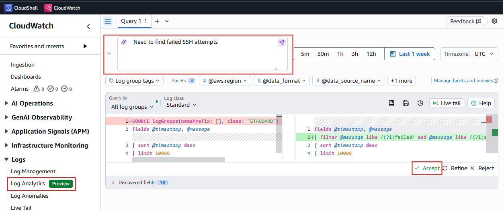
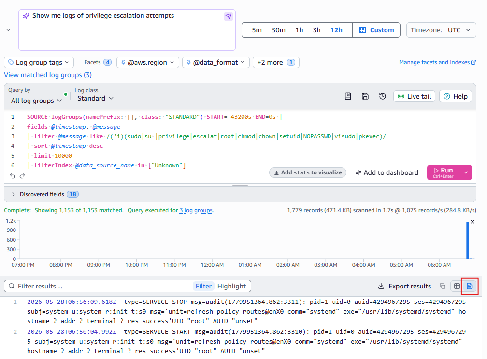
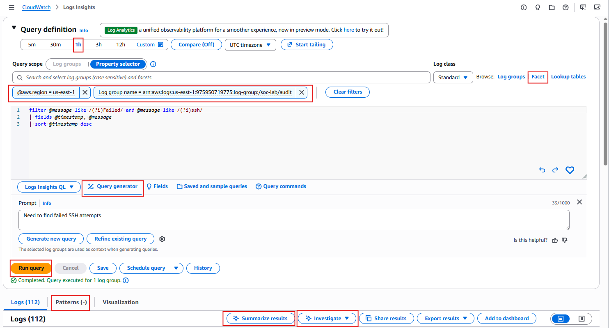
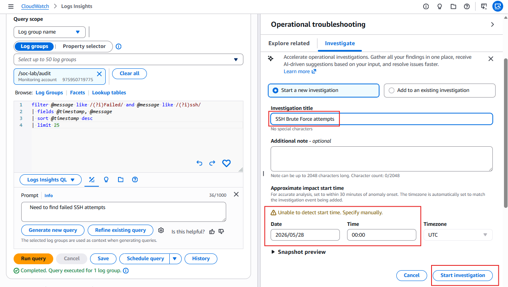

## Lab 2.1: CloudWatch Log Streaming and AI Investigation

This lab streams the endpoint logs from lab 1.2 into CloudWatch and immediately applies AI to analyze them. You will attach an IAM role to your EC2 instance, install the CloudWatch agent, and confirm both the audit and nginx logs are flowing into CloudWatch. You will then use CloudWatch Log Analytics AI to write Logs Insights queries in plain English, and CloudWatch AI Operations to run automated investigations that surface the same suspicious activity from lab 1.2 — this time without any manual querying or Python script.

## Attacker Objective (Cyber Lens)

Objective: Generate enough endpoint noise across SSH, web, and privilege channels that AI-assisted analysis is required to distinguish signal from background activity.
ATT&CK focus: T1110 (Brute Force), T1548 (Abuse Elevation Control Mechanism), T1190 (Exploit Public-Facing Application).
Defender outcome: Confirm that the audit and nginx logs from lab 1.2 flow into CloudWatch and that CloudWatch AI surfaces the high-value events without manual log grepping.

## Learning Objectives

By the end of this lab, you will be able to:

1. Grant an EC2 instance permission to call AWS services via an IAM role.
2. Install and configure the CloudWatch agent to stream OS and web logs.
3. Use CloudWatch Log Analytics AI to generate Logs Insights queries from plain English.
4. Configure CloudWatch AI Operations with a retention policy and permissions role.
5. Run AI-assisted investigations and evaluate AI-generated hypotheses as a SOC analyst.

---

## Prerequisites

- Labs 1.1, 1.2, and 1.3 complete (EC2 and logs in `us-west-2`).
- Your EC2 instance running with nginx active and audit and nginx logs present from lab 1.2.
- AWS console and CloudShell set to **US West (Oregon) — us-west-2**.

---

## Lab Pipeline


---

## Part 1: Attach IAM Role to EC2

The CloudWatch agent needs IAM credentials to push logs to CloudWatch. Run this from **CloudShell**.

### Create and attach the IAM role

```bash
export AWS_REGION=us-west-2

cat > /tmp/ec2-trust.json << 'EOF'
{
  "Version": "2012-10-17",
  "Statement": [{
    "Effect": "Allow",
    "Principal": {"Service": "ec2.amazonaws.com"},
    "Action": "sts:AssumeRole"
  }]
}
EOF

aws iam create-role \
  --role-name soc-lab-ec2-monitoring \
  --assume-role-policy-document file:///tmp/ec2-trust.json 2>/dev/null \
  || echo "Role already exists"

aws iam attach-role-policy \
  --role-name soc-lab-ec2-monitoring \
  --policy-arn arn:aws:iam::aws:policy/CloudWatchAgentServerPolicy

aws iam attach-role-policy \
  --role-name soc-lab-ec2-monitoring \
  --policy-arn arn:aws:iam::aws:policy/AmazonSSMManagedInstanceCore

aws iam create-instance-profile \
  --instance-profile-name soc-lab-ec2-monitoring 2>/dev/null \
  || echo "Instance profile already exists"

aws iam add-role-to-instance-profile \
  --instance-profile-name soc-lab-ec2-monitoring \
  --role-name soc-lab-ec2-monitoring 2>/dev/null \
  || echo "Role already in profile"
```

Attach the profile to your EC2 instance. Replace `i-REPLACE_ME` with your instance ID (find it in the [EC2 console](https://us-west-2.console.aws.amazon.com/ec2/home?region=us-west-2#Instances)):

```bash
export INSTANCE_ID=i-REPLACE_ME

aws ec2 associate-iam-instance-profile \
  --instance-id $INSTANCE_ID \
  --iam-instance-profile Name=soc-lab-ec2-monitoring \
  --region $AWS_REGION
```

---

## Part 2: Install and Configure the CloudWatch Agent

SSH into your EC2 instance.

1. Install the CloudWatch agent.

```bash
sudo dnf install -y amazon-cloudwatch-agent
```

2. Grant the `cwagent` user read access to the audit log directory.

```bash
sudo setfacl -m u:cwagent:x /var/log/audit/
sudo setfacl -m u:cwagent:r /var/log/audit/audit.log
sudo setfacl -m d:u:cwagent:r /var/log/audit/

sudo getfacl /var/log/audit/audit.log
```

Expected: a `user:cwagent:r--` line in the output. The nginx logs are world-readable and need no ACL changes.

3. Write the agent config to collect both log sources.

```bash
sudo tee /opt/aws/amazon-cloudwatch-agent/etc/amazon-cloudwatch-agent.json << 'EOF'
{
  "logs": {
    "logs_collected": {
      "files": {
        "collect_list": [
          {
            "file_path": "/var/log/audit/audit.log",
            "log_group_name": "/soc-lab/audit",
            "log_stream_name": "{instance_id}"
          },
          {
            "file_path": "/var/log/nginx/access.log",
            "log_group_name": "/soc-lab/nginx",
            "log_stream_name": "{instance_id}"
          }
        ]
      }
    }
  }
}
EOF
```

4. Validate and start the agent.

```bash
sudo /opt/aws/amazon-cloudwatch-agent/bin/amazon-cloudwatch-agent-ctl \
  -a fetch-config \
  -m ec2 \
  -c file:/opt/aws/amazon-cloudwatch-agent/etc/amazon-cloudwatch-agent.json
```

If you see `Configuration validation succeeded` at the bottom, proceed to the next commands.

``` bash
sudo systemctl enable --now amazon-cloudwatch-agent
sudo systemctl status amazon-cloudwatch-agent --no-pager
```

5. Verify both log groups were created. Run from **CloudShell** (wait 1–2 minutes after starting the agent).

```bash
aws logs describe-log-groups \
  --log-group-name-prefix /soc-lab \
  --region $AWS_REGION \
  --query 'logGroups[].logGroupName'
```

Expected: `["/soc-lab/audit", "/soc-lab/nginx"]`.

If you get `[]`, generate a log entry (`sudo ls /root` on the instance), wait 30 seconds, and retry. The log group is created on first write.

---

## Part 3: Query Logs with Natural Language

CloudWatch Log Analytics includes an AI-powered natural language interface that writes Logs Insights queries for you.

> **Region:** Confirm the console shows **United States (Oregon) / us-west-2** before opening CloudWatch.

### How to open the query editor (Part 3)

The **query editor** is the large text area with a multi-line query and an orange **Run** button. Above it you should see **Ask AI to write a query** (or **Query Generator**).

**Option A — left navigation (try first):**

1. Open **CloudWatch** (search “CloudWatch” in the AWS console top bar).
2. In the left menu, expand **Logs** (or **Logs and metrics**).
3. Click **Log Analytics** or **Logs Insights** (AWS may show either name — both open the query editor).
4. You should land on a page titled **Logs Insights** or **Log Analytics** with an empty or sample query and **Run** on the right.

**Option B — direct link (if the menu is confusing):**

Paste this in the browser address bar (while logged in, region Oregon):

```text
https://us-west-2.console.aws.amazon.com/cloudwatch/home?region=us-west-2#logsV2:logs-insights
```

**Option C — from a log group:**

1. **CloudWatch** → **Logs** → **Log groups**
2. Check **`/soc-lab/audit`**
3. Click **Query** or **View in Logs Insights** (wording varies)

**You are in the wrong place if** you only see a list of log streams with no query box — go back and use Option A or B.



### Run the SSH query

1. In the **Ask AI to write a query** bar, enter:

   ```
   Need to find failed SSH attempts
   ```

2. Accept the generated query. Review which fields it filters on before running.

3. **Select log groups:** click **Log groups** (or the log group picker) and select **only** **`/soc-lab/audit`**. Uncheck “all log groups” or other groups — do not use `namePrefix: []` (all groups).

4. Set time range to **1 week**, then click **Run** (or **Run query**).

5. Review results. **Few or zero SSH failures in `/soc-lab/audit` is normal** — Lab 1.2 SSH brute force is logged in **journald** on the instance, not in `audit.log`. CloudWatch only streams `audit.log` and `nginx` access logs. Use the privilege-escalation query below for strong audit signal (`lab-backdoor`).

6. Try a second prompt on **`/soc-lab/audit`**, same time range:

   ```
   Show me logs of privilege escalation attempts
   ```

   You should see `lab-backdoor` / `sudoers` activity from Lab 1.2.

7. Optional — web recon on **`/soc-lab/nginx`**:

   ```
   Show nginx 404 errors for admin or env paths
   ```

   > Use the file view to read the full message from the log output as shown below.



### Troubleshooting — “I can’t find the query editor”

| Symptom | Fix |
|---------|-----|
| Only see **Log groups** list, no query box | Use **Logs** → **Log Analytics** / **Logs Insights**, or the direct link above |
| Left menu shows **AI Operations** but no **Logs** | Scroll the CloudWatch left nav; **Logs** is a separate section above AI Operations |
| Inside **AI Operations → Investigations** with no query | That is **Part 4**. For Part 3, open **Logs Insights** first (Option A/B) |
| Query runs but 0 results | Confirm **`/soc-lab/audit`** is selected; widen time range to **1 week**; verify agent is running (Part 2) |
| SSH query returns almost nothing | Expected for audit log — run the **privilege escalation** prompt on `/soc-lab/audit` |

---

## Part 4: Configure AI Operations and Run Investigations

AI Operations must be enabled at the account level before investigations can be created. This step sets retention and provisions the permissions role.

### Enable AI Operations

1. In the CloudWatch left nav, click **AI Operations**.

2. Click **Configurations**.

3. If AI Operations has not been enabled, you will see an **Enable** or **Get started** prompt. Proceed through it.

4. Set **Investigation retention period** to **7 days**.

   > Investigations older than the retention period are automatically deleted. 7 days is sufficient for a lab environment and avoids unnecessary storage costs.

5. For the IAM role, select **Auto-create a new role with default investigation permissions**.

   > The auto-created role grants CloudWatch read access to your logs, metrics, and alarms within the account. It does not grant write access to any resources. You can inspect the role in IAM after creation — it will be named something like `CloudWatchAIOperationsRole`.

6. Click **Save** or **Enable**.

### Run Investigations

> **Query editor in Part 4:** You get the same style of editor **inside** an investigation — **Query Generator** at the top, multi-line query, orange **Run**. If you only see investigation list with no editor, click **Create investigation** first.

1. In the CloudWatch left nav, click **AI Operations** → **Investigations** → **Create investigation**.

2. Select **From logs Insights** as the investigation source.

3. If a helper query panel opens on the right side, close it by clicking the **X** in the top-right corner of that panel. You should see the main query editor (same layout as Part 3).

4. In **Query Generator** (or **Ask AI to write a query**), enter:

   ```
   Need to find failed SSH attempts
   ```

5. Select **only** **`/soc-lab/audit`** as the log group, set time range to **1 day**, select **`aws.region`** as the **Facet**, and click **Run**. The Facet is required — without it the observation may fail to attach to the investigation.

   > Few SSH hits in audit log is OK (see Part 3). For a stronger investigation signal, you can instead use: `Find privilege escalation using sudo` on `/soc-lab/audit`.



6. Click the patterns tab then the **investigate -> start new investigation** button. Give the investigation a relevant name. You may need to provide a start date and time if it does not detect it.

   ```
   failed ssh attempts
   ```



7. CloudWatch AI will analyze the results and generate hypotheses. For each hypothesis:
   - What conclusion did the AI reach? (e.g., likely misconfiguration, not an active threat)
   - What evidence did it cite to support that conclusion?
   - Do you agree with the assessment based on what you know about the activity that generated these logs?

   > A hypothesis of "likely misconfiguration from localhost" is a meaningful finding — it tells you the alert is low-priority and rules out active credential stuffing from an external source. Not every AI finding is an escalation; ruling things out is equally valuable.

8. Create a second investigation for a different threat angle:

   ```
   Find privilege escalation using sudo
   ```

   Compare the hypotheses CloudWatch generates for this vs. the SSH investigation.

9. When you open an investigation, an AI agent starts running immediately to analyze the data and form hypotheses. Allow a few minutes for it to finish, you will see a progress indicator while it works.

   Once the agent completes, review the investigation:

   - **Summary** — what triggering signal did the AI identify?
   - **Hypotheses** — the AI will offer one or more candidate explanations. Read each one and select the hypothesis that best matches what you know about the activity. For example, a hypothesis of "likely misconfiguration from localhost" tells you the activity is low-priority and rules out active credential stuffing from an external source — ruling things out is equally valuable to escalating.
   - **Key findings** — note any linked log events, related metrics, or correlated alarms. If something is missing that you would expect, note the gap.
   - **Suggested actions** — the AI may or may not recommend follow-up steps. If no action is suggested, that is not an error: it means the AI did not identify active compromise requiring remediation. This is a valid and common outcome for simulated or low-severity activity.

   After reviewing, write a brief incident report in the investigation notes:
   - What triggered the investigation
   - Which hypothesis you selected and why
   - Whether the finding is a real threat, a misconfiguration, or expected lab activity
   - What you would do next if this were a real incident

   Then close the investigation. In the **Investigations** tab, select the investigation, click the **three-dot menu** (⋮), and choose **Close investigation**. Enter a reason when prompted:

   - SSH investigation: `Confirmed localhost misconfiguration, not an active threat`
   - Sudo investigation: `Expected controlled lab activity, no escalation detected`

   > Closing with a reason is good hygiene — it keeps the list clean and creates an audit trail of analyst decisions.

---

## Conclusion

You streamed endpoint security logs from your EC2 instance into CloudWatch and immediately applied AI to analyze them. The same suspicious activity from lab 1.2 is now surfaced by CloudWatch's built-in AI — no manual query writing required. This automated pipeline is the foundation for the dashboard and alarm system in lab 2.2.

### Lab Checkpoint

Confirm before continuing:

- CloudWatch log groups `/soc-lab/audit` and `/soc-lab/nginx` both exist and contain events
- CloudWatch agent status shows `active (running)`
- At least two natural language queries run in Log Analytics against `/soc-lab/audit`
- AI Operations is enabled with 7-day retention
- At least two investigations created (SSH failures, sudo escalation)
- Both investigations closed with a documented reason
