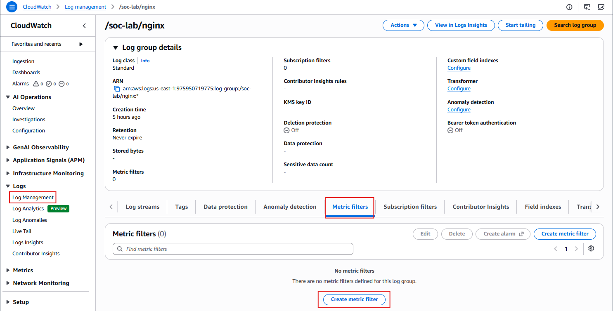
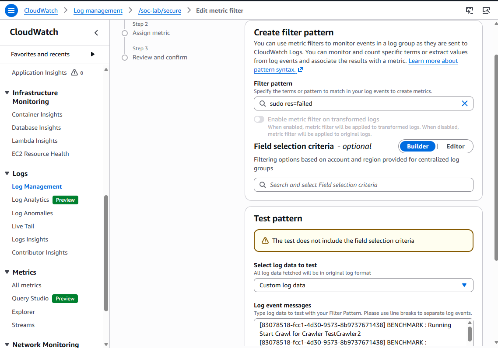
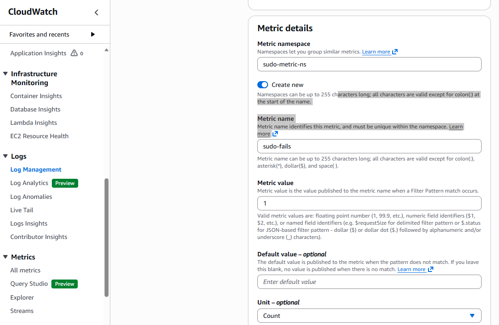
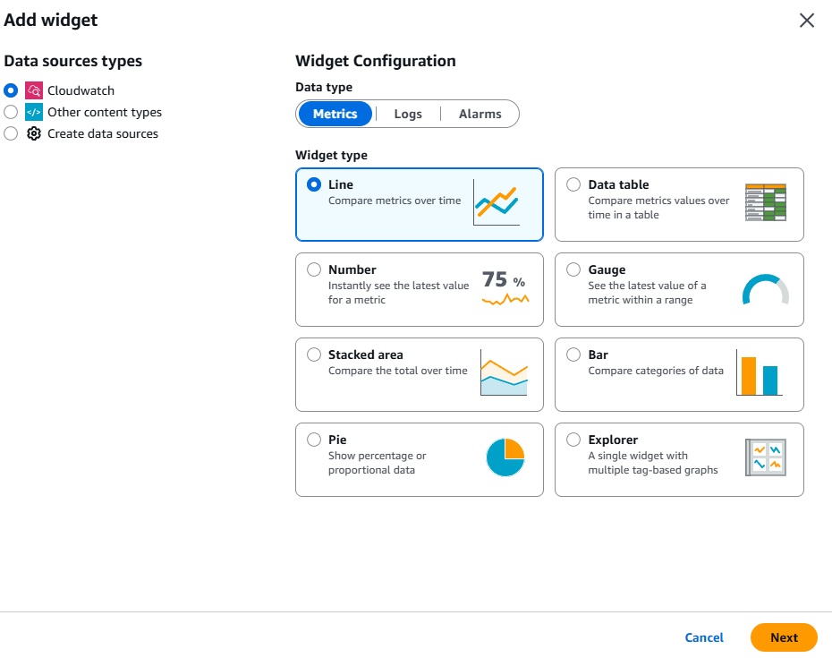
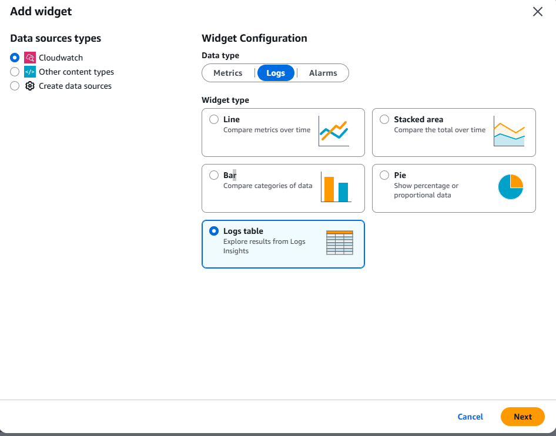
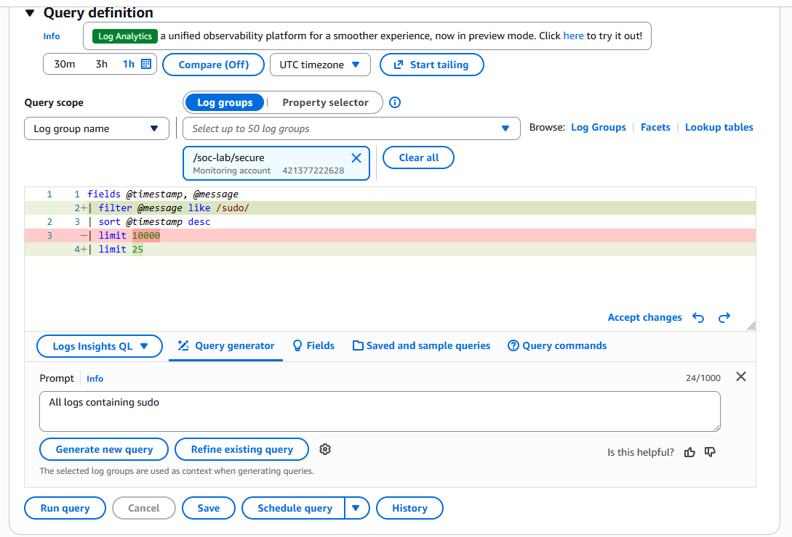
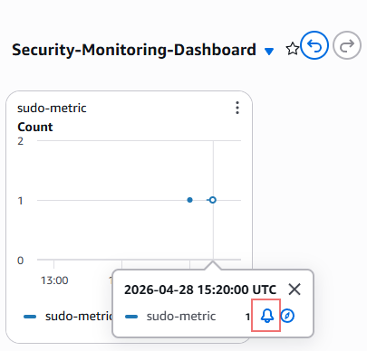

## Lab 2.2: Security Monitoring Dashboard and Automated Detection

This lab builds a live detection system around the web reconnaissance signal from lab 1.2. Attackers probing a web server for exposed files and admin panels generate a distinctive pattern in nginx logs: a burst of 404 responses from a single source IP, hitting paths no legitimate user would request. You will create a metric filter to count these events, build a CloudWatch dashboard with seven analyst-focused queries, configure an alarm, and wire it to an AI Operations investigation that triggers automatically when the threshold is breached.

## Attacker Objective (Cyber Lens)

Objective: Probe the web server for exposed endpoints and admin panels to identify attack surface before exploitation.
ATT&CK focus: T1190 (Exploit Public-Facing Application), T1595.002 (Active Scanning — Vulnerability Scanning).
Defender outcome: Confirm that web scan events are counted, visualized, alarmed, and routed to AI triage without manual intervention.

## Learning Objectives

By the end of this lab, you will be able to:

1. Create a CloudWatch metric filter to count security-relevant log patterns.
2. Build a multi-widget CloudWatch dashboard using Logs Insights queries.
3. Configure a CloudWatch alarm on a custom log metric.
4. Wire an alarm action to automatically trigger an AI Operations investigation.
5. Re-run a web probe from CloudShell to generate fresh detection signal.

---

## Prerequisites

- Labs 1.1, 1.2, and 2.1 complete (CloudWatch log groups in `us-west-2`).
- CloudWatch log groups `/soc-lab/audit` and `/soc-lab/nginx` active and ingesting logs.
- AWS Console access in `us-west-2`.
- SSH access to your `soc-lab` EC2 instance.

---

## Part 1: Create the Metric Filter

A metric filter tells CloudWatch to watch every log event in a log group and increment a custom metric counter when it matches a pattern. You will count every nginx 404 response — the fingerprint of a web reconnaissance scan.

1. In the AWS Console, navigate to **CloudWatch** → **Logs Management**.

2. Click **/soc-lab/nginx**.

3. Click the **Metric filters** tab, then click **Create metric filter**.

   

4. For **Filter pattern**, enter:

   ```
   [host, logName, user, timestamp, request, statusCode=4*, size]
   ```

   This matches any nginx access log line where the status code field has a client error.

   

5. Before saving, test the pattern. In the **Test pattern** section, click **Select log data to test** and pull recent log events from the log group. Run the test — the 404 lines from lab 1.2's curl probe should match immediately and be highlighted.

6. Click **Next**.

7. Set the following:
   - **Filter name**: `nginx-scan-attempts`
   - **Metric namespace**: `SOCLab`
   - **Metric name**: `WebScanAttempts`
   - **Metric value**: `1`
   - **Default value**: `0`
   - **Unit**: `Count`
   - **Dimensions:** `Select region and account`

   

8. Click **Next**, review, then click **Create metric filter**.

---

## Part 2: Generate Fresh Signal

Re-run the web probe from **CloudShell** to populate fresh events that the dashboard and alarm can react to. Set your EC2 public IP first:

```bash
export PUBLIC_IP=YOUR_EC2_PUBLIC_IP

curl -s http://$PUBLIC_IP/admin > /dev/null
curl -s http://$PUBLIC_IP/login > /dev/null
curl -s http://$PUBLIC_IP/.env > /dev/null
curl -s http://$PUBLIC_IP/wp-admin > /dev/null
curl -s http://$PUBLIC_IP/config.php > /dev/null
```

Back on your **EC2 instance**, confirm the events landed:

```bash
sudo tail -n 10 /var/log/nginx/access.log
```

You should see five fresh 404 entries with your CloudShell IP as the source.

---

## Part 3: Build the Dashboard

Navigate to **CloudWatch** → **Dashboards** → **Create dashboard** and name it `soc-lab-web-monitor`.

For each widget below: click **Add widget**, select the chart type and source as specified, then configure the query or metric. When building each widget, **do not enable "Persist time range"** — leave it off so the dashboard time range control applies globally.

---

### Widget 1 — Web Scan Count (Line Chart)

**Type**: Metrics → Line



In the metric browser, navigate to **SOCLab** → **WebScanAttempts**. Select it.

Under **Graphed metrics**:
- Statistic: **Sum**
- Period: **5 minutes**


Title: `Web Scan Count`

---

### Widget 2 — All 404 Requests (Logs Table)

**Type**: Logs table



Log group: `/soc-lab/nginx`

Query:
```
fields @timestamp, @message
| filter @message like " 404 "
| sort @timestamp desc
| limit 50
```

Title: `All 404 Requests`

---

### Widget 3 — Top Scanned Paths (Bar Chart)

**Type**: Bar chart

Log group: `/soc-lab/nginx`

Query:
```
fields @message
| filter @message like " 404 "
| parse @message '"* * HTTP' as method, uri
| stats count(*) as hits by uri
| sort hits desc
| limit 20
```

Title: `Top Scanned Paths`

---

### Widget 4 — Source IPs with Most 404s (Logs Table)

**Type**: Logs table

Log group: `/soc-lab/nginx`

Query:
```
fields @message
| filter @message like " 404 "
| parse @message /(?<ip>\d+\.\d+\.\d+\.\d+)/
| stats count(*) as requests by ip
| sort requests desc
```

Title: `Source IPs`

---

### Widget 5 — Request Timeline (Logs Table)

**Type**: Logs table

Log group: `/soc-lab/nginx`

Query:
```
fields @timestamp, @message
| filter @message like " 404 "
| sort @timestamp asc
| limit 100
```

Title: `404 Timeline`

---

### Widget 6 — Full Request Detail (Logs Table)

**Type**: Logs table

Log group: `/soc-lab/nginx`

Query:
```
fields @timestamp, @message
| filter @message like " 404 "
| parse @message /(?<ip>\d+\.\d+\.\d+\.\d+) - - \[.*?\] "(?<method>\S+) (?<uri>\S+) [^"]*" (?<status>\d+) (?<bytes>\S+)/
| display @timestamp, ip, method, uri, status, bytes
| sort @timestamp desc
| limit 50
```

Title: `Request Detail`

---

### Widget 7 — Additional Exploration

Use the **Query Generator** (Ask AI to write a query) to create at least one additional widget. Try a prompt like:

```
Show me web requests that look like directory traversal or admin panel scanning
```

Review the query the AI generates before running it. Use your judgment on chart type.



Title: your choice.

---

## Part 4: Create the Alarm

1. In the dashboard, hover over the **Web Scan Count** line chart widget. A bell icon or **Create alarm** option will appear — click it.

   

   > If you do not see the option on hover, navigate directly to **CloudWatch** → **Alarms** → **Create alarm** → **Select metric** → **SOCLab** → **WebScanAttempts**.

2. Configure the alarm conditions:
   - **Statistic**: Sum
   - **Period**: 1 minute
   - **Threshold type**: Static
   - **Condition**: Greater than or equal to `3`

3. Click **Next** to configure actions.

4. Under **Alarm state trigger**, select **In alarm**.

5. Add an **SNS notification** (optional):
   - Create a new SNS topic named `soc-lab-alerts`
   - Add your email address if you want to receive alert emails
   - If you skip the email, the topic still exists for future use

6. Add an **AI Operations investigation** action:
   - Look for the investigation action type in the actions panel
   - This automatically creates an AI Operations investigation when the alarm fires — no manual step required

7. Under **Alarm description**, write something like:

   ```
   Detected 3 or more 4**04** responses within a 1-minute window on /soc-lab/nginx.
   Possible web reconnaissance scan. Review the soc-lab-web-monitor dashboard and
   the auto-triggered AI investigation for triage.
   ```

8. Name the alarm `web-scan-alarm` and click **Create alarm**.

9. Re-run the curl probe from CloudShell to trigger the alarm:

   ```bash
   for i in {1..3}; do
     curl -s http://$PUBLIC_IP/admin > /dev/null
     curl -s http://$PUBLIC_IP/.env > /dev/null
     curl -s http://$PUBLIC_IP/wp-admin > /dev/null
   done
   ```

   Within 1–2 minutes the alarm should transition to **In alarm** and an AI Operations investigation should open automatically.

---

## Part 5: Add Privilege Persistence Detection on the Audit Log

The nginx alarm covers web reconnaissance. This part adds a second alarm on `/soc-lab/audit` for the highest-severity event from lab 1.2: a file write to `/etc/sudoers.d/`. Any write there — legitimate or malicious — should generate an immediate alert with no rate threshold.

### Create the Metric Filter

1. In the AWS Console, navigate to **CloudWatch** → **Logs** → **Log groups**.

2. Click **/soc-lab/audit**.

3. Click the **Metric filters** tab, then click **Create metric filter**.

4. For **Filter pattern**, enter:

   ```
   nametype=CREATE sudoers
   ```

   This matches audit events where a file was created inside `/etc/sudoers.d/` — the `nametype=CREATE` field distinguishes an actual file write from a read or stat. Using only `key=sudoers_watch` would match legitimate reads as well; this pattern isolates the dangerous operation.

5. Test the pattern. Click **Select log data to test** and pull recent events — the CREATE event from the `lab-backdoor` drop in lab 1.2 should match immediately.

6. Click **Next** and set:
   - **Filter name**: `sudoers-modified`
   - **Metric namespace**: `SOCLab`
   - **Metric name**: `SudoersModified`
   - **Metric value**: `1`
   - **Default value**: `0`

7. Click **Next**, review, then click **Create metric filter**.

### Create the Alarm

1. Navigate to **CloudWatch** → **Alarms** → **Create alarm** → **Select metric** → **SOCLab** → **SudoersModified**.

2. Configure:
   - **Statistic**: Sum
   - **Period**: 1 minute
   - **Condition**: Greater than or equal to `1`

   > Unlike the web scan alarm, the threshold is 1 — any write to sudoers.d is suspicious by definition.

3. Add an **AI Operations investigation** action on **In alarm** state.

4. Under **Alarm description**, write:

   ```
   A file was written to /etc/sudoers.d/ on the monitored EC2 instance.
   This may indicate a privilege escalation persistence attempt (T1548).
   Review the auto-triggered AI investigation immediately.
   ```

5. Name the alarm `sudoers-alarm` and click **Create alarm**.

### Add a Dashboard Widget and Trigger

1. Open the `soc-lab-web-monitor` dashboard and click **Add widget**.

2. Add a **Logs table** widget with log group `/soc-lab/audit` and this query:

   ```
   fields @timestamp, @message
   | filter @message like "nametype=CREATE" and @message like "sudoers"
   | sort @timestamp desc
   | limit 20
   ```

   Title: `Sudoers Modifications`

3. On your **EC2 instance**, re-drop the backdoor file to generate a fresh audit event and trigger the alarm:

   ```bash
   echo "ec2-user ALL=(ALL) NOPASSWD: ALL" | sudo tee /etc/sudoers.d/lab-backdoor
   ```

   Within 1–2 minutes `sudoers-alarm` should transition to **In alarm** and an AI Operations investigation should open automatically.

---

## Conclusion

You built two detection pipelines from lab 1.2 evidence — one watching nginx for web reconnaissance, one watching auditd for privilege persistence. Both feed CloudWatch alarms that trigger AI investigations automatically, covering both log streams end-to-end with no manual intervention.

### Lab Checkpoint

Confirm before continuing:

- Metric filter `nginx-scan-attempts` exists on `/soc-lab/nginx`
- Metric filter `sudoers-modified` exists on `/soc-lab/audit`
- Dashboard `soc-lab-web-monitor` has all 7 + 1 widgets and displays data
- Alarm `web-scan-alarm` transitioned to **In alarm** after the curl probe
- Alarm `sudoers-alarm` transitioned to **In alarm** after the backdoor drop
- Both alarms triggered AI Operations investigations automatically
- SNS topic `soc-lab-alerts` exists (email subscription optional)
