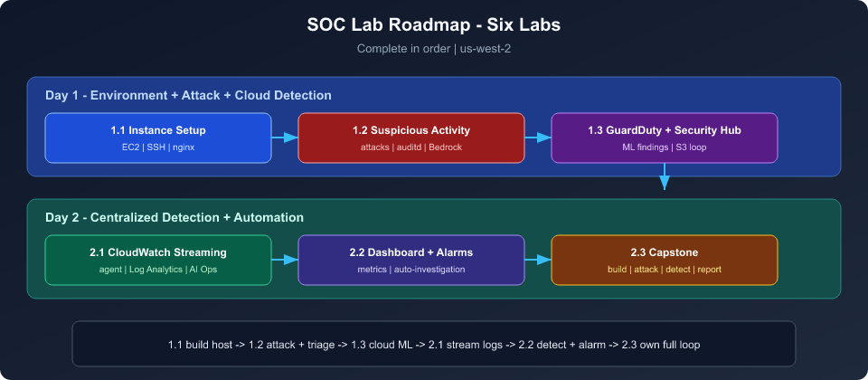
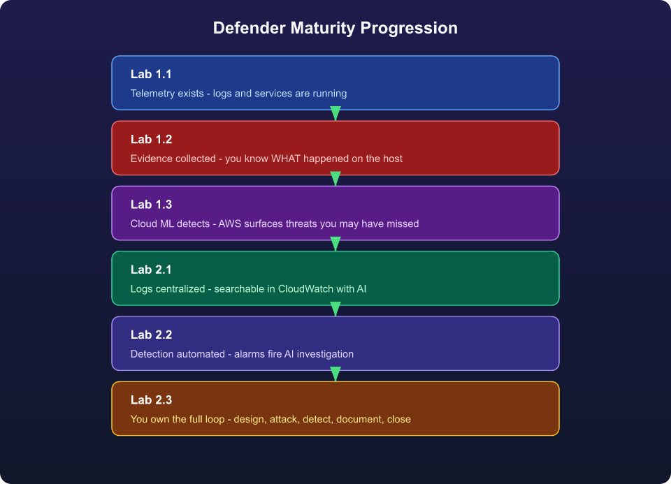
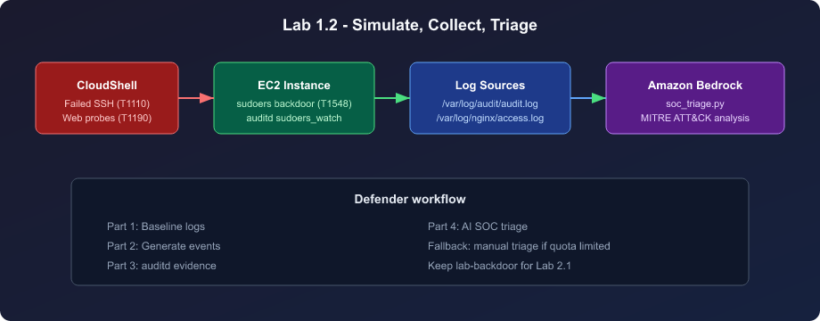
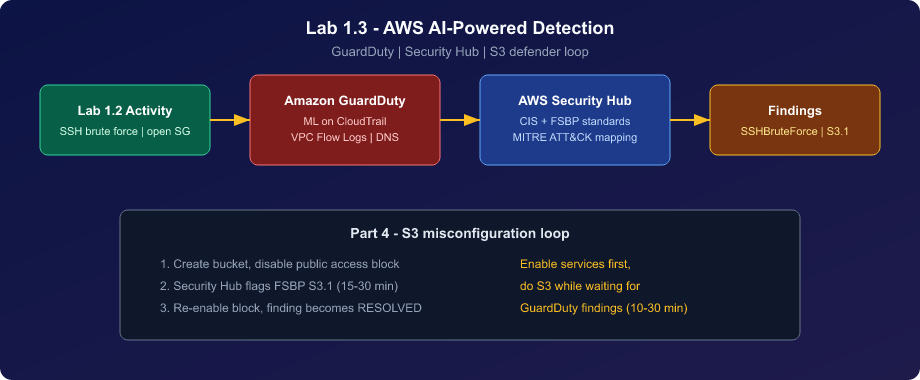
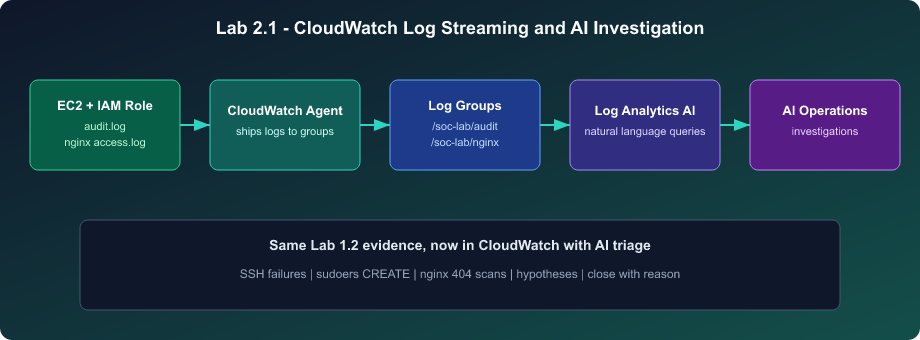
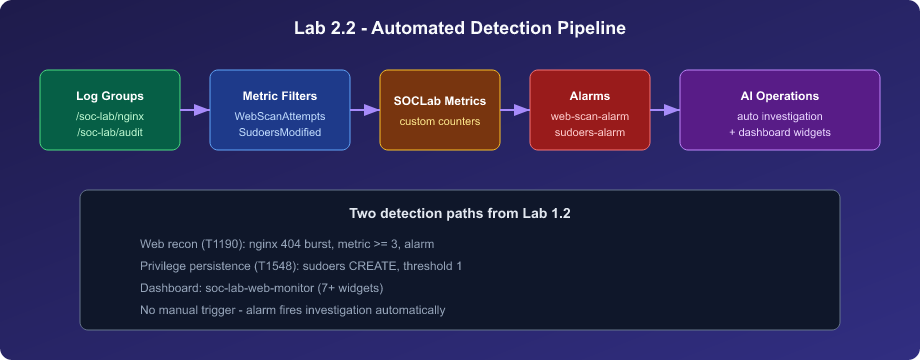
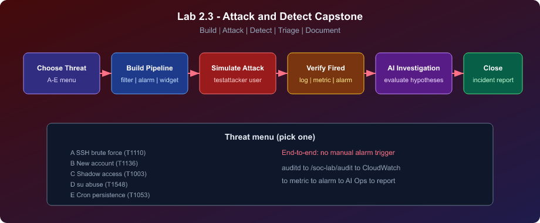
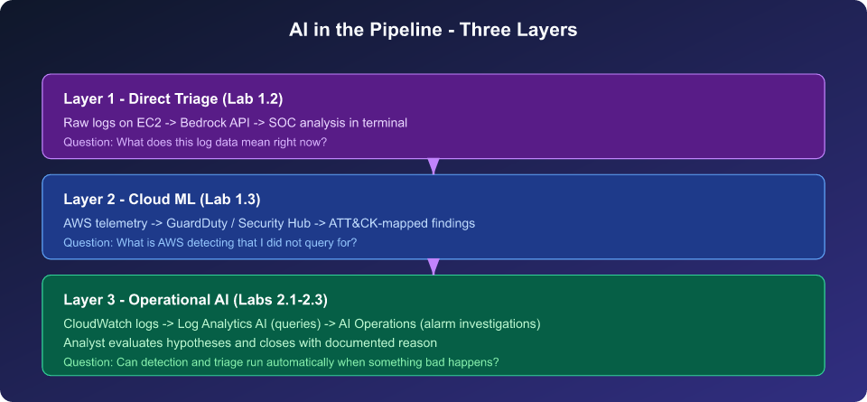

# SOC Lab Roadmap — AI in Cybersecurity

Six hands-on labs that take you from a bare EC2 instance to a working mini-SOC: endpoint telemetry, simulated attacks, AWS-native ML detection, centralized logging, automated alarms, and AI-driven triage. Complete them **in order** — each lab reuses artifacts from the previous one.

**Region:** `us-west-2` (US West Oregon) for all AWS work.

---

## The Big Picture

You play **both attacker and defender**. On Day 1 you build the environment, generate realistic suspicious activity, triage it manually (with AI), and turn on AWS-managed threat detection. On Day 2 you centralize logs in CloudWatch, build detection pipelines, wire alarms to AI investigations, and prove the full loop works end-to-end in a capstone.



---

## Concept Flow — What You Learn at Each Stage

| Stage | Core question | Primary skills | Key tools |
|-------|---------------|----------------|-----------|
| **Foundation** | Can we access and instrument a Linux host? | EC2, SSH, Linux permissions, web services | CloudShell, VS Code Remote SSH, nginx |
| **Endpoint evidence** | What did the attacker do on the host? | Log collection, audit rules, manual triage | journalctl, auditd, nginx logs, Bedrock |
| **Cloud-native detection** | What does AWS see without agents on the box? | ML threat detection, compliance posture | GuardDuty, Security Hub, S3 |
| **Log centralization** | How do we get host logs into one place? | IAM roles, log shipping, AI query generation | CloudWatch agent, Log Analytics |
| **Detection engineering** | How do we alert without a human watching logs? | Metric filters, dashboards, alarm actions | CloudWatch metrics, alarms, AI Operations |
| **SOC workflow** | Can we detect, investigate, and close an incident? | Pipeline design, hypothesis evaluation, reporting | Full stack from 2.1–2.2, applied independently |

---

## Defender Maturity — How Each Lab Builds on the Last



---

## Lab-by-Lab Guide

### [1.1 — Instance Setup](1.1-Instance-Setup.md)

**Role in roadmap:** Foundation. Nothing else works without a running host and logs.

| | |
|---|---|
| **You build** | EC2 instance, security group (ports 22/80), SSH key, nginx web service |
| **Concepts** | Cloud networking basics, key-based SSH, Linux file permissions, SetUID risk |
| **ATT&CK lens** | T1021 Remote Services, T1078 Valid Accounts |
| **Carries forward** | EC2 public IP, `soc-lab-key.pem`, nginx access logs, auditd baseline |


---

### [1.2 — Suspicious Activity Simulation and AI Triage](1.2-Suspicious-Activity-Simulation-and-AI-Triage.md)

**Role in roadmap:** First full attack/defend cycle at the **endpoint** — generate signal, collect evidence, triage with AI.

| | |
|---|---|
| **You simulate** | SSH brute force (CloudShell), web path scanning (curl/browser), sudoers backdoor drop |
| **You collect** | `journalctl` (SSH), nginx access log (404s), auditd (`sudoers_watch`, CREATE events) |
| **You triage** | `soc_triage.py` → Amazon Bedrock (MITRE mapping, risk rating, actions) |
| **ATT&CK lens** | T1110 Brute Force, T1190 Exploit Public-Facing Application, T1548 Abuse Elevation Control |
| **Carries forward** | Populated audit/nginx logs, `lab-backdoor` file, audit rule — **leave these in place for Day 2** |



---

### [1.3 — AWS AI-Powered Threat Detection](1.3-AWS-AI-Powered-Threat-Detection.md)

**Role in roadmap:** Shift from **host logs** to **cloud-native ML detection** — no agents, no custom rules.

| | |
|---|---|
| **You enable** | GuardDuty (VPC flow, CloudTrail, DNS analysis), Security Hub (CIS + FSBP) |
| **You observe** | Findings from Lab 1.2 activity (e.g. SSHBruteForce), posture issues (open SG, MFA) |
| **You practice** | S3 misconfiguration loop: create risk → Security Hub S3.1 → remediate → RESOLVED |
| **ATT&CK lens** | T1110, T1548 (cloud-layer view of same activity) |
| **Carries forward** | GuardDuty and Security Hub running continuously in your account |

> **Timing:** Findings can take 10–30 minutes. Enable services first, do the S3 exercise while waiting.



---

### [2.1 — CloudWatch Log Streaming and AI Investigation](2.1-CloudWatch-Log-Streaming-and-AI-Investigation.md)

**Role in roadmap:** Bridge Day 1 endpoint logs to **centralized, AI-assisted analysis** in CloudWatch.

| | |
|---|---|
| **You build** | IAM instance profile, CloudWatch agent, log groups `/soc-lab/audit` and `/soc-lab/nginx` |
| **You use AI** | Log Analytics (natural-language queries), AI Operations (investigations + hypotheses) |
| **Concepts** | IAM roles for EC2, log ACLs, analyst evaluation of AI output (not blind trust) |
| **ATT&CK lens** | Same T1110 / T1548 / T1190 — now visible in CloudWatch instead of raw grep |
| **Carries forward** | Streaming logs, AI Operations enabled, closed investigations with documented reasons |



---

### [2.2 — Security Monitoring Dashboard and Automated Detection](2.2-Security-Monitoring-Dashboard-and-Automated-Detection.md)

**Role in roadmap:** **Detection engineering** — turn log patterns into metrics, dashboards, and self-triggering AI investigations.

| | |
|---|---|
| **Pipeline A (web)** | nginx 404 pattern → metric `WebScanAttempts` → alarm `web-scan-alarm` → AI Ops |
| **Pipeline B (privilege)** | audit `nametype=CREATE sudoers` → metric `SudoersModified` → alarm `sudoers-alarm` → AI Ops |
| **You build** | Dashboard `soc-lab-web-monitor` (7+ widgets), optional SNS topic |
| **ATT&CK lens** | T1190, T1595.002 Active Scanning, T1548 |
| **Carries forward** | Metric filters, alarms, dashboard — reused and extended in 2.3 |



---

### [2.3 — Attack and Detect Capstone](2.3-Attack-and-Detect-Capstone.md)

**Role in roadmap:** **Synthesis** — you design the detection, run the attack, and close the incident without step-by-step hand-holding.

| | |
|---|---|
| **You choose** | One threat from the menu (SSH brute force, new account, shadow access, su abuse, cron persistence) |
| **You build** | Metric filter + alarm + dashboard widget for your threat |
| **You prove** | auditd → CloudWatch → metric → alarm → AI investigation → incident report → close |
| **Deliverable** | Structured incident report with timeline, raw log evidence, and disposition |
| **ATT&CK lens** | Depends on threat (T1110, T1136, T1003, T1548, or T1053) |



---

## Artifact Chain — What Persists Between Labs

| Artifact | Created in | Used in |
|----------|------------|---------|
| EC2 instance + public IP | 1.1 | All labs |
| nginx + access logs | 1.1 | 1.2, 2.1, 2.2 |
| Failed SSH + web probe events | 1.2 | 1.3 (GuardDuty), 2.1 (CloudWatch) |
| `/etc/sudoers.d/lab-backdoor` + audit rule | 1.2 | 2.1, 2.2 (sudoers alarm) |
| GuardDuty + Security Hub | 1.3 | Ongoing cloud detection |
| CloudWatch log groups | 2.1 | 2.2, 2.3 |
| Metric filters + alarms | 2.2 | 2.3 (pattern to follow) |
| `testattacker` user | 2.3 | 2.3 attack simulations |

---

## ATT&CK Coverage Across the Course

| Technique | ID | Where it appears |
|-----------|-----|------------------|
| Remote Services | T1021 | 1.1 (SSH access model) |
| Valid Accounts | T1078 | 1.1 (key-based auth) |
| Brute Force | T1110 | 1.2, 1.3, 2.3-A |
| Exploit Public-Facing Application | T1190 | 1.2, 2.2 |
| Active Scanning | T1595.002 | 2.2 |
| Abuse Elevation Control Mechanism | T1548 | 1.2, 1.3, 2.2, 2.3-D |
| Create Account | T1136 | 2.3-B |
| OS Credential Dumping | T1003 | 2.3-C |
| Scheduled Task/Job | T1053 | 2.3-E |

---

## AI in the Pipeline — Three Layers



Each layer answers a different SOC question:

- **1.2:** "What does this log data mean right now?"
- **1.3:** "What is AWS detecting that I did not query for?"
- **2.x:** "Can detection and triage run automatically when something bad happens?"

---

## Recommended Study Order

```text
1.1  ->  1.2  ->  1.3  ->  2.1  ->  2.2  ->  2.3
build host | attack + triage | cloud ML | stream logs | detect + alarm | own end-to-end
```

Do not skip ahead. Lab 2.2 assumes log groups from 2.1. Lab 2.3 assumes alarms from 2.2 as a reference pattern.

---

## Prerequisites (Course-Wide)

- AWS account with EC2, IAM, GuardDuty, Security Hub, CloudWatch, and Bedrock access
- VS Code with **Remote - SSH** extension
- Basic Python and Bash (reading scripts, running commands)
- Foundational security concepts (authentication, logs, alerts, incident triage)

See also: [Glossary](glossary.md) · [Lab images index](images/README.md)

---

## Quick Checkpoint — Am I Ready for the Next Lab?

| After lab | Confirm before continuing |
|-----------|---------------------------|
| **1.1** | EC2 running, SSH works, nginx page loads at `http://YOUR_PUBLIC_IP` |
| **1.2** | SSH failures logged, nginx 404s present, audit CREATE for `lab-backdoor`, triage done (Bedrock or manual) |
| **1.3** | GuardDuty + Security Hub enabled, at least one finding (or pending), S3 loop completed |
| **2.1** | `/soc-lab/audit` and `/soc-lab/nginx` ingesting, two AI investigations closed with reasons |
| **2.2** | Both alarms fired automatically, dashboard populated, AI investigations triggered |
| **2.3** | Your chosen threat detected end-to-end, incident report written, investigation closed |

---

## Lab Files

| Lab | Guide |
|-----|-------|
| 1.1 | [1.1-Instance-Setup.md](1.1-Instance-Setup.md) |
| 1.2 | [1.2-Suspicious-Activity-Simulation-and-AI-Triage.md](1.2-Suspicious-Activity-Simulation-and-AI-Triage.md) |
| 1.3 | [1.3-AWS-AI-Powered-Threat-Detection.md](1.3-AWS-AI-Powered-Threat-Detection.md) |
| 2.1 | [2.1-CloudWatch-Log-Streaming-and-AI-Investigation.md](2.1-CloudWatch-Log-Streaming-and-AI-Investigation.md) |
| 2.2 | [2.2-Security-Monitoring-Dashboard-and-Automated-Detection.md](2.2-Security-Monitoring-Dashboard-and-Automated-Detection.md) |
| 2.3 | [2.3-Attack-and-Detect-Capstone.md](2.3-Attack-and-Detect-Capstone.md) |
